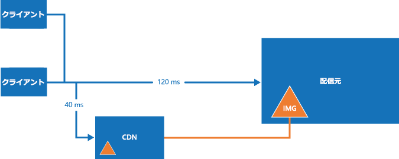

# コンテンツ配信ネットワーク (CDN) を使用するためのベスト プラクティス

コンテンツ配信ネットワーク (CDN) は、ユーザーに Web コンテンツを効率的に配信できるサーバーの分散ネットワークです。 CDN では、待機時間を最小限に抑えるために、エンドユーザーに近いエッジ サーバーに、キャッシュされたコンテンツを格納します。 

CDN は通常、イメージ、スタイル シート、ドキュメント、クライアント側スクリプト、HTML ページなどの静的コンテンツの配信に使用されます。 CDN を使用する主な利点は、アプリケーションがホストされているデータセンターに対してユーザーの位置する地理的な場所に関係なく、短い待ち時間でコンテンツをユーザーに高速配信できることです。 また、アプリケーションが CDN でホストされているコンテンツに対してサービス要求を行う必要はないため、CDN は Web アプリケーションの負荷の軽減にも役立ちます。
 

Azure の [Azure Content Delivery Network](/azure/cdn/cdn-overview) は、Azure または他の任意の場所でホストされている高帯域幅コンテンツを配信するためのグローバル CDN ソリューションです。 Azure CDN を使用すると、Azure Blob Storage、Web アプリケーション、仮想マシン、またはパブリック アクセス可能な Web サーバーから読み込んだ一般公開されているオブジェクトをキャッシュすることができます。 

このトピックでは、CDN を使用する場合の、いくつかの一般的なベスト プラクティスおよび考慮事項について説明します。 Azure CDN の使用に関する詳細については、[CDN ドキュメント](/azure/cdn/)をご覧ください。

## CDN の使用方法と使用する理由

CDN の一般的な用途は次のとおりです。  

* クライアント アプリケーション用の静的リソースの配信 (多くの場合、Web サイトから)。 静的リソースとは、たとえば、イメージ、スタイル シート、ドキュメント、ファイル、クライアント側スクリプト、HTML ページ、HTML フラグメントなど、個々の要求に応じてサーバー側が変更する必要がないコンテンツです。 アプリケーションでは、実行時にアイテムを作成し、CDN から使用できるようにすることもできますが (たとえば、最新ニュースの見出し一覧を作成するなど)、個々の要求に応じて実行することはありません。
* 静的な共有パブリック コンテンツを携帯電話やタブレット コンピューターなどのデバイスに配信する。 アプリケーション自体は、さまざまなデバイス上で実行されているクライアントに API を提供する Web サービスです。 CDN は、クライアント UI の生成などの目的で、クライアントが使用する静的データセットを配信することもできます (Web サービスを介して)。 たとえば、JSON または XML ドキュメントの配信に CDN を使用することができます。
* 専用のコンピューティング リソースを使用することなく、静的パブリック コンテンツのみで構成されている Web サイト全体をクライアントに提供。
* オンデマンドでビデオ ファイルをクライアントにストリーミング。 ビデオの場合、CDN 接続を提供するデータセンターは世界各国にあるため、短い待機時間、信頼性の高い接続という利点があります。 Microsoft Azure Media Services (AMS) は、CDN に直接コンテンツを配信し、そこからさらに配信するために Azure CDN と統合されています。 詳しくは、「[ストリーミング エンドポイントの概要](/azure/media-services/media-services-streaming-endpoints-overview)」をご覧ください。
* ユーザーのエクスペリエンスを全般的に改善 (特に、アプリケーションをホストしているデータセンターから離れた場所で利用しているユーザー)。 そのようなユーザーの場合、他の方法では、待機時間が長くなる場合があります。 多くの場合、Web アプリケーションに含まれるコンテンツのうち、大部分は静的コンテンツです。CDN を使用することで、パフォーマンスと全体的なユーザー エクスペリエンスを維持することができます。また、アプリケーションを複数のデータセンターにデプロイする必要がなくなります。 Azure CDN ノードの場所の一覧については、「[Azure CDN の POP の場所](/azure/cdn/cdn-pop-locations/)」をご覧ください。
* IoT (モノのインターネット) のソリューションをサポートする。 IoT ソリューションに関連する膨大な数のデバイスおよびアプライアンスでは、各デバイスに直接ファームウェアの更新を配布する必要がある場合、アプリケーションがすぐに過負荷になるおそれがあります。
* アプリケーションを拡張することなく、ピーク時や需要の急騰に対処。結果として、運用コストの増加を防ぐことができます。 たとえば、特定モデルのルーターなどのハードウェア デバイス、またはスマート TV などのコンシューマー デバイスを対象にした、オペレーティング システムの更新プログラムがリリースされた場合、短期間で数百万単位のユーザーやデバイスがダウンロードするので、需要が大きく跳ね上がります。

## 課題

CDN の使用を計画する際には、いくつかの課題を考慮する必要があります。  

* **デプロイ**」を参照してください。 CDN のコンテンツ取得元を決定する必要があります。また、複数のストレージ システムにあるコンテンツをデプロイする必要があるかどうかを決定する必要があります。 静的コンテンツとリソースをデプロイするプロセスを考慮してください。 たとえば、Azure BLOB ストレージにコンテンツを読み込むために個別の手順の実装が必要になる場合があります。
* **バージョン管理とキャッシュ制御**。 静的コンテンツを更新する方法と、新しいバージョンをデプロイする方法を検討する必要があります。 CDN によるキャッシュと有効期限 (TTL) の実行方法を理解してください。 Azure CDN の[キャッシュのしくみ](/azure/cdn/cdn-how-caching-works)に関するページをご覧ください。
* **テスト**。 アプリケーションをローカル環境やステージング環境で開発し、テストしている場合、CDN の設定をローカルでテストすることは困難になる可能性があります。
* **検索エンジンの最適化 (SEO)**。 CDN を使用する場合、イメージやドキュメントなどのコンテンツは異なるドメインから提供されます。 このことは、このコンテンツの SEO に影響を及ぼします。
* **コンテンツのセキュリティ**。 すべての CDN が、コンテンツに対して任意の形式のアクセス コントロールを提供しているわけではありません。 Azure CDN などの一部の CDN サービスは、トークン ベースの認証をサポートして CDN コンテンツを保護しています。 詳細については、「[トークン認証による Azure Content Delivery Network 資産の保護](/azure/cdn/cdn-token-auth)」をご覧ください。
* **クライアントのセキュリティ**。 クライアントは、CDN 上のリソースへのアクセスを許可していない環境から接続している可能性があります。 たとえば、既知のリソースにのみアクセスが制限されているセキュリティに制約のある環境や、ページの提供元以外から配信されたリソースを読み込まない環境などです。 このような場合に対処するには、フォールバックの実装が必要です。
* **回復力**。 CDN は、アプリケーションの単一障害点になる可能性があります。 

CDN が適していないシナリオを次に示します。  

* コンテンツの有効期間中に、コンテンツのヒット率が低く、ほとんどアクセスされない場合 (その有効期限設定で決定)。 
* データが非公開の場合。たとえば、大規模な企業やサプライ チェーンのエコシステムなどです。

## 一般的なガイドラインと推奨される方法

CDN の使用は、アプリケーションの負荷を最小限に抑え、可用性とパフォーマンスを最大限にするために有効な方法です。 アプリケーションで使用する適切なコンテンツとリソースのすべてに対して、この手法の採用を検討する必要があります。 CDN の使用戦略を立てるときは、次のセクションに示す項目を考慮してください。

### デプロイ
アプリケーション デプロイメント パッケージまたはプロセスに静的コンテンツを含めない場合は、必要に応じて、アプリケーションとは別に静的コンテンツをプロビジョニングおよびデプロイします。 アプリケーション コンポーネントと静的リソース コンテンツの両方を管理するために使用するバージョン管理アプローチに対して、どのような影響があるかを考慮してください。

バンドルと縮小の技術を使用して、クライアントの読み込み時間を短縮することを検討してください。 バンドルでは、複数のファイルを単一のファイルに連結します。 縮小では、機能を変更することなく、スクリプトおよび CSS ファイルから不要な文字を削除します。

コンテンツを追加の場所にデプロイする必要がある場合、デプロイメント プロセスの手順が増えます。 アプリケーションが、定期的に、またはイベントに応じて CDN のコンテンツを更新すると、更新されたコンテンツを CDN のエンドポイントだけでなく追加の場所にも保存する必要があります。

静的コンテンツが CDN から提供されることを期待している場合、ローカル開発およびテストを処理する方法を検討してください。 たとえば、コンテンツをビルド スクリプトの一部として CDN に事前デプロイすることが可能です。 また、コンパイル ディレクティブまたはフラグを使用して、アプリケーションがリソースを読み込む方法を制御します。 たとえば、デバッグ モードでは、アプリケーションがローカル フォルダーから静的リソースを読み込むことが可能です。 リリース モードでは、アプリケーションは CDN を使用します。

gzip (GNU zip) などのファイル圧縮のオプションを検討してください。 圧縮は、Web アプリケーション ホスティングによって元のサーバーで実行するか、または CDN によってエッジ サーバー上で直接実行できます。 詳細については、「[Azure CDN でのファイル圧縮によるパフォーマンスの向上](/azure/cdn/cdn-improve-performance)」をご覧ください。

### ルーティングとバージョン管理
さまざまな時点でそれぞれ異なる CDN インスタンスを使用することが必要な場合があります。 たとえば、アプリケーションの新しいバージョンをデプロイする場合は、新しい CDN を使用し、前の CDN は以前のバージョンのために保持することができます (以前の形式でコンテンツを保持)。 コンテンツ配信元として Azure BLOB ストレージを使用している場合は、別のストレージ アカウントまたは別のコンテナーを作成し、CDN エンドポイントでその場所を指定します。 

Azure BLOB ストレージからコンテンツを取得するときに、クエリ文字列はリソース名 (BLOB 名) の一部になるので、CDN 上のリソースに対するリンクで、クエリ文字列を使用してアプリケーションの別バージョンを指定しないでください。 この方法はまた、クライアントでリソースをキャッシュする方法に影響する可能性があります。

以前のリソースが CDN にキャッシュされている場合、アプリケーションの更新時に新しいバージョンの静的コンテンツをデプロイすることが困難になる可能性があります。 詳細については、キャッシュ制御のセクションをご覧ください。

国によって CDN コンテンツへのアクセスを制限することを検討してください。 Azure CDN を使用すると、発信元の国に基づいて要求をフィルター処理し、配信するコンテンツを制限することができます。 詳細については、「[国に応じてコンテンツへのアクセスを制限する](/azure/cdn/cdn-restrict-access-by-country/)」をご覧ください。

### キャッシュ制御
システム内でのキャッシュの管理方法について検討します。 たとえば、Azure CDN では、グローバル キャッシュ規則を設定してから、特定の元のエンドポイントに対するカスタム キャッシュを設定できます。 また、配信元でキャッシュ ディレクティブ ヘッダーを送信することによって CDN でのキャッシュの実行方法を制御できます。 

詳細については、「[キャッシュのしくみ](/azure/cdn/cdn-how-caching-works)」をご覧ください。

オブジェクトを CDN で使用できないようにするには、配信元からオブジェクトを削除するか、または、CDN エンドポイントを削除します。BLOB ストレージの場合は、コンテナーまたは BLOB を非公開にします。 ただし、有効期限が切れるまで、項目は削除されません。 手動で CDN エンドポイントを消去することもできます。

### セキュリティ

CDN は、CDN から提供された証明書を使用して HTTPS (SSL) 上でコンテンツを配信できますが、HTTP 上で配信することもできます。 コンテンツが混合している事に関するブラウザーからの警告を避けるには、HTTPS を使用して、HTTPS 経由で読み込まれたページに表示されている静的コンテンツを要求する必要があります。

CDN を使用してフロント ファイルなどの静的アセットを配信する場合は、 *XMLHttpRequest* 呼び出しを使用して異なるドメインからこれらのリソースを要求すると、同じ配信元ポリシーの問題が起こる場合があります。 多くの Web ブラウザーは、適切な応答ヘッダーを設定するように Web サーバーが構成されていない場合、クロス オリジン リソース共有 (CORS) を回避します。 次のいずれかの方法を使用して、CORS をサポートする CDN を構成できます。

* CDN を構成して、CORS ヘッダーを応答に追加します。 詳細については、[CORS を使用する Azure CDN](/azure/cdn/cdn-cors) に関するページを参照してください。 
* 配信元が Azure Blob ストレージの場合は、ストレージ エンドポイントに CORS 規則を追加します。 詳細については、「 [Azure ストレージ サービスでのクロス オリジン リソース共有 (CORS) のサポート](http://msdn.microsoft.com/library/azure/dn535601.aspx)」を参照してください。
* アプリケーションを構成して、CORS ヘッダーを設定します。 たとえば、ASP.NET Core ドキュメントの「[クロス オリジン要求 (CORS) を有効にします](/aspnet/core/security/cors)」をご覧ください。

### CDN フォールバック
CDN のエラーや一時的な使用不能状態に対するアプリケーションの対応方法を考慮する必要があります。 クライアント アプリケーションは、前回の要求中に (クライアントの) ローカルにキャッシュされたリソースのコピーを使用できる場合があります。CDN を使用できない場合は、エラーを検出すると、そこで配信元 (リソースが保存されているアプリケーション フォルダーまたは Azure BLOB コンテナー) にリソースを要求するコードを含めることもできます。
