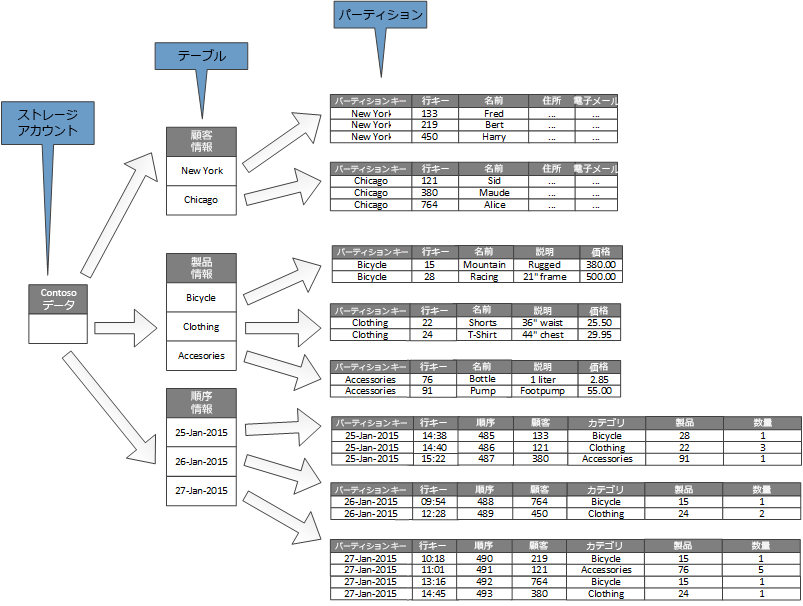
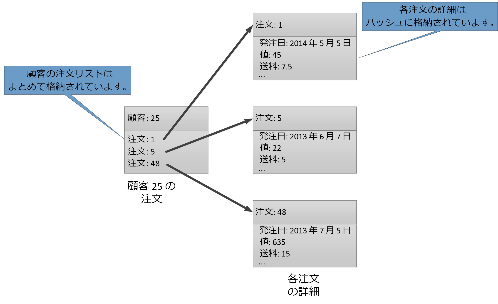

# データのパーティション分割戦略

この記事では、さまざまな Azure データ ストア内のデータをパーティション分割する際のいくつかの戦略について説明します。 データをパーティション分割するタイミングとベスト プラクティスに関する一般的なガイダンスについては、「[データのパーティション分割](./data-partitioning.md)」を参照してください。

## Azure SQL Database のパーティション分割

1 つの SQL データベースには保持できるデータ量に制限があります。 スループットにはアーキテクチャ上の要因とアーキテクチャがサポートするコンカレント接続数による制約があります。

[エラスティック プール](/azure/sql-database/sql-database-elastic-pool)は、SQL データベースの水平スケーリングをサポートします。 エラスティック プールを使用することで、複数の SQL データベースにまたがってデータをシャードにパーティション分割できます。 また、処理する必要のあるデータ量が増加または減少する場合にシャードを追加または削除できます。 さらに、エラスティック プールを使用して負荷をデータベース全体に分散することにより、競合を少なくすることもできます。

各シャードは、SQL データベースとして実装されます。 1 つのシャードは、"*シャードレット*" と呼ばれる複数のデータセットを保持できます。 各データベースは、それが含むシャードレットを定義するメタデータを維持します。 シャードレットは、単一のデータ項目にすることも、同じシャードレット キーを共有する項目グループにすることもできます。 たとえば、マルチテナント アプリケーションでは、シャードレット キーをテナント ID にし、テナントのすべてのデータを同じシャードレットに保持することができます。

クライアント アプリケーションが、データセットをシャードレット キーに関連付ける役割を担います。 個別の SQL データベースは、グローバル シャード マップ マネージャーとして機能します。 このデータベースには、システム内のすべてのシャードとシャードレットの一覧があります。 アプリケーションは、シャード マップ マネージャー データベースに接続してシャード マップのコピーを取得します。 次に、シャード マップをローカルにキャッシュし、このマップを使用して適切なシャードにデータ要求をルーティングします。 この機能は、Java と .NET で利用できる [Elastic Database クライアント ライブラリ](/azure/sql-database/sql-database-elastic-database-client-library)に含まれる一連の API の背後に隠されています。

エラスティック プールの詳細については、「[Azure SQL Database によるスケール アウト](/azure/sql-database/sql-database-elastic-scale-introduction)」を参照してください。

遅延を小さくし、可用性を高めるには、グローバル シャード マップ マネージャー データベースをレプリケートします。 Premium 価格レベルを使用すると、アクティブ geo レプリケーションを構成して、データを異なるリージョン内のデータベースに連続してコピーできます。

または、[Azure SQL データ同期](/azure/sql-database/sql-database-sync-data)か [Azure Data Factory](/azure/data-factory/) を使用して、リージョン間でシャード マップ マネージャー データベースをレプリケートします。 この形態のレプリケーションは定期的に実行され、シャード マップの変更がまれな場合に適しています。Premium レベルは不要です。

Elastic Database では、データをシャードレットにマップし、シャードに格納するために、2 つの構成を利用できます。

- **リスト シャード マップ**は、1 つのキーをシャードレットに関連付けます。 たとえば、マルチテナント システムで、各テナント用のデータを一意のキーに関連付けて、独自のシャードレットに格納することができます。 分離されていることを保証するには、各シャードレットをそれ自身のシャード内に保持します。

    

- **範囲シャード マップ**は、連続するキー値のセットをシャードレットに関連付けます。 たとえば、同じシャードレット内に一連のテナント (それぞれが独自のキーを持つ) のデータをグループ化できます。 この構成は、各テナントがデータ ストレージを共有するため 1 つ目の構成よりも安価ですが、分離性は緩やかになります。

    

単一のシャードに複数のシャードレットのデータを含めることができます。 たとえば、リスト シャードレットを使用してさまざまな非連続テナントのデータを同一のシャードに格納できることがあります。 同一のシャード内で範囲シャードレットとリスト シャードレットを混在させることもできます。ただし、それぞれは、別のマップを介してアドレス指定されます。 この手法を次の図に示します。

エラスティック プールを使用すると、データ量の増減に合わせて、シャードを追加または削除できます。 クライアント アプリケーションでは、シャードを動的に作成および削除し、シャード マップ マネージャーを透過的に更新することができます。 ただし、シャードを削除する操作は、そのシャード内のすべてのデータの削除を要求する破壊的な操作です。

アプリケーションで、1 つのシャードを 2 つのシャードに分割する、または複数のシャードを結合する必要がある場合は、[Split-Merge ツール](/azure/sql-database/sql-database-elastic-scale-overview-split-and-merge)を使用します。 これは、Azure の Web サービスとして実行され、シャード間で安全にデータを移行するツールです。

パーティション分割構成は、システムのパフォーマンスに大きく影響します。 また、シャードの追加/削除の頻度、またはシャード間でデータを再パーティション分割する必要がある頻度にも影響を及ぼします。 次の点を考慮してください。

- 一緒に使用するデータを同一のシャードにグループ化し、複数のシャードのデータにアクセスする操作が発生しないようにします。 シャードは、それ自体が SQL データベースであるため、データベース間結合はクライアント側で実行する必要があります。

    SQL Database はデータベース間結合をサポートしませんが、Elastic Database ツールを使用すると、[マルチシャード クエリ](/azure/sql-database/sql-database-elastic-scale-multishard-querying)を実行できます。 マルチシャード クエリでは、各データベースに個々のクエリを送信し、結果をマージします。

- シャード間に依存関係のあるシステムを設計しないでください。 1 つのデータベース内の参照整合性制約、トリガー、およびストアド プロシージャは、別のデータベースのオブジェクトを参照できません。

- クエリによって頻繁に使用される参照データがある場合は、シャード間でこのデータをレプリケートすることを検討してください。 この手法に従うと、データベース間でデータを結合する必要がなくなります。 理想的には、レプリケーションの負荷を最小にしたり、無効となる可能性を減らしたりするには、そのようなデータが静的であるか移動頻度が低いものである必要があります。

- 同じシャードマップに属するシャードレットは、同じスキーマを持つ必要があります。 このルールは SQL Database によって強制されませんが、各シャードレットに異なるスキーマが存在すると、データ管理とクエリが非常に複雑になります。 代わりに、スキーマごとに個別のシャード マップを作成します。 異なるシャードレットに属するデータを、同じシャードに格納できることに注意してください。

- トランザクション操作は、1 つのシャード内のデータを対象にする場合にのみサポートされます。シャード間ではサポートされません。 トランザクションは、シャードレットをまたがってデータにアクセスできますが、シャードレットが同一のシャードに属する場合に限られます。 このため、ビジネス ロジックがトランザクションを実行する必要がある場合、データを同一のシャードに格納するか、または最終的な整合性を実装します。

- シャードを、シャードのデータにアクセスするユーザーの近くに配置します。 この戦略は、遅延を小さくするのに役立ちます。

- アクセス頻度の非常に高いシャードと低いシャードが混在しないようにします。 シャード間で負荷が均等に分散されるようにします。 これを行うには、シャーディング キーのハッシュ処理が必要になることがあります。 geo 配置シャードを実装する場合、ハッシュ処理されたキーが、データにアクセスするユーザーの近くに格納されているシャードに保持されているシャードレットにマッピングすることを確認する必要があります。

### Azure Table Storage のパーティション分割

Azure Table Storage は、パーティション分割に対応するように設計されたキーと値のストアです。 すべてのエンティティは、パーティションに格納され、パーティションは Azure Table Storage によって内部的に管理されます。 テーブルに格納される各エンティティは、次の 2 つの部分で構成されるキーを提供する必要があります。

- **パーティション キー**。 これは文字列値で、Azure Table Storage がこのエンティティを配置するパーティションを決定するために使用されます。 同じパーティション キーを持つすべてのエンティティが、同じパーティションに格納されます。

- **行キー**。 これは文字列値で、パーティション内のエンティティを識別します。 パーティション内のすべてのエンティティは、このキーの昇順で辞書的に並び替えられます。 パーティション キーと行キーの組み合わせは、各エンティティで一意になる必要があり、1 KB の長さを超えることはできません。

以前に使用されていないパーティション キーを使用してエンティティがテーブルに追加される場合、Azure Table Storage はこのエンティティ用に新しいパーティションを作成します。 同じパーティション キーを持つ別のエンティティは、同じパーティションに格納されます。

このメカニズムは、自動スケールアウト戦略を効果的に実装します。 各パーティションは、単一パーティションからデータを取得するクエリが高速に実行できるようにするために、Azure データセンターの同じサーバーに格納されます。

Microsoft は、Azure Storage の[スケーラビリティ ターゲット]を公表しています。 システムがこれらの制限を超過する可能性がある場合は、エンティティを複数のテーブルに分割することを検討してください。 垂直的パーティション分割を使用し、フィールドを最も一緒にアクセスされる頻度の高いグループに分割します。

次の図は、サンプル ストレージ アカウントの論理構造を示しています。 このストレージ アカウントには、3 つのテーブル(Customer Info、Product Info、および Order Info) が含まれています。

各テーブルには複数のパーティションがあります。

- Customer Info テーブルでは、データは顧客の所在地の市に従ってパーティション分割されます。 行キーには、顧客 ID が含まれます。
- Product Info テーブルでは、製品が製品カテゴリによってパーティション分割され、行キーには製品番号が含まれます。
- Order Info テーブルでは、注文が注文日によってパーティション分割され、行キーには、注文が受信された時刻が指定されます。 すべてのデータは、各パーティションで行キーの順に並べられることに注意してください。

Azure Table Storage 用にエンティティを設計する際には、次の点を考慮する必要があります。

- データへのアクセス方法によって、パーティション キーと行キーを選択します。 パーティション キーと行キーの組み合わせは、クエリの大半をサポートするように選択する必要があります。 最も効率的にクエリを実行するには、パーティション キーと行キーを指定してデータを取得します。 パーティション キーと行キーの範囲を指定するクエリは、単一のパーティションをスキャンすることによって完了できます。 データは行キーの順序で並んでいるため、このクエリは比較的高速に実行されます。 スキャンするパーティションがクエリで指定されていない場合は、すべてのパーティションをスキャンする必要があります。

- エンティティにナチュラル キーが含まれている場合、それをパーティション キーとして使用し、空の文字列を行キーとして指定します。 エンティティに 2 つのプロパティで構成される複合キーがある場合、変化の少ない方のプロパティをパーティション キーとして選択し、別のプロパティを行キーとして指定します。 エンティティに 3 つ以上のキー プロパティがある場合、プロパティの連結を使用して、パーティション キーと行キーを指定します。

- パーティション キーおよび行キー以外のフィールドを使用してデータを検索するクエリを定期的に実行する場合、[インデックス テーブル パターン](../patterns/index-table.md)を使用することを検討するか、Cosmos DB などのインデックス付けをサポートする別のデータ ストアを使用することを検討してください。

- 単純数列 ("0001"、"0002"、"0003" など) を使用してパーティション キーを生成する場合で、各パーティションには少量のデータしか含まれない場合、Azure Table Storage は、これらのパーティションを物理的にグループ化して、同一のサーバーに配置することがあります。 Azure Storage では、アプリケーションはパーティションの連続した範囲を対象にするクエリ (範囲クエリ) を実行する可能性が最も高いと想定して、このような状況向けに最適化しています。 ただし、この手法では、新しいエンティティのすべての挿入操作が、連続する範囲の 1 つの末尾に集中する可能性があるので、ホットスポットを発生させる可能性があります。 また、拡張性が損なわれる可能性もあります。 負荷をさらに均等に分散するには、パーティション キーのハッシュ処理を検討してください。

- Azure Table Storage は、同一パーティションに属するエンティティに対するトランザクション操作をサポートします。 アプリケーションは、トランザクションに含まれるエントリが 100 個以下で、要求のペイロードが 4 MB を超えない場合、複数の挿入、更新、削除、置換、またはマージの操作を 1 つのアトミック単位として実行できます。 複数のパーティションにまたがる操作はトランザクションとしてはサポートされません。また、最終的な整合性を実装することが必要になることがあります。 テーブル ストレージとトランザクションの詳細については、「[Performing entity group transactions (エンティティ グループ トランザクションの実行)]」を参照してください。

- パーティション キーの粒度に配慮してください。

  - すべてのエンティティで同じパーティション キーを使用すると、1 つのサーバーに 1 つのパーティションを保持することになります。 これにより、パーティションでスケールアウトが機能しなくなり、負荷が単一のサーバーに集中します。 結論として、この手法が適しているのは、少量のエンティティを格納している場合のみです。 ただし、すべてのエンティティをエンティティ グループ トランザクションの対象にすることができます。

  - 各エンティティに対して一意のパーティション キーを使用すると、Table Storage サービスにより、各エンティティに異なるパーティションが作成され、結果として、小さなパーティションが大量に作成される可能性があります。 この手法は、単一パーティション キーの手法よりも拡張性に優れていますが、エンティティ グループ トランザクションは使用できません。 また、複数のエンティティをフェッチするクエリが複数のサーバーからの読み込みを実行する可能性があります。 ただし、アプリケーションが範囲クエリを実行する場合、パーティション キーに単純数列を使用すると、これらのクエリの最適化に役立つ可能性があります。

  - 一部のエンティティト間でパーティション キーを共有すると、関連するエンティティをグループ化して同一のパーティションに格納できます。 関連するエンティティにアクセスする操作は、エンティティ グループ トランザクションを使用して実行でき、一連の関連するエンティティをフェッチするクエリは単一サーバーにアクセスするだけで結果が返される可能性があります。

詳細については、[Azure ストレージ テーブルの設計ガイド]に関するページをご覧ください。

## Azure Blob Storage のパーティション分割

Azure Blob Storage を使用すると、大きなバイナリ オブジェクトを保持できます。 大量のデータを高速にアップロードまたはダウンロードする必要があるシナリオでは、ブロック BLOB を使用します。 データの一部への順次アクセスではなくランダム アクセスを必要とするアプリケーションでは、ページ BLOB を使用します。

ブロック BLOB とページ BLOB のいずれも、Azure ストレージ アカウントのコンテナーに保持されます。 コンテナーを使用することにより、同じセキュリティ要件を持つ関連する BLOB をグループ化することができます。 このグループ化は、物理的ではなく、論理的です。 コンテナー内では、各 BLOB は一意の名前を持ちます。

BLOB のパーティション キーは、アカウント名とコンテナー名と BLOB 名を組み合わせたものです。 データを範囲にパーティション分割するには、パーティション キーが使用されます。これらの範囲はシステム全体にわたって負荷分散されます。 BLOB は、アクセスをスケールアウトするために多数のサーバーに分散させることができますが、1 つの BLOB を処理できるのは 1 台のサーバーのみです。

名前付けスキームでタイムスタンプまたは数値識別子を使用すると、1 つのパーティションに過剰なトラフィックが送信され、システムの効果的な負荷分散が制限される可能性があります。 たとえば、*yyyy-mm-dd* などのタイムスタンプを持つ BLOB オブジェクトを使用する毎日の操作がある場合、その操作に対するすべてのトラフィックが、1 つのパーティション サーバーに送信されます。 代わりに、名前の前に 3 桁のハッシュを付けることを検討してください。 詳細については、「[パーティションの命名規則](/azure/storage/common/storage-performance-checklist#subheading47)」を参照してください。

単一のブロックまたはページを書き込む操作はアトミックですが、複数のブロック、ページ、または BLOB にまたがる操作はアトミックではありません。 複数のブロック、ページ、または BLOB にまたがる書き込み操作の実行中に一貫性を確保するには、BLOB リースを使用して書き込みロックを取得する必要があります。

## Azure ストレージ キューのパーティション分割

Azure ストレージ キューを使用すると、プロセス間の非同期メッセージ処理を実装できます。 Azure ストレージ アカウントは任意の数のキューを含むことができ、各キューは任意の数のメッセージを含むことができます。 唯一の制限は、ストレージ アカウントで利用できる領域です。 個々のメッセージの最大サイズは、64 KB です。 このサイズよりも大きいメッセージを必要とする場合は、代わりに Azure Service Bus キューの使用を検討します。

各ストレージ キューは、それを含むストレージ アカウント内で一意の名前を持ちます。 Azure はこの名前に基づいてキューをパーティション分割します。 同じキューのすべてのメッセージは同一のパーティションに格納され、単一のサーバーにより制御されます。 負荷を均等化するために、キューごとに異なるサーバーで管理することができます。 サーバーへのキューの割り当ては、アプリケーションおよびユーザーにとって透過的です。

大規模なアプリケーションでは、アプリケーションのすべてのインスタンスに対して同一のストレージ キューを使用しないでください。この手法では、キューをホストするサーバーがホットスポットになる可能性があるためです。 代わりに、アプリケーションの機能分野ごとに異なるキューを使用してください。 Azure ストレージ キューはトランザクションをサポートしません。このため、メッセージを別のキューに転送することは、メッセージ処理の一貫性にほとんど影響を与えません。

Azure ストレージ キューは、最大 2,000 メッセージ/秒を処理できます。 これよりも多いメッセージを処理する必要がある場合、複数のキューを作成することを検討します。 たとえば、グローバル アプリケーションで、複数のストレージ アカウントのそれぞれにストレージ キューを作成し、各リージョンで動作するアプリケーション インスタンスを処理します。

## Azure Service Bus のパーティション分割

Azure Service Bus はメッセージ ブローカーを使用して、Service Bus のキューまたはトピックに送信されるメッセージを処理します。 既定では、キューまたはトピックに送信されるすべてのメッセージは、同一のメッセージ ブローカー プロセスによって処理されます。 このアーキテクチャにより、メッセージ キューの全体的なスループットに制限が生じる可能性があります。 ただし、キューまたはトピックの作成時にそれらをパーティション分割することもできます。 そのためには、キューまたはトピックの *EnablePartitioning* プロパティを *true* に設定します。

パーティション分割されたキューまたはトピックは複数のフラグメントに分割され、それぞれのフラグメントは個別のメッセージ ストアおよびメッセージ ブローカーにより返されます。 これらのフラグメントの作成および管理は、Service Bus によって行われます。 アプリケーションがメッセージをパーティション分割されたキューまたはトピックに送信すると、Service Bus はメッセージをそのキューまたはトピックのフラグメントに割り当てます。 アプリケーションがメッセージをキューまたはサブスクリプションから受信すると、Service Bus は各フラグメントで次に利用可能なメッセージが存在するかどうかを確認し、存在する場合はそのメッセージを処理するために、アプリケーションに渡します。

この構造は、メッセージ ブローカー間およびメッセージ ストア間で負荷を分散するのに役立ち、拡張性と可用性を向上させます。 1 つのフラグメントのメッセージ ブローカーまたはメッセージ ストアが一時的に利用できなくなると、Service Bus は利用可能な残りのフラグメントの 1 つからメッセージを取得できます。

Service Bus は、次の手順に従って、メッセージをフラグメントに割り当てます。

- メッセージがセッションに属する場合、*SessionId* プロパティと同じ値を持つすべてのメッセージは、同一のフラグメントに送信されます。

- メッセージはセッションに属していないが、送信者が *PartitionKey* プロパティの値を指定している場合、同じ *PartitionKey* 値を持つすべてのメッセージは、同一のフラグメントに送信されます。

  > [!NOTE]
  > *SessionId* および *PartitionKey* プロパティの両方を指定している場合、これらを同じ値に設定する必要があります。そうしないと、メッセージは拒否されます。

- メッセージの *SessionId* プロパティと *PartitionKey* プロパティは指定されていないが、重複検出が有効な場合、*MessageId* プロパティが使用されます。 同じ *MessageId* を持つすべてのメッセージは、同一のフラグメントに転送されます。

- メッセージに *SessionId、PartitionKey*、または *MessageId* のいずれのプロパティも含まれていない場合、Service Bus は順番にメッセージをフラグメントに割り当てます。 あるフラグメントが利用できない場合、Service Bus は次のフラグメントに移動します。 つまり、メッセージ インフラストラクチャで一時的な障害が発生しても、メッセージ送信操作が失敗することはありません。

Service Bus のメッセージのキューまたはトピックをパーティション分割するかどうか、また、パーティション分割する方法を決定するときは、次の点を考慮する必要があります。

- Service Bus のキューとトピックは、Service Bus 名前空間のスコープ内で作成されます。 Service Bus は、現在、名前空間あたり最大 100 のパーティション分割されたキューまたはトピックをサポートします。

- 各 Service Bus 名前空間は利用可能なリソースについてクォータが適用されます。これらのリソースには、トピックあたりのサブスクリプションの数、秒あたりのコンカレント送受信要求の数、確立可能なコンカレント接続の最大数などがあります。 これらのクォータについては、「[Service Bus のクォータ]」に記載されています。 これらの値を超えることが予想される場合、独自のキューとトピックを持つ追加の名前空間を作成し、負荷をこれらの名前空間間で分散します。 たとえば、グローバル アプリケーションで、リージョンごとに個別の名前空間を作成し、最も近い名前空間のキューとトピックを使用するように、アプリケーション インスタンスを構成します。

- トランザクションの一部として送信されるメッセージでは、パーティション キーを指定する必要があります。 これは、*SessionId*、*PartitionKey*、または *MessageId* プロパティで指定できます。 同一トランザクションの一部として送信されるすべてのメッセージは、同じパーティション キーを指定する必要があります。これは、これらのメッセージが同一のメッセージ ブローカー プロセスによって処理される必要があるためです。 同一トランザクション内のメッセージを異なるキューまたはトピックに送信することはできません。

- パーティション分割されたキューおよびトピックは、アイドル状態になったときに自動的に削除されるように構成することはできません。

- クロスプラットフォームまたはハイブリッドのソリューションを構築している場合、現在、パーティション分割されたキューおよびトピックを Advanced Message Queuing Protocol (AMQP) で使用することはできません。

## Cosmos DB のパーティション分割

Azure Cosmos DB は [Azure Cosmos DB SQL API][cosmosdb-sql-api] を使用して JSON ドキュメントを格納できる NoSQL データベースです。 Cosmos DB データベースのドキュメントは、オブジェクトまたは他の種類のデータの JSON シリアル化された表現です。 すべてのドキュメントは一意な ID を含む必要があることを除いて、いずれの固定されたスキーマも強制されません。

ドキュメントはコレクションに編成されます。 コレクションでは、関連するドキュメントをグループ化できます。 たとえば、ブログ投稿を維持するシステムでは、各ブログ投稿のコンテンツをドキュメントとしてコレクションに格納できます。 また、各サブジェクト タイプのコレクションも作成できます。 また、さまざまな著者が自身のブログ投稿を制御および管理するシステムなどのマルチテナント アプリケーションでは、ブログを著者別にパーティション分割して、著者ごとに個別のコレクションを作成できることがあります。 コレクションに割り当てられるストレージ領域は、弾力性があり、必要に応じて縮小または拡大できます。

Cosmos DB では、アプリケーションで定義されたパーティション キーに基づくデータの自動パーティション分割をサポートします。 "*論理パーティション*" は、1 つのパーティション キー値に対応するすべてのデータを格納するパーティションです。 同じパーティション キー値を共有するすべてのドキュメントは、同じ論理パーティション内に配置されます。 Cosmos DB では、パーティション キーのハッシュに従って値を分散配置します。 論理パーティションの最大サイズは 10 GB です。 したがって、パーティション キーの選択は、設計時の重要な決定事項の 1 つです。 値が多岐にわたっていて、なおかつ均等なアクセス パターンを持つプロパティを選択します。 詳細については、「[Azure Cosmos DB でのパーティション分割とスケーリング](/azure/cosmos-db/partition-data)」を参照してください。

> [!NOTE]
> 各 Cosmos DB データベースには、取得するリソースの量を決定する "*パフォーマンス レベル*" があります。 パフォーマンス レベルには、関連する "*要求ユニット*" (RU) レートの制限があります。 RU レートの制限は、そのコレクションに予約されており、そのコレクションによって排他使用できるリソースの量を指定します。 コレクションのコストは、そのコレクションによって選択されたパフォーマンス レベルに依存します。 パフォーマンス レベル (および RU レートの制限) が高くなるほど、料金も高くなります。 コレクションのパフォーマンス レベルは、Azure Portal を使用することにより調整できます。 詳細については、「[Azure Cosmos DB の要求ユニット][cosmos-db-ru]」を参照してください。

Cosmos DB が提供するパーティション分割メカニズムでは十分でない場合、アプリケーション レベルでデータをシャード化する必要がある場合があります。 ドキュメント コレクションは、単一データベース内でデータをパーティション分割するための自然なメカニズムを提供します。 シャーディングを実装するための最も簡単な方法は、各シャード用にコレクションを作成することです。 コンテナーは論理リソースであり、1 つ以上のサーバーにまたがることができます。 固定サイズのコンテナーの上限は、容量が 10 GB で、スループットが毎秒 10,000 RU となります。 無制限のコンテナーには最大ストレージ サイズはありませんが、パーティション キーを指定する必要があります。 クライアント アプリケーションは、アプリケーション シャーディングを使用して要求を適切なシャードに転送する必要があります。このためには、通常、シャード キーを定義するデータのいくつかの属性に基づいて、独自のマッピング メカニズムを実装します。

すべてのデータベースは、Cosmos DB アカウントのコンテキストで作成されます。 1 つのアカウントに複数のデータベースを含めることができ、アカウントによりデータベースの作成先となるリージョンが指定されます。 また、各アカウントは、独自のアクセス制御を実行します。 Cosmos DB アカウントを使用して、シャード (データベース内のコレクション) をそれらにアクセスする必要のあるユーザーの近くに geo 配置し、それらのユーザーだけがそれらのシャードに接続できるように制限を強制することができます。

Cosmos DB SQL API でデータをパーティション分割する方法を決定する際には、次の点を考慮する必要があります。

- **Cosmos DB データベースで利用できるリソースは、アカウントのクォータ制限の対象になります**。 各データベースは複数のコレクションを保持できます。各コレクションには、そのコレクションの RU レートの制限 (予約されているスループット) を管理するパフォーマンス レベルが関連付けられています。 詳細については、「[Azure サブスクリプションとサービスの制限、クォータ、制約][azure-limits]」をご覧ください。

- **各ドキュメントには、それが保持されるコレクション内でそれを一意に識別するために使用できる属性が存在する必要があります**。 この属性は、ドキュメントの保持先となるコレクションを定義するシャード キーとは異なります。 コレクションは大量のドキュメントを含むことができます。 理論的には、ドキュメント ID の最大長によってのみ制限されます。 ドキュメント ID の最大長は、255 文字です。

- **ドキュメントに対するすべての操作は、トランザクションのコンテキスト内で実行されます。トランザクションは、ドキュメントが含まれているコレクションに対象が制限されます。** 操作が失敗すると、それまでに実行された作業はロールバックされます。 ドキュメントは操作の対象ですが、実行されるすべての変更は、スナップショット レベルで分離されます。 このメカニズムは、たとえば、新しいドキュメントを作成する要求が失敗すると、同時にデータベースをクエリしている別のユーザーが、その時点で削除された不完全なドキュメントを見ることはないことを保証します。

- **データベース クエリもまた、コレクション レベルの範囲に制限されます**。 単一のクエリは、1 つのコレクションのみからのデータを取得できます。 複数のコレクションからデータを取得する必要がある場合、各コレクションを個別にクエリし、結果をアプリケーション コードでマージする必要があります。

- **Cosmos DB はプログラム可能な項目をサポートします。これらはすべて、ドキュメントと一緒にコレクションに格納できます**。 このような項目としては、ストアド プロシージャ、ユーザー定義の関数、および JavaScript で記述されたトリガーがあります。 これらの項目は、同一コレクション内の任意のドキュメントにアクセスできます。 さらに、これらの項目は、ドキュメントに対して実行された作成、削除、または置換の操作の結果として起動されるトリガーの場合には、アンビエント トランザクションのスコープ内で実行します。また、明示的なクライアント要求の結果として実行されるストアド プロシージャの場合には、新しいトランザクションを開始することによって実行されます。 プログラム可能な項目内のコードが例外をスローすると、トランザクションはロールバックされます。 ストアド プロシージャとトリガーを使用してドキュメント間の整合性と一貫性を維持できますが、これらのドキュメントはすべて、同一のコレクション内に含まれている必要があります。

- **データベースに保持することが想定されているコレクションが、コレクションのパフォーマンス レベルによって定義されているスループット制限を超えないことを確認する必要があります**。 詳細については、「[Azure Cosmos DB の要求ユニット][cosmos-db-ru]」を参照してください。 これらの制限に到達することが予想される場合は、異なるアカウントのデータベースにまたがってコレクションを分割して、コレクションあたりの負荷を軽減します。

## Azure Search のパーティション分割

データを検索する機能は、多くの Web アプリケーションによって提供されるナビゲーションと探索の主要な方法です。 ユーザーは、検索条件の組み合わせに基づいて、リソース (たとえば、e コマース アプリケーションでの製品) をすばやく見つけることができます。 Azure Search サービスは、Web コンテンツに対するフルテキスト検索機能に加えて、先行入力、近似一致に基づくクエリ候補表示、ファセット ナビゲーションなどの機能を提供しています。 詳細については、「[Azure Search とは]」を参照してください。

Azure Search は、検索可能なコンテンツを JSON ドキュメントとしてデータベースに格納します。 これらのドキュメントの検索可能なフィールドを指定するインデックスを定義し、これらの定義を Azure Search に提供します。 ユーザーが検索要求を発行すると、Azure Search は適切なインデックスを使用して一致する項目を検索します。

競合を少なくするために、Azure Search によって使用されるストレージは、最大 1、2、3、4、6、または 12 のパーティションに分割でき、各パーティションは最大 6 回レプリケートできます。 パーティションの数とレプリカの数の積は、"*検索単位*" (SU) と呼ばれます。 Azure Search の単一インスタンスは、最大 36 SU を含むことができます (12 のパーティションを持つデータベースは、最大 3 つのレプリカをサポートします)。

課金は、サービスに割り当てられている各 SU に対して行われます。 検索可能なコンテンツの量、または検索要求の割合が増加した場合、Azure Search の既存のインスタンスに SU を追加して、増加した負荷を処理できます。 Azure Search 自体が、パーティション間にドキュメントを均等に分散します。 手動によるパーティション分割戦略は、現時点でサポートされていません。

各パーティションは、最大 1,500 万のドキュメント、または 300 GB のストレージ領域のいずれか少ない方を収容できます。 最大 50 のインデックスを作成できます。 サービスのパフォーマンスは、ドキュメントの複雑さ、利用可能なインデックス、およびネットワーク遅延の影響によって異なります。 平均すると、単一レプリカ (1 SU) は 15 クエリ/秒 (QPS) を処理できます。ただし、スループットをより正確に測定するために、自身のデータを使用してベンチマークを実行することをお勧めします。 詳細については、「[Azure Search サービスの制限] 」を参照してください。

> [!NOTE]
> 検索可能ドキュメントには、限定されたセットのデータ型を格納できます。これらのデータには、文字列、ブール値、数値データ、日付時刻データ、および一部の地理的データが含まれます。 詳細については、Microsoft Web サイトの「[Supported data types (Azure Search) (サポートされるデータ型 (Azure Search))]」を参照してください。

Azure Search がサービスの各インスタンス用にデータをパーティション分割する方法については、限定された制御しかできません。 ただし、グローバル環境では、次のいずれかの戦略を使用してサービス自体をパーティション分割することにより、パフォーマンスを向上させ、遅延を小さくし、競合を少なくすることができる場合があります。

- 各リージョンで Azure Search のインスタンスを作成し、クライアント アプリケーションの要求が最も近い利用可能なインスタンスに転送されることを確認します。 この戦略では、検索可能なコンテンツに対するすべての更新がサービスのすべてのインスタンスに対して、遅れることなくレプリケートされる必要があります。

- Azure Search の 2 つの階層を作成します。

  - 各リージョンに、そのリージョンで最も頻繁にアクセスされるデータを含むローカル サービス。 限定的な結果でも早くほしい場合は、ここに要求できます。
  - すべてのデータを収容するグローバル サービス。 時間がかかっても完全な結果が必要な場合は、ここに要求できます。

この手法は、検索対象のデータに大きな地域的な相違がある場合に最も適しています。

## Azure Redis Cache のパーティション分割

Azure Redis Cache は、Redis キー/値データ ストアに基づく、クラウド内の共有キャッシュ サービスを提供します。 名前が示すように、Azure Redis Cache はキャッシュ ソリューションを意図しています。 恒久的なデータ ストアとしてではなく、一時的なデータを保持するためにのみ使用する必要があります。 Azure Redis Cache を利用するアプリケーションは、キャッシュが利用できない場合でも、継続して動作できる必要があります。 Azure Redis Cache はプライマリ/セカンダリ レプリケーションをサポートし、高可用性を提供しますが、現在、最大キャッシュ サイズは 53 GB に制限されています。 このサイズを超える領域を必要とする場合は、追加のキャッシュを作成する必要があります。 詳細については、[Azure Redis Cache] に関するページを参照してください。

Redis データ ストアをパーティション分割する場合、Redis サービスのインスタンス全体でデータを分割します。 各インスタンスは、単一パーティションを構成します。 Azure Redis Cache はファサードの背後に Redis サービスを抽象化し、それらが直接アクセスされないようにします。 パーティション分割を実装する最も簡単な方法は、複数の Azure Redis Cache インスタンスを作成し、データをそれら全体に分散することです。

データ項目の格納先となるキャッシュを指定する識別子 (パーティション キー) と各データ項目を関連付けることができます。 クライアント アプリケーション ロジックはこの識別子を使用して、要求を適切なパーティションにルーティングできます。 この構成は非常に単純ですが、パーティション分割構成が変更されると (たとえば、追加の Azure Redis Cache インスタンスが作成されると)、クライアント アプリケーションの再構成が必要になる場合があります。

Azure Redis Cache ではないネイティブ Redis は、Redis クラスタリングに基づくサーバー側のパーティション分割をサポートします。 この手法では、ハッシュ メカニズムを使用することにより、データをサーバー間で均等に分散できます。 各 Redis サーバーは、パーティションが保持するハッシュ キーの範囲を定義するメタデータを格納します。また、他のサーバーのパーティションに配置されているハッシュ キーに関する情報も含みます。

クライアント アプリケーションは単純に要求を、パーティション分割された任意の Redis サーバー (最も近いサーバーの可能性大) に送信します。 Redis サーバーは、クライアント要求を調べます。 ローカルで解決できる場合、要求された操作が実行されます。 ローカルで解決できない場合、適切なサーバーに要求が転送されます。

このモデルは Redis クラスタリングを使用することによって実装されます。詳細については、Redis Web サイトの「[Redis cluster tutorial (Redis クラスターのチュートリアル)]」ページを参照してください。 Redis クラスタリングはクライアント アプリケーションにとって透過的なものです。 クライアントを再構成しなくても追加の Redis サーバーをクラスターに追加できます (およびデータを再パーティション分割できます)。

> [!IMPORTANT]
> 現在、Azure Redis Cache と Redis クラスタリングは併用できません。 Azure でこの手法を実装したい場合は、一連の Azure Virtual Machines に Redis をインストールし、手動で構成することにより、独自の Redis サーバーを実装する必要があります。 [Running Redis on a CentOS Linux VM in Microsoft Azure (Microsoft Azure の CentOS Linux VM 上での Redis の実行)]に関するページでは、Azure VM として実行される Redis ノードの構築および構成方法を示す例について説明しています。

Redis Web サイトの「 [Partitioning: how to split data among multiple Redis instances (パーティション分割: 複数の Redis インスタンス間でデータを分割する方法) (パーティション分割: 複数の Redis インスタンス間でデータを分割する方法)] 」には、Redis へのパーティション分割の実装に関する詳細情報が記載されています。 このセクションの以降の説明では、クライアント側またはプロキシに支援されたパーティション分割を実装していると想定します。

Azure Redis Cache でデータをパーティション分割する方法を決定する際には、次の点を検討する必要があります。

- Azure Redis Cache は恒久的なデータ ストアとして動作するようには意図されていません。このため、実装するパーティション分割構成に関係なく、アプリケーション コードはキャッシュではない場所からデータを取得できる必要があります。

- 頻繁に一緒にアクセスされるデータは、同一パーティションに維持する必要があります。 Redis は強力なキー値ストアで、データを構造化するための高度に最適化された一連のメカニズムを提供します。 次のようなメカニズムがあります。
  - 単純な文字列 (最大 512 MB の長さバイナリ データ)
  - リストなどの集約型 (キューおよびスタックとして動作可能)
  - セット (順序ありおよび順序なし)
  - ハッシュ (オブジェクト内のフィールドを表す項目などの関連するフィールドをグループ化することが可能)

- 集約型を使用すると、多くの関連する値を同じキーに関連付けることができます。 Redis キーは、それが含むデータ項目ではなく、リスト、セット、またはハッシュを識別します。 これらの型は、Azure Redis Cache ですべて利用できます。詳細については、Redis Web サイトの「[Data Types]」を参照してください。 たとえば、顧客により登録された注文を追跡する e コマース システムの一部として、各顧客の詳細情報を、顧客 ID をキーとして使用して Redis ハッシュに格納できる場合があります。 各ハッシュは、その顧客の注文 ID のコレクションを保持することができます。 別の Redis セットで注文を保持することもできます。この場合も、ハッシュとして構造化され、注文 ID をキーとして使用します。 図 8 に、この構造を示します。 Redis では、いずれの形態の参照整合性も実装しないので、開発者は、顧客と注文の間の関係を維持するロジックを組み込む必要があります。

*図 8: 顧客の注文とそれらの詳細情報を記録するために Redis ストレージで想定される構造。*

> [!NOTE]
> Redis では、すべてのキーは、Redis 文字列と同じようなバイナリ データ値で、最大で 512 MB のデータを含むことができます。 理論的には、キーはあらゆる情報を含むことができます。 ただし、キーに対して一貫した名前付け規則を適用し、データの型をわかりやすく表し、エンティティを識別し、しかも過度に長すぎないような名前を割り当てることをお勧めします。 一般的な方法では、"entity_type:ID" の形のキーを使用します。 たとえば、"customer:99" は ID 99 の顧客のキーを示します。

- 関連する情報を同一データベースの異なる集約型に格納することによって、垂直的パーティション分割を実装できます。 たとえば、e コマース アプリケーションで、製品について共通してアクセスされる情報を 1 つの Redis ハッシュに格納し、アクセス頻度の低い詳細情報を別の Redis ハッシュに格納できることがあります。 両方のハッシュはキーの一部として同じ製品 ID を使用できます。 たとえば、製品情報用の "product: *nn*" (*nn* は製品 ID) や詳細データ用の "product_details: *nn*" を使用できます。 この戦略は、ほとんどのクエリが取得する可能性が高いデータの量を少なくするのに役立てることができます。

- Redis データ ストアを再パーティションできますが、複雑で時間のかかる作業であることに留意してください。 Redis クラスタリングではデータの再パーティション分割を自動的に実行できますが、この機能は、Azure Redis Cache とは併用できません。 このため、パーティション分割構成を設計する際には、各パーティションに十分な空き領域を確保して、予想される将来のデータ増加に最初から備える必要があります。 ただし、Azure Redis Cache はデータを一時的にキャッシュすることを意図しており、キャッシュに保持されるデータは有効期間 (TTL) 値として指定される期間だけ有効であることに注意する必要があります。 揮発性が比較的高いデータでは TTL を短くできますが、静的なデータでは、TTL を非常に長くすることができます。 有効期間の長いデータをキャッシュに大量に格納しないでください。そのデータにより、キャッシュがいっぱいになる可能性があります。 強制退去ポリシーを指定して、利用できる領域が少ない場合に Azure Redis Cache がデータを削除できるようにすることができます。

  > [!NOTE]
  > Azure Redis Cache を使用する場合は、適切な価格レベルを選択することにより、キャッシュの最大サイズを 250 MB から 53 GB の範囲で指定します。 ただし、いったん Azure Redis Cache を作成したら、その後にはサイズを大きくしたり小さくしたりすることはできません。

- Redis のバッチおよびトランザクションは、複数の接続を利用できないので、バッチまたはトランザクションによりアクセスされるすべてのデータは同一のデータベース (シャード) で保持する必要があります。

  > [!NOTE]
  > Redis トランザクションの一連の操作は、必ずしもアトミックである必要はありません。 トランザクションを構成するコマンドは、実行前に検証されてキューに登録されます。 この段階でエラーが発生すると、キュー全体が破棄されます。 ただし、トランザクションが正常に発行されると、キューに登録されていた一連のコマンドが正しい順序で実行されます。 いずれかのコマンドで障害が発生すると、そのコマンドの実行だけが中止されます。 キュー内の前後にあるコマンドはすべて実行されます。 詳細については、Redis Web サイトの「 [Transactions (トランザクション)] 」を参照してください。

- Redis は、限定された数のアトミック操作をサポートします。 複数のキーと値をサポートするこの種の操作は、MGET 操作と MSET 操作だけです。 MGET 操作は指定したキー リストの値のコレクションを返し、MSET 操作は指定したキー リストの値のコレクションを格納します。 これらの操作を使用する必要がある場合、MSET コマンドと MGET コマンドによって参照されるキー値ペアは、同一のデータベースに格納される必要があります。

## Azure Service Fabric のパーティション分割

Azure Service Fabric は、クラウドの分散アプリケーションにランタイムを提供する microservices プラットフォームです。 Service Fabric は、.Net ゲストの実行可能ファイル、ステートフルおよびステートレスなサービス、およびコンテナーをサポートしています。 ステートフルなサービスは、Service Fabric クラスター内のキー値コレクションにデータを永続的に格納する[信頼性の高いコレクション][service-fabric-reliable-collections]を提供します。 リライアブル コレクション内のパーティション分割キー戦略の詳細については、「[Azure Service Fabric の Reliable Collections のガイドラインと推奨事項]」を参照してください。

### 詳細情報

- [Azure Service Fabric の概要]は、Azure Service Fabric の導入です。

- [Service Fabric Reliable Services のパーティション分割]では、Azure Service Fabric で信頼性の高いサービスについて詳しく説明しています。

## Azure Event Hubs のパーティション分割

[Azure Event Hubs][event-hubs] は、大規模なデータ ストリーミングのために設計されており、パーティション分割は、水平方向のスケーリングを可能にするためにサービスに組み込まれています。 各コンシューマーは、メッセージ ストリームの特定のパーティションのみを読み取ります。

イベント発行元は、そのパーティション キーのみを認識し、イベントの発行先となるパーティションは認識しません。 このようにキーとパーティションを分離することにより、送信者はダウンストリーム処理について余分な情報を把握しなくてもよくなります。 (特定のパーティションにイベントを直接送信することも可能ですが、通常は推奨されません)。  

パーティション数を選択する場合は、長期間にわたる拡張を考慮してください。 Event hub を作成した後は、パーティションの数を変更できません。

Event Hubs でのパーティションの使用の詳細については、「[Event Hubs とは]」を参照してください。

可用性と一貫性の間のトレードオフに関する詳細については、「[Event Hubs における可用性と一貫性]」を参照してください。

[Event Hubs における可用性と一貫性]: /azure/event-hubs/event-hubs-availability-and-consistency
[azure-limits]: /azure/azure-subscription-service-limits
[Azure Content Delivery Network]: /azure/cdn/cdn-overview
[Azure Redis Cache]: https://azure.microsoft.com/services/cache/
[Azure Storage Scalability and Performance Targets]: /azure/storage/storage-scalability-targets
[Azure ストレージ テーブルの設計ガイド]: /azure/storage/storage-table-design-guide
[Building a Polyglot Solution]: https://msdn.microsoft.com/library/dn313279.aspx
[cosmos-db-ru]: /azure/cosmos-db/request-units
[Data Access for Highly-Scalable Solutions: Using SQL, NoSQL, and Polyglot Persistence]: https://msdn.microsoft.com/library/dn271399.aspx
[Data consistency primer]: https://aka.ms/Data-Consistency-Primer
[Data Partitioning Guidance]: https://msdn.microsoft.com/library/dn589795.aspx
[Data Types]: https://redis.io/topics/data-types
[cosmosdb-sql-api]: /azure/cosmos-db/sql-api-introduction
[Elastic Database features overview]: /azure/sql-database/sql-database-elastic-scale-introduction
[event-hubs]: /azure/event-hubs
[Federations Migration Utility]: https://code.msdn.microsoft.com/vstudio/Federations-Migration-ce61e9c1
[Azure Service Fabric の Reliable Collections のガイドラインと推奨事項]: /azure/service-fabric/service-fabric-reliable-services-reliable-collections-guidelines
[Multi-shard querying]: /azure/sql-database/sql-database-elastic-scale-multishard-querying
[Azure Service Fabric の概要]: /azure/service-fabric/service-fabric-overview
[Service Fabric Reliable Services のパーティション分割]: /azure/service-fabric/service-fabric-concepts-partitioning
[Partitioning: how to split data among multiple Redis instances (パーティション分割: 複数の Redis インスタンス間でデータを分割する方法) (パーティション分割: 複数の Redis インスタンス間でデータを分割する方法)]: https://redis.io/topics/partitioning
[Performing Entity Group Transactions (エンティティ グループ トランザクションの実行)]: /rest/api/storageservices/Performing-Entity-Group-Transactions
[Redis cluster tutorial (Redis クラスターのチュートリアル)]: https://redis.io/topics/cluster-tutorial
[Running Redis on a CentOS Linux VM in Microsoft Azure (Microsoft Azure の CentOS Linux VM 上での Redis の実行)]: https://blogs.msdn.microsoft.com/tconte/2012/06/08/running-redis-on-a-centos-linux-vm-in-windows-azure/
[Scaling using the Elastic Database split-merge tool]: /azure/sql-database/sql-database-elastic-scale-overview-split-and-merge
[Using Azure Content Delivery Network]: /azure/cdn/cdn-create-new-endpoint
[Service Bus のクォータ]: /azure/service-bus-messaging/service-bus-quotas
[service-fabric-reliable-collections]: /azure/service-fabric/service-fabric-reliable-services-reliable-collections
[Azure Search サービスの制限]:  /azure/search/search-limits-quotas-capacity
[Sharding pattern]: ../patterns/sharding.md
[Supported data types (Azure Search) (サポートされるデータ型 (Azure Search))]:  https://msdn.microsoft.com/library/azure/dn798938.aspx
[Transactions (トランザクション)]: https://redis.io/topics/transactions
[Event Hubs とは]: /azure/event-hubs/event-hubs-what-is-event-hubs
[Azure Search とは]: /azure/search/search-what-is-azure-search
[What is Azure SQL Database?]: /azure/sql-database/sql-database-technical-overview
[スケーラビリティ ターゲット]: /azure/storage/common/storage-scalability-targets
