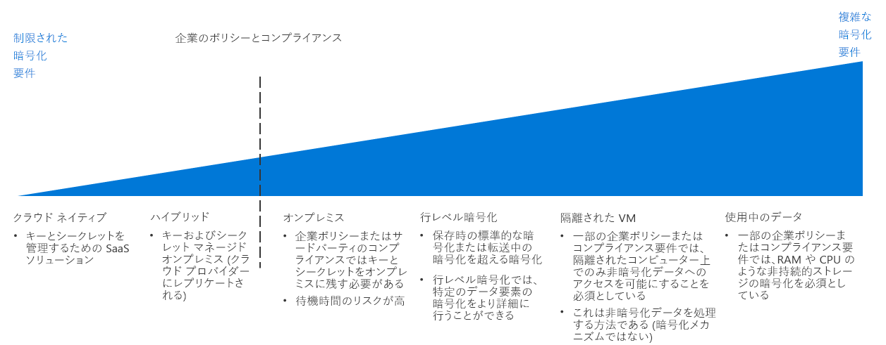

# 暗号化決定ガイド

データを暗号化すると、データが不正アクセスから保護されます。 暗号化ポリシーを適切に実装すると、クラウドベースのワークロードにセキュリティのレイヤーが追加され、組織やネットワークの内外両方からの攻撃者や他の承認されていないユーザーに対する保護が提供されます。

リソースの暗号化は一般に望ましいことですが、待ち時間が長くなってリソースの全体的な使用量が増加するコストも伴います。 要求の厳しいワークロードでは、暗号化とパフォーマンスの適切なバランスが重要です。

ジャンプ先:[キーの管理](#key-management) | [データの暗号化](#data-encryption) | [詳細情報](#learn-more)

クラウド暗号化戦略を決定するときの転換点では、企業のポリシーとコンプライアンスの要件に焦点が当てられます。

クラウド環境に暗号化を実装する方法は複数あり、コストと複雑さが異なります。 企業のポリシーとサード パーティのコンプライアンスは、暗号化戦略を計画するときの最も大きな要因です。 ほとんどのクラウドベースのソリューションでは、保存時と転送中のデータを暗号化するための標準的なメカニズムが提供されます。 一方、標準化されたシークレットとキーの管理、使用する暗号化、データ固有の暗号化など、より厳しい制御が要求されるポリシーとコンプライアンス要件の場合は、おそらく、複雑なソリューションの実装が必要になります。

## キー管理

最新のキー管理システムでは、保護を強化するためハードウェア セキュリティ モジュール (HSM) を使用したキーの格納のサポートが提供されている必要があります。 そのため、組織で暗号化キー、重要なパスワード、接続文字列、その他の IT の機密情報を作成して保管できるためには、キー管理システムが不可欠です。

次の表では、クラウドへの移行を計画するときのために、安全で管理しやすいクラウド デプロイを作成するのに不可欠な、暗号化キー、証明書、シークレットを保存して管理する方法について説明します。

| 質問 | クラウド ネイティブ | ハイブリッド | オンプレミス |
|---------------------------------------------------------------------------------------------------------------------------------------|--------------|--------|-------------|
| 組織では一元的なキーとシークレットの管理が行われていませんか                                                                    | はい          | いいえ      | いいえ           |
| デバイスに対するキーとシークレットの作成はオンプレミスのハードウェアに制限する必要がある一方で、それらのキーはクラウドで使用されますか | いいえ            | はい    | いいえ           |
| 組織にはキーとシークレットがオフサイトに格納されるのを禁止するルールまたはポリシーがありますか                | いいえ            | いいえ      | はい         |

### クラウド ネイティブ

クラウド ネイティブのキー管理では、すべてのキーとシークレットはクラウドベースのコンテナーで生成、管理、格納されます。 このアプローチでは、キーの管理に関連する多くの IT タスクが簡略化されます。

クラウド ネイティブのキー管理の前提条件:クラウド ネイティブのキー管理システムの使用には、次の前提条件があります。

- 組織のシークレットとキーの作成、管理、ホストについて、クラウドのキー管理ソリューションを信頼します。
- クラウドのキー管理システムにアクセスするために暗号化サービスまたはシークレットへのアクセスに依存するすべてのオンプレミス アプリケーションとサービスを有効にします。

### ハイブリッド (Bring Your Own Key)

Bring Your Own Key のアプローチでは、オンプレミス環境内の専用 HSM ハードウェアでキーを生成した後、クラウド リソースで使用するために、セキュリティで保護されたクラウドのキー管理システムにキーを転送します。

ハイブリッドのキー管理の前提条件:ハイブリッドのキー管理システムの使用には、次の前提条件があります。

- キーとシークレットをホストおよび使用するために、クラウド プラットフォームの基盤のセキュリティおよびアクセス制御インフラストラクチャを信頼します。
- 規制や組織方針によって、組織のシークレットとキーの作成と管理をオンプレミスで行うことが求められます。

### オンプレミス (Hold Your Own Key)

特定のシナリオでは、規制、方針、または技術的な理由により、パブリック クラウド サービスによって提供されるキー管理システムにキーを格納できない可能性があります。 このような場合は、オンプレミスのハードウェアを使用してキーを保持し、クラウドベースのリソースが暗号化のためにこれらのキーにアクセスできるメカニズムをプロビジョニングする必要があります。 Hold Your Own Key アプローチと互換性のないクラウド サービスがあるかもしれないことに注意してください。

オンプレミスのキー管理の前提条件:オンプレミスのキー管理システムの使用には、次の前提条件があります。

- 規制や組織方針によって、組織のシークレットとキーの作成、管理、ホストをオンプレミスで行うことが求められます。
- 暗号化サービスまたはシークレットへのアクセスに依存するすべてのクラウドベースのアプリケーションまたはサービスが、オンプレミスのキー管理システムにアクセスできます。

## データの暗号化

暗号化ポリシーを計画するときは、暗号化ニーズが異なる複数のデータの状態が存在することを考慮します。

| データの状態 | データ |
|-----|-----|
| 転送中のデータ | 内部ネットワーク トラフィック、インターネット接続、データ センターまたは仮想ネットワーク間の接続 |
| 保存データ    | データベース、ファイル、仮想ドライブ、PaaS ストレージ |
| 使用中のデータ     | RAM または CPU キャッシュに読み込まれたデータ |

### 転送中のデータ

転送中のデータとは、内部のリソース間、データ センター間や外部のネットワーク間、またはインターネット上を移動しているデータです。

転送中のデータの暗号化は、通常、トラフィックに対して SSL/TLS プロトコルを要求することによって行われます。 クラウドでホストされたリソースと外部ネットワークまたはパブリック インターネットの間を移動するトラフィックは、常に暗号化する必要があります。 PaaS リソースでも、一般に、既定でトラフィックに対して SSL/TLS の暗号化が適用されます。 会社の仮想ネットワーク内でホストされている IaaS リソース間のトラフィックに対して暗号化を適用するかどうかは、クラウド導入チームとワークロード所有者が決定することであり、通常は推奨されます。

**転送中のデータの暗号化の前提条件**。 転送中データに対する適切な暗号化ポリシーの実装では、次のことが想定されます。

- クラウド環境内のパブリックにアクセスできるすべてのエンドポイントは、SSL/TLS プロトコルを使用してパブリック インターネットで通信します。
- クラウド ネットワークを、パブリック インターネット経由でオンプレミスまたは他の外部ネットワークと接続するときは、暗号化された VPN プロトコルを使用します。
- ExpressRoute などの専用 WAN 接続を使用して、クラウド ネットワークをオンプレミスや他の外部ネットワークと接続するときは、オンプレミスの VPN または他の暗号化アプライアンスと、クラウド ネットワークにデプロイされた対応する仮想 VPN または暗号化アプライアンスを、ペアにして使用します。
- IT スタッフが見ることのできるトラフィック ログまたは他の診断レポートに含めるべきでない機密データがある場合は、仮想ネットワーク内のリソース間のすべてのトラフィックを暗号化します。

### 保存データ

保存データは、積極的に移動または処理されていないすべてのデータを表し、ファイル、データベース、仮想マシンのドライブ、PaaS のストレージ アカウント、または同様の資産が含まれます。 保存データの暗号化は、外部ネットワーク侵入、悪意のある内部ユーザー、または偶発的な解放からの不正アクセスに対して、仮想デバイスまたはファイルを保護します。

一般に、PaaS ストレージとデータベース リソースでは、既定で暗号化が適用されます。 IaaS の仮想リソースは、キー管理システムに格納されている暗号化キーを使用して、仮想ディスクの暗号化により保護できます。

保存データの暗号化には、保護対象の厳密なデータをいっそう細かく制御できる、列レベルと行レベルの暗号化のような高度なデータベースの暗号化技術も含まれます。

ポリシーとコンプライアンスの全体的な要件、格納されているデータの機密性、およびワークロードのパフォーマンス要件に基づいて、暗号化を必要とする資産を決定する必要があります。

**保存データの暗号化の前提条件**。 保存データの暗号化では、次のことが想定されます。

- 格納するデータは、公開を前提としたものではありません。
- ワークロードは、ディスク暗号化による待ち時間の増加を受け入れることができます。

### 使用中のデータ

使用中のデータの暗号化には、RAM や CPU キャッシュなどの非永続的ストレージ内のデータのセキュリティ保護が含まれます。 完全なメモリの暗号化などのテクノロジや、Intel の Secure Guard Extensions (SGX) などのエンクレーブ テクノロジーを使用します。 これには、安全で信頼できる実行環境を作成するために使用できる同形暗号化などの暗号化技術も含まれます。

**使用中のデータの暗号化の前提条件**。 使用中のデータの暗号化では、次のことが想定されます。

- 常に (RAM や CPU レベルでも)、データの所有権を、基になるクラウド プラットフォームから切り離しておく必要があります。

## 詳細情報

Azure プラットフォームでの暗号化とキー管理の詳細については、次の記事を参照してください。

- 「[Azure の暗号化の概要](/azure/security/security-azure-encryption-overview)」。 Azure で暗号化を使用して保存データと転送中のデータの両方が保護される方法について詳細に説明されています。
- [Azure Key Vault](/azure/key-vault/key-vault-overview)。 Key Vault は、Azure 内の暗号化キー、シークレット、証明書を格納および管理するための主要なキー管理システムです。
- 「[Confidential computing in Azure (Azure での Confidential Computing)](/solutions/confidential-compute)」。 Azure の Confidential Computing イニシアチブでは、信頼できる実行環境または使用中のデータを保護するための他の暗号化メカニズムを作成するためのツールとテクノロジが提供されます。

## 次の手順

ソフトウェア定義ネットワークでクラウドのデプロイに仮想化されたネットワーク機能が提供される方法について学習します。

> [!div class="nextstepaction"]
> [デプロイに最も適したソフトウェア定義ネットワーク パターン](../software-defined-network/overview.md)
