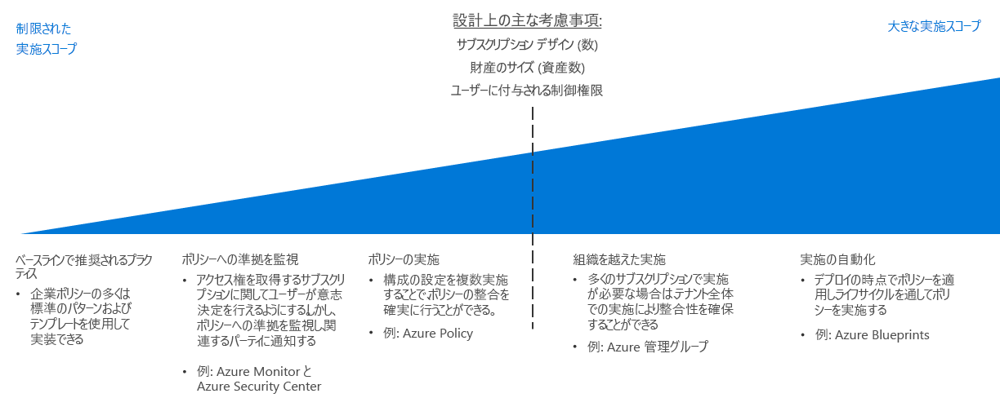

# ポリシー適用の意思決定ガイドPolicy enforcement decision guide

組織のポリシーを定義することは、組織全体にわたってそれを適用する方法がなければ有効ではありません。Defining organizational policy is not effective unless there is a way to enforce it across your organization. クラウドへの移行を計画する際に鍵となるのは、クラウド資産全体にわたってポリシーのコンプライアンスを最大限確保するために、クラウド プラットフォームによって提供されるツールと既存の IT プロセスをどのように組み合わせれば最適であるかを特定することです。A key aspect to planning any cloud migration is determining how best to combine tools provided by the cloud platform with your existing IT processes to maximize policy compliance across your entire cloud estate.

ジャンプ先:[ベースラインの推奨プラクティス](#baseline-recommended-practices) | [ポリシー コンプライアンスの監視](#policy-compliance-monitoring) | [ポリシーの適用](#policy-enforcement) | [組織間のポリシー](#cross-organization-policy) | [適用の自動化](#automated-enforcement)Jump to: [Baseline recommended practices](#baseline-recommended-practices) | [Policy compliance monitoring](#policy-compliance-monitoring) | [Policy enforcement](#policy-enforcement) | [Cross-organization policy](#cross-organization-policy) | [Automated enforcement](#automated-enforcement)

クラウドの資産が増加するにつれて、増加した一連のリソース、サブスクリプション、テナントにわたってポリシーを管理し、適用するという、関連して生じる必要性に直面することになります。As your cloud estate grows, you will be faced with a corresponding need to maintain and enforce policy across a larger array of resources, subscriptions, and tenants. 資産が大きいほど、一貫した適合と迅速な違反の検出を確実に行うために必要とされる適用のメカニズムは、より複雑なものとなります。The larger your estate, the more complex your enforcement mechanisms will need to be to ensure consistent adherence and fast violation detection. 小規模なクラウド デプロイに対しては、通常、リソースまたはサブスクリプション レベルでプラットフォームによって提供されるポリシー適用メカニズムで十分です。一方、大規模なデプロイでは、デプロイの標準、リソースのグループ化と組織化、ポリシーの適用とログ システムおよびレポート システムとの統合を伴う、より高度なメカニズムを活用する必要が生じる場合があります。Platform-provided policy enforcement mechanisms at the resource or subscription level are usually sufficient for smaller cloud deployments, while larger deployments may need to take advantage of more sophisticated mechanisms involving deployment standards, resource grouping and organization, and integrating policy enforcement with your logging and reporting systems.

ポリシー適用戦略の複雑さを選択する際には、主として、[サブスクリプション設計](../subscriptions/overview.md)で必要とされるサブスクリプションまたはテナントの数が重要な分岐点となっています。The key inflection point when choosing the complexity of your policy enforcement strategy is primarily focused on the number of subscriptions or tenants required by your [subscription design](../subscriptions/overview.md). クラウド資産内でさまざまなユーザー ロールに付与されるコントロールの量も、これらの決定に影響を与える可能性があります。The amount of control granted to various user roles within your cloud estate might influence these decisions as well.

## ベースラインの推奨プラクティスBaseline recommended practices

1 つのサブスクリプションと単純なクラウドを持つデプロイでは、ほとんどのクラウド プラットフォームにネイティブで備わっている機能を使用して、多くの企業のポリシーを適用できます。For single subscription and simple cloud deployments, many corporate policies can be enforced using features that are native to most cloud platforms. デプロイの複雑さが比較的低いこのレベルであっても、CAF [意思決定ガイド](../overview.md)の全体を通して説明されているパターンを一貫して使用することが、ベースライン レベルのポリシー コンプライアンスを確立する助けになります。Even at this relatively low level of deployment complexity, the consistent use of the patterns discussed throughout the CAF [decision guides](../overview.md) can help establish a baseline level of policy compliance.

例: For example:

- [デプロイ テンプレート](../resource-consistency/overview.md)を使用すると、標準化された構造と構成を持つリソースをプロビジョニングできます。[Deployment templates](../resource-consistency/overview.md) can provision resources with standardized structure and configuration.
- [タグ付けと名前付けの標準](../resource-tagging/overview.md)を導入すると、オペレーションを組織化し、会計とビジネス上の要件を支える助けになります。[Tagging and naming standards](../resource-tagging/overview.md) can help organize operations and support accounting and business requirements.
- トラフィック管理とネットワーク制限を、[ソフトウェア定義のネットワーク](../software-defined-network/overview.md)を通して実施できます。Traffic management and networking restrictions can be implemented through [software defined networking](../software-defined-network/overview.md).
- [ロール ベースのアクセス制御](../identity/overview.md)では、クラウド リソースをセキュリティで保護し、分離することができます。[Role-based access control](../identity/overview.md) can secure and isolate your cloud resources.

これらのガイド全体で説明されている標準的なパターンのアプリケーションが、どのように組織の要件を満たす助けになるかを調べることで、クラウド ポリシーの適用計画を開始します。Start your cloud policy enforcement planning by examining how the application of the standard patterns discussed throughout these guides can help meet your organizational requirements.

## ポリシー コンプライアンスの監視Policy compliance monitoring

別の重要な要素は、比較的小規模なクラウドのデプロイであっても、クラウド ベースのアプリケーションとサービスが組織のポリシーに準拠していることを確認し、リソースが非準拠になった場合には速やかに担当の関係者に通知する機能です。Another key factor, even for relatively small cloud deployments, is the ability to verify that cloud-based applications and services comply with organizational policy, promptly notifying the responsible parties if a resource becomes noncompliant. クラウド ワークロードのコンプライアンス状態の[ログ記録とレポート作成](../log-and-report/overview.md)を効果的に行うことは、企業ポリシー適用戦略の重要な一部です。Effectively [logging and reporting](../log-and-report/overview.md) the compliance status of your cloud workloads is a critical part of a corporate policy enforcement strategy.

クラウド資産が拡大したら、[Azure Security Center](/azure/security-center/) などの追加ツールによって、統合されたセキュリティと脅威の検出を提供できます。こうしたツールは、一元化されたポリシー管理を適用したり、オンプレミスとクラウドの両方の資産にアラートを適用したりするのに役立ちます。As your cloud estate grows, additional tools such as [Azure Security Center](/azure/security-center/) can provide integrated security and threat detection, and help apply centralized policy management and alerting for both your on-premises and cloud assets.

## ポリシーの適用Policy enforcement

サブスクリプション レベルで構成設定とリソース作成ルールを適用し、ポリシーの整合を確保しやすくすることもできます。You can also apply configuration settings and resource creation rules at the subscription level to help ensure policy alignment.

[Azure Policy](/azure/governance/policy/overview) は、ポリシーの作成、割り当て、および管理を行うための Azure のサービスです。[Azure Policy](/azure/governance/policy/overview) is an Azure service for creating, assigning, and managing policies. これらのポリシーは、リソースにさまざまなルールと効果を適用して、それらのリソースが会社の標準とサービス レベル アグリーメントに準拠した状態に保たれるようにします。These policies enforce different rules and effects over your resources, so those resources stay compliant with your corporate standards and service level agreements. Azure Policy では、割り当てられているポリシーへの非準拠がないか、リソースを評価します。Azure Policy evaluates your resources for noncompliance with assigned policies. たとえば、環境内の仮想マシンの SKU サイズを制限したい場合があります。For example, you might want to limit the SKU size of virtual machines in your environment. 対応するポリシーが実施されると、新しいリソースと既存のリソースの準拠状況が評価されます。Once a corresponding policy is implemented, new and existing resources would be evaluated for compliance. 適切なポリシーにより、既存のリソースを準拠の状態にすることができます。With the right policy, existing resources can be brought into compliance.

## 組織間のポリシーCross-organization policy

クラウドの資産が、適用が必要な多くのサブスクリプションにまたがるまで拡大したら、テナント全体の適用戦略に焦点を合わせて、ポリシーの一貫性を確保する必要があります。As your cloud estate grows to span many subscriptions that require enforcement, you will need to focus on a tenant-wide enforcement strategy to ensure policy consistency.

ポリシーは組織構造に関連しているため、[サブスクリプション設計](../subscriptions/overview.md)ではポリシーを考慮に入れる必要があります。Your [subscription design](../subscriptions/overview.md) will need to account for policy as it relates to your organizational structure. サブスクリプション設計内で複雑な組織のサポートを助けるのに加え、[Azure 管理グループ](../subscriptions/overview.md#management-groups)を使用して、Azure ポリシー ルールを複数のサブスクリプションにわたって割り当てることができます。In addition to helping support complex organization within your subscription design, [Azure management groups](../subscriptions/overview.md#management-groups) can be used to assign Azure Policy rules across multiple subscriptions.

## 適用の自動化Automated enforcement

標準化されたデプロイ テンプレートは、規模がより小さい場合に効果的であるのに対して、[Azure Blueprints](/azure/governance/blueprints/overview) では、Azure ソリューションの大規模な標準化されたプロビジョニングとデプロイのオーケストレーションが可能です。While standardized deployment templates are effective at a smaller scale, [Azure Blueprints](/azure/governance/blueprints/overview) allows large-scale standardized provisioning and deployment orchestration of Azure solutions. 作成される任意のリソースに対して一貫したポリシー設定を適用し、複数のサブスクリプションにわたるワークロードをデプロイできます。Workloads across multiple subscriptions can be deployed with consistent policy settings for any resources created.

クラウドとオンプレミスのリソースを統合する IT 環境については、ログ作成とレポート作成のシステムを使用して、ハイブリッドの監視機能を提供することが必要な場合があります。For IT environments integrating cloud and on-premises resources, you may need use logging and reporting systems to provide hybrid monitoring capabilities. サード パーティ製またはカスタムの運用監視システムで、追加のポリシー適用機能を提供できる場合があります。Your third-party or custom operational monitoring systems may offer additional policy enforcement capabilities. 複雑なクラウド資産の場合は、これらのシステムをどのようにクラウド資産と統合するのが最適であるかを検討してください。For complicated cloud estates, consider how best to integrate these systems with your cloud assets.

## 次の手順Next steps

サブスクリプション設計とガバナンス目標のサポートのため、リソースの整合性を利用してクラウド デプロイの編成と標準化を行う方法について学習します。Learn how resource consistency is used to organize and standardize cloud deployments in support of subscription design and governance goals.

> [!div class="nextstepaction"]
> [リソースの整合性Resource consistency](../resource-consistency/overview.md)
