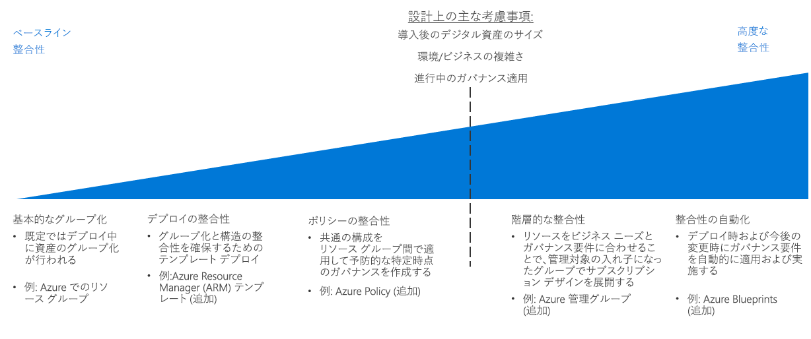

# CAF:リソースの整合性の意思決定ガイド

Azure の[サブスクリプション設計](../subscriptions/overview.md)では、組織の全体的な構造に関連してクラウド資産をどのように編成するかを定義します。 さらに、既存の IT 管理標準と組織のポリシーの統合は、サブスクリプション内でクラウド リソースをどのようにデプロイおよび編成するかによって異なります。

リソースのデプロイ、グループ化、および管理の設計を実装するために使用できるツールは、クラウド プラットフォームによって異なります。 一般に、各ソリューションには次の機能が含まれます。

- サブスクリプション レベルまたはアカウント レベルより下の論理的なグループ化のメカニズム。
- API を使用したプログラムでリソースをデプロイする機能。
- 標準化されたデプロイを作成するためのテンプレート。
- サブスクリプション レベル、アカウント レベル、およびリソース グループ レベルでポリシー ルールをデプロイする機能。

ジャンプ先:[基本的なグループ化](#basic-grouping) | [デプロイの整合性](#deployment-consistency) | [ポリシーの整合性](#policy-consistency) | [階層的な整合性](#hierarchical-consistency)  | [整合性の自動化](#automated-consistency)

主にリソースのデプロイとグループ化の意思決定を左右する要因: 移行後のデジタル資産のサイズ、既存のサブスクリプション設計方法にうまく適合しないビジネスまたは環境の複雑性、リソースがデプロイされた後に時間の経過と共にガバナンス適用する必要性。 より高度なリソース グループ設計には、正確なグループ化を確実に行うためにより多くの労力が必要となり、その結果、変更管理と追跡に費やす時間が増えることになります。

## 基本的なグループ化

Azure では、[リソース グループ](/azure/azure-resource-manager/resource-group-overview#resource-groups)はサブスクリプション内でリソースを論理的にグループ化するリソース編成のコア メカニズムです。

リソース グループは、共通のライフ サイクル、またはポリシーやロールベースのアクセス制御 (RBAC) の要件などの共有管理の制約があるリソースのコンテナーとして機能します。 リソース グループに別のリソース グループを入れ子にすることはできません。また、リソースは 1 つのリソース グループにのみ属することができます。 リソース グループのすべてのリソースに対して特定のアクションを適用できます。 たとえば、リソース グループを削除すると、そのグループ内のすべてのリソースが削除されます。 リソース グループを作成する際には一般的なパターンがあり、通常、2 つのカテゴリに分類されます。

- 従来型 IT ワークロード:ほとんどの場合、同じライフサイクル内の項目 (アプリケーションなど) でグループ化されます。 アプリケーションでグループ化すると、個々のアプリケーションの管理が可能になります。
- アジャイルの IT ワークロード:外部顧客向けのクラウド アプリケーションに焦点を当てます。 多くの場合、こうしたリソース グループは、デプロイの機能レイヤー (Web 層、アプリケーション層など) と管理の機能レイヤーを反映します。

## デプロイの整合性

基本的なリソース グループ化メカニズムの上に構築されている大部分のクラウド プラットフォームは、テンプレートを使用して、クラウド環境にリソースをデプロイするためのシステムを提供します。 ワークロードのデプロイ時、テンプレートを使用して一貫性のある組織と名前付け規則を作成し、リソースのデプロイと管理の設計におけるこれらの側面を強化できます。

[Azure Resource Manager テンプレート](/azure/azure-resource-manager/resource-group-overview#template-deployment)を使用すると、事前に定義された構成とリソース グループの構造を使用して一貫した状態でリソースを繰り返しデプロイすることができます。 Resource Manager テンプレートを使用して、デプロイの基礎として標準のセットを定義できます。

たとえば、サーバー間のトラフィックを管理するために、ロード バランサーと組み合わせた Web サーバーとして 2 つの仮想マシンを含む Web サーバー ワークロードをデプロイするための標準テンプレートを作成できます。 新しい Web サーバー ワークロードが必要な場合はいつでも、このテンプレートを再利用して、関連するデプロイ名と IP アドレスを変更するだけで構造的に同一のデプロイを作成できます。

なお、プログラムでこれらのテンプレートをデプロイして、CI/CD システムと統合することもできます。

## ポリシーの整合性

リソースが作成されるときにガバナンス ポリシーが確実に適用されるようにするために、リソース グループ設計の一部には、リソースをデプロイするときに共通の構成を使用することが含まれます。

リソース グループと標準化された Resource Manager テンプレートを組み合わせることで、デプロイに必要な設定の標準と、リソース グループまたはリソースそれぞれに適用される [Azure Policy](/azure/governance/policy/overview) ルールの標準を適用できます。

たとえば、サブスクリプション内にデプロイされたすべての仮想マシンが、中央の IT チームによって管理されている共通のサブネットに接続するという要件があるとします。 ワークロード VM をデプロイするための標準的なテンプレートを作成できます。このテンプレートにより、ワークロードの別のリソース グループが作成され、必要な VM がそこにデプロイされます。 このリソース グループには、共有サブネットに参加するリソース グループ内のネットワーク インターフェイスのみを許可するポリシー ルールがあります。

クラウド デプロイ内でのポリシーの決定の適用に関する詳細については、[ポリシーの適用](../policy-enforcement/overview.md)をご覧ください。

## 階層的な整合性

クラウド資産のサイズ拡大に合わせて、Azure Enterprise Agreement の企業、部門、アカウント、サブスクリプションの各階層を使用してサポートできるさらに複雑なガバナンス要件のサポートが必要となる場合があります。 リソース グループを使用すると、組織内で追加の階層レベルをサポートでき、リソース グループ レベルで Azure Policy の規則およびアクセスの制御を適用できます。

[Azure 管理グループ](../subscriptions/overview.md#management-groups)は、エンタープライズ契約の構造の上に代替の階層をオーバーレイして、より複雑な組織構造をサポートすることができます。 これにより、サブスクリプションおよびそれらのサブスクリプションに含まれるリソースで、ビジネス組織の要件に合わせて編成されたアクセスの制御およびポリシーの適用のメカニズムがサポートされます。

## 整合性の自動化

大規模なクラウド デプロイでは、グローバル ガバナンスがさらに重要で複雑になります。 リソースをデプロイするときにガバナンスの要件を自動的に適用し、強制することは、既存のデプロイの更新された要件を満たすことと同様に非常に重要です。

[Azure Blueprints](/azure/governance/blueprints/overview) を使用すると、組織で Azure 内の大規模なクラウド資産のグローバル ガバナンスをサポートできます。 Blueprints は、標準の Azure Resource Manager テンプレートで提供される機能を超えて、リソースのデプロイとポリシー規則の適用が可能な完全なデプロイ オーケストレーションを作成します。 Blueprints は、バージョン管理、ブループリントが使用されていたすべてのサブスクリプションに更新プログラムを適用する機能、およびデプロイされたサブスクリプションをロックしてリソースの不正な作成および変更を回避する機能をサポートしています。

これらの展開パッケージを使用すると、IT チームと開発チームが、変化する組織のポリシー要件に準拠する新しいワークロードとネットワーク資産を迅速にデプロイできます。 Blueprints は CI/CD パイプラインに統合して、デプロイの更新時に、改訂されたガバナンス標準をそれらのデプロイに適用することもできます。

## 次の手順

リソースの名前付けとタグ付けを使用して、クラウド リソースをさらに編成して管理する方法について説明します。

> [!div class="nextstepaction"]
> [リソースの名前付けとタグ付け](../resource-tagging/overview.md)
