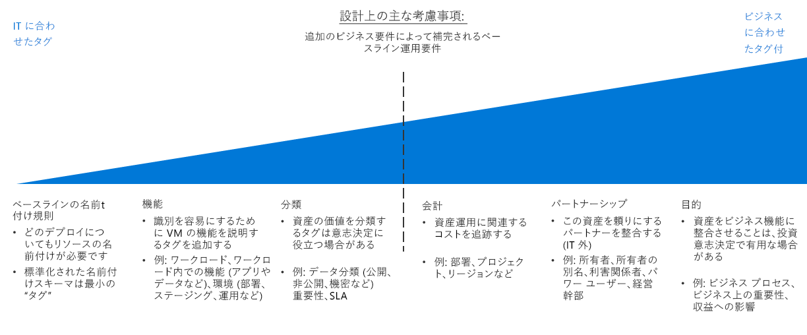

# リソースの編成とタグ付けの決定のガイド

デプロイが非常に単純なものでない限り、クラウドベースのリソースの編成は、IT 部門にとって最も重要なタスクの 1 つです。 リソースを編成する目的は、主に次の 3 つです。

- **リソース管理**。 IT チームは、特定のワークロード、環境、所有権グループ、またはその他の重要な情報に関連付けられているリソースをすばやく見つける必要があります。 リソースの整理は、リソース管理に組織のロールとアクセス許可を割り当てるために不可欠です。
- **操作**。 適切な方法で編成すると、IT 部門によるリソースの管理が簡単になるだけでなく、リソースの作成、運用の監視、および DevOps プロセスの作成の一部としてオートメーションを利用できるようになります。
- **アカウンティング**。 ビジネス グループにクラウド リソースの消費量を認識させるため、IT 部門は、どのワークロードとチームがどのリソースを使用しているかを把握する必要があります。 チャージバックやショーバック アカウンティングなどの手法をサポートするには、所有権と使用状況を反映するようにクラウド リソースを編成する必要があります。

## タグ付け決定ガイド

ジャンプ先:[ベースラインの名前付け規則](#baseline-naming-conventions) | [リソース タグ付けのパターン](#resource-tagging-patterns) | [名前付けとタグ付けのポリシー](#naming-and-tagging-policy) | [詳細情報](#learn-more)

タグ付けのアプローチには、クラウド ワークロードを管理する IT チームのサポートから、ビジネス全体のすべての側面に関連する情報の統合までの範囲の何に注目するかにより、簡単にも複雑にもなります。

IT に合わせることに注目したタグ付けでは、資産を監視する複雑さは軽減され、機能と分類に基づく管理の決定ははるかに簡単になります。

非 IT ポリシーも含むタグ付けスキームでは、ビジネスの関心が反映されたタグ付け標準を作成し、そのような標準を長期間維持するために、より多くの時間をかけることが必要になる場合があります。 ただし、このプロセスの結果として作成されるタグ付けシステムでは、IT 資産のコストと価値を考慮する機能が向上します。 資産の価値とその運用コストのこのような関連付けは、組織内での IT のコスト センターとしての認識を変える最初のステップの 1 つです。

## ベースラインの名前付け規則

標準化された名前付け規則は、クラウドでホストされるリソースを編成するための開始点です。 適切な構造の名前付けシステムを作成すると、管理とアカウンティング両方の目的でリソースをすばやく識別できるようになります。 組織の他の部分に IT 名前付け規則が既にある場合は、クラウド リソースの名前付け規則をそれらに揃えるかどうか、またはクラウドベースの標準を別に確立する必要があるかを検討します。

Azure リソースの種類によって[名前付けの要件](../../../best-practices/naming-conventions.md#naming-rules-and-restrictions)が異なることにも注意してください。 名前付け規則は、これらの名前付け要件に対応している必要があります。

## リソース タグ付けのパターン

一貫した名前付け規則だけで提供できるものより高度な組織のために、クラウド プラットフォームではリソースのタグ付けの機能がサポートされています。

"*タグ*" は、リソースにアタッチされているメタデータ要素です。 タグは、キー/値の文字列のペアで構成されます。 これらのペアに含める値はユーザー次第ですが、包括的な名前付けとタグ付けのポリシーの一部として、一貫性のあるグローバルなタグのセットを適用することは、全体的なガバナンス ポリシーの重要な部分です。

タグ付けの一般的なパターンの例を次に示します。

<!-- markdownlint-disable MD033 -->

| タグの種類 | 例 | 説明 |
|-----|-----|-----|
| 機能            | app = catalogsearch1  tier = web  webserver = apache env = prod  env = staging  env = dev                 | ワークロード内での目的との関連、デプロイされている環境、または他の機能および運用に関する詳細で、リソースを分類します。                                 |
| 分類        | confidentiality=private sla = 24hours                                 | 使用方法および適用されるポリシーによって、リソースを分類します                               |
| 会計            | department = finance  project = catalogsearch  region = northamerica | 課金を目的として、組織内の特定のグループにリソースを関連付けることができます |
| パートナーシップ           | owner = jsmith  contactalias = catsearchowners stakeholders = user1;user2;user3                        | リソースに関連のある、またはそれ以外でリソースによって影響を受けるユーザー (IT 外) に関する情報を提供します                      |
| 目的               | businessprocess=support businessimpact=moderate revenueimpact=high   | 投資に関する決定のサポートを向上させるため、リソースをビジネス機能と一致させます  |

<!-- markdownlint-enable MD033 -->

## 名前付けとタグ付けのポリシー

名前付けとタグ付けのポリシーは時間とともに発展します。 ただし、クラウド移行の冒頭で、組織の主要な優先順位を決定することが重要です。 計画プロセスの一環として、次のことを慎重に検討します。

- 名前付けとタグ付けのポリシーを、組織内の既存の名前付けおよび組織的ポリシーと統合する最善の方法は何ですか。
- チャージバックまたはショウバックのアカウンティング システムを実装しますか。 この組織構造では、部署、ビジネス グループ、チームはどのように表されていますか
- すべてのリソースで必要なタグ付け情報は何ですか 実装するかしないかが個々のチームに委ねられるタグ付け情報は何ですか
- リソースの規制準拠要件のような詳細情報をタグ付けで表す必要がありますか 稼働時間の要件、パッチのスケジュール、セキュリティ要件など、運用に関する詳細はどうですか

## 詳細情報

Azure での名前付けとタグ付けに関する詳細については、以下を参照してください。

- [Azure リソースの名前付け規則](../../../best-practices/naming-conventions.md)。 Azure リソースの推奨される名前付け規則については、Azure クラウドの基礎のサイトでこのガイドを参照してください。
- [タグを使用した Azure リソースの整理](/azure/azure-resource-manager/resource-group-using-tags?toc=/azure/billing/TOC.json)。 Azure ではリソース グループと個々のリソースの両方のレベルでタグを適用でき、適用されたタグに基づいて柔軟な詳細さでアカウンティング レポートを作成できます。

## 次の手順

クラウド環境でデータをセキュリティ保護するための暗号化の使用方法について学習します。

> [!div class="nextstepaction"]
> [暗号化](../encryption/overview.md)
