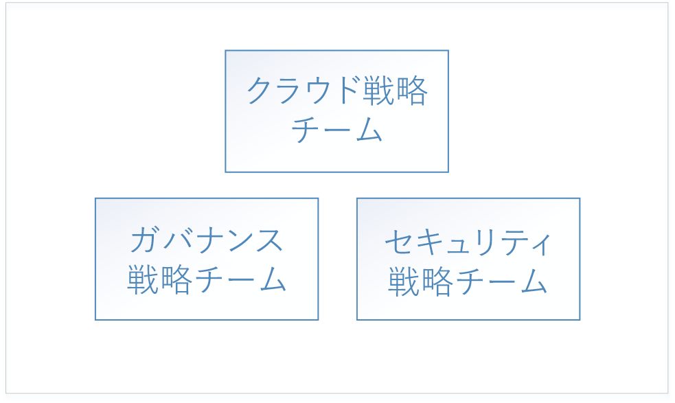
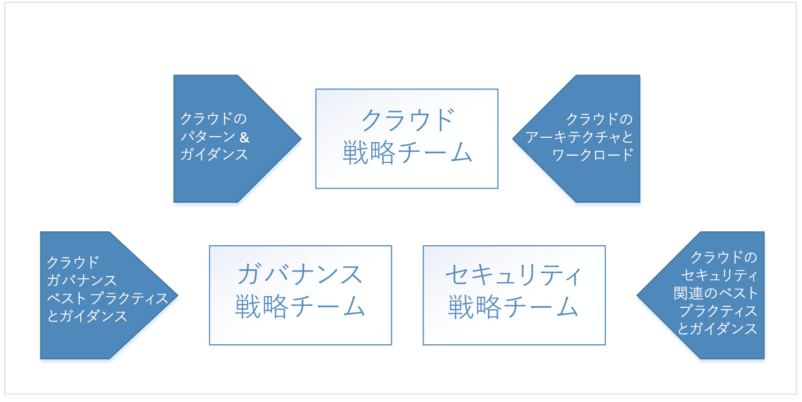
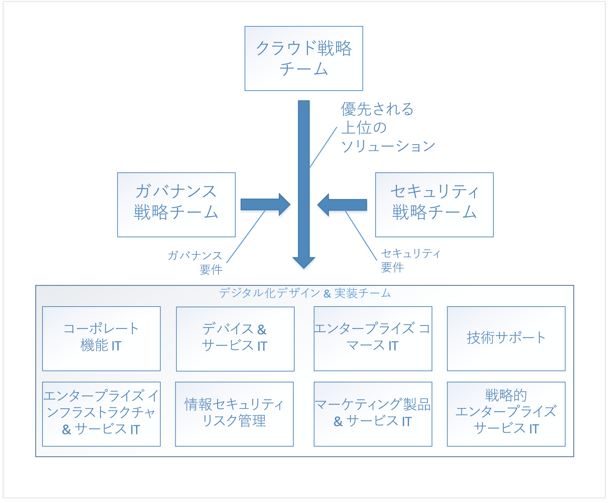

# クラウド導入フレームワークの概要

クラウド コンピューティングへの**デジタル変革**は、オンプレミスでの運用からクラウドでの運用への移行を意味します。 この移行にはビジネスの新しい方法が含まれます。たとえば、デジタル変革により、ソフトウェアやデータ センター ハードウェアのための設備投資から、クラウド リソースを使用するための運用コストに移行します。 [Azure 向けの Microsoft Cloud 導入フレームワーク](../overview.md)の使用を開始する方法について説明します。

## デジタル変換プロセス

クラウドの導入を成功させるには、企業は組織、従業員、プロセスがこのデジタル変換に対応できるように準備する必要があります。 組織構造は企業によって異なるため、組織の準備を整える汎用的な方法はありません。 このドキュメントでは、企業が準備する際に実施できるステップの概要を説明します。 組織は、ここで示す各ステップを遂行するための詳細な計画の作成に時間を費やす必要があります。

デジタル変革の大まかなプロセスは次のとおりです。

1. クラウド戦略チームを結成します。 このチームはデジタル変革を牽引する役割を担います。 この段階で、デジタル変革のためのガバナンス チームとセキュリティ チームを結成することも重要です。
2. クラウド戦略チームのメンバーは、クラウド テクノロジについて、何が新しく、何が違うのかを学びます。
3. クラウド戦略チームは、デジタル変革に向けてビジネス ケースを構築して企業の準備をします。ビジネス戦略の現在のギャップをすべて列挙し、それらを排除するための大まかなソリューションを決定します。
4. ビジネス グループと共に大まかなソリューションを調整します。 各ソリューションの設計と実装を所有する、各ビジネス グループ内の関係者を特定します。
5. 既存の役割、スキル、プロセスを変換して、クラウド向けの役割、スキル、プロセスを含めます。

<!--6. Develop processes for operating in the cloud to make solutions more robust in terms of availability, resiliency, and security.
1. Optimize solutions for performance, scalability, and cost efficiency.-->

## 手順 1: クラウド戦略チームを結成します。

企業のデジタル変革の第一歩は、組織のビジネス リーダーを関与させてクラウド戦略チーム (CST) を結成することです。 このチームは、財務グループ、IT インフラストラクチャ グループ、アプリケーション グループのビジネス リーダーで構成されます。 これらのチームは、クラウドの分析および実験フェーズを支援できます。

たとえば、クラウド戦略チームは、CTO が主導し、エンタープライズ アーキテクチャ チームのメンバー、IT 財務担当者、さまざまな IT アプリケーション グループ (人事、財務など) の上級技術者、インフラストラクチャ、セキュリティ、ネットワークの各チームのリーダーで構成できます。

また、他にガバナンス チームとセキュリティ チームという 2 つの高レベルのチームを結成することも重要です。 これらのチームは、企業のガバナンス ポリシーとセキュリティ ポリシーの策定、実施、継続的な監査を担当します。 ガバナンス チームには、資産保護、コスト管理、グループ ポリシー、関連トピックに取り組んだことがあるメンバーが必要です。 セキュリティ チームには、業界の現在のセキュリティ標準と企業のセキュリティ要件を熟知しているメンバーが必要です。

ガバナンス チームは、クラウドにおける企業のガバナンス モデルの設計と実装、およびデジタル変革に含まれる共有インフラストラクチャ資産の配置と管理を担当します。 これらの資産には、オンプレミス ネットワークをクラウドの仮想ネットワークに接続するために必要なハードウェア、ソフトウェア、クラウド リソースが含まれます。

セキュリティ チームは、ガバナンス チームと緊密に連携して、クラウドにおける企業のセキュリティ ポリシーを策定し、実施する役割を担います。 セキュリティ チームは、クラウドの仮想ネットワークを含めるために、オンプレミス ネットワークのセキュリティ境界の拡張を管理します。 これは、クラウド仮想ネットワーク上の受信ファイアウォールと送信ファイアウォールを所有して管理し、ツールとポリシーによって、承認されていないリソースの展開を確実に防ぐという形を取ることがあります。

## 手順 2: クラウドの何が新しいのかを学ぶ

企業のデジタル変革の次のステップでは、クラウド戦略チームのメンバーが、クラウド テクノロジによって企業のビジネスの方法がどのように変わるのかを学びます。 これは、ビジネス、従業員、テクノロジの変革に向けた準備と計画です。 クラウド戦略チームのメンバーは、オンプレミスと比較して、クラウドの何が新しく、何が違うのかを理解することが重要です。

クラウドを理解するための出発点として、[Azure のしくみ](what-is-azure.md)を俯瞰的に学びます。 次に、[リソース アクセス管理を理解](azure-resource-access.md)するための準備として、[Azure のガバナンス](what-is-governance.md)の基礎を学びます。

高度な学習のために、ガバナンス チームは、目次のガバナンス セクションの概念と設計ガイドを見直す必要があります。 インフラストラクチャとワークロードのセクションは、クラウドの一般的なアーキテクチャとワークロードについて学ぶのに役立ちます。

## 手順 3: ビジネス戦略のギャップを特定する

次に、クラウド戦略チームは、デジタル変革ソリューションを必要とするビジネス上の問題を列挙します。 たとえば、既存のオンプレミスのデータ センターに、耐用年数が経過し、交換が必要なハードウェアが存在する場合があります。 別の例として、新しい機能やサービスの市場投入に時間がかかっており、競争で後れを取っている場合もあります。 これらのギャップは、企業のデジタル変革の "*目標*" を表しています。

ビジネス戦略のギャップは、次のカテゴリに分類できます。

|Category|説明|
|-----|-----|
|コスト管理|企業がテクノロジの代金を支払う方法のギャップを表します。|
|ガバナンス|コスト超過、セキュリティの問題、またはコンプライアンスの問題の原因となる可能性のある不適切な使用から資産を保護するために企業が使用するプロセスのギャップを表します。 |
|コンプライアンス|企業が、社内の独自のプロセスとポリシー、および外部の法律、規制、標準に従う方法のギャップを表します。 |
|セキュリティ|企業がテクノロジおよびデータ資産を外部の脅威から保護する方法のギャップを表します。 |
|データ ガバナンス|企業がデータ (特に顧客データ) を管理する方法のギャップを表します。 たとえば、欧州連合の新しい一般データ保護規則 (GDPR) には、顧客データの保護に関する厳しい要件があり、新しいハードウェアやソフトウェアが必要になる場合があります。|

ビジネス戦略のすべてのギャップをこれらのカテゴリに分類したら、次に、各問題の大まかなソリューションを決定します。

次の表に、いくつかの例を示します。

|ビジネス戦略のギャップ|カテゴリ &nbsp; &nbsp; &nbsp; &nbsp; &nbsp;|ソリューション &nbsp;&nbsp;&nbsp;&nbsp;&nbsp;&nbsp;&nbsp;&nbsp;&nbsp;&nbsp;&nbsp;&nbsp;&nbsp;&nbsp;|
|-----|-----|-----|
| 現在、オンプレミスでホストされているサービスで、需要ピーク時 (使用の約 10%) に可用性、回復性、スケーラビリティに関する問題が発生しています。 オンプレミスのデータ センター内のサーバーは耐用年数が経過しています。 エンタープライズ IT では、ピーク需要に対処するための仕様を備えた、データ センター向けの新しいオンプレミス ハードウェアの購入を推奨しています。| コスト管理 | 影響を受ける既存のオンプレミスのワークロードを、クラウドのスケーラブルなリソースに移行し、使用分のみの料金を支払います。 |
| データ管理に関する外部の法律と規制により、保存データの暗号化 (新しいハードウェアとソフトウェアが必要) を必要とする一連の標準管理に従うことが企業に求められています。 | データ ガバナンス | 保存データを Azure Storage Service Encryption for Data at Rest に移行します。 |
| オンプレミスのデータ センターでホストされているサービスで、公開されているサービスに対する分散型サービス拒否 (DDoS) 攻撃が発生しています。 この攻撃は軽減するのが難しく、新しいハードウェア、ソフトウェア、セキュリティ担当者が効果的に対処する必要があります。 | セキュリティ | サービスを Azure に移行し、Azure DDoS Protection を利用します。|

ビジネス戦略のすべてのギャップを列挙し、大まかなソリューションを決定したら、リストに優先順位を付けます。 リストに優先順位を付けるには、ビジネス戦略のギャップを、各カテゴリでの企業の短期的および長期的目標に合わせます。 たとえば、企業の短期的目標が、次の 2 つの会計四半期に IT 支出を削減することである場合、"*コスト管理*" カテゴリのビジネス ギャップには、それぞれに関連する推定コスト削減額に基づいて優先順位を付けることができます。

このプロセスの出力は、ビジネス カテゴリに合わせて調整された大まかなソリューションのスタックランク付けリストになります。

## 手順 4: 大まかなソリューションをビジネス グループと共に調整してソリューションを設計する

デジタル変革の目標を列挙し、優先順位を付け、大まかなソリューションを提案しました。次に、クラウド戦略チームは、各ビジネス グループの設計チームおよび実装チームと共にそれぞれの大まかなソリューションを調整します。

各チームは優先順位が付けられたリストを入手し、大まかなソリューションを検討して各ソリューションを設計します。 設計プロセスには、新しいインフラストラクチャと新しいワークロードの仕様が含まれます。 また、従業員の役割と従業員が従うプロセスが変更される場合もあります。 この段階で、各設計チームは、ガバナンス チームとセキュリティ チームを交えて各設計を検討することも非常に重要です。 各設計は、ガバナンス チームとセキュリティ チームが定義したポリシーと手順の範囲内である必要があり、各設計の最終的な承認時にこれらのチームを含める必要があります。

各ソリューションの設計は簡単な作業ではありません。設計を進める中で、他のチームの他のソリューション設計との関連を踏まえて設計を検討する必要があります。 たとえば、一部の設計により、既存のオンプレミスのアプリケーションやサービスをクラウドに移行することになる場合は、これらをグループ化し、全体的な移行戦略を策定する方が効率的な場合があります。 別の例として、既存のオンプレミスのアプリケーションとサービスの中に移行できないものがあり、それらを新しく開発されたサービスまたはサード パーティのサービスに置き換えることがソリューションとなる場合もあります。 この場合、これらをグループ化し、重複するものを特定して、サード パーティのサービスを複数のソリューションに使用できるかどうかを判断する方が効率的です。

ソリューションの設計が完了したら、チームは各設計の実装フェーズに移ります。 各ソリューション設計の実装フェーズは、標準のプロジェクト管理プロセスを使用して実行できます。

## 手順 5:既存の役割、スキル、プロセスをクラウド向けに変換する

IT 業界の歴史における各進化段階で、業界の最も顕著な変化は、スタッフの役割の変化によって特徴付けられることも少なくありません。 メインフレームからクライアント/サーバー モデルへの移行時には、コンピューターのオペレーターの役割がほぼ消滅し、システム管理者に置き換えられました。 仮想化時代が到来したときには、物理サーバーを操作するスタッフの要件が減り、代わりに仮想化スペシャリストが求められるようになりました。 同様に、組織がクラウド コンピューティングに移行するにつれて、役割が再び変化すると考えられます。 たとえば、データ センター スペシャリストがクラウド財務アナリストに置き換えられる可能性があります。 IT 職の肩書が変わっていない場合でも、日常業務における役割は大幅に進化しています。

IT スタッフは、クラウド ソリューションをサポートするために異なるスキル セットが必要であることを認識するようになるにつれて、自分の役割や立場に不安を感じている可能性があります。 しかし、新しいクラウド テクノロジを調査し、知識を身に付けている機敏な従業員は、このような恐れを抱く必要はありません。 これらの従業員はクラウド サービスの導入を牽引し、組織が関連する変化を理解して受け入れることができるよう支援することができます。

### 懸念を把握する

デジタル変革を進める中で、各チームはスタッフの懸念を把握する必要があります。 懸念を把握するときは、以下を特定します。

* 懸念の種類。 たとえば、スタッフはデジタル変革に伴う職務の変更に抵抗を示す可能性があります。
* 懸念に対処していない場合の影響。 たとえば、デジタル変革に対する抵抗から、スタッフが必要な変更を実施するのに時間がかかる可能性があります。
* 懸念に対処できる領域。 たとえば、IT 部門のスタッフが新しいスキルを習得することに難色を示している場合、IT 関係者の領域が、この懸念に最も適切に対処できます。 懸念事項によっては、領域の特定が明確な場合もあります。このような場合、経営幹部に上申することが必要な場合があります。

### ギャップを特定する

企業のデジタル変革に関する問題への取り組みのもう 1 つの側面は、**ギャップ**の特定です。 ギャップとは、社内に現在存在しない、デジタル変革に必要な役割、スキル、またはプロセスです。

まず、新しい責務と撤廃すべき現在の責務に重点を置いて、デジタル変革に伴う新しい責務を列挙します。 各責務に即した分野を特定します。 新しい責務については、その分野にどの程度即しているかを判断します。 一部の責務は複数の分野にまたがる可能性があります。これは、懸念事項と捉える必要があり、適切に調整する機会を示しています。 責務と見なされる分野がない場合は、これをギャップと捉えます。

次に、責務をサポートするために必要なスキルを特定します。 社内にこれらのスキルを持つ既存のリソースがあるかどうかを確認します。 既存のリソースがない場合は、必要なトレーニング プログラムや人材獲得を決定します。 デジタル変革を順調に進めるために責務をサポートする必要がある期間を決定します。

最後に、これらのスキルを実行する役割を特定します。 一部の既存の従業員が役割の一部を担うことになりますが、まったく新しい役割が必要になる場合もあります。

### チーム間で連携する

組織のデジタル変革のギャップを埋めるために必要なスキルは、通常、1 つの役割、または 1 つの部門に限定されるわけではありません。 スキルには、1 つの役割または複数の役割にまたがる可能性のある関係や依存関係があり、それらの役割は複数の部門に存在することがあります。 たとえば、ワークロード所有者は、IT の役割を担う従業員に、サブスクリプションやリソース グループなどのコア リソースをプロビジョニングするよう求めることがあります。

これらの依存関係は、組織が役割間のワークフローを管理するために実装する新しいプロセスを表します。 上記の例では、ワークロード所有者と IT の役割の関係をサポートできる複数の異なる種類のプロセスがあります。 たとえば、ワークフロー ツールを作成してプロセスを管理できます。また、簡単な電子メール テンプレートを使用することもできます。

これらの依存関係を追跡し、それらをサポートするプロセスと、そのプロセスが現在存在するかどうかを記録します。 ツールを必要とするプロセスでは、ツールを展開するためのタイムラインが、デジタル変革の全体的なスケジュールに沿っていることを確認します。

## 次の手順

デジタル変革は反復的なプロセスであり、反復するたびに、関与するチームが効率化されていきます。

> [!div class="nextstepaction"]
> [Azure のしくみを理解する](what-is-azure.md)
