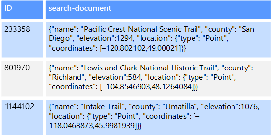

# 非リレーショナル データと NoSQL

*非リレーショナル データベース*とは、従来のほとんどのデータベース システムにある行と列のテーブル スキーマを使用しないデータベースです。 代わりに、非リレーショナル データベースは、格納されているデータの種類に固有の要件に合わせて最適化されたストレージ モデルを使用します。 たとえば、単純なキーと値のペア、JSON ドキュメント、またはエッジと頂点から構成されるグラフとしてデータを格納できます。

これらのデータ ストアのすべてに共通する点は、[リレーショナル モデル](../relational-data/index.md)を使用していないことです。 また、サポートするデータの種類やデータのクエリ方法がより具体的になる傾向があります。 たとえば、時系列データ ストアは、時間ベースのデータ シーケンスに対するクエリに合わせて最適化されていますが、グラフ データ ストアは、エンティティ間の重み付けされたリレーションシップの探索に合わせて最適化されています。 どちらの形式も、トランザクション データの管理タスクに対しては適切に汎用化されません。

*NoSQL* という用語は、クエリに SQL を使用しないデータ ストアを指します。代わりに他のプログラミング言語とコンストラクトを使用してデータのクエリを実行します。 実際、NoSQL データベースの多くは SQL 互換のクエリをサポートしていますが、"NoSQL" は "非リレーショナル データベース" を意味します。 ただし通常、基になるクエリ実行戦略は、同じ SQL クエリを実行する場合でも従来の RDBMS の方法とは大きく異なります。

以下のセクションでは、非リレーショナル データベースまたは NoSQL データベースの主なカテゴリについて説明します。

## ドキュメント データ ストア

ドキュメント データ ストアは、*ドキュメント*と呼ばれるエンティティ内の名前付き文字列フィールドとオブジェクト データ値のセットを管理します。 通常、これらのデータ ストアはデータを JSON ドキュメント形式で格納します。 各フィールド値は、スカラー項目 (数値など) または複合要素 (リストや親子コレクションなど) の場合があります。 ドキュメントのフィールド内のデータは、XML、YAML、JSON、BSON などのさまざまな方法でエンコードしたり、またはプレーン テキストとして格納することもできます。 ドキュメント内のフィールドは、ストレージ管理システムに公開されるため、アプリケーションで、これらのフィールドの値を使用して データをクエリおよびフィルターできます。

一般に、ドキュメントには、エンティティのデータ全体が含まれます。 エンティティを構成する項目は、アプリケーション固有です。 たとえば、エンティティに、顧客、注文、または両方の組み合わせの詳細を格納できます。 リレーショナル データベース管理システム (RDBMS) 内の複数のリレーショナル テーブル間に分散されている情報を 1 つのドキュメントに格納できます。 ドキュメント ストアでは、すべてのドキュメントが同じ構造をしている必要はありません。 この自由形式のアプローチにより、大幅な柔軟性を提供します。 たとえば、アプリケーションは、ビジネス要件の変更に応じて、さまざまなデータをドキュメントに格納できます。

  

アプリケーションは、ドキュメント キーを使用してドキュメントを取得できます。 これはドキュメントの一意の識別子で、多くの場合にハッシュされ、データを均等に分散するのに役立ちます。 一部のドキュメント データベースは、ドキュメント キーを自動的に作成します。 他は、ユーザーがキーとして使用するドキュメントの属性を指定できます。 アプリケーションは、1 つまたは複数のフィールドの値に基づいて、ドキュメントをクエリすることもできます。 一部のドキュメント データベースでは、インデックスをサポートし、1 つまたは複数のインデックス付きフィールドに基づいたドキュメントの高速のルックアップを容易にします。

多くのドキュメント データベースで、インプレース更新をサポートしているため、アプリケーションは、ドキュメント全体を書き直すことなく、ドキュメント内の特定のフィールドの値を変更できます。 1 つのドキュメントの複数のフィールドに対する読み取りおよび書き込み操作は、通常アトミックです。

関連 Azure サービス:  

- [Azure Cosmos DB](https://azure.microsoft.com/services/cosmos-db/)

## 単票形式データ ストア

単票形式または列ファミリ データ ストアは、列と行にデータを編成します。 列ファミリ データ ストアは、その最も単純な形式では、少なくとも概念的にはリレーショナル データベースによく似ています。 列ファミリ データベースの真の能力は、データを格納する列指向のアプローチに由来する、スパース データを構造化する非正規化アプローチにあります。

列ファミリ データ ストアは、行と列を含む表形式データを保持するものと考えることができますが、列は列ファミリと呼ばれるグループに分類されます。 各列ファミリは、論理的に関連し、通常はユニットとして取得または操作される一連の列を保持しています。 個別にアクセスされるその他のデータは、個別の列ファミリに格納できます。 列ファミリ内では、新しい列を動的に追加することができ、行をスパースにする (つまり、行のすべての列に値を持つ必要がない) ことができます。

次の図は、`Identity` と `Contact Info` の 2 つの列ファミリのある例を示しています。 単一のエンティティのデータは、各列ファミリに同じ行キーを持ちます。 列ファミリ内にある任意のオブジェクトの行が動的に変化する構造は、列ファミリ アプローチの重要な利点です。列ファミリ データ ストアのこの構造は、さまざまなスキーマを持つデータを格納するために適しています。

キー/値のストアまたはドキュメント データベースとは異なり、ほとんどの列ファミリのデータベースは、ハッシュを計算するのではなく、キー順序でデータを物理的に格納します。 行キーはプライマリ インデックスと見なされ、行キーによって、特定のキーまたは一連のキーを使用するキーベースのアクセスが可能になります。 一部の実装では、列ファミリ内の特定の列に対してセカンダリ インデックスを作成できます。 セカンダリ インデックスを使用すると、行キーではなく、列値によってデータを取得できます。

ディスク上では、列ファミリ内のすべての列が同じファイルに格納され、各ファイルには特定の数の行が格納されます。 大規模なデータ セットにこのアプローチを利用すると、一度に少数の列に対してのみクエリを実行する場合に、ディスクから読み取る必要のあるデータ量を減らすことでパフォーマンス上のメリットがあります。

一部の実装では、複数の列ファミリにまたがる行全体で原子性を提供するものもありますが、行の読み取りと書き込みの操作は通常、単一の列ファミリ内ではアトミックです。

関連 Azure サービス:  

- [HDInsight の HBase](/azure/hdinsight/hdinsight-hbase-overview)

## キー/値のデータ ストア

キー/値のストアは、本質的に大規模なハッシュ テーブルです。 各データ値を一意のキーに関連付けると、キー/値のストアがこのキーを使用し、適切なハッシュ関数を使用してデータを格納します。 ハッシュ関数は、データ ストレージ間でハッシュされたキーを均等に分散するために選択されます。

ほとんどのキー/値のストアは、簡単なクエリ、挿入、および削除操作のみをサポートしています。 (部分的または完全に) 値を変更するには、アプリケーションで値全体の既存のデータを上書きする必要があります。 ほとんどの実装で、1 つの値の読み取りや書き込みは、アトミック操作です。 値が大きい場合、書き込みにいくらか時間がかかることがあります。

一部のキー/値のストアでは値の最大サイズに制限を課すものがありますが、アプリケーションは、一連の値として任意のデータを格納できます。 格納された値は、ストレージ システム ソフトウェアに非透過的です。 すべてのスキーマ情報が提供され、アプリケーションによって解釈される必要があります。 基本的に、値は BLOB で、キー/値のストアは単純にキーによって、値を取得または格納します。

キー/値のストアは、キーの値を使用して、またはキーの範囲を指定して簡単な検索を実行するアプリケーションに合わせて高度に最適化されていますが、複数のテーブルにまたがるデータの結合など、キー/値の異なるテーブル間でデータをクエリする必要があるシステムには適していません。

また、キー/値のストアは、キーのみに基づくルックアップを実行するのではなく、キー以外の値によるクエリやフィルター処理が重要なシナリオに合わせて最適化されていません。 たとえば、リレーショナル データベースでは、WHERE 句を使用して非キー列をフィルター処理することでレコードを見つけることができますが、通常、キー/値ストアにはこのようなルックアップ機能がありません。ルックアップを実行した場合、すべての値のスキャンが遅くなります。

1 つのキー/値のストアでは、個々のコンピューター上の複数のノード間でデータを簡単に分散できるため、きわめてスケーラブルにすることができます。

関連 Azure サービス:  

- [Azure Cosmos DB Table API](/azure/cosmos-db/table-introduction)
- [Azure Redis Cache](https://azure.microsoft.com/services/cache/)  
- [Azure Table Storage](https://azure.microsoft.com/services/storage/tables/)

## グラフ データ ストア

グラフ データ ストアは、ノードとエッジの 2 種類の情報を管理します。 ノードはエンティティを表し、エッジはこれらのエンティティ間のリレーションシップを示します。 ノードもエッジも、そのノードやエッジに関する情報を提供するプロパティを持つことができ、テーブルの列に似ています。 エッジは、リレーションシップの性質を示す方向を持つこともできます。

グラフ データ ストアの目的は、アプリケーションが、ノードとエッジのネットワークを通過するクエリを効率的に実行して、エンティティ間のリレーションシップを分析できるようにすることです。 次のダイアグラムにグラフとして構築された組織の職員のデータを示します。 エンティティは従業員や部門で、エッジは社内の直属の上下関係と従業員が勤務する部署を示しています。 このグラフでは、エッジの矢印は、上下関係の方向を示しています。

この構造により、"Sarah に直接または間接的に報告するすべての従業員を見つける" または "John と同じ部門で働いている人" などのクエリの実行が簡単になります。 大量のエンティティとリレーションシップを含む大規模なグラフでは、きわめて複雑な分析をすばやく実行できます。 多くのグラフ データベースは、リレーションシップのネットワークを効率的に走査するために使用できるクエリ言語を提供しています。

関連 Azure サービス:  

- [Azure Cosmos DB Graph API](/azure/cosmos-db/graph-introduction)  

## 時系列データ ストア

時系列データは時間によって編成された一連の値であり、時系列データ ストアはこの種類のデータに合わせて最適化されています。 時系列データ ストアは、通常多数のソースからリアルタイムで大量のデータを収集するため、きわめて大量の書き込みをサポートする必要があります。 時系列データ ストアは、テレメトリ データの格納に合わせて最適化されています。 シナリオには、IoT センサーやアプリケーション/システム カウンターが含まれます。 更新はまれであり、削除は多くの場合に一括操作として行われます。

時系列データベースに書き込まれるレコードは通常小さいですが、多くの場合にレコード数が多く、合計データ サイズが急速に増大する可能性があります。 また、時系列データ ストアは、順番どおりに到着しないデータ、遅れて到着するデータ、データ ポイントの自動インデックス付け、および時間枠の観点で記述されたクエリに合わせた最適化も処理します。 この最後の機能を使用すると、時系列データを使用する一般的な方法である時系列の視覚化をサポートするために、何百万ものデータ ポイントと複数のデータ ストリームに対して高速にクエリを実行できます。

詳細については、「[Time series solutions](../scenarios/time-series.md)」(時系列ソリューション) を参照してください。

関連 Azure サービス:

- [Azure Time Series Insights](https://azure.microsoft.com/services/time-series-insights/)  
- [HDInsight での HBase を使用する OpenTSDB](/azure/hdinsight/hdinsight-hbase-overview)

## オブジェクト データ ストア

オブジェクト データ ストアは、イメージ、テキスト ファイル、ビデオおよびオーディオ ストリーム、大規模アプリケーション データ オブジェクトとドキュメント、仮想マシン ディスク イメージなど、大規模なバイナリ オブジェクトまたは BLOB の格納と取得検索に合わせて最適化されています。 オブジェクトは、格納されているデータ、いくつかのメタデータ、およびオブジェクトにアクセスするための一意の ID で構成されます。 オブジェクト ストアは、個々が非常に大きいファイルをサポートするために設計されています。また、すべてのファイルを管理するために合計サイズの大きなストレージも用意されています。

一部のオブジェクト データ ストアは、複数のサーバー ノード全体で指定された BLOB をレプリケートすることで、高速な並列読み取りを実現しています。 これにより、大きなファイルに含まれるデータのスケールアウト クエリが可能になります。なぜなら、通常は異なるサーバーで実行される複数のプロセスが、それぞれ大きなデータ ファイルに対して同時にクエリを実行できるためです。

オブジェクト データ ストアの特殊なケースの 1 つとして、ネットワーク ファイル共有があります。 ファイル共有を使用すると、サーバー メッセージ ブロック (SMB) などの標準的なネットワーク プロトコルを使用してネットワーク経由でファイルにアクセスできます。 適切なセキュリティと同時実行アクセス制御メカニズムがあれば、この方法でデータを共有することで、単純な読み取りおよび書き込み要求などの基本的な低レベルの操作に対して、分散型サービスが高度にスケーラブルなデータ アクセスを提供できるようになります。

関連 Azure サービス:

- [Azure Blob Storage](https://azure.microsoft.com/services/storage/blobs/)
- [Azure Data Lake Store](https://azure.microsoft.com/services/data-lake-store/)  
- [Azure File Storage](https://azure.microsoft.com/services/storage/files/)

## 外部インデックス データ ストア

外部インデックス データ ストアには、他のデータ ストアおよびサービスで保持されている情報を検索する機能があります。 外部インデックスは、任意のデータ ストアのセカンダリ インデックスとして機能し、膨大な量のデータにインデックスを付けることができます。また、それらのインデックスにほぼリアルタイムでアクセスできます。

たとえば、テキスト ファイルをファイル システムに格納することができます。 ファイル パスを指定してファイルを見つけるのは簡単ですが、ファイルの内容に基づいて検索するには、すべてのファイルのスキャンが必要になりますが、その処理には時間がかかります。 外部インデックスを使用すると、セカンダリ検索インデックスを作成し、条件に一致するファイルのパスをすばやく見つけることができます。 外部インデックスのもう 1 つの応用例は、キーでのみインデックスを付けるキー/値のストアを使用する場合です。 データの値に基づいてセカンダリ インデックスを作成し、一致する各項目を一意に識別するキーをすばやく検索できます。

インデックスは、インデックス作成プロセスを実行して作成されます。 インデックス作成は、データ ストアによってトリガーされるプル モデル、またはアプリケーション コードによって開始されるプッシュ モデルを使用して実行できます。 インデックスは、多次元にすることができ、大量のテキスト データ間でフリーテキスト検索をサポートできます。

外部インデックス データ ストアは、フル テキストおよび Web ベースの検索をサポートするためによく使用されます。 このような場合、完全一致検索またはあいまい検索を使用できます。 あいまい検索では、一連の用語に一致するドキュメントを検索し、それらがどの程度一致しているかを計算します。 一部の外部インデックスは、類義語、ジャンルの拡張 (たとえば、"犬" と "ペット" の一致など)、語幹検索 (たとえば、"run" を検索すると "ran" と "running" も一致するなど) に基づいて一致を返すことができる言語分析もサポートしています。

関連 Azure サービス:  

- [Azure Search](https://azure.microsoft.com/services/search/)

## 一般的な要件

多くの場合、非リレーショナル データ ストアは、リレーショナル データベースで使用されるものとは異なるストレージ アーキテクチャを使用します。 具体的には、固定スキーマを持たない傾向があります。 また、トランザクションをサポートしない傾向や、トランザクションの範囲を制限する傾向があり、スケーラビリティ上の理由からセカンダリ インデックスが含まれないことが一般的です。

次の一覧は、各非リレーショナル データ ストアの要件を比較したものです。

| 要件 | ドキュメント データ | 列ファミリ データ | キー/値データ | グラフ データ |
| --- | --- | --- | --- | --- |
| 正規化 | 非正規化 | 非正規化 | 非正規化 | 正規化 |
| スキーマ | 読み取り時のスキーマ | 書き込み時に定義される列ファミリ、読み取り時の列スキーマ | 読み取り時のスキーマ | 読み取り時のスキーマ |
| 一貫性 (同時実行トランザクション全体) | 調整可能な一貫性、ドキュメントレベルの保証 | 列ファミリレベルの保証 | キーレベルの保証 | グラフレベルの保証 |
| 原子性 (トランザクション スコープ) | コレクション | テーブル | テーブル | Graph |
| ロック戦略 | オプティミスティック (ロック フリー) | ペシミスティック (行ロック) | オプティミスティック (ETag) |
| アクセス パターン | ランダム アクセス | トール/ワイド データの集計 | ランダム アクセス | ランダム アクセス |
| インデックス作成 | プライマリ インデックスとセカンダリ インデックス | プライマリ インデックスとセカンダリ インデックス | プライマリ インデックスのみ | プライマリ インデックスとセカンダリ インデックス |
| データ シェイプ | ドキュメント | 列を含む列ファミリの表形式 | キーと値 | エッジと頂点を含むグラフ |
| スパース | [はい] | はい | はい | いいえ  |
| ワイド (列/属性数が多数) | [はい] | はい | いいえ  | いいえ  |  
| データ サイズ | 小規模 (KB) から中規模 (低 MB) | 中規模 (MB) から大規模 (低 GB) | 小規模 (KB) | 小規模 (KB) |
| 全体的な最大スケール | 非常に大規模 (PB) | 非常に大規模 (PB) | 非常に大規模 (PB) | 大規模 (TB) |

| 要件 | 時系列データ | オブジェクト データ | 外部インデックス データ |
| --- | --- | --- | --- |
| 正規化 | 正規化 | 非正規化 | 非正規化 |
| スキーマ | 読み取り時のスキーマ | 読み取り時のスキーマ | 書き込み時のスキーマ |
| 一貫性 (同時実行トランザクション全体) | 該当なし | 該当なし | 該当なし |
| 原子性 (トランザクション スコープ) | 該当なし | オブジェクト | 該当なし |
| ロック戦略 | 該当なし | ペシミスティック (BLOB ロック) | 該当なし |
| アクセス パターン | ランダム アクセスと集計 | 順次アクセス | ランダム アクセス |
| インデックス作成 | プライマリ インデックスとセカンダリ インデックス | プライマリ インデックスのみ | 該当なし |
| データ シェイプ | 表形式 | BLOB とメタデータ | ドキュメント |
| スパース | いいえ  | 該当なし | いいえ  |
| ワイド (列/属性数が多数) |  いいえ  | 可能  | [はい] |  
| データ サイズ | 小規模 (KB) | 大規模 (KB) から非常に大規模 (TB) | 小規模 (KB) |
| 全体的な最大スケール | 大規模 (低 TB)  | 非常に大規模 (PB) | 大規模 (低 TB) |
