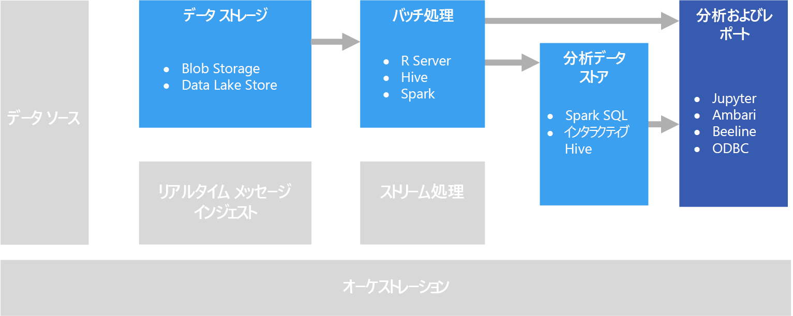

# 対話型データ探索

多くの企業のビジネス インテリジェンス (BI) ソリューションでは、レポートとセマンティック モデルは BI スペシャリストによって作成され、一元管理されます。 しかし、データ ドリブンの意思決定をユーザーが行えるようにすることを望む組織が増えています。 また、データを対話的に探索し、統計モデルと分析手法を適用してデータの傾向やパターンを見つけることを職務とする "*データ サイエンティスト*" や "*データ アナリスト*" を雇用する組織の数が増えています。 対話型データ探索では、アドホック クエリとデータ視覚化用に待機時間の短い処理を提供するツールやプラットフォームが必要です。

## セルフサービス BI

セルフサービス BI とは、企業全体のデータから実用的な情報を検索、探索、共有する権限をユーザーに与えるビジネス上の意思決定の最新アプローチに付けられた名前です。 これを実現するには、データ ソリューションでいくつかの要件がサポートされている必要があります。

* データ カタログを通じたビジネス データ ソースの検出。
* データ エンティティの定義と値の一貫性を確保するマスター データ管理。
* ビジネス ユーザー向けの対話型のデータ モデリングおよび視覚化ツール。

セルフサービス BI ソリューションでは、ビジネス ユーザーは一般に、ビジネスの特定の領域に関連するデータ ソースを検索して使用し、直感的なツールと生産性向上アプリケーションを使用して同僚と共有できる個人のデータ モデルとレポートを定義します。

関連 Azure サービス:

- [Azure Data Catalog](/azure/data-catalog/data-catalog-what-is-data-catalog)
- [Microsoft Power BI](https://powerbi.microsoft.com/)

## データ サイエンス実験
組織が高度な分析と予測モデリングを必要とする場合、通常、最初の準備作業はスペシャリスト データ サイエンティストによって実行されます。 データ サイエンティストは、データを探索し、データの "*特徴*" と目的の予測 "*ラベル*" の間に関係を見いだす統計的分析手法を適用します。 一般にデータの探索は、統計モデリングと視覚化をネイティブにサポートする Python や R などのプログラミング言語を使用して行われます。 データの探索に使用されるスクリプトは、通常は Jupyter Notebook などの特殊な環境にホストされます。 これらのツールを使用して、データ サイエンティストはデータをプログラムで探索しながら、見つかった実用的な情報を文書化および共有できます。

関連 Azure サービス:

- [Azure Notebooks](https://notebooks.azure.com/)
- [Azure Machine Learning Studio](/azure/machine-learning/studio/what-is-ml-studio)
- [Azure Machine Learning 実験サービス](/azure/machine-learning/preview/experimentation-service-configuration)
- [データ サイエンス仮想マシン](/azure/machine-learning/data-science-virtual-machine/overview)

## 課題

- **データ プライバシー コンプライアンス** ユーザーがセルフサービスの分析とレポートに個人データを使用できるようにすることについて注意が必要です。 組織のポリシーと規制の問題のため、コンプライアンスの考慮事項がある可能性があります。 

- **データの量。** ユーザーに完全なデータ ソースへのアクセス権を付与すると便利な場合がありますが、Excel または Power BI 操作がきわめて長時間にわたって実行されたり、多くのクラスター リソースを使用する Spark SQL クエリが実行されたりすることがあります。

- **ユーザーの知識。** ユーザーは、ビジネス上の意思決定を通知するために独自のクエリと集計を作成します。 ユーザーが正確な結果を得るために必要な分析スキルとクエリのスキルを持っているという確信がありますか。

- **結果の共有。** ユーザーがレポートまたはデータ視覚化を作成および共有できる場合は、セキュリティの考慮事項がある可能性があります。

## アーキテクチャ

このシナリオの目的は対話型データ分析をサポートすることですが、多くの場合、データ サイエンスに関連するデータ クレンジング、サンプリング、構造化のタスクには実行時間の長いプロセスが含まれます。 このため、[バッチ処理](./batch-processing.md)アーキテクチャが適切になります。

## テクノロジの選択

以下のテクノロジは、Azure での対話型データ探索に推奨される選択肢です。

### データ ストレージ

- **Azure Storage Blob コンテナー**または **Azure Data Lake Store**。 データ サイエンティストは、一般に生ソース データを処理して、データ内の考えられるすべての特徴、外れ値、エラーにアクセスできるようにします。 ビッグ データのシナリオでは、このデータは通常、データ ストア内でファイルの形式をとります。

詳しくは、[データ ストレージ](../technology-choices/data-storage.md)に関するページをご覧ください。

### バッチ処理

- **Microsoft R Server** または **Spark**。 ほとんどのデータ サイエンティストは、R や Python など、数学および統計パッケージを強力にサポートするプログラミング言語を使用します。 大量のデータを操作する場合は、これらの言語で分散処理を使用できるプラットフォームを使用して待機時間を短縮できます。 Microsoft R Server は、単独で使用することも、Spark と組み合わせて R 処理関数をスケールアウトすることもできます。Spark は Python をネイティブにサポートして、その言語の同様のスケールアウト機能に対応します。
- **Hive**。 Hive は、SQL に似たセマンティクスを使用してデータを変換するのに適した選択肢です。 ユーザーは、セマンティックが SQL に似た HiveQL ステートメントを使用してテーブルの作成と読み込みを行うことができます。

詳しくは、[バッチ処理](../technology-choices/batch-processing.md)に関するページをご覧ください。

### 分析データ ストア

- **Spark SQL**。 Spark SQL は Spark 上に構築された API で、SQL 構文を使用してクエリを実行できるデータフレームとテーブルの作成をサポートします。 分析するデータ ファイルが生ソース ファイルであるかバッチ プロセスによってクリーニングおよび準備された新しいファイルであるかに関係なく、ユーザーはそれらに Spark SQL テーブルを定義して、分析に対してさらにクエリを実行できます。 
- **Hive**。 Hive を使用した生データのバッチ処理に加えて、データが格納されているフォルダーに基づく Hive テーブルおよびビューを含む Hive データベースを作成して、分析とレポートに対して対話型クエリを実行できます。 HDInsight には、インメモリ キャッシュを使用して Hive クエリの応答時間を短縮する対話型 Hive クラスターの種類が含まれています。 SQL に似た構文に慣れているユーザーは、対話型 Hive を使用してデータを探索できます。

詳しくは、[分析データ ストア](../technology-choices/analytical-data-stores.md)に関するページをご覧ください。

### 分析とレポート

- **Jupyter**。 Jupyter Notebook は、R、Python、Scala などの言語でコードを実行するためのブラウザー ベースのインターフェイスを提供しています。 Microsoft R Server または Spark を使用してデータをバッチ処理する場合、または Spark SQL を使用してクエリを実行するテーブルのスキーマを定義する場合は、Jupyter がデータのクエリに適した選択肢である可能性があります。 Spark を使用する場合は、標準の Spark データフレーム API または Spark SQL API に加え、組み込みの SQL ステートメントを使用して、データのクエリと視覚化の生成を行うことができます。
- **対話型 Hive クライアント**。 対話型 Hive クラスターを使用してデータのクエリを実行する場合は、Ambari クラスター ダッシュボード、Beeline コマンド ライン ツール、または Microsoft Excel や Power BI などの ODBC ベースのツール (Hive ODBC ドライバーを使用) で Hive ビューを使用することができます。

詳しくは、[データ分析とレポート テクノロジ](../technology-choices/analysis-visualizations-reporting.md)に関するページをご覧ください。