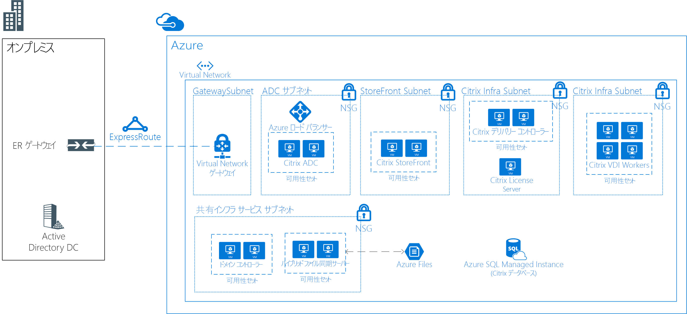

# Citrix を使用した Linux 仮想デスクトップ

このシナリオの例は、Linux デスクトップ用の仮想デスクトップインフラストラクチャ (VDI) が必要なあらゆる業界に当てはまります。 VDI とは、データセンター内のサーバー上で稼働する仮想マシン内でユーザーのデスクトップを実行するプロセスを指します。 このシナリオで、顧客は VDI のニーズを満たすために Citrix ベースのソリューションを使用することを選んでいます。

従業員が複数のデバイスやオペレーティング システムを使用する異機種混合環境の組織は少なくありません。 セキュリティで保護された環境を維持しながら、アプリケーションへの一貫したアクセスを提供することは容易ではありません。 Linux デスクトップ用の VDI ソリューションを利用するなら、組織はエンド ユーザーが使用するデバイスや OS に関係なく、アクセスを提供することができます。

このサンプル ソリューションの利点のいくつかを以下に示します。
* 共有 Linux 仮想デスクトップを利用してより多くのユーザーが同じインフラストラクチャにアクセスできるようにすることで、投資収益率が高くなります。 一元化された VDI 環境にリソースを統合することで、求められるエンド ユーザーのデバイスのスペックが低くなります。
* エンド ユーザーのデバイスに関係なく一貫したパフォーマンスが得られます。
* ユーザーは、Linux アプリケーションに (Linux 以外のデバイスを含む) あらゆるデバイスからアクセスできます。
* 各地に分散して配置されている全従業員の機密データを Azure データ センターで保護できます。

## 関連するユース ケース

次のユース ケースでこのシナリオをご検討ください。

* 特化されたミッション クリティカルな Linux VDI デスクトップに Linux または Linux 以外のデバイスから安全にアクセスできるようにする

## アーキテクチャ

このシナリオの例では、企業ネットワークから Linux 仮想デスクトップにアクセスできるようにする方法を示しています。

* オンプレミスの環境と Azure の間に ExpressRoute が確立されます。これにより、クラウドへの高速で信頼性の高い接続が可能になります。
* VDI 用に Citrix XenDeskop ソリューションがデプロイされています。
* Ubuntu (またはサポートされている別のディストリビューション) で CitrixVDA が実行されます。
* Azure ネットワーク セキュリティ グループによって正しいネットワーク ACL が適用されます。
* Citrix ADC (NetScaler) がCitrix のすべてのサービスを発行し、負荷分散します。
* Citrix サーバーにドメイン参加するために Active Directory Domain Services が使用されます。 VDA サーバーでは、ドメイン参加は行われません。
* Azure Hybrid File Sync により、ソリューション全体で記憶域を共有できます。 たとえば、リモート ソリューションでもホーム ソリューションでも使用できます。

このシナリオでは、次の SKU が使用されます。

- Citrix ADC (NetScaler): 2 x D4s v3 ([NetScaler 12.0 VPX Standard Edition 200 MBPS PAYG イメージ](https://azuremarketplace.microsoft.com/pt-br/marketplace/apps/citrix.netscalervpx-120?tab=PlansAndPrice)を使用)
- Citrix License Server: 1 x D2s v3
- Citrix VDA: 4 x D8s v3
- Citrix Storefront: 2 x D2s v3
- Citrix Delivery Controller: 2 x D2s v3
- ドメイン コントローラー: 2 x D2s v3
- Azure ファイル サーバー: 2 x D2s v3

> [!NOTE]
> すべてのライセンス (NetScaler を除く) は、ライセンス持ち込み (BYOL) です

### コンポーネント

- [Azure Virtual Network](/azure/virtual-network/virtual-networks-overview) を使用すると、VM などのリソースが、他のリソース、インターネット、オンプレミスのネットワークと安全に通信することができます。 仮想ネットワークにより、分離性、セグメント化、トラフィックのフィルター処理とルーティングが提供され、場所間の接続が可能になります。 このシナリオでは、すべてのリソースに対して 1 つの仮想ネットワークが使用されます。
- [Azure ネットワーク セキュリティ グループ](/azure/virtual-network/security-overview)には、ソースまたはターゲット IP アドレス、ポート、プロトコルを基に、受信/送信ネットワーク トラフィックを許可または拒否するセキュリティ規則の一覧が含まれています。 このシナリオの仮想ネットワークは、アプリケーション コンポーネント間のトラフィック フローを制限するネットワーク セキュリティ グループ規則によって保護されています。
- [Azure Load Balancer](/azure/application-gateway/overview) は、規則と正常性プローブに従って受信トラフィックを分散します。 ロード バランサーは、低遅延と高スループットを実現できるだけでなく、あらゆる TCP アプリケーションと UDP アプリケーションの数百万ものフローにスケールアップできます。 このシナリオでは、Citrix NetScaler のトラフィックの分散に内部ロード バランサーを使用します。
- すべての共有ストレージで [Azure Hybrid File Sync](https://github.com/MicrosoftDocs/azure-docs/edit/master/articles/storage/files/storage-sync-files-planning.md) が使用されます。 ストレージは、Hybrid File Sync を使用して 2 つのファイル サーバーにレプリケートされます。
- [Azure SQL Database](/azure/sql-database/sql-database-technical-overview) は、Microsoft SQL Server データベース エンジンの安定した最新バージョンに基づく、サービスとしてのリレーショナル データベース (DBaaS) です。 これは、Citrix のデータベースをホストするために使用されます。
- [ExpressRoute](/azure/expressroute/expressroute-introduction) を利用すると、接続プロバイダーが提供するプライベート接続を介して、オンプレミスのネットワークを Microsoft クラウドに拡張できます。 
- Active Directory Domain Services はディレクトリ サービスとユーザー認証に使用されます
- [Azure 可用性セット](/azure/virtual-machines/windows/tutorial-availability-sets)は、Azure にデプロイされる VM を、クラスター内の複数の分離されたハードウェア ノードに分散させます。 これにより、Azure 内でハードウェアまたはソフトウェアの障害が発生した場合に影響を受けるのは VM のサブセットに限定され、ソリューション全体は引き続き利用可能であり、運用可能であることが保証されます。 
- [Citrix ADC (NetScaler)](https://www.citrix.com/products/citrix-adc) は、アプリケーション固有のトラフィック分析を実行して、Web アプリケーション用のレイヤー 4 からレイヤー 7 (L4-L7) のネットワーク トラフィックをインテリジェントに配布、最適化、保護するアプリケーション配信コントローラーです。 
- [Citrix Storefront](https://www.citrix.com/products/citrix-virtual-apps-and-desktops/citrix-storefront.html) は、セキュリティを強化し、デプロイを簡素化するエンタープライズ アプリ ストアです。他に例を見ない、モダンでほぼネイティブのユーザー エクスペリエンスを、あらゆるプラットフォーム上の Citrix Receiver で提供します。 StoreFront を使用すると、マルチサイトおよびマルチ バージョンの Citrix Virtual Apps and Desktops 環境を簡単に管理できます。 
- [Citrix License Server](https://www.citrix.com/buy/licensing/overview.html) は、Citrix 製品のライセンスを管理します。
- [Citrix XenDesktops VDA](https://docs.citrix.com/en-us/citrix-virtual-apps-desktops-service) を使用すると、アプリケーションとデスクトップに接続できます。 VDA は、ユーザーのためにアプリケーションまたは仮想デスクトップを実行するマシンにインストールされます。 これを使用することで、マシンをデリバリー コントローラーに登録して、ユーザー デバイスへの High Definition eXperience (HDX) 接続を管理することができるようになります。
- [Citrix Delivery Controllers](https://docs.citrix.com/en-us/xenapp-and-xendesktop/7-15-ltsr/manage-deployment/delivery-controllers) は、ユーザー アクセスの管理、および接続の仲介と最適化を担当するサーバー側のコンポーネントです。 コントローラーには、デスクトップとサーバーのイメージを作成する Machine Creation Services も備えられています。

### 代替手段

- 複数のパートナーが、VMware や Workspot など、Azure でサポートされている VDI ソリューションを用意しています。 この特定のサンプル アーキテクチャは、Citrix を使用したデプロイ済みプロジェクトに基づいています。
- Citrix は、このアーキテクチャの一部を抽象化するクラウド サービスを提供しています。 そのサービスは、このソリューションの代替手段となり得ます。 詳細については、[Citrix Cloud](https://www.citrix.com/products/citrix-cloud) を参照してください。

## 考慮事項

- [Citrix の Linux 要件](https://docs.citrix.com/en-us/linux-virtual-delivery-agent/current-release/system-requirements)をご確認ください。
- 待機時間は、ソリューション全体に影響を与えることがあります。 運用環境では、必要に応じてテストを行ってください。
- シナリオによっては、VDA 用の GPU を備えた VM がソリューションに必要になる場合があります。 このソリューションは、GPU が要件ではないことを前提としています。

### 可用性、スケーラビリティ、セキュリティ

- このサンプル ソリューションは、ライセンス サーバーを除くすべての役割が高可用性を持つよう設計されています。 ライセンス サーバーがオフラインになっても、30 日間の猶予期間にわたって環境は機能し続けるため、ライセンス サーバーに追加の冗長性は不要です。
- 同様の役割を提供するすべてのサーバーを[可用性セット](/azure/virtual-machines/windows/manage-availability#configure-multiple-virtual-machines-in-an-availability-set-for-redundancy)にデプロイする必要があります。
- このサンプル ソリューションには、ディザスター リカバリー機能は含まれていません。 これを設計に組み込む場合は、[Azure Site Recovery](/azure/site-recovery/site-recovery-overview) をお勧めします。
- 運用環境では、[バックアップ](/azure/backup/backup-introduction-to-azure-backup)、[監視](/azure/monitoring-and-diagnostics/monitoring-overview)、[更新管理](/azure/automation/automation-update-management)などのデプロイ管理ソリューションを実装する必要があります。
- このサンプル ソリューションは、約 250 人 (VDA サーバーあたり約 50 - 60 人) のユーザーがさまざまな用途で同時に使用できます。 しかし、これは使用するアプリケーションの種類によって大いに異なります。 運用環境で使用する場合は、厳しいロード テストを実施する必要があります。

## このシナリオのデプロイ

デプロイの詳細については、公式の [Citrix ドキュメント](https://docs.citrix.com/en-us/citrix-virtual-apps-desktops/install-configure.html)を参照してください。

## 価格

- Citrix XenDestop ライセンスは、Azure サービスの料金には含まれません。
- Citrix NetScaler ライセンスは、従量課金制のモデルに含まれます。
- 予約インスタンスを使用すると、ソリューションの計算コストが大幅に削減されます。
- ExpressRoute の料金は含まれません。

## 次の手順

- 計画とデプロイについては、[こちらから](https://docs.citrix.com/en-us/citrix-virtual-apps-desktops/install-configure) Citrix ドキュメントをご確認ください。
- Azure に Citrix ADC (NetScaler) をデプロイするには、Citrix によって提供されている Resource Manager テンプレートを[こちら](https://github.com/citrix/netscaler-azure-templates)でご確認ください。
