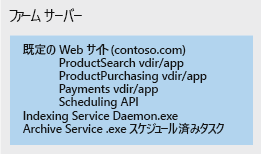

# Service Fabric を使用したモノリシック アプリケーションの分解

このシナリオの例では、扱いにくいモノリシック アプリケーションを分解するためのプラットフォームとして [Service Fabric](/azure/service-fabric/service-fabric-overview) を使用するアプローチについて説明します。 ここでは、IIS/ASP.Net Web サイトを管理しやすい複数のマイクロサービスから成るアプリケーションに分解する反復的なアプローチを検討します。

モノリシック アーキテクチャからマイクロサービス アーキテクチャに移行すると、次のような利点があります。
* 1 つの小さなわかりやすいコード単位を変更して、その単位のみを展開することができます。
* 各コード単位の展開にかかる時間はわずか数分です。
* 小さな単位にエラーがある場合、アプリケーション全体ではなくその単位のみが動作を停止します。
* 小さいコード単位を複数の開発チームに個別に配布する処理も簡単です。
* 新規の開発者でも、単位の個別機能を短時間で簡単に理解できます。

この例ではサーバー ファームの大規模な IIS アプリケーションを使用しますが、反復的な分解とホスティングの概念は、任意の種類の大規模アプリケーションに使用できます。 このソリューションでは Windows を使用しますが、Service Fabric は Linux OS でも実行できます。 オンプレミス、Azure、または任意のクラウド プロバイダー内の VM ノードで実行できます。

## 関連するユース ケース

このシナリオは、次のことが発生している大規模なモノリシック Web アプリケーションを使用する組織に関連します。

- 小さなコード変更のエラーで Web サイト全体が中断する。
- Web サイト全体を更新する必要があるためリリースに何日もかかる。
- 1 人では把握できないほどの複雑なコード ベースなので、新規の開発者やチームのオンボード時に能力向上に時間がかかる。

## アーキテクチャ

ホスティング プラットフォームとして Service Fabric を使用すると、次に示すように、大規模な IIS Web サイトをマイクロサービスのコレクションに変換できます。

上の図では、大きな IIS アプリケーションのすべての部分を次のように分解しています。

- 受信したブラウザー要求を受け付け、解析してそれを処理するサービスを決定し、そのサービスに要求を転送する、ルーティングまたはゲートウェイ サービス。
- 前は ASP.NET アプリケーションとして実行する 1 つの IIS サイトの下の正式な仮想ディレクトリだった 4 つの ASP.NET Core アプリケーション。 アプリケーションは、独自の独立したマイクロサービスに分けられました。 それにより、変更、バージョン管理、アップグレードを個別に行うことができます。 この例では、.Net Core と ASP.NET Core を使用して各アプリケーションを書き直してします。 これらは [Reliable Services](/azure/service-fabric/service-fabric-reliable-services-introduction) として記述されているので、完全な Service Fabric プラットフォームの機能と利点 (通信サービス、正常性レポート、通知など) にネイティブにアクセスできます。
- *Indexing Service* という Windows サービス。基になるサーバーのレジストリを直接変更せず、自己完結型で実行してすべての依存関係を 1 つの単位として展開できるように Windows コンテナーに配置されています。
- アーカイブ サービス。スケジュールに従ってサイトのいくつかのタスクを実行する単なる実行可能ファイルです。 変更しなくても必要な処理が実行され、変更する投資価値がないと判断されたため、スタンドアロン実行可能ファイルとして直接ホストされています。

## 考慮事項

最初の課題は、モノリスで呼び出すことができるマイクロサービスとしてモノリスから抽出できる小さいコードを識別することです。 時間をかけて繰り返し、開発者が容易に理解して変更し、低リスクで迅速に展開できるマイクロサービスのコレクションにモノリスを分解します。

さまざまなフォームでのすべてのマイクロサービスの実行をサポートできるため、Service Fabric を選択します。 たとえば、スタンドアロンの実行可能ファイル、新しい小さい Web サイト、新しい小さい API、コンテナー化サービスなどを混在させることができます。Service Fabric は、1 つのクラスターにこれらすべてのサービス タイプを組み合わせることができます。

この最終的な分解されたアプリケーションを得るため、反復的なアプローチを使用しています。 最初にサーバー ファームには大規模な IIS/ASP.NET Web サイトがあります。 サーバー ファームの 1 つのノードを次に示します。 これには、元の Web サイトと複数の仮想ディレクトリ、サイトが呼び出す追加の Windows サービス、定期的なサイト アーカイブ メンテナンスを行う実行可能ファイルが含まれます。

最初の開発イテレーションでは、IIS サイトとその仮想ディレクトリを [Windows コンテナー](/azure/service-fabric/service-fabric-containers-overview)内に配置します。 このようにすると、サイトは動作可能なままですが、基になるサーバー ノード OS には密接にバインドされなくなります。 コンテナーは基になる Service Fabric ノードによって実行およびオーケストレーションされますが、ノードはサイトが依存する状態を持つ必要がありません (レジストリ エントリ、ファイルなど)。 これらのアイテムはすべてコンテナー内にあります。 同じ理由で、インデックス サービスも Windows コンテナーに配置しました。 コンテナーは、個別に展開、バージョン管理、スケーリングできます。 最後に、アーカイブ サービスは、特別な要件のない自己完結型 exe であるため、単純な[スタンドアロンの実行可能ファイル](/azure/service-fabric/service-fabric-guest-executables-introduction)としてホストします。

次の図は、大規模な Web サイトが独立ユニットとして部分的に分解され、時間の許す限り詳細に分解する準備ができたことを示しています。

さらなる開発では、上の図で示されている 1 つの大きい既定の Web サイト コンテナーを分離することに注目します。 各仮想ディレクトリ ASP.NET アプリが一度に 1 つずつコンテナーから削除されて、ASP.NET Core の[リライアブル サービス](/azure/service-fabric/service-fabric-reliable-services-introduction) に移植されます。

各仮想ディレクトリが取り除かれた後、既定の Web サイトは、受信したブラウザー要求を受け取って適切な ASP.NET アプリケーションにルーティングする ASP.NET Core のリライアブル サービスとして記述されます。

### 可用性、スケーラビリティ、セキュリティ

Service Fabric は、[さまざまな形式のマイクロサービスをサポートできる](/azure/service-fabric/service-fabric-choose-framework)一方で、同じクラスター上でのそれらの間の呼び出しを高速かつシンプルに保ちます。 Service Fabric は、[フォールト トレラント](/azure/service-fabric/service-fabric-availability-services)な自己復旧クラスターであり、コンテナーや実行可能ファイルを実行でき、直接マイクロサービスを記述するためのネイティブ API さえ備えています (前述の "Reliable Services")。 そのプラットフォームは、各マイクロサービスのローリング アップグレードとバージョン管理を容易にします。 必要なマイクロサービスだけに[スケール](/azure/service-fabric/service-fabric-concepts-scalability)インまたはスケールアウトするため、Service Fabric クラスター全体に分散する特定のマイクロサービスをさらに多くまたは少なく実行するように、プラットフォームに指示できます。

Service Fabric は、仮想 (または物理) ノードのインフラストラクチャ上に構築されたクラスターであり、ネットワーク、ストレージ、およびオペレーティング システムを備えています。 そのため、一連の管理、保守、および監視タスクがあります。

クラスターのガバナンスと制御も考慮します。 ユーザーが運用データベース サーバーに勝手にデータベースを展開するのが望ましくないのと同様に、監視なしにユーザーが Service Fabric クラスターにアプリケーションを展開するのも望ましくありません。

Service Fabric は多くの異なる[アプリケーション シナリオ](/azure/service-fabric/service-fabric-application-scenarios)をホストできるので、実際のシナリオに適用されるものを時間をかけて確認してください。

## 価格

Azure でホストされる Service Fabric クラスターの場合、コストの最大部分はクラスター内のノードの数とサイズです。 Azure では、指定した基になるノード サイズで構成されるクラスターを迅速かつ簡単に作成できますが、コンピューティング料金はノード数にノード サイズを掛けたものに基づきます。

それよりコストのかからない他のコンポーネントは、各ノードの仮想ディスクに対するストレージ料金と、Azure からのネットワーク IO 送信料金です (たとえば、Azure からユーザーのブラウザーへのネットワーク トラフィック)。

コストがどれくらいになるかわかるよう、クラスター サイズ、ネットワーク、ストレージについていくつかの既定値を使用して例を作成してあります。[料金計算ツール](https://azure.com/e/52dea096e5844d5495a7b22a9b2ccdde)をご覧ください。 この既定の計算ツールの値を、実際の状況に関連する値に自由に更新してください。

## 次の手順

[ドキュメント](/azure/service-fabric/service-fabric-overview)を読み、Service Fabric の多くの異なる[アプリケーション シナリオ](/azure/service-fabric/service-fabric-application-scenarios)を確認して、プラットフォームをよく理解してください。 ドキュメントでは、クラスターを構成するもの、クラスターを実行できる環境、ソフトウェア アーキテクチャ、およびメンテナンスについてわかります。

既存の .NET アプリケーションに対する Service Fabric のデモを見るには、Service Fabric の[クイック スタート](/azure/service-fabric/service-fabric-quickstart-dotnet)を展開してください。

まずは、現在のアプリケーションの観点から、そのさまざまな機能について考えてみてください。 機能の 1 つを選択し、その機能だけを全体から分離できる方法を検討します。 一度に 1 つの独立した理解しやすい部分を取り出します。

## 関連リソース

- [Azure でのマイクロサービスの構築](/azure/architecture/microservices)
- [Service Fabric の概要](/azure/service-fabric/service-fabric-overview)
- [Service Fabric のプログラミング モデル](/azure/service-fabric/service-fabric-choose-framework)
- [Service Fabric の可用性](/azure/service-fabric/service-fabric-availability-services)
- [Service Fabric のスケーリング](/azure/service-fabric/service-fabric-concepts-scalability)
- [Service Fabric でのコンテナーのホスト](/azure/service-fabric/service-fabric-containers-overview)
- [Service Fabric でのスタンドアロン実行可能ファイルのホスト](/azure/service-fabric/service-fabric-guest-executables-introduction)
- [Service Fabric のネイティブな Reliable Services](/azure/service-fabric/service-fabric-reliable-services-introduction)
- [Service Fabric アプリケーションのシナリオ](/azure/service-fabric/service-fabric-application-scenarios)