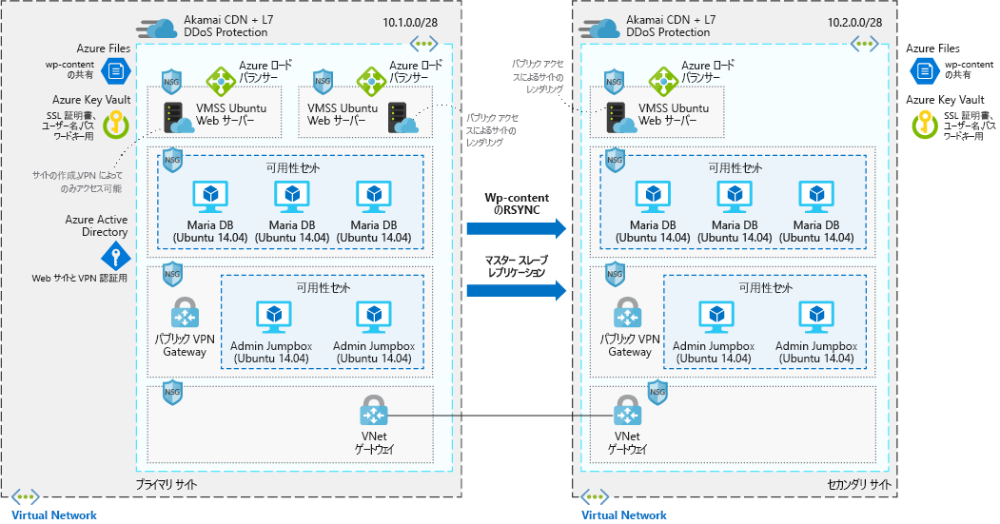

# 高度にスケーラブルで安全な WordPress Web サイト

このシナリオの例は、高度にスケーラブルで安全な WordPress のインストールが必要な企業に当てはまります。 このシナリオの基盤となっているのは大規模なコンベンションで使用されたデプロイであり、セッション時に跳ね上がるサイトへのトラフィックに合わせて首尾よくスケーリングできるものでした。

## 関連するユース ケース

その他の関連するユース ケース:

- トラフィックの急増を引き起こすメディア イベント。
- コンテンツ管理システムとして WordPress を使用しているブログ。
- WordPress を使用するビジネスまたは eコマースの Web サイト。
- 他のコンテンツ管理システムを使用して構築された Web サイト。

## アーキテクチャ

このシナリオでは、Ubuntu Web サーバーと MariaDB を使用する WordPress のスケーラブルで安全なインストールについて説明します。 このシナリオには 2 つの異なるデータ フローがあります。最初のデータ フローは、ユーザーから Web サイトへのアクセスです。

1. ユーザーは CDN を介してフロントエンド Web サイトにアクセスします。
2. CDN は Azure ロード バランサーを起点として使用し、キャッシュされていないデータをそこから取得します。
3. Azure ロード バランサーは、Web サーバーの仮想マシン スケール セットに要求を分散します。
4. WordPress アプリケーションは、Maria DB クラスターから動的な情報を取得します。静的コンテンツはすべて Azure Files でホストされています。
5. SSL キーは Azure Key Vault に保存されます。

2 番目のワークフローは、作成者が新しいコンテンツを投稿する仕組みです。

1. 作成者は、パブリック VPN ゲートウェイに安全に接続します。
2. VPN 認証情報が Azure Active Directory に格納されます。
3. 管理者ジャンプ ボックスへの接続が確立されます。
4. 次いで、作成者は、管理者ジャンプ ボックスからオーサリング クラスター用の Azure ロード バランサーに接続できます。
5. Azure ロード バランサーは、Maria DB クラスターへの書き込みアクセス権限を持つ Web サーバーの仮想マシン スケール セットにトラフィックを分散します。
6. 新しい静的コンテンツは Azure Files にアップロードされ、動的コンテンツは Maria DB クラスターに書き込まれます。
7. 次いで、これらの変更は、rsync またはマスター/スレーブの複製によって代替リージョンに複製されます。

### コンポーネント

- [Azure コンテンツ配信ネットワーク (CDN)](/azure/cdn/cdn-overview) は、ユーザーに Web コンテンツを効率的に配信するサーバーの分散ネットワークです。 CDN はキャッシュされたコンテンツをエンド ユーザーに近いポイントオブプレゼンスの場所のエッジ サーバーに格納して、待ち時間を最小限に抑えます。
- [仮想ネットワーク](/azure/virtual-network/virtual-networks-overview)を使用すると、VM などのリソースが互い同士や、インターネット、およびオンプレミスのネットワークと安全に通信することができます。 仮想ネットワークにより、分離性、セグメント化、トラフィックのフィルター処理とルーティングが提供され、場所間の接続が可能になります。 2 つのネットワークは、Vnet ピアリング経由で接続されます。
- [ネットワーク セキュリティ グループ](/azure/virtual-network/security-overview)には、ソースまたはターゲット IP アドレス、ポート、プロトコルを基に、受信/送信ネットワーク トラフィックを許可または拒否するセキュリティ規則の一覧が含まれています。 このシナリオの仮想ネットワークは、アプリケーション コンポーネント間のトラフィック フローを制限するネットワーク セキュリティ グループ規則によって保護されています。
- [ロード バランサー](/azure/load-balancer/load-balancer-overview)は、規則と正常性プローブに従って受信トラフィックを分散します。 ロード バランサーは、低遅延と高スループットを実現できるだけでなく、あらゆる TCP アプリケーションと UDP アプリケーションの数百万ものフローにスケールアップできます。 このシナリオでは、コンテンツ配信ネットワークからフロントエンド Web サーバーへのトラフィックの分散にロード バランサーが使用されています。
- [仮想マシン スケール セット][docs-vmss]では、負荷分散が行われる同一の VM のグループを作成して管理することができます。 需要または定義されたスケジュールに応じて、VM インスタンスの数を自動的に増減させることができます。 このシナリオでは、2 つの異なる仮想マシンスケール セットが使用されます。1 つはコンテンツを提供するフロントエンド Web サーバー用で、もう 1 つは新しいコンテンツを作成するために使用されるフロントエンド Web サーバー用です。
- [Azure Files](/azure/storage/files/storage-files-introduction) は、このシナリオにおけるすべての WordPress コンテンツをホストする完全に管理されたファイル共有をクラウドで提供し、すべての VM がそのデータにアクセスできるようにします。
- [Azure Key Vault](/azure/key-vault/key-vault-overview) は、パスワード、証明書、キーを格納し、それらへのアクセスを厳重に制御するために使用されます。
- [Azure Active Directory (Azure AD)](/azure/active-directory/fundamentals/active-directory-whatis) は、マルチテナントに対応したクラウドベースのディレクトリおよび ID の管理サービスです。 このシナリオでは、Azure AD が Web サイトと VPN トンネルの認証サービスを提供します。

### 代替手段

- MariaDB データ ストアの代わりに、[Linux 用 SQL Server](/azure/virtual-machines/linux/sql/sql-server-linux-virtual-machines-overview) を使用できます。
- 完全に管理されたソリューションをご希望の場合は、[Azure database for MySQL](/azure/mysql/overview) で Maria DB データ ストアを置き換えることができます。

## 考慮事項

### 可用性

このシナリオでは VM インスタンスが複数のリージョンにまたがって展開され、WordPress コンテンツの場合は RSYNC によって、MariaDB クラスターの場合はマスター スレーブ レプリケーションによって、2 つのリージョン間でデータが複製されます。

可用性に関する他のトピックについては、Azure アーキテクチャ センターの[可用性のチェックリスト][availability]を参照してください。

### スケーラビリティ

このシナリオでは、各リージョンの 2 つのフロントエンド Web サーバー クラスターのために仮想マシン スケール セットを使用します。 スケール セットにより、顧客の要求に応じて、または定義されているスケジュールに基づいて、フロントエンド アプリケーション層を実行する VM インスタンスの数を自動的にスケーリングできます。 詳細については、[仮想マシン スケール セットでの自動スケールの概要][docs-vmss-autoscale]に関するページをご覧ください。

バックエンドは、可用性セットの MariaDB クラスターです。 詳細については、「[MariaDB (MySQL) クラスター: Azure チュートリアル][mariadb-tutorial]」を参照してください。

スケーラビリティに関する他のトピックについては、Azure アーキテクチャ センターの「[スケーラビリティのチェックリスト][scalability]」をご覧ください。

### セキュリティ

フロントエンド アプリケーション層へのすべての仮想ネットワーク トラフィックが、ネットワーク セキュリティ グループによって保護されます。 フロントエンド アプリケーション層 VM インスタンスのみがバックエンド データベース層にアクセスできるように、規則によってトラフィックのフローが制限されます。 データベース層からの送信インターネット トラフィックは許可されません。 攻撃フットプリントを減らすために、ダイレクト リモート管理ポートは開かれていません。 詳細については、[Azure ネットワーク セキュリティ グループ][docs-nsg]に関するページをご覧ください。

セキュリティで保護されたシナリオの設計に関する一般的なガイダンスについては、「[Azure のセキュリティのドキュメント][security]」を参照してください。

### 回復性

このシナリオでは、複数のリージョン、データ レプリケーション、仮想マシン スケール セットと組み合わて、Azure ロード バランサーが使用されます。 これらのネットワーク コンポーネントは、接続されている VM インスタンスにトラフィックを分散します。また、コンポーネントには正常性プローブが含まれ、正常な状態の VM にのみトラフィックが分散されることが保証されます。 これらのネットワーク コンポーネントはすべて、CDN を介してアクセスされます。 トラフィックを中断し、エンドユーザーへのアクセスに影響を及ぼす可能性のある問題に対する回復性が、これによってネットワーク リソースとアプリケーションで実現します。

回復性に優れたシナリオの設計に関する一般的なガイダンスについては、「[回復性に優れた Azure 用アプリケーションの設計][resiliency]」を参照してください。

## 価格

このシナリオの実行コストを調べることができるように、すべてのサービスがコスト計算ツールで事前構成されています。 特定のユース ケースについて価格の変化を確認するには、予想されるトラフィックに合わせて該当する変数を変更します。

上記のアーキテクチャ ダイアグラムに基づいて、[料金プロファイル] [ pricing]が事前に構成されています。 独自のユース ケースに合わせて料金計算ツールを構成するために、考慮すべきいくつかの点があります。その主なものを以下に示します。

- どのくらいのトラフィックを予想していますか (GB/月単位)? トラフィックの量は、仮想マシン スケール セットのデータを表示するために必要な VM の数に影響するため、コストに最も大きな影響を与えます。 さらに、これは CDN を介して表示されるデータの量と直接相関します。
- どのくらいの新しいデータを Web サイトに書き込む予定ですか? Web サイトに書き込まれる新しいデータは、リージョン間でミラーリングされるデータの量と関係しています。
- コンテンツのうち、動的コンテンツはどのくらいですか? 静的コンテンツはどのくらいですか? 動的コンテンツと静的コンテンツの差異は、どのくらいのデータをデータベース階層から取得する必要があり、どのくらいのデータが CDN にキャッシュされるかに影響します。

<!-- links -->
[architecture]: ./media/architecture-secure-scalable-wordpress.png
[mariadb-tutorial]: /azure/virtual-machines/linux/classic/mariadb-mysql-cluster
[docs-vmss]: /azure/virtual-machine-scale-sets/overview
[docs-vmss-autoscale]: /azure/virtual-machine-scale-sets/virtual-machine-scale-sets-autoscale-overview
[docs-nsg]: /azure/virtual-network/security-overview
[security]: /azure/security/
[availability]: ../../checklist/availability.md
[resiliency]: /azure/architecture/resiliency/
[scalability]: /azure/architecture/checklist/scalability
[pricing]: https://azure.com/e/a8c4809dab444c1ca4870c489fbb196b
