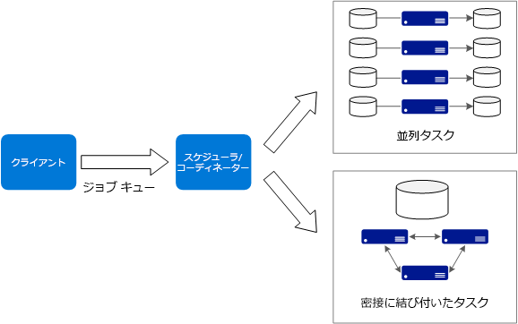
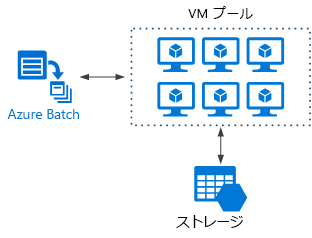
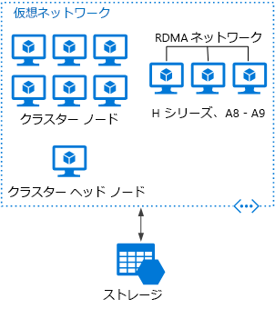
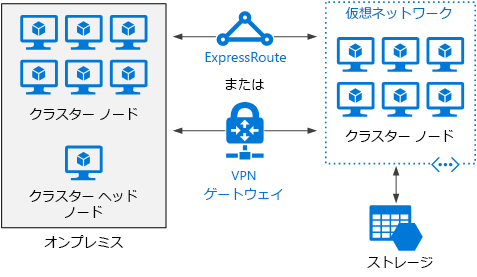

# ビッグ コンピューティング アーキテクチャ スタイル

*ビッグ コンピューティング*という用語は、数百、数千という大量の数のコアを必要とする大規模なワークロードを指します。 シナリオには、イメージのレンダリング、流体力学、財務リスクのモデリング、石油探査、薬物設計、および工学応力分析などが含まれます。

ビッグ コンピューティング アプリケーションの一般的な特性を次に示します。

- 作業は、多くのコアで同時に実行できる個別のタスクに分割できます。
- 各タスクは有限です。 タスクはいくつかの入力を受け取り、いくつかの処理を行って、出力が生成されます。 アプリケーション全体は、一定時間 (数分から数日) 実行されます。 一般的なパターンは、バーストにより大量のコアをプロビジョニングし、アプリケーションが完了するとコア数はゼロまで下降します。 
- アプリケーションを常時実行し続ける必要はありません。 ただし、システムでは、ノードの障害またはアプリケーションのクラッシュを処理する必要があります。
- 一部のアプリケーションでは、タスクは独立しており、並列して実行できます。 または、タスクが緊密に結合されているため、相互に交信または中間結果を交換する必要がある場合もあります。 この場合、InfiniBand やリモート ダイレクト メモリ アクセス (RDMA) などの高速ネットワーク テクノロジを使用することを検討してください。 
- ワークロードに応じてコンピューティング集中型の VM サイズ (H16r、H16mr、および A9) を使用することができます。

## このアーキテクチャを使用する条件

- シミュレーション や計算などの大量の計算操作。
- 計算負荷が高く、複数のコンピューター (10 ～ 1000 台) の CPU に分割する必要があるシミュレーション。
- 1 台のコンピューター上の大量のメモリを必要とするシミュレーションでは、複数のコンピューターに分割する必要があります。
- 1 台のコンピューターでは計算に時間がかかりすぎる長い計算。
- モンテカルロ シミュレーションなどの、数百または数千回実行する必要がある小規模な計算。

## メリット

- "[驚異的並列][embarrassingly-parallel]" 処理による高いパフォーマンス。
- 大きな問題を高速で解決するために何百、何千ものコンピューター コアを使用できます。
- 専用の高速 InfiniBand ネットワークを使用した、特殊な高性能ハードウェアの使用。
- 作業中、必要に応じて VM をプロビジョニングし、削除できます。 

## 課題

- VM インフラストラクチャの管理。
- 大量の計算の管理。 
- 適切なタイミングで数千のコアをプロビジョニングする。
- 緊密に結合されたタスクにコアを追加すると逆効果になる場合があります。 実験を通して最適なコア数を特定する必要があります。

## Azure Batch を使用したビッグ コンピューティング

[Azure Batc][batch] は、大規模な高パフォーマンス コンピューティング (HPC) のアプリケーションを実行するためのマネージ サービスです。

Azure Batch を使用して、VM プールを構成し、アプリケーションとデータ ファイルをアップロードします。 バッチ サービスにより VM がプロビジョニングされ、VM にタスクが割り当てられ、タスクが実行され、進行状況が監視されます。 バッチは、ワークロードに応じて VM を自動的にスケール アウトできます。 また、バッチは、ジョブのスケジューリングも提供します。

 

## Virtual Machines で実行されるビッグ コンピューティング

[Microsoft HPC Pack][hpc-pack] を使用して VM のクラスターを管理して、HPC ジョブをスケジュールおよび監視できます。 この方法では、ユーザーが VM およびネットワーク インフラストラクチャのプロビジョニングや管理を行う必要があります。 既存の HPC ワークロードの一部またはすべてを Azure に移動する場合は、このアプローチを検討してください。 HPC クラスター全体を Azure に移動するか、HPC クラスターはオンプレミスにしたまま、バースト容量のために Azure を使用できます。 詳細については、[大規模コンピューティング ワークロードのための Batch および HPC ソリューション][batch-hpc-solutions]を参照してください。

### Azure にデプロイされた HPC Pack

このシナリオでは、HPC クラスターすべてを Azure 内で作成します。

 
 
ヘッド ノードは、管理およびジョブ スケジューリング サービスをクラスターに提供します。 緊密に結合されたタスクの場合は、非常に高い帯域幅、低待機時間の VM 間通信を提供する RDMA ネットワークを使用します。 詳細については、「[Azure に HPC Pack 2016 クラスターをデプロイする][deploy-hpc-azure]」を参照してください。

### Azure への HPC クラスターのバースト

このシナリオでは、組織は、HPC Pack をオンプレミスで実行しており、バースト容量のために Azure VM を使用します。 クラスターのヘッド ノードは、オンプレミスに設置されています。 ExpressRoute または VPN Gateway は、オンプレミス ネットワークを Azure VNet に接続します。

 

[batch]: /azure/batch/
[batch-hpc-solutions]: /azure/batch/batch-hpc-solutions
[deploy-hpc-azure]: /azure/virtual-machines/windows/hpcpack-2016-cluster
[embarrassingly-parallel]: https://en.wikipedia.org/wiki/Embarrassingly_parallel
[hpc-pack]: https://technet.microsoft.com/library/cc514029

 
