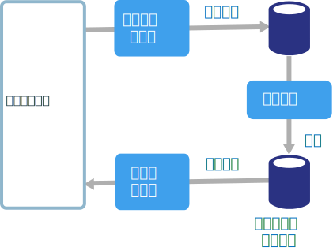
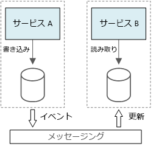

# CQRS アーキテクチャのスタイル

コマンド クエリ責務分離 (CQRS) は、読み取り操作と書き込み操作を分離するアーキテクチャ スタイルです。

従来のアーキテクチャでは、データベースの更新とクエリに同じデータ モデルが使用されます。 このシンプルな方法は、基本的な CRUD 操作に適しています。 ただし、複雑なアプリケーションの場合、このアプローチではうまくいかないことがあります。 たとえば、読み取り側でさまざまなクエリが実行され、形式の異なる複数のデータ転送オブジェクト (DTO) が返される場合もあります。 これにより、オブジェクトのマッピングが複雑になる可能性があります。 また書き込み側のモデルでは、複雑な検証とビジネス ロジックが実装される可能性があります。 その結果、モデルが複雑になりすきる恐れがあります。

さらに、読み取りと書き込みのワークロードが不均衡になりやすいため、パフォーマンスやスケールの要件が大きく異なってくる可能性もあります。

CQRS では、データを更新するための**コマンド**とデータを読み取るための**クエリ**を使用し、読み取りと書き込みを個別のモデルに分離することで、これらの問題に対処します。

- コマンドは、データ中心ではなく、タスクベースにします (「ReservationStatus を Reserved に設定する」などではなく、「ホテルの部屋を予約する」などの形式にします)。コマンドは、同期的に処理するのではなく、非同期処理のキューに配置できます。

- クエリでは、データベースは変更されません。 クエリでは、ドメイン ナレッジをカプセル化しない DTO が返されます。

分離性を高めるために、読み取りデータと書き込みデータを物理的に分離することもできます。 その場合は、読み取りデータベースでは、クエリ用に最適化された独自のデータ スキーマを使用できます。 たとえば、結合や O/RM マッピングが複雑になるのを回避するために、データの[具体化されたビュー][materialized-view]を格納することもできます。 また、異なる種類のデータ ストアを使用することもできます。 たとえば、書き込みデータベースをリレーショナルにし、読み取りデータベースをドキュメント データベースにすることもできます。

読み取りデータベースと書き込みデータベースを個別に使用する場合は、両者の同期を維持する必要があります。これは通常、データベースの更新時に書き込みモデルでイベントを発行することによって達成されます。 データベースの更新とイベントの発行は、単一のトランザクションで行う必要があります。

CQRS の実装では、[イベント ソーシング パターン][event-sourcing]が使用される場合があります。 このパターンを使用すると、アプリケーションの状態が一連のイベントとして格納されます。 各イベントは、データに対する一連の変更を表します。 現在の状態は、これらのイベントを再生することによって構築されます。 CQRS の場合、イベント ソーシングの利点の 1 つは、他のコンポーネントへの通知 (特に、読み取りモデルへの通知) に、同じイベントを使用できることです。 読み取りモデルでは、現在の状態のスナップショットを作成するのにイベントが使用されます (そのほうが、クエリにとってより効率的です)。 ただし、イベント ソーシングを使用すると、設計がより複雑になります。

## このアーキテクチャを使用する状況

多数のユーザーが同じデータにアクセスするコラボラティブなドメインについては、CQRS の使用を検討してください (特に、読み取りと書き込みのワークロードが不均衡な場合)。

CQRS は、システム全体に適用される最上位レベルのアーキテクチャではありません。 CQRS は、読み取りと書き込みを分離することが効果的であるとはっきりわかっているサブシステムにのみ適用してください。 その他の場合は、複雑さが増すだけでメリットがありません。

## メリット

- **独立してスケーリングできる**。 CQRS では、読み取りと書き込みの各ワークロードを個別にスケーリングできるので、ロック競合を減らせる可能性があります。
- **最適化されたデータ スキーマ**。 読み取り側ではクエリ用に最適化されたスキーマを使用し、書き込み側では更新用に最適化されたスキーマを使用できます。
- **セキュリティ**。 適切なドメイン エンティティだけがデータへの書き込みを実行している状態を維持しやすくなります。
- **懸念事項の分離**。 読み取り側と書き込み側を分離することで、モデルの保守性と柔軟性を向上できる可能性があります。 複雑なビジネス ロジックの多くは、書き込みモデルになります。 読み取りモデルは、比較的シンプルにすることができます。
- **クエリがよりシンプル**。 具体化されたビューを読み取りデータベースに格納することで、クエリ時の複雑な結合を回避できます。

## 課題

- **複雑さ**。 CQRS の基本的な考え方はシンプルです。 ただし、アプリケーションの設計は複雑になる可能性があります。このことは、イベント ソーシング パターンが含まれる場合には特に顕著です。

- **メッセージング**。 CQRS ではメッセージングは必須ではありませんが、コマンドの発行やイベントの更新を処理するためにメッセージングが使用されることもよくあります。 その場合には、メッセージのエラーや重複を処理する必要が生じます。

- **最終的な一貫性**。 読み取りデータベースと書き込みデータベースを分割すると、読み取りデータが古くなる可能性があります。

## ベスト プラクティス

- CQRS の実装の詳細については、[CQRS パターン][cqrs-pattern]に関するページを参照してください。

- [イベント ソーシング][event-sourcing] パターンを使用して、更新の競合を回避することを検討してください。

- 読み取りモデルに[具体化されたビュー パターン][materialized-view]を使用して、クエリのスキーマを最適化することを検討してしてください。

## マイクロサービスでのCQRS

CQRS は、[マイクロサービス アーキテクチャ][microservices]で特に役に立ちます。 マイクロサービスの原則の 1 つは、サービスから別のサービスのデータ ストアに直接アクセスできないということです。

次の図では、サービス A がデータ ストアに書き込みを行い、サービス B が、具体化されたビューのデータを保持しています。 サービス A は、データ ストアに書き込みを行う際、必ずイベントを発行します。 サービス B は、そのイベントをサブスクライブします。

<!-- links -->

[cqrs-pattern]: ../../patterns/cqrs.md
[event-sourcing]: ../../patterns/event-sourcing.md
[materialized-view]: ../../patterns/materialized-view.md
[microservices]: ./microservices.md
