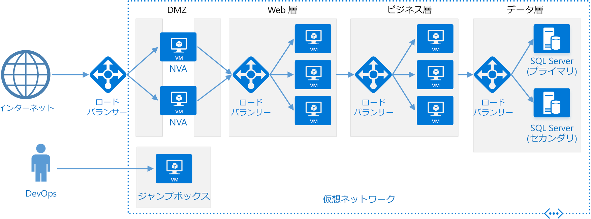

# n 層アーキテクチャのスタイル

n 層アーキテクチャは、アプリケーションを**論理レイヤー**と**物理層**に分離します。 

レイヤーは役割を切り離し、依存関係を管理する方法です。 各レイヤーには特定の役割があります。 上位レイヤーは下位レイヤーのサービスを使用できますが、その逆はありません。 

各層は物理的に分離されており、個別のマシンで実行されます。 層は、別の層を直接呼び出したり、非同期メッセージング (メッセージ キュー) を使用したりできます。 各レイヤーはそれぞれの層でホストされることがありますが、それは必須ではありません。 複数のレイヤーが同じ層でホストされることもあります。 層を物理的に分離することで拡張性と回復性が向上しますが、ネットワーク通信が追加されると待機時間も増加します。 

従来の 3 層アプリケーションには、プレゼンテーション層、中間層、データベース層があります。 中間層はオプションです。 複雑なアプリケーションでは、層が 3 層よりも多くなることがあります。 上記の図は、2 つの中間層があり、異なる機能領域をカプセル化するアプリケーションを示しています。 

n 層アプリケーションは、**クローズド レイヤー アーキテクチャ**にすることも、**オープン レイヤー アーキテクチャ**にすることもできます。

- クローズド レイヤー アーキテクチャでは、レイヤーは直下のレイヤーのみを呼び出すことができます。 
- オープン アーキテクチャでは、レイヤーは下位のどのレイヤーでも呼び出すことができます。 

クローズド レイヤー アーキテクチャでは、レイヤー間の依存関係が制限されます。 ただし、レイヤーが次のレイヤーに要求をただ渡すだけでも、不要なネットワーク トラフィックが発生する可能性があります。 

## このアーキテクチャを使用する状況

n 層アーキテクチャは通常、サービスとしてのインフラストラクチャ (IaaS) アプリケーションとして実装され、各層は個別の VM セットで実行されます。 ただし、n 層アプリケーションは純粋な IaaS である必要はありません。 多くの場合、アーキテクチャの一部、特にキャッシュ、メッセージング、データ ストレージに管理サービスを使用するのが有用です。

n 層アーキテクチャで以下の点を考慮してください。

- シンプルな Web アプリケーション。 
- 最小限のリファクタリングでオンプレミス アプリケーションを Azure に移行。
- オンプレミス アプリケーションとクラウド アプリケーションの統合開発。

n 層アーキテクチャは従来のオンプレミス アプリケーションで非常によく使用されているため、既存のワークロードを Azure に移行するのにとても適しています。

## メリット

- クラウドとオンプレミス間、またクラウド プラットフォーム間での移植性。
- ほとんどの開発者が短時間で習得。
- 従来のアプリケーション モデルからの自然な進化。
- 異機種混在環境 (Windows と Linux) でも利用可能

## 課題

- データベースで CRUD 操作のみを行う中間層で終わらせるのが簡単なため、有効な作業を行うことなく待機時間が増えます。 
- モノリシックな設計により、機能の個別のデプロイが回避されます。
- IaaS アプリケーションの管理は、管理サービスのみを使用するアプリケーションよりも手がかかります。 
- 大規模なシステムでネットワークのセキュリティを管理するのは難しいことがあります。

## ベスト プラクティス

- 自動スケールを使用して負荷の変化に対応する。 「[自動スケールのベスト プラクティス][autoscaling]」をご覧ください。
- 非同期メッセージングを使用して層を分離する。
- 半静的なデータをキャッシュする。 [キャッシュのベスト プラクティス][caching]に関する記事をご覧ください。
- [SQL Server Always On 可用性グループ][sql-always-on]のようなソリューションを使用して、高可用性のデータベース層を構成する。
- フロント エンドとインターネットの間に Web アプリケーション ファイアウォール (WAF) を配置する。
- 各層をそれぞれのサブネットに配置し、サブネットをセキュリティ境界として使用する。 
- 中間層からの要求のみを許可して、データ層へのアクセスを制限する。

## 仮想マシンでの n 層アーキテクチャ

このセクションでは、VM で実行される推奨の n 層アーキテクチャについて説明します。 

各層は 2 つ以上の VM で構成され、可用性セットまたは VM スケール セットに配置されます。 VM を複数配置すると、1 つの VM が失敗した場合の回復性があります。 層内の VM 間で要求を分散させるには、ロード バランサーが使用されます。 プールに VM を追加することで、層を水平方向にスケールできます。 

各層はそれぞれのサブネット内にも配置されますが、それは、その内部 IP アドレスが同じアドレス範囲内になることを意味します。 そのため、ネットワーク セキュリティ グループ (NSG) ルールを適用して個別の層にテーブルをルーティングするのが容易になります。

Web 層とビジネス層はステートレスです。 どの VM も、その層へのあらゆる要求を処理できます。 データ層は、レプリケートされたデータベースで構成されます。 Windows の場合は、SQL Server で Always On 可用性グループを使用して高可用性を実現することをお勧めします。 Linux の場合は、Apache Cassandra などの、レプリケーションをサポートするデータベースを選択します。 

ネットワーク セキュリティ グループ (NSG) により、各層へのアクセスを制限します。 たとえば、データベース層ではビジネス層からのアクセスのみが許可されます。

詳細について、また配置可能な Resource Manager テンプレートについては、次の参照アーキテクチャをご覧ください。

- [Run Windows VMs for an N-tier application (n 層アプリケーションの Windows VM を実行する)][n-tier-windows]
- [Run Linux VMs for an N-tier application (n 層アプリケーションの Linux VM を実行する)][n-tier-linux]

### 追加の考慮事項

- n 層アーキテクチャは 3 層に制限されているわけではありません。 複雑なアプリケーションの場合は、さらに層が増えるのが一般的です。 その場合は、レイヤー 7 ルーティングを使用して特定の層に要求をルートすることを検討してください。

- 層は拡張性、信頼性、セキュリティの境界です。 これらの領域で異なる要件を持つ各サービスには、個別の層を使用することを検討してください。

- 自動スケールには、VM Scale Sets を使用してください。

- 大幅にリファクタリングせずに管理サービスを使用できる、アーキテクチャ内の場所を探してください。 具体的には、キャッシュ、メッセージング、ストレージ、データベースを確認してください。 

- セキュリティを高めるために、アプリケーションの前にネットワーク DMZ を配置してください。 DMZ には、ファイアウォールやパケット検査などのセキュリティ機能を実装する、ネットワーク仮想アプライアンス (NVA) が含まれています。 詳細については、[ネットワーク DMZ 参照アーキテクチャ][dmz]に関する記事をご覧ください。

- 高可用性のために、可用性セットに複数の NVA を配置してください。外部のロード バランサーを使用して、インターネット要求をインスタンス間で分散させてください。 詳細については、「[Deploy highly available network virtual appliances (高可用性ネットワーク仮想アプライアンスのデプロイ)][ha-nva]」をご覧ください。

- アプリケーション コードを実行している VM には、RDP または SSH から直接アクセスできないようにしてください。 その代わりに、オペレーターは要塞ホストとも呼ばれる JumpBox にログインする必要があります。 これは、管理者が他の VM への接続に使用するネットワーク上の VM です。 JumpBox には、承認されたパブリック IP アドレスからの RDP または SSH のみを許可する NSG があります。

- サイト間の仮想プライベート ネットワーク (VPN) または Azure ExpressRoute を使用して、Azure 仮想ネットワークをお客様のオンプレミス ネットワークに拡張できます。 詳細については、[ハイブリッド ネットワーク 参照アーキテクチャ][hybrid-network]に関する記事をご覧ください。

- お客様の組織が Active Directory を使用して ID を管理している場合、Active Directory 環境を Azure VNet に拡張できます。 詳細については、[ID 管理参照アーキテクチャ][identity]に関する記事をご覧ください。

- VM の Azure SLA で提供されるよりも高い可用性が必要な場合は、アプリケーションを 2 つのリージョンにレプリケートして、Azure Traffic Manager を使用してフェールオーバーを行います。 詳細については、[複数リージョンでの Windows VM の実行][ multiregion-windows]、または[複数リージョンでの Linux VM の実行][multiregion-linux]に関する記事をご覧ください。

[autoscaling]: ../../best-practices/auto-scaling.md
[caching]: ../../best-practices/caching.md
[dmz]: ../../reference-architectures/dmz/index.md
[ha-nva]: ../../reference-architectures/dmz/nva-ha.md
[hybrid-network]: ../../reference-architectures/hybrid-networking/index.md
[identity]: ../../reference-architectures/identity/index.md
[multiregion-linux]: ../../reference-architectures/virtual-machines-linux/multi-region-application.md
[multiregion-windows]: ../../reference-architectures/virtual-machines-windows/multi-region-application.md
[n-tier-linux]: ../../reference-architectures/virtual-machines-linux/n-tier.md
[n-tier-windows]: ../../reference-architectures/virtual-machines-windows/n-tier.md
[sql-always-on]: /sql/database-engine/availability-groups/windows/always-on-availability-groups-sql-server