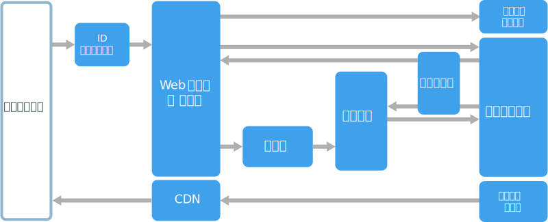
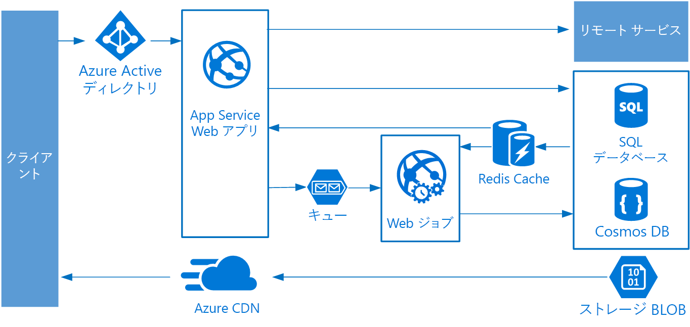

# Web キュー ワーカーのアーキテクチャ スタイル

このアーキテクチャのコア コンポーネントは、クライアント要求を処理する **Web フロント エンド**と、リソースを消費するタスク、実行時間の長いワークフロー、またはバッチ ジョブを実行する**ワーカー**です。  Web フロント エンドは**メッセージ キュー**を通じてワーカーと通信します。  

このアーキテクチャで一般的に使用されているその他のコンポーネントは次のとおりです。

- 1 つまたは複数のデータベース。 
- データベースから高速でデータを読み取るために値を格納するキャッシュ。
- 静的コンテンツを提供するための CDN
- 電子メールや SMS サービスなどのリモート サービス。 多くの場合、これらは、サード パーティによって提供されます。
- 認証 ID プロバイダー。

Web とワーカーはいずれもステートレスです。 セッション状態は、分散キャッシュに格納することができます。 ワーカーによる実行時間の長い作業は、非同期的に実行されます。 ワーカーは、キューのメッセージによってトリガーされるか、またはバッチ処理のためにスケジュールに従って実行できます。 ワーカーは、オプションのコンポーネントです。 処理時間が長い操作がない場合は、ワーカーを省略できます。  

フロント エンドは、Web API で構成されている可能性があります。 クライアント側では、Web API は、AJAX 呼び出しを実行する単一ページ アプリケーションまたはネイティブ クライアント アプリケーションが使用できます。

## このアーキテクチャを使用する条件

Web キュー ワーカーのアーキテクチャは、通常、マネージ コンピューティング サービス、Azure App Service または Azure Cloud Services のいずれかを使用して実装されます。 

次の場合に、このアーキテクチャ スタイルを検討してください。

- 比較的単純なドメインのアプリケーション。
- 実行時間の長いワークフローやバッチ操作があるアプリケーション。
- サービスとしてのインフラストラクチャ (IaaS) ではなく、マネージ サービスを使用する場合。

## メリット

- 比較的単純でわかりやすいアーキテクチャ。
- 展開と管理が容易。
- 懸念事項の明確な分離。
- フロント エンドは、非同期メッセージングを使用してワーカーから切り離されます。
- フロント エンド ロールとワーカーはそれぞれ個別に拡張できます。

## 課題

- 慎重に設計しないと、フロント エンドおよびワーカーが、大型のモノリシック コンポーネントになり、管理や更新が困難になる。
- フロント エンド ロールとワーカーがデータ スキーマまたはコード モジュールを共有している場合、依存関係が潜在することがある。 

## ベスト プラクティス

- クライアントに適切に設計された API を公開する。 「[API 設計のベスト プラクティス][api-design]」を参照してください
- 負荷の変化に対応するために自動スケールする。 「[自動スケールのベスト プラクティス][autoscaling]」を参照してください。
- 半静的なデータをキャッシュする。 「[キャッシングのベスト プラクティス][caching]」を参照してください。
- CDN を使用して、静的コンテンツをホストする。 「[CDN のベスト プラクティス][cdn]」を参照してください。
- 適切な場合は、多言語永続化を使用する。 「[ジョブに最適なデータ ストアの使用][polyglot]」を参照してください。
- 拡張性を向上し、競合を予防し、パフォーマンスを最適化するためにデータを分割する。 「[データのパーティション分割のベスト プラクティス][data-partition]」を参照してください。

## Azure App Service の Web キュー ワーカー

このセクションでは、Azure App Service を使用する、推奨 Web キュー ワーカー アーキテクチャについて説明します。 

フロント エンドは、Azure App Service Web アプリとして実装され、ワーカーは、WebJob として実装されます。 Web アプリと WebJob の両方が VM インスタンスを提供する App Service プランに関連付けられています。 

メッセージ キューには、Azure Service Bus または Azure Storage キューのいずれかを使用できます。 (図は、Azure Storage キューを示しています)。

Azure Redis Cache は、セッション状態と短い待ち時間でアクセスが必要なその他のデータを格納します。

Azure CDN を使用して、画像、CSS、HTML などの静的なコンテンツをキャッシュします。

ストレージは、アプリケーションのニーズに最適なストレージ テクノロジを選択します。 複数のストレージ テクノロジ (多言語持続性) を使用することもできます。 この概念を示すために、この図には、Azure SQL Database と Azure Cosmos DB を示しています。  

詳細については、[App Service Web アプリケーションの参照アーキテクチャ][scalable-web-app]を参照してください。

### 追加の考慮事項

- ストレージまでキューやワーカーを経由しないトランザクションもあります。 Web フロント エンドは、単純な読み取り/書き込み操作を直接実行できます。 ワーカーは、リソースを消費するタスクまたは実行時間の長いワークフローの設計されています。 ワーカーがまったく必要ない場合もあります。

- App Service の組み込み自動スケール機能を使用して、VM インスタンスの数をスケール アウト。 アプリケーションで負荷が、予測可能なパターン通りの場合は、スケジュールに基づく自動スケールを使用します。 負荷が予測可能でない場合は、メトリックに基づいた自動スケール ルールを使用します。      

- Web アプリと WebJob を個別の App Service プランに配置することを検討してください。 それにより、別の VM インスタンスでホストされるため、個別に拡張できます。 

- 運用環境とテスト環境では、異なる App Service プランを使用してください。 運用環境とテスト環境で同じプランを使用すると、テストが、運用環境の VM で実行されます。

- デプロイ スロットを使用して展開を管理します。 これにより、ステージング スロットに更新されたバージョンを展開してた後、新しいバージョンに交換できます。 また、更新バージョンで問題があった場合は、前のバージョンに戻ることもできます。

<!-- links -->

[api-design]: ../../best-practices/api-design.md
[autoscaling]: ../../best-practices/auto-scaling.md
[caching]: ../../best-practices/caching.md
[cdn]: ../../best-practices/cdn.md
[data-partition]: ../../best-practices/data-partitioning.md
[polyglot]: ../design-principles/use-the-best-data-store.md
[scalable-web-app]: ../../reference-architectures/app-service-web-app/scalable-web-app.md