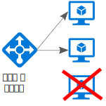

# すべてを冗長化

## 単一障害点をなくすために、冗長性をアプリケーションに組み込みます

耐障害性のあるアプリケーションでは障害が回避されます。 アプリケーションのクリティカル パスを特定してください。 パスの各ポイントに冗長性が確保されていますか。 サブシステムで障害が発生した場合に、アプリケーションは他にフェールオーバーしますか。

## Recommendations

**ビジネス要件を考慮する**。 システムにどのくらいの冗長性を組み込むかは、コストと複雑さの両方に影響します。 アーキテクチャには、目標復旧時間 (RTO) などのビジネス要件の情報が必要です。 たとえば、複数リージョンのデプロイは、単一リージョンのデプロイよりもコストがかかり、管理も複雑です。 フェールオーバーとフェールバックを処理するための操作手順が必要になります。 追加コストと複雑さが理にかなっているかどうかは、ビジネス シナリオによって異なります。

**VM をロード バランサーの内側に配置する**。 ミッション クリティカルなワークロードには、単一 VM を使用しないでください。 代わりに、複数の VM をロード バランサーの内側に配置します。 VM が使用できなくなると、ロード バランサーは、残りの正常な VM にトラフィックを分散します。 この構成をデプロイする方法については、[スケーラビリティと可用性のための複数の VM][multi-vm-blueprint] に関するページをご覧ください。

**データベースをレプリケートする**。 Azure SQL Database と Cosmos DB を使用すると、リージョン内でデータが自動的にレプリケートされ、リージョン間では geo レプリケーションを有効にできます。 IaaS データベース ソリューションを使用している場合は、[SQL Server Always On 可用性グループ][sql-always-on]など、レプリケーションとフェールオーバーをサポートするものを選択します。

**geo レプリケーションを有効にする**。 [Azure SQL Database][sql-geo-replication] と [Cosmos DB][cosmosdb-geo-replication] の geo レプリケーションにより、1 つ以上のセカンダリ リージョンにデータの読み取り可能セカンダリ レプリカが作成されます。 障害発生時、データベースは書き込みのためにセカンダリ リージョンにフェールオーバーできます。

**可用性のためにパーティション分割する**。 データベース パーティション分割は、通常、スケーラビリティ向上のために使用されますが、可用性を向上させることもできます。 あるシャードがダウンしても、それ以外のシャードには引き続きアクセスできます。 あるシャードで発生した障害によって中断されるのは、トランザクション全体のサブセットのみです。

**複数のリージョンにデプロイする**。 最大の高可用性を実現するために、アプリケーションを複数のリージョンにデプロイします。 これにより、まれではありますが、問題がリージョン全体に影響を及ぼす場合に、アプリケーションを別のリージョンにフェールオーバーできます。 次の図は、Azure Traffic Manager を使用してフェールオーバーを処理する複数リージョン アプリケーションを示しています。

**フロントエンドおよびバックエンドのフェールオーバーを同期する**。 Azure Traffic Manager を使用して、フロントエンドにフェールオーバーします。 あるリージョンでフロントエンドにアクセスできなくなると、Traffic Manager は、新しい要求をセカンダリ リージョンにルーティングします。 データベース ソリューションによっては、データベースのフェールオーバーの調整が必要になる場合があります。

**自動フェールオーバーを使用するが、フェールバックは手動で行う**。 Traffic Manager は自動フェールオーバーに使用し、自動フェールバックには使用しないでください。 自動フェールバックには、完全に正常な状態に戻る前に、プライマリ リージョンに切り替えられてしまうリスクがあります。 そうではなく、手動でフェールバックする前に、すべてのアプリケーション サブシステムが正常であることを確認してください。 また、データベースによっては、フェールバックの前に、データの一貫性チェックが必要になる場合があります。

**Traffic Manager の冗長性を確保する**。 Traffic Manager が障害ポイントになる可能性があります。 Traffic Manager の SLA を確認し、Traffic Manager を使用するだけで、高可用性のビジネス要件を満たすかどうかを確かめてください。 満たさない場合は、代替システムとして他のトラフィック管理ソリューションを追加することを検討してください。 Azure Traffic Manager サービスで障害が発生した場合は、他のトラフィック管理サービスを参照するように、DNS の CNAME レコードを変更します。

<!-- links -->

[multi-vm-blueprint]: ../../reference-architectures/virtual-machines-windows/multi-vm.md

[cassandra]: https://cassandra.apache.org/
[cosmosdb-geo-replication]: /azure/cosmos-db/distribute-data-globally
[sql-always-on]: https://msdn.microsoft.com/library/hh510230.aspx
[sql-geo-replication]: /azure/sql-database/sql-database-geo-replication-overview
