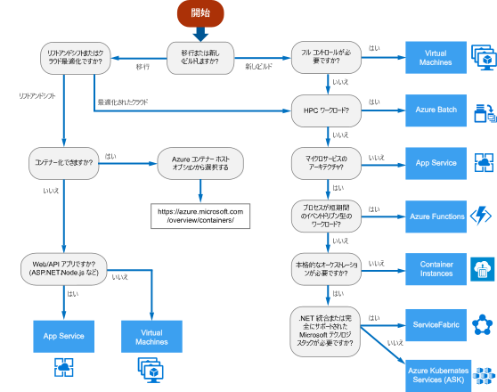

# Azure コンピューティング サービスのデシジョン ツリー

Azure では、複数の方法でお使いのアプリケーション コードをホストできます。 "*コンピューティング*" という用語は、アプリケーションがそこで実行されるコンピューティング リソースのホスティング モデルを指します。 次のフローチャートは、お使いのアプリケーションのコンピューティング サービスを選択するうえで役立ちます。
 

このフローチャートは、推奨事項を導き出すための一連の主要な意思決定基準を示しています。 すべてのアプリケーションに固有の要件があるため、推奨事項は原案として使用することをお勧めします。 その後、詳細な分析を実行し、次の点を確認します。
 
- 機能セット
- [サービスの制限](/azure/azure-subscription-service-limits)
- [コスト](https://azure.microsoft.com/pricing/)
- [SLA](https://azure.microsoft.com/support/legal/sla/)
- [リージョン別の提供状況](https://azure.microsoft.com/global-infrastructure/services/)
- 開発者のエコシステムとチームのスキル
- [コンピューティングの比較表](./compute-comparison.md)

アプリケーションが複数のワークロードで構成されている場合は、それぞれのワークロードを個別に評価します。 完全なソリューションに、複数のコンピューティング サービスに組み込むことができます。

