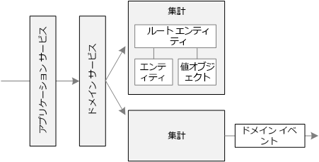

# マイクロサービスの設計: ドメイン分析 

マイクロサービスの最大の課題の 1 つは、個々のサービスの境界の定義です。 原則として 1 つのサービスは "1 つのこと" を行う必要がありますが、その実現のためには慎重な検討が必要です。 "適切" な設計を作り出す機械的なプロセスはありません。 ビジネス用ドメイン、要件、および目的についてよく考える必要があります。 そうしないと、好ましくない特徴 (サービス間の非表示の依存関係、密結合、不完全なデザインのインターフェイスなど) を持つ場当たり的な設計になる可能性があります。 この章では、マイクロサービスを設計するためのドメイン駆動のアプローチについて説明します。 

マイクロサービスは、データ アクセスやメッセージングなどの水平レイヤーではなく、ビジネス機能に基づいて設計する必要があります。 また、マイクロサービスには疎結合と機能の高い凝集度が必要です。 他のサービスを同時に更新せずにサービスを変更できる場合、マイクロサービス同士は*ゆるやかに結び付いて*います。 明確に定義された 1 つの目的 (ユーザー アカウントの管理、配送履歴の追跡など) を持つマイクロサービスは*高凝集*です。 サービスはドメイン ナレッジをカプセル化し、クライアントからそのナレッジを抽象化する必要があります。 たとえば、クライアントは、スケジューリング アルゴリズムの詳細やドローン フリートの管理方法を知らなくてもドローンのスケジュールを設定できる必要があります。

ドメイン駆動設計 (DDD) は、適切に設計された一連のマイクロサービスを作り出すためのフレームワークを提供します。 DDD には 2 つの異なるフェーズ (戦略と戦術) があります。 戦略的 DDD では、システムの大規模な構造を定義します。 戦略的 DDD は、アーキテクチャがビジネス機能に焦点を当てた状態を維持するために役立ちます。 戦術的 DDD は、ドメイン モデルの作成に使うことのできる一連の設計パターンを提供します。 これらのパターンには、エンティティ、集約、およびドメイン サービスがあります。 このような戦術的パターンを使うと、疎結合および高凝集のマイクロサービスを設計できます。

この章と次の章では、以下の手順について説明し、それらをドローン配送アプリケーションに適用します。 

1. 最初にビジネス用ドメインを分析し、アプリケーションの機能的な要件を理解します。 この手順により、正式でないドメインの記述が生成されます。この記述をより正式なドメイン モデルのセットに作り替えることができます。 

2. 次に、ドメインの*境界付けられたコンテキスト*を定義します。 境界付けられた各コンテキストには、大規模なアプリケーションの特定のサブドメインを表すドメイン モデルが含まれています。 

3. 境界付けられたコンテキスト内で、戦術的 DDD パターンを適用して、エンティティ、集約、およびドメイン サービスを定義します。 
 
4. 前の手順の結果を使って、アプリケーションのマイクロサービスを識別します。

この章では、DDD と主に関連のある最初の 3 つの手順について説明します。 マイクロサービスの識別は次の章で行います。 ただし、DDD は反復的かつ継続的なプロセスであることを覚えておいてください。 サービスの境界は固定されていません。 アプリケーションの進化に伴って、1 つのサービスを複数の小さなサービスに分割することができます。

> [!NOTE]
> この章では、ドメインの完全かつ包括的な分析については説明しません。 主要なポイントを示すために、あえて簡単な例を取り上げています。 DDD の詳しい背景情報については、この用語を最初に紹介した Eric Evans 氏の著書『*Domain-Driven Design*』をお読みになることをお勧めします。 その他の参考資料としては、Vaughn Vernon 氏の著書『*Implementing Domain-Driven Design*』があります。 

## ドメインを分析する

DDD アプローチを使うと、各サービスがビジネスの機能的な要件に適合するようなマイクロサービスを設計できます。 また、組織の境界やテクノロジの選択が設計に影響するというトラップを回避できます。

コードを記述する前に、作成するシステムを俯瞰する必要があります。 DDD では、最初にビジネス用ドメインをモデリングして、*ドメイン モデル*を作成します。 ドメイン モデルはビジネス用ドメインの抽象化モデルです。 このモデルはドメイン ナレッジを抽出して整理し、開発者やドメイン エキスパートに共通の言語を提供します。 

最初に、すべてのビジネス機能とその関係をマッピングします。 これは、ドメイン エキスパート、ソフトウェア アーキテクト、およびその他の関係者が関与する共同作業になる可能性があります。 特定の形式を使う必要はありません。  図をスケッチするか、ホワイトボードに描画します。

図を描画したら、個別のサブドメインの識別を開始できます。 密接に関連している機能はどれか、 ビジネスの中核となる機能はどれか、付帯的なサービスを提供する機能はどれか、 依存関係グラフとは何かを確認します。 この最初のフェーズでは、テクノロジや実装の詳細を気にすることはありません。 とは言え、アプリケーションを外部システム (CRM、支払い処理、請求システムなど) と統合する必要のある場所について注意する必要があります。 

## ドローン配送: ビジネス用ドメインの分析

最初のいくつかのドメイン分析の完了後、Fabrikam のチームはドローン配送ドメインを示すおおまかなスケッチを作成しました。

 

- **出荷**はビジネスの中核であるため、図の中央に配置します。 図のそれ以外の要素は、この機能を実現するために存在します。
- **ドローンの管理**もビジネスの中核です。 ドローン管理と密接に関連する機能には、**ドローンの修理**、および**予測分析**によるドローンの付帯サービスとメンテナンスが必要な時期の予測があります。 
- **ETA 分析**は集配の時間を見積もります。 
- **サード パーティの輸送**では、荷物をドローンで出荷できない場合の代替輸送方法をアプリケーションでスケジュールできます。
- **ドローンの共有**は、コア ビジネスを拡張するものです。 企業では、ドローンが空きがある期間に、使われていないドローンを貸し出すことができます。 この機能は、初期リリースには含まれていません。
- **ビデオ監視**は、企業が後から展開する可能性のあるもう 1 つの分野です。
- **ユーザー アカウント**、**請求**、および**コール センター**は、コア ビジネスをサポートするサブドメインです。
 
プロセスのこの時点では、実装やテクノロジに関する決定を行っていません。 一部のサブシステムには、外部のソフトウェア システムやサード パーティのサービスが含まれている可能性があります。 その場合でも、アプリケーションはこれらのシステムやサービスとやり取りする必要があるため、ドメイン モデルにシステムやサービスを追加することが重要です。 

> [!NOTE]
> アプリケーションが外部システムに依存する場合は、外部システムのデータ スキーマや API がアプリケーションに漏えいし、最終的にアーキテクチャの設計が損なわれるというリスクがあります。 これは、最新のベスト プラクティスに従っていない、および複雑なデータ スキーマや古い API を使っている従来のシステムに特に当てはまります。 その場合は、これらの外部システムとアプリケーション間の境界を明確に定義することが重要です。 そのためには、[ストラングラー パターン](../patterns/strangler.md)や[破損対策レイヤー パターン](../patterns/anti-corruption-layer.md)の使用を検討してください。

## 境界付けられたコンテキストを定義する

ドメイン モデルには、世界中に存在する実際のもの (ユーザー、ドローン、荷物など) の表現が含まれます。 ただし、同じものについてシステム全体で同じ表現を使わなければならないというわけではありません。 

たとえば、ドローンの修理と予測分析を扱うサブシステムでは、ドローンの多くの物理的特性 (メンテナンス履歴、マイレージ、年数、モデル番号、性能の特徴など) を表す必要があります。 しかし、配送をスケジュールするときは、それらについて考慮しません。 スケジューリング サブシステムでは、ドローンが使用可能か、および集配の ETA だけを把握する必要があります。 

これらの 2 つのサブシステムに対して 1 つのモデルを作成しようとすると、不必要に複雑なモデルになります。 また、変更を行う場合に複数のチームが個々のサブシステムに対して作業を行う必要があるため、時間の経過と共にモデルの進化が難しくなります。 そのため、多くの場合、現実世界のエンティティ (ここではドローン) を 2 つの異なるコンテキストで表す個別のモデルを設計することをお勧めします。 各モデルには、特定のコンテキスト内に関連する機能と属性だけが含まれます。

ここで、*境界付けられたコンテキスト*という DDD の概念が作用します。 境界付けられたコンテキストは、特定のドメイン モデルが適用されるドメイン内の単なる境界です。 前述の図では、さまざまな機能が 1 つのドメイン モデルを共有するかどうかに従って機能をグループ化できます。 

 
 
境界付けられたコンテキストは、必ずしも互いに分離された状態である必要はありません。 この図では、境界付けられたコンテキストを結ぶ実線は、2 つの境界付けられたコンテキストがやり取りする場所を表します。 たとえば、"出荷" は顧客の情報を取得するために "ユーザー アカウント" に依存し、フリートのドローンをスケジュールするために "ドローン管理" に依存します。

Eric Evans 氏は、著書『*Domain Driven Design*』で、別の境界付けられたコンテキストとやり取りする際にドメイン モデルの整合性を維持するための複数のパターンについて説明しています。 マイクロサービスの主要な原則の 1 つは、明確に定義された API を通じてサービスがやり取りするということです。 このアプローチは、Evans 氏が Open Host Service および Published Language と呼ぶ 2 つのパターンに対応します。 Open Host Service では、サブシステムが他のサブシステムとやり取りするための正式なプロトコル (API) を定義します。 Published Language は、他のチームがクライアントを記述するために使うことのできる形式で API を発行することにより、この考え方を拡張したものです。 「[API Design](./api-design.md)」(API の設計) の章では、[OpenAPI 仕様](https://www.openapis.org/specification/repo) (旧称 Swagger) を使って、JSON または YAML 形式で表現された、REST API 用の言語に依存しないインターフェイスの記述を定義する方法について説明します。

この記事の以降の部分では、境界付けられたコンテキスト "出荷" について重点的に説明します。 

## 戦術的 DDD

DDD の戦略フェーズでは、ビジネス用ドメインを策定し、ドメイン モデルの境界付けられたコンテキストを定義します。 戦術的 DDD では、ドメイン モデルをより正確に定義します。 戦術的パターンは、1 つの境界付けられたコンテキスト内で適用されます。 マイクロサービスのアーキテクチャで特に興味深いのは、エンティティと集約のパターンです。 これらのパターンを適用すると、アプリケーション内のサービスの自然な境界を識別できます ([次の章](./microservice-boundaries.md)を参照)。 原則として、マイクロサービスは集約よりは大きく、境界付けられたコンテキストよりは小さくする必要があります。 最初に、戦術的パターンを確認します。 次に、ドローン配送アプリケーションの境界付けられたコンテキスト "出荷" にそのパターンを適用します。 

### 戦術的パターンの概要

ここでは、戦術的 DDD パターンの概要を示します。DDD について既に詳しくご存じの場合は、このセクションをスキップしてもかまいません。 各パターンについて詳しくは、Eric Evans 氏の著書の第 5 章と第 6 章、および Vaughn Vernon 氏の著書『*Implementing Domain-Driven Design*』をご覧ください。 

**エンティティ**:  エンティティは、時間の経過に関係なく保持される一意の ID を持つオブジェクトです。 たとえば、銀行取引アプリケーションでは、顧客と口座がエンティティになります。 

- システムでは、エンティティに一意識別子が割り当てられており、エンティティの検索や取得に使うことができます。 この識別子は必ずユーザーに対して直接公開されているわけではありません。 データベースの GUID や主キーがこれに該当します。 
- ID は複数の境界付けられたコンテキストにまたがり、アプリケーションの有効期間を越えて存続する可能性があります。 たとえば、銀行口座番号や政府発行の ID が特定のアプリケーションの有効期間に関連付けられることはありません。
- エンティティの属性は時間の経過と共に変わる可能性があります。 たとえば、個人名や住所は変わる可能性がありますが、個人は同じ人物のままです。 
- エンティティは他のエンティティへの参照を保持できます。
 
**値オブジェクト**:  値オブジェクトには ID がありません。 このオブジェクトは属性の値でのみ定義されます。 値オブジェクトも変更できません。 値オブジェクトを更新するには、必ず新しいインスタンスを作成して、古いインスタンスを置き換えます。 値オブジェクトにはドメイン ロジックをカプセル化する方法が用意されていますが、これらの方法がオブジェクトの状態に対して副次的な影響を及ぼしてはなりません。 値オブジェクトの一般的な例として、色、日付と時刻、通貨の値が挙げられます。 

**集約**:  集約では、1 つ以上のエンティティを囲む一貫性の境界を定義します。 集約内の 1 つのエンティティはルートです。 ルート エンティティの識別子を使って、検索が行われます。 集約内のその他のエンティティはルートの子であり、ルートからのポインターをたどることによって参照されます。 

集約の目的は、トランザクションのインバリアントをモデル化することです。 現実世界のものには複雑な関係があります。 たとえば、顧客が注文を作成し、注文には商品が含まれ、商品には供給業者が存在する、などの関係です。 アプリケーションがいくつかの関連オブジェクトを変更する場合は、どのように一貫性を保証するのでしょうか。 また、インバリアントを追跡して実現するにはどうすればよいでしょうか。  

従来のアプリケーションでは、多くの場合、データベース トランザクションを使って一貫性を実現します。 しかし、分散アプリケーションでは、多くの場合、これを実現できません。 1 つのビジネス トランザクションが複数のデータ ストアにまたがる場合、トランザクションの実行時間が長い場合、またはトランザクションにサード パーティのサービスが関与する場合があります。 最終的に、ドメインに必要なインバリアントの実現は、データ レイヤーではなくアプリケーションに依存します。 それが集約によってモデル化されるものです。

> [!NOTE]
> 集約は 1 つのエンティティで構成され、子エンティティはありません。 エンティティが集約になるために必要なのはトランザクション境界です。

**ドメイン サービスとアプリケーション サービス**:  DDD の用語では、サービスとは、状態を保持せずにいくつかのロジックを実装するオブジェクトです。 Evans 氏は、ドメイン ロジックをカプセル化する*ドメイン サービス*と、技術的な機能 (ユーザー認証や SMS メッセージの送信など) を提供する*アプリケーション サービス*を区別しています。 ドメイン サービスは、多くの場合、複数のエンティティにまたがる動作のモデル化に使われます。 

> [!NOTE]
> ソフトウェア開発においては、*サービス*という用語に過剰な負荷がかかっています。 ここでの定義はマイクロサービスに直接関連しません。

**ドメイン イベント**:  ドメイン イベントを使うと、何かが発生したときにシステムの他の部分に通知できます。 その名前が示すように、ドメイン イベントはドメイン内で発生するイベントです。 たとえば、"レコードがテーブルに挿入された" ことはドメイン イベントではありません。 "配送がキャンセルされた" ことはドメイン イベントです。 ドメイン イベントはマイクロサービスのアーキテクチャに特に関連します。 マイクロサービスは分散型であり、データ ストアを共有しないので、ドメイン イベントはマイクロサービスが互いに連携するための方法を提供します。 「[サービス間の通信](./interservice-communication.md)」の章では、非同期メッセージングについて詳しく説明します。
 
ここで説明していない DDD パターンは他にもいくつかあります (ファクトリ、リポジトリ、モジュールなど)。 これらはマイクロサービスの実装時に役立つパターンですが、マイクロサービス間の境界の設計にはあまり関連しません。

## ドローン配送: パターンの適用

最初に、境界付けられたコンテキスト "出荷" が処理する必要のあるシナリオを見てみましょう。

- 顧客は、ドローン配送サービスに登録された企業からドローンで商品を集荷するよう依頼できます。
- 荷送人は、タグ (バーコードまたは RFID) を生成して荷物に取り付けます。 
- ドローンが集荷先から荷物を集荷して、配送先に届けます。
- 顧客が配送をスケジュールするときに、システムはルート情報、気象条件、履歴データに基づいて ETA を提供します。 
- ドローンの飛行中、ユーザーは現在地と最新の ETA を追跡できます。 
- ドローンによる荷物の集荷が完了するまで、顧客は配送をキャンセルできます。
- 配送が完了すると、顧客に通知が送信されます。
- 荷送人は、署名またはフィンガープリントの形式で顧客から配送の確認を要求できます。
- ユーザーは、完了した配送の履歴を検索できます。

これらのシナリオから、開発チームは以下の**エンティティ**を識別しました。

- 配送
- パッケージ
- ドローン
- アカウント
- 確認
- 通知
- タグ

最初の 4 つ (配送、荷物、ドローン、アカウント) はすべて、トランザクションの一貫性の境界を表す**集約**です。 "確認" と "通知" は "配送" の子エンティティです。"タグ" は "荷物" の子エンティティです。 

この設計の**値オブジェクト**には Location、ETA、PackageWeight、および PackageSize があります。 

"配送" 集約の UML 図を次に示します。 この集約は、他の集約 (アカウント、荷物、ドローン) への参照を保持します。

次の 2 つのドメイン イベントがあります。

- ドローンの飛行中、"ドローン" エンティティはドローンの場所と状態 (飛行中、着陸) を示す DroneStatus イベントを送信します。

- "配送" エンティティは、配送の段階が変わるたびに DeliveryTracking イベントを送信します。 これらには、DeliveryCreated、DeliveryRescheduled、DeliveryHeadedToDropoff、DeliveryCompleted があります。 

これらのイベントは、ドメイン モデル内で意味のある内容を示しています。 これらはドメインに関する情報を示すものであり、特定のプログラミング言語コンストラクトに関連付けられません。

開発チームは、これまでに記述されたどのエンティティにも当てはまらないもう 1 つの機能分野を識別しました。 システムの一部では、配送のスケジューリングまたは更新に関連するすべての手順を調整する必要があります。 そのため、開発チームは、2 つの**ドメイン サービス** (手順を調整する *Scheduler*、および各手順の状態を監視する *Supervisor*) を設計に追加し、いずれかの手順が失敗またはタイムアウトしたかどうかを検出するようにしました。これは [Scheduler Agent Supervisor パターン](../patterns/scheduler-agent-supervisor.md)のバリエーションです。

> [!div class="nextstepaction"]
> [マイクロサービス境界の識別](./microservice-boundaries.md)
