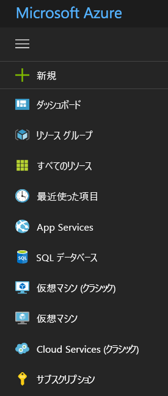

# <a name="use-azure-key-vault-to-protect-application-secrets"></a>Azure Key Vault を使用したアプリケーション シークレットの保護

[ サンプル コード][sample application]

次のようなアプリケーション設定は機密情報であり、保護する必要があることは一般的です。

* データベース接続文字列
* パスワード
* 暗号化キー

セキュリティのベスト プラクティスとして、ソース管理でこれらの機密情報を保存しないでください。 ソースコード リポジトリがプライベートであっても、機密情報が漏洩しやすくなります。 また、これは機密情報が一般に公開されることから保護するだけではありません。 大規模なプロジェクトでは、実稼働の機密情報にアクセスできる開発者およびオペレーターを制限する必要がある場合があります  (テスト環境または開発環境の設定は異なります)。

より安全なオプションは、これらの機密情報を [Azure Key Vault][KeyVault] に保存することです。 Key Vault とは、暗号化キーやその他の機密情報を管理するための、クラウドでホストされているサービスです。 この記事では、Key Vault を使用して、アプリケーションの構成設定を格納する方法について説明します。

[Tailspin Surveys][Surveys] アプリケーションでは、次の設定が機密情報です。

* データベース接続文字列。
* Redis 接続文字列。
* Web アプリケーションのクライアント シークレット。

Surveys アプリケーションは、次の場所から構成設定を読み込みます。

* appsettings.json ファイル
* [ユーザー シークレット ストア][user-secrets] (開発環境のみ、テスト目的)
* ホスティング環境 (Azure Web アプリのアプリ設定)
* Key Vault (有効な場合)

これらはそれぞれ、以前の設定をオーバーライドするため、Key Vault に格納されているすべての設定が優先されます。

> [!NOTE]
> 既定では、Key Vault の構成プロバイダーは無効になっています。 これは、アプリケーションをローカルで実行する場合には必要ありません。 運用環境のデプロイで有効にします。

起動時に、アプリケーションはすべての登録済み設定プロバイダーからの設定を読み取り、これらの設定を使用して、厳密に型指定されたオプションのオブジェクトを設定します。 詳細については、[オプションと構成オブジェクトの使用][options]に関する記事をご覧ください。

## <a name="setting-up-key-vault-in-the-surveys-app"></a>Surveys アプリケーションでの Key Vault の設定
前提条件:

* [Azure Resource Manager コマンドレット][azure-rm-cmdlets]をインストールします。
* 「[Run the Surveys application (Surveys アプリケーションの実行)][readme]」の説明に従って、Surveys アプリケーションを構成します。

手順の概要は次のとおりです。

1. テナントで管理者ユーザーを設定します。
2. クライアント証明書を設定します。
3. Key Vault を作成します。
4. 作成した Key Vault に構成設定を追加します。
5. Key Vault を有効にするコードをコメント解除します。
6. アプリケーションのユーザー シークレットを更新します。

### <a name="set-up-an-admin-user"></a>管理者ユーザーを設定する
> [!NOTE]
> Key Vault を作成するには、Azure サブスクリプションを管理できるアカウントを使用する必要があります。 また、Key Vault からの読み取りを承認する任意のアプリケーションを、そのアカウントと同じテナントに登録する必要があります。
> 
> 

この手順では、Surveys アプリケーションが登録されているテナントのユーザーとしてサインインした状態で、Key Vault を作成できることを確認します。

Surveys アプリケーションが登録されている Azure AD テナント内に管理者ユーザーを作成します。

1. [Azure Portal][azure-portal] にログインします。
2. アプリケーションが登録されている Azure AD テナントを選択します。
3. **[その他のサービス]** > **[セキュリティ + ID]** > **[Azure Active Directory]** > **[ユーザーとグループ]** > **[すべてのユーザー]** の順にクリックします。
4. ポータルの上部にある **[新しいユーザー]** をクリックします。
5. フィールドに入力し、ユーザーを **[全体管理者]** ディレクトリ ロールに割り当てます。
6. **Create** をクリックしてください。


このユーザーを、サブスクリプションの所有者として割り当てます。

1. ハブ メニューで、**[サブスクリプション]** を選択します。

    

2. この管理者がアクセスするサブスクリプションを選択します。
3. サブスクリプション ブレードで、**[アクセス制御 (IAM)]** を選択します。
4. **[追加]** をクリックします。
4. **[ロール]** で、**[所有者]** を選択します。
5. 所有者として追加するユーザーの電子メール アドレスを入力します。
6. ユーザーを選択して **[保存]** をクリックします。

### <a name="set-up-a-client-certificate"></a>クライアント証明書を設定する
1. 次のとおり、PowerShell スクリプト [/Scripts/Setup-KeyVault.ps1][Setup-KeyVault] を実行します。
   
    ```
    .\Setup-KeyVault.ps1 -Subject <<subject>>
    ```
    `Subject` パラメーターに任意の名前を入力します ("surveysapp" など)。 このスクリプトによって、自己署名証明書が生成され、"Current User/Personal" 証明書ストアに保存されます。 スクリプトの出力は、JSON フラグメントです。 この値をコピーします。

2. [[Azure Portal]][azure-portal] で、ポータルの右上隅にあるアカウントを選択して、Survey アプリケーションが登録されているディレクトリに移動します。

3. **[Azure Active Directory]** > **[アプリの登録]** > Surveys の順に選択します。

4.  **[マニフェスト]** をクリックし、**[編集]** をクリックします。

5.  スクリプトの出力を `keyCredentials` プロパティに貼り付けます。 次のようになります。
        
    ```json
    "keyCredentials": [
        {
        "type": "AsymmetricX509Cert",
        "usage": "Verify",
        "keyId": "29d4f7db-0539-455e-b708-....",
        "customKeyIdentifier": "ZEPpP/+KJe2fVDBNaPNOTDoJMac=",
        "value": "MIIDAjCCAeqgAwIBAgIQFxeRiU59eL.....
        }
    ],
    ```          

6. **[Save]** をクリックします。  

7. 手順 3 - 6 を繰り返し、同じ JSON フラグメントを Web API (Surveys.WebAPI) のアプリケーション マニフェストに追加します。

8. PowerShell ウィンドウから次のコマンドを実行して、証明書の拇印を取得します。
   
    ```
    certutil -store -user my [subject]
    ```
    
    `[subject]` には、PowerShell スクリプトの Subject に指定した値を使用します。 拇印は "Cert Hash(sha1)" の下に表示されます。 この値をコピーします。 拇印は後で使用します。

### <a name="create-a-key-vault"></a>Key Vault を作成します
1. 次のとおり、PowerShell スクリプト [/Scripts/Setup-KeyVault.ps1][Setup-KeyVault] を実行します。
   
    ```
    .\Setup-KeyVault.ps1 -KeyVaultName <<key vault name>> -ResourceGroupName <<resource group name>> -Location <<location>>
    ```
   
    資格情報の入力を求められたら、先ほど作成した Azure AD ユーザーとしてサインインします。 このスクリプトにより、新しいリソース グループと、そのリソース グループ内に新しい Key Vault が作成されます。 
   
2. 次のように SetupKeyVault.ps を再び実行します。
   
    ```
    .\Setup-KeyVault.ps1 -KeyVaultName <<key vault name>> -ApplicationIds @("<<Surveys app id>>", "<<Surveys.WebAPI app ID>>")
    ```
   
    次のパラメーター値を設定します。
   
       * key vault name = 前の手順で Key Vault に指定した名前。
       * Surveys app ID = Surveys Web アプリケーションのアプリケーション ID。
       * Surveys.WebApi app ID = Surveys.WebAPI アプリケーションのアプリケーション ID。
         
    例:
     
    ```
     .\Setup-KeyVault.ps1 -KeyVaultName tailspinkv -ApplicationIds @("f84df9d1-91cc-4603-b662-302db51f1031", "8871a4c2-2a23-4650-8b46-0625ff3928a6")
    ```
    
    このスクリプトでは、Web アプリと Web API が Key Vault からシークレットを取得することを承認します。 詳細については、「[Azure Key Vault の概要](/azure/key-vault/key-vault-get-started/)」をご覧ください。

### <a name="add-configuration-settings-to-your-key-vault"></a>作成した Key Vault に構成設定を追加する
1. 次のように SetupKeyVault.ps を実行します。
   
    ```
    .\Setup-KeyVault.ps1 -KeyVaultName <<key vault name> -KeyName Redis--Configuration -KeyValue "<<Redis DNS name>>.redis.cache.windows.net,password=<<Redis access key>>,ssl=true" 
    ```
    各値の説明:
   
   * key vault name = 前の手順で Key Vault に指定した名前。
   * Redis DNS name = Redis Cache インスタンスの DNS 名。
   * Redis access key = Redis Cache インスタンスのアクセス キー。
     
2. この時点で、Key Vault にシークレットが正常に保存されたかどうかをテストすることをお勧めします。 次の PowerShell コマンドを実行します。
   
    ```
    Get-AzureKeyVaultSecret <<key vault name>> Redis--Configuration | Select-Object *
    ```

3. もう一度 SetupKeyVault.ps を実行して、データベース接続文字列を追加します。
   
    ```
    .\Setup-KeyVault.ps1 -KeyVaultName <<key vault name> -KeyName Data--SurveysConnectionString -KeyValue <<DB connection string>> -ConfigName "Data:SurveysConnectionString"
    ```
   
    ここでは、 `<<DB connection string>>` がデータベース接続文字列の値です。
   
    ローカル データベースでテストする場合は、Tailspin.Surveys.Web/appsettings.json ファイルから接続文字列をコピーします。 これを行う場合、必ず二重の円記号 ('\\\\') を 1 つの円記号に変更してください。 2 つのバックスラッシュは、JSON ファイルにおけるエスケープ文字です。
   
    例:
   
    ```
    .\Setup-KeyVault.ps1 -KeyVaultName mykeyvault -KeyName Data--SurveysConnectionString -KeyValue "Server=(localdb)\MSSQLLocalDB;Database=Tailspin.SurveysDB;Trusted_Connection=True;MultipleActiveResultSets=true" 
    ```

### <a name="uncomment-the-code-that-enables-key-vault"></a>Key Vault を有効にするコードをコメント解除する
1. Tailspin.Surveys ソリューションを開きます。
2. Tailspin.Surveys.Web/Startup.cs で、次のコード ブロックを見つけてコメントを解除します。
   
    ```csharp
    //var config = builder.Build();
    //builder.AddAzureKeyVault(
    //    $"https://{config["KeyVault:Name"]}.vault.azure.net/",
    //    config["AzureAd:ClientId"],
    //    config["AzureAd:ClientSecret"]);
    ```
3. Tailspin.Surveys.Web/Startup.cs で、`ICredentialService` を登録するコードを探します。 `CertificateCredentialService` を使用する行のコメントを解除し、`ClientCredentialService` を使用する行をコメントにします。
   
    ```csharp
    // Uncomment this:
    services.AddSingleton<ICredentialService, CertificateCredentialService>();
    // Comment out this:
    //services.AddSingleton<ICredentialService, ClientCredentialService>();
    ```
   
    この変更により、[クライアント アサーション][client-assertion]を使用する Web アプリが OAuth アクセス トークンを取得できるようになります。 クライアント アサーションを使用すると、OAuth クライアント シークレットは不要になります。 代わりに、Key Vault にクライアント シークレットを格納することができます。 ただし、Key Vault とクライアント アサーションの両方がクライアント証明書を使用するため、Key Vault を有効にする場合は、クライアント アサーションも有効にすることをお勧めします。

### <a name="update-the-user-secrets"></a>ユーザー シークレットを更新する
ソリューション エクスプローラーで Tailspin.Surveys.Web プロジェクトを右クリックし、 **[ユーザー シークレットの管理]** を選択します。 secrets.json ファイルで、既存の JSON を削除し、次のコードを貼り付けます。

```json
{
  "AzureAd": {
    "ClientId": "[Surveys web app client ID]",
    "ClientSecret": "[Surveys web app client secret]",
    "PostLogoutRedirectUri": "https://localhost:44300/",
    "WebApiResourceId": "[App ID URI of your Surveys.WebAPI application]",
    "Asymmetric": {
      "CertificateThumbprint": "[certificate thumbprint. Example: 105b2ff3bc842c53582661716db1b7cdc6b43ec9]",
      "StoreName": "My",
      "StoreLocation": "CurrentUser",
      "ValidationRequired": "false"
    }
  },
  "KeyVault": {
    "Name": "[key vault name]"
  }
}
```

角かっこ ([ ]) 内のエントリを適切な値に置き換えます。

* `AzureAd:ClientId`: Surveys アプリケーションのクライアント ID。
* `AzureAd:ClientSecret`: Azure AD で Surveys アプリケーションを登録したときに生成したキー。
* `AzureAd:WebApiResourceId`: Azure AD で Surveys.WebAPI アプリケーションの作成時に指定したアプリ ID URI。
* `Asymmetric:CertificateThumbprint`: クライアント証明書の作成時に以前入手した証明書の拇印。
* `KeyVault:Name`: Key Vault の名前。

> [!NOTE]
> `Asymmetric:ValidationRequired` が false になっているのは、前に作成した証明書がルート証明機関 (CA) によって署名されていないためです。 運用時には、ルート CA によって署名された証明書を使用して、`ValidationRequired` を true に設定してください。
> 
> 

更新した secrets.json ファイルを保存します。

次に、ソリューション エクスプローラーで、Tailspin.Surveys.WebApi プロジェクトを右クリックし、 **[ユーザー シークレットの管理]** を選択します。 既存の JSON を削除し、次のコードを貼り付けます。

```json
{
  "AzureAd": {
    "ClientId": "[Surveys.WebAPI client ID]",
    "WebApiResourceId": "https://tailspin5.onmicrosoft.com/surveys.webapi",
    "Asymmetric": {
      "CertificateThumbprint": "[certificate thumbprint]",
      "StoreName": "My",
      "StoreLocation": "CurrentUser",
      "ValidationRequired": "false"
    }
  },
  "KeyVault": {
    "Name": "[key vault name]"
  }
}
```

角かっこ ([ ]) 内のエントリを置き換え、secrets.json ファイルを保存します。

> [!NOTE]
> Web API の場合は、Surveys アプリケーションではなく、Surveys.WebAPI アプリケーションのクライアント ID を使用してください。
> 
> 

[**次へ**][adfs]

<!-- Links -->
[adfs]: ./adfs.md
[authorize-app]: /azure/key-vault/key-vault-get-started//#authorize
[azure-portal]: https://portal.azure.com
[azure-rm-cmdlets]: https://msdn.microsoft.com/library/mt125356.aspx
[client-assertion]: client-assertion.md
[configuration]: /aspnet/core/fundamentals/configuration
[KeyVault]: https://azure.microsoft.com/services/key-vault/
[key-tags]: https://msdn.microsoft.com/library/azure/dn903623.aspx#BKMK_Keytags
[Microsoft.Azure.KeyVault]: https://www.nuget.org/packages/Microsoft.Azure.KeyVault/
[options]: /aspnet/core/fundamentals/configuration#using-options-and-configuration-objects
[readme]: ./run-the-app.md
[Setup-KeyVault]: https://github.com/mspnp/multitenant-saas-guidance/blob/master/scripts/Setup-KeyVault.ps1
[Surveys]: tailspin.md
[user-secrets]: /aspnet/core/security/app-secrets
[sample application]: https://github.com/mspnp/multitenant-saas-guidance
