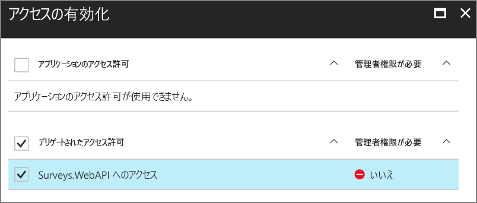
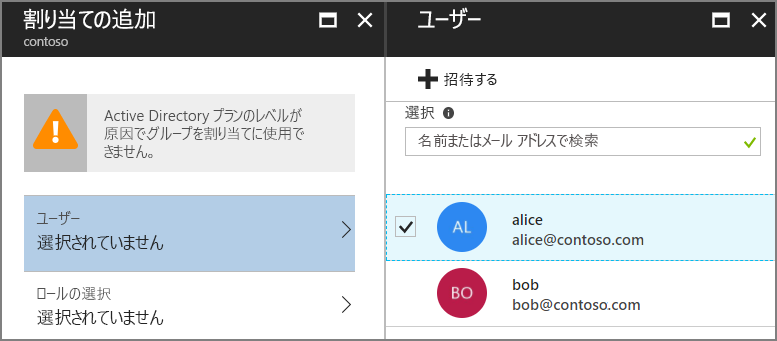
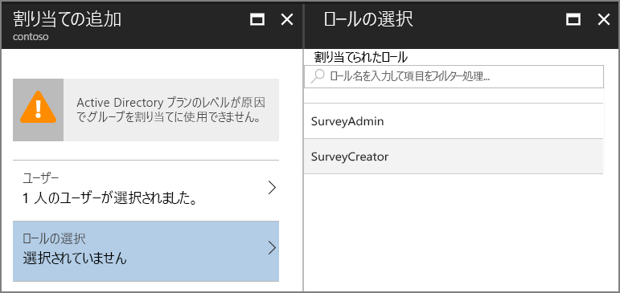
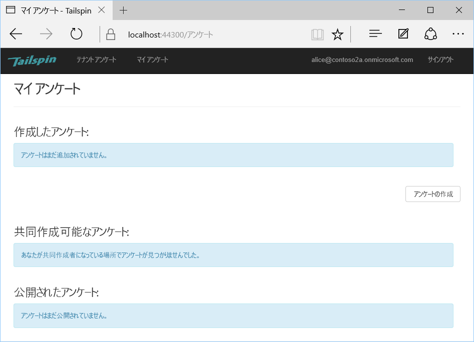

# <a name="run-the-surveys-application"></a>Surveys アプリケーションの実行

この記事では、[Tailspin Surveys](./tailspin.md) アプリケーションを Visual Studio からローカルで実行する方法について説明します。 この手順では、Azure にアプリケーションをデプロイしません。 ただし、Azure リソース (Azure Active Directory (Azure AD) ディレクトリと Redis Cache) を作成する必要があります。

手順の概要は次のとおりです。

1. 架空の Tailspin 社の Azure AD ディレクトリ (テナント) を作成する。
2. Azure AD に Surveys アプリケーションとバックエンドの Web API を登録する。
3. Azure Redis Cache インスタンスを作成する。
4. アプリケーション設定を構成し、ローカル データベースを作成する。
5. アプリケーションを実行し、新しいテナントをサインアップする。
6. ユーザーにアプリケーション ロールを追加する。

## <a name="prerequisites"></a>前提条件
-   [Visual Studio 2017][VS2017]
-   [Microsoft Azure](https://azure.microsoft.com) アカウント

## <a name="create-the-tailspin-tenant"></a>Tailspin テナントの作成

Tailspin は、Surveys アプリケーションをホストする架空の会社です。 Tailspin では、Azure AD を使用して他のテナントがアプリに登録できるようにしています。 登録後、これらの顧客は Azure AD 資格情報を使用してアプリにサインインできます。

この手順では、Tailspin 用の Azure AD ディレクトリを作成します。

1. [Azure Portal][portal] にサインインします。

2. **[新規]** > **[セキュリティ + ID]** > **[Azure Active Directory]** の順にクリックします。

3. 組織名に `Tailspin` を入力し、ドメイン名を入力します。 ドメイン名は `xxxx.onmicrosoft.com` の形式で指定し、グローバルで一意にする必要があります。 

    

4. **Create** をクリックしてください。 新しいディレクトリの作成には数分かかることがあります。

エンド ツー エンドのシナリオを完成させるには、アプリケーションにサインアップする顧客の名前の付いた 2 つ目の Azure AD ディレクトリが必要となります。 このためには、既定の Azure AD ディレクトリ (Tailspin 以外) を使用するか、新しいディレクトリを作成します。 この例では、架空の顧客として Contoso を使用します。

## <a name="register-the-surveys-web-api"></a>Surveys Web API の登録 

1. [Azure Portal][portal] で、ポータルの右上隅でご自分のアカウントを選択し、新しい Tailspin ディレクトリに移動します。

2. 左側のナビゲーション ウィンドウで、**[Azure Active Directory]** を選択します。 

3. **[アプリの登録]** > **[新しいアプリケーションの登録]** の順にクリックします。

4. **[作成]** ブレードで、次の情報を入力します。

   - **名前**: `Surveys.WebAPI`

   - **アプリケーションの種類**: `Web app / API`

   - **サインオン URL**: `https://localhost:44301/`
   
    

5. **Create** をクリックしてください。

6. **[アプリの登録]** ブレードで、新しい **Surveys Web API** アプリケーションを選択します。
 
7. **[プロパティ]** をクリックします。

8. **[アプリケーション ID/URI]** 編集ボックスに `https://<domain>/surveys.webapi` を入力します。`<domain>` はディレクトリのドメイン名です。 次に例を示します。`https://tailspin.onmicrosoft.com/surveys.webapi`

    

9. **[マルチ テナント]** を **[はい]** に設定します。

10. **[Save]** をクリックします。

## <a name="register-the-surveys-web-app"></a>Surveys Web アプリの登録 

1. **[アプリの登録]** ブレードに戻り、**[新しいアプリケーションの登録]** をクリックします。

2. **[作成]** ブレードで、次の情報を入力します。

   - **名前**: `Surveys`
   - **アプリケーションの種類**: `Web app / API`
   - **サインオン URL**: `https://localhost:44300/`
   
   サインオン URL のポート番号は、前の手順の `Surveys.WebAPI`アプリとは異なることに注意してください。

3. **Create** をクリックしてください。
 
4. **[アプリの登録]** ブレードで、新しい **Surveys** アプリケーションを選択します。
 
5. アプリケーション ID をコピーします。 この情報は後で必要になります。

    

6. **[プロパティ]** をクリックします。

7. **[アプリケーション ID/URI]** 編集ボックスに `https://<domain>/surveys` を入力します。`<domain>` はディレクトリのドメイン名です。 

    ![[設定]](./images/running-the-app/settings.png)

8. **[マルチ テナント]** を **[はい]** に設定します。

9. **[Save]** をクリックします。

10. **[設定]** ブレードで **[応答 URL]** をクリックします。
 
11. 応答 URL `https://localhost:44300/signin-oidc` を追加します。

12. **[Save]** をクリックします。

13. **[API アクセス]** の下の **[キー]** をクリックします。

14. `client secret` などの説明を入力します。

15. **[時間の選択]** ドロップダウンで、**[1 年間]** を選択します。 

16. **[Save]** をクリックします。 保存すると、キーが生成されます。

17. このブレードから移動する前にキーの値をコピーします。

    > [!NOTE] 
    > このブレードから移動すると、キーは再度表示されません。 

18. **[API アクセス]** の下の、**[必要なアクセス許可]** をクリックします。

19. **[追加]** > **[API を選択します]** の順にクリックします。

20. 検索ボックスで、`Surveys.WebAPI` を検索します。

    

21. `Surveys.WebAPI` を選択して **[選択]** をクリックします。

22. **[委任されたアクセス許可]** の下の **[Access Surveys.WebAPI]\(Surveys Web API にアクセス\)** をオンにします。

    

23. **[選択]** > **[完了]** の順にクリックします。


## <a name="update-the-application-manifests"></a>アプリケーション マニフェストの更新

1. `Surveys.WebAPI`アプリの **[設定]** ブレードに戻ります。

2. **[マニフェスト]** > **[編集]** の順にクリックします。

    
 
3. 次の JSON を `appRoles` 要素に追加します。 `id` プロパティの新しい GUID を生成します。

   ```json
   {
     "allowedMemberTypes": ["User"],
     "description": "Creators can create surveys",
     "displayName": "SurveyCreator",
     "id": "<Generate a new GUID. Example: 1b4f816e-5eaf-48b9-8613-7923830595ad>",
     "isEnabled": true,
     "value": "SurveyCreator"
   },
   {
     "allowedMemberTypes": ["User"],
     "description": "Administrators can manage the surveys in their tenant",
     "displayName": "SurveyAdmin",
     "id": "<Generate a new GUID>",  
     "isEnabled": true,
     "value": "SurveyAdmin"
   }
   ```

4. `knownClientApplications` プロパティに、以前の Surveys アプリケーション登録時に取得した、Surveys Web アプリケーションのアプリケーション ID を追加します。 For example:

   ```json
   "knownClientApplications": ["be2cea23-aa0e-4e98-8b21-2963d494912e"],
   ```

   この設定により、Web API の呼び出しが承認されたクライアントの一覧に Surveys アプリが追加されます。

5. **[Save]** をクリックします。

ここで Surveys アプリ向けに同じ手順を繰り返しますが、`knownClientApplications` のエントリは追加しません。 同じロールの定義を使用しますが、ID の GUID は新しく生成します。

## <a name="create-a-new-redis-cache-instance"></a>新しい Redis Cache インスタンスの作成

Surveys アプリケーションは Redis を使用して、OAuth 2 アクセス トークンをキャッシュします。 キャッシュを作成するには、以下のようにします。

1.  [Azure Portal](https://portal.azure.com) に移動して **[新規]** > **[データベース]** > **[Redis Cache]** の順にクリックします。

2.  DNS 名、リソース グループ、場所、価格レベルなどの必要な情報を入力します。 新しいリソース グループを作成するか、既存のリソース グループを使用できます。

3. **Create** をクリックしてください。

4. Redis Cache が作成されたら、ポータルのリソースに移動します。

5. **[アクセス キー]** をクリックして主キーをコピーします。

Redis Cache の作成の詳細については、「[Azure Redis Cache の使用方法](/azure/redis-cache/cache-dotnet-how-to-use-azure-redis-cache)」をご覧ください。

## <a name="set-application-secrets"></a>アプリケーション シークレットの設定

1.  Visual Studio で Tailspin Surveys ソリューションを開きます。

2.  ソリューション エクスプローラーで Tailspin.Surveys.Web プロジェクトを右クリックし、 **[ユーザー シークレットの管理]** を選択します。

3.  secrets.json ファイルに、次を貼り付けます。
    
    ```json
    {
      "AzureAd": {
        "ClientId": "<Surveys application ID>",
        "ClientSecret": "<Surveys app client secret>",
        "PostLogoutRedirectUri": "https://localhost:44300/",
        "WebApiResourceId": "<Surveys.WebAPI app ID URI>"
      },
      "Redis": {
        "Configuration": "<Redis DNS name>.redis.cache.windows.net,password=<Redis primary key>,ssl=true"
      }
    }
    ```
   
    山かっこ内に表示される項目を次のように置き換えます。

    - `AzureAd:ClientId`: Surveys アプリのアプリケーション ID。
    - `AzureAd:ClientSecret`: Azure AD で Surveys アプリケーションを登録したときに生成したキー。
    - `AzureAd:WebApiResourceId`: Azure AD で Surveys.WebAPI アプリケーションの作成時に指定したアプリ ID URI。 この URI の形式は `https://<directory>.onmicrosoft.com/surveys.webapi` です。
    - `Redis:Configuration`: Redis Cache の DNS 名とプライマリ アクセス キーからこの文字列を作成します。 たとえば、"tailspin.redis.cache.windows.net,password=2h5tBxxx,ssl=true" とします。

4.  更新した secrets.json ファイルを保存します。

5.  Tailspin.Surveys.WebAPI プロジェクト向けにこの手順を繰り返しますが、secrets.json に以下を貼り付けます。 山かっこ内の項目を前と同じように置き換えます。

    ```json
    {
      "AzureAd": {
        "WebApiResourceId": "<Surveys.WebAPI app ID URI>"
      },
      "Redis": {
        "Configuration": "<Redis DNS name>.redis.cache.windows.net,password=<Redis primary key>,ssl=true"
      }
    }
    ```

## <a name="initialize-the-database"></a>データベースの初期化

この手順では、Entity Framework 7 を使用して、LocalDB を使ってローカルの SQL データベースを作成します。

1.  コマンド ウィンドウを開く

2.  Tailspin.Surveys.Data プロジェクトに移動します。

3.  次のコマンドを実行します。

    ```
    dotnet ef database update --startup-project ..\Tailspin.Surveys.Web
    ```
    
## <a name="run-the-application"></a>アプリケーションの実行

アプリケーションを実行するには、Tailspin.Surveys.Web と Tailspin.Surveys.WebAPI の両方のプロジェクトを起動します。

次のように F5 キーを押すと、Visual Studio で両方のプロジェクトが自動的に実行されるように設定できます。

1.  ソリューション エクスプローラーで、ソリューションを右クリックして **[スタートアップ プロジェクトの設定]** をクリックします。
2.  **[マルチ スタートアップ プロジェクト]** を選択します。
3.  Tailspin.Surveys.Web と Tailspin.Surveys.WebAPI の両プロジェクトで、**[アクション]** = **[開始]** に設定します。

## <a name="sign-up-a-new-tenant"></a>新しいテナントのサインアップ

アプリケーションの起動時にサインインしていないため、次のようなウェルカム ページが表示されます。


組織にサインアップするには、以下を実行します。

1. **[Enroll your company in Tailspin]\(Tailspin に自社を登録する\)** をクリックします。
2. Surveys アプリを使用して、組織の名前の付いた Azure AD ディレクトリにサインインします。 管理者ユーザーとしてサインインする必要があります。
3. 同意プロンプトを受け入れます。

Surveys アプリケーションがテナントを登録し、お客様はサインアウトされます。このアプリによってお客様がサインアウトされるのは、アプリケーションを使用する前に、Azure AD でアプリケーション ロールを設定する必要があるためです。


## <a name="assign-application-roles"></a>アプリケーション ロールの割り当て

テナントがサインアップしたら、テナントの AD 管理者がユーザーにアプリケーション ロールを割り当てる必要があります。


1. [Azure Portal][portal] で、Surveys アプリケーションのサインアップに使用した Azure AD ディレクトリに移動します。 

2. 左側のナビゲーション ウィンドウで、**[Azure Active Directory]** を選択します。 

3. **[エンタープライズ アプリケーション]** > **[すべてのアプリケーション]** の順にクリックします。 ポータルに `Survey` と `Survey.WebAPI` が一覧表示されます。 表示されない場合は、サインアップ プロセスが完了していることを確認してください。

4.  Surveys アプリケーションをクリックします。

5.  **[ユーザーとグループ]** をクリックします。

4.  **[ユーザーの追加]** をクリックします。

5.  Azure AD Premium を使用する場合は、**[ユーザーとグループ]** をクリックします。 それ以外の場合は、**[ユーザー]**.をクリックします。 (グループにロールを割り当てるには Azure AD Premium が必要です。)

6. 1 人以上のユーザーを選択して、**[選択]** をクリックします。

    

6.  ロールを選択して **[選択]** をクリックします。

    

7.  **[割り当て]** をクリックします。

同じ手順を繰り返して、Survey Web API アプリケーションのロールを割り当てます。

> 重要: ユーザーは Survey と Survey.WebAPI の両方で常に同じロールである必要があります。 同じロールでないと、ユーザーのアクセス許可の一貫性が失われ、Web API の 403 (アクセス不可) エラーが発生する場合があります。

ここでアプリに戻って、もう一度サインインします。 **[My Surveys]\(マイ アンケート\)** をクリックします。 ユーザーに SurveyAdmin または SurveyCreator のロールが割り当てられていれば、ユーザーが新しいアンケートを作成するためのアクセス許可を持っていることを示す **[アンケートの作成]** ボタンが表示されます。




<!-- links -->

[portal]: https://portal.azure.com
[VS2017]: https://www.visualstudio.com/vs/
