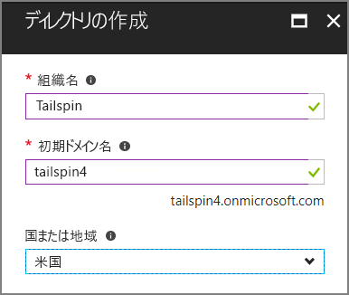
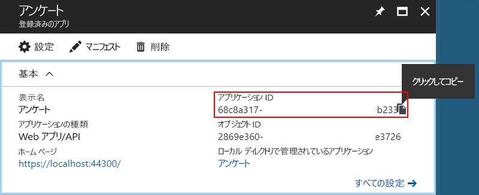
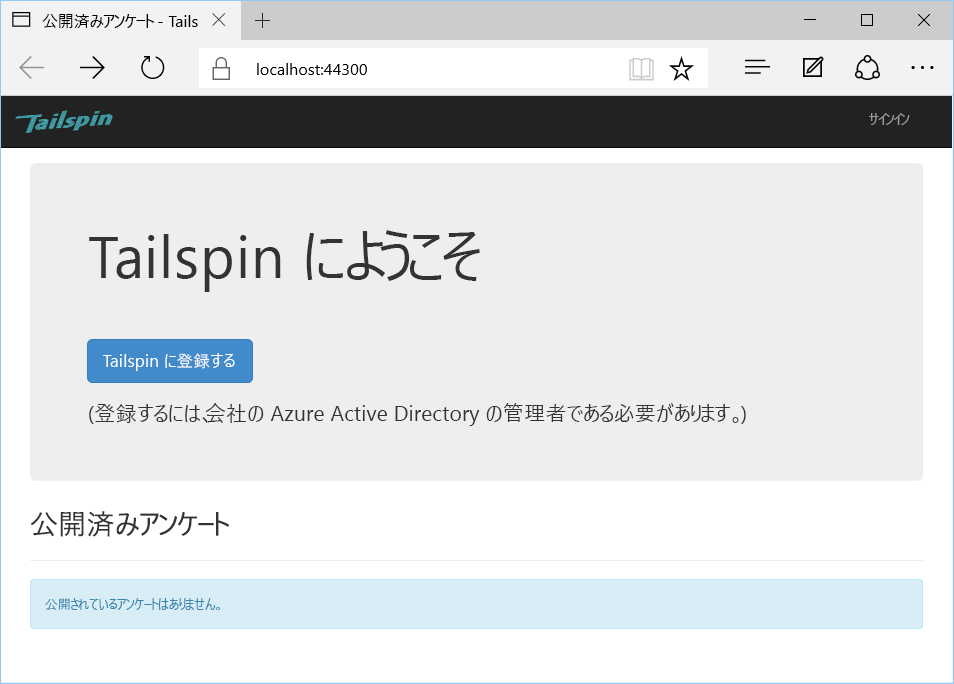

# <a name="run-the-surveys-application"></a><span data-ttu-id="d0e0c-103">Surveys アプリケーションの実行</span><span class="sxs-lookup"><span data-stu-id="d0e0c-103">Run the Surveys application</span></span>

<span data-ttu-id="d0e0c-104">この記事では、[Tailspin Surveys](./tailspin.md) アプリケーションを Visual Studio からローカルで実行する方法について説明します。</span><span class="sxs-lookup"><span data-stu-id="d0e0c-104">This article describes how to run the [Tailspin Surveys](./tailspin.md) application locally, from Visual Studio.</span></span> <span data-ttu-id="d0e0c-105">この手順では、Azure にアプリケーションをデプロイしません。</span><span class="sxs-lookup"><span data-stu-id="d0e0c-105">In these steps, you won't deploy the application to Azure.</span></span> <span data-ttu-id="d0e0c-106">ただし、Azure リソース (Azure Active Directory (Azure AD) ディレクトリと Redis Cache) を作成する必要があります。</span><span class="sxs-lookup"><span data-stu-id="d0e0c-106">However, you will need to create some Azure resources &mdash; an Azure Active Directory (Azure AD) directory and a Redis cache.</span></span>

<span data-ttu-id="d0e0c-107">手順の概要は次のとおりです。</span><span class="sxs-lookup"><span data-stu-id="d0e0c-107">Here is a summary of the steps:</span></span>

1. <span data-ttu-id="d0e0c-108">架空の Tailspin 社の Azure AD ディレクトリ (テナント) を作成する。</span><span class="sxs-lookup"><span data-stu-id="d0e0c-108">Create an Azure AD directory (tenant) for the fictitious Tailspin company.</span></span>
2. <span data-ttu-id="d0e0c-109">Azure AD に Surveys アプリケーションとバックエンドの Web API を登録する。</span><span class="sxs-lookup"><span data-stu-id="d0e0c-109">Register the Surveys application and the backend web API with Azure AD.</span></span>
3. <span data-ttu-id="d0e0c-110">Azure Redis Cache インスタンスを作成する。</span><span class="sxs-lookup"><span data-stu-id="d0e0c-110">Create an Azure Redis Cache instance.</span></span>
4. <span data-ttu-id="d0e0c-111">アプリケーション設定を構成し、ローカル データベースを作成する。</span><span class="sxs-lookup"><span data-stu-id="d0e0c-111">Configure application settings and create a local database.</span></span>
5. <span data-ttu-id="d0e0c-112">アプリケーションを実行し、新しいテナントをサインアップする。</span><span class="sxs-lookup"><span data-stu-id="d0e0c-112">Run the application and sign up a new tenant.</span></span>
6. <span data-ttu-id="d0e0c-113">ユーザーにアプリケーション ロールを追加する。</span><span class="sxs-lookup"><span data-stu-id="d0e0c-113">Add application roles to users.</span></span>

## <a name="prerequisites"></a><span data-ttu-id="d0e0c-114">前提条件</span><span class="sxs-lookup"><span data-stu-id="d0e0c-114">Prerequisites</span></span>
-   <span data-ttu-id="d0e0c-115">[Visual Studio 2017][VS2017]</span><span class="sxs-lookup"><span data-stu-id="d0e0c-115">[Visual Studio 2017][VS2017]</span></span>
-   <span data-ttu-id="d0e0c-116">[Microsoft Azure](https://azure.microsoft.com) アカウント</span><span class="sxs-lookup"><span data-stu-id="d0e0c-116">[Microsoft Azure](https://azure.microsoft.com) account</span></span>

## <a name="create-the-tailspin-tenant"></a><span data-ttu-id="d0e0c-117">Tailspin テナントの作成</span><span class="sxs-lookup"><span data-stu-id="d0e0c-117">Create the Tailspin tenant</span></span>

<span data-ttu-id="d0e0c-118">Tailspin は、Surveys アプリケーションをホストする架空の会社です。</span><span class="sxs-lookup"><span data-stu-id="d0e0c-118">Tailspin is the fictitious company that hosts the Surveys application.</span></span> <span data-ttu-id="d0e0c-119">Tailspin では、Azure AD を使用して他のテナントがアプリに登録できるようにしています。</span><span class="sxs-lookup"><span data-stu-id="d0e0c-119">Tailspin uses Azure AD to enable other tenants to register with the app.</span></span> <span data-ttu-id="d0e0c-120">登録後、これらの顧客は Azure AD 資格情報を使用してアプリにサインインできます。</span><span class="sxs-lookup"><span data-stu-id="d0e0c-120">Those customers can then use their Azure AD credentials to sign into the app.</span></span>

<span data-ttu-id="d0e0c-121">この手順では、Tailspin 用の Azure AD ディレクトリを作成します。</span><span class="sxs-lookup"><span data-stu-id="d0e0c-121">In this step, you'll create an Azure AD directory for Tailspin.</span></span>

1. <span data-ttu-id="d0e0c-122">[Azure Portal][portal] にサインインします。</span><span class="sxs-lookup"><span data-stu-id="d0e0c-122">Sign into the [Azure portal][portal].</span></span>

2. <span data-ttu-id="d0e0c-123">**[+ リソースの作成]** > **[Identity]** > **[Azure Active Directory]** の順にクリックします。</span><span class="sxs-lookup"><span data-stu-id="d0e0c-123">Click **+ Create a Resource** > **Identity** > **Azure Active Directory**.</span></span>

3. <span data-ttu-id="d0e0c-124">組織名に `Tailspin` を入力し、ドメイン名を入力します。</span><span class="sxs-lookup"><span data-stu-id="d0e0c-124">Enter `Tailspin` for the organization name, and enter a domain name.</span></span> <span data-ttu-id="d0e0c-125">ドメイン名は `xxxx.onmicrosoft.com` の形式で指定し、グローバルで一意にする必要があります。</span><span class="sxs-lookup"><span data-stu-id="d0e0c-125">The domain name will have the form `xxxx.onmicrosoft.com` and must be globally unique.</span></span> 

    

4. <span data-ttu-id="d0e0c-126">**Create** をクリックしてください。</span><span class="sxs-lookup"><span data-stu-id="d0e0c-126">Click **Create**.</span></span> <span data-ttu-id="d0e0c-127">新しいディレクトリの作成には数分かかることがあります。</span><span class="sxs-lookup"><span data-stu-id="d0e0c-127">It may take a few minutes to create the new directory.</span></span>

<span data-ttu-id="d0e0c-128">エンド ツー エンドのシナリオを完成させるには、アプリケーションにサインアップする顧客の名前の付いた 2 つ目の Azure AD ディレクトリが必要となります。</span><span class="sxs-lookup"><span data-stu-id="d0e0c-128">To complete the end-to-end scenario, you'll need a second Azure AD directory to represent a customer that signs up for the application.</span></span> <span data-ttu-id="d0e0c-129">このためには、既定の Azure AD ディレクトリ (Tailspin 以外) を使用するか、新しいディレクトリを作成します。</span><span class="sxs-lookup"><span data-stu-id="d0e0c-129">You can use your default Azure AD directory (not Tailspin), or create a new directory for this purpose.</span></span> <span data-ttu-id="d0e0c-130">この例では、架空の顧客として Contoso を使用します。</span><span class="sxs-lookup"><span data-stu-id="d0e0c-130">In the examples, we use Contoso as the fictitious customer.</span></span>

## <a name="register-the-surveys-web-api"></a><span data-ttu-id="d0e0c-131">Surveys Web API の登録</span><span class="sxs-lookup"><span data-stu-id="d0e0c-131">Register the Surveys web API</span></span> 

1. <span data-ttu-id="d0e0c-132">[Azure Portal][portal] で、ポータルの右上隅でご自分のアカウントを選択し、新しい Tailspin ディレクトリに移動します。</span><span class="sxs-lookup"><span data-stu-id="d0e0c-132">In the [Azure portal][portal], switch to the new Tailspin directory by selecting your account in the top right corner of the portal.</span></span>

2. <span data-ttu-id="d0e0c-133">左側のナビゲーション ウィンドウで、**[Azure Active Directory]** を選択します。</span><span class="sxs-lookup"><span data-stu-id="d0e0c-133">In the left-hand navigation pane, choose **Azure Active Directory**.</span></span> 

3. <span data-ttu-id="d0e0c-134">**[アプリの登録]** > **[新しいアプリケーションの登録]** の順にクリックします。</span><span class="sxs-lookup"><span data-stu-id="d0e0c-134">Click **App registrations** > **New application registration**.</span></span>

4. <span data-ttu-id="d0e0c-135">**[作成]** ブレードで、次の情報を入力します。</span><span class="sxs-lookup"><span data-stu-id="d0e0c-135">In the **Create** blade, enter the following information:</span></span>

   - <span data-ttu-id="d0e0c-136">**名前**: `Surveys.WebAPI`</span><span class="sxs-lookup"><span data-stu-id="d0e0c-136">**Name**: `Surveys.WebAPI`</span></span>

   - <span data-ttu-id="d0e0c-137">**アプリケーションの種類**: `Web app / API`</span><span class="sxs-lookup"><span data-stu-id="d0e0c-137">**Application type**: `Web app / API`</span></span>

   - <span data-ttu-id="d0e0c-138">**サインオン URL**: `https://localhost:44301/`</span><span class="sxs-lookup"><span data-stu-id="d0e0c-138">**Sign-on URL**: `https://localhost:44301/`</span></span>
   
    

5. <span data-ttu-id="d0e0c-139">**Create** をクリックしてください。</span><span class="sxs-lookup"><span data-stu-id="d0e0c-139">Click **Create**.</span></span>

6. <span data-ttu-id="d0e0c-140">**[アプリの登録]** ブレードで、新しい **Surveys Web API** アプリケーションを選択します。</span><span class="sxs-lookup"><span data-stu-id="d0e0c-140">In the **App registrations** blade, select the new **Surveys.WebAPI** application.</span></span>
 
7. <span data-ttu-id="d0e0c-141">**[設定]** > **[プロパティ]** の順にクリックします。</span><span class="sxs-lookup"><span data-stu-id="d0e0c-141">Click **Settings** > **Properties**.</span></span>

8. <span data-ttu-id="d0e0c-142">**[アプリケーション ID/URI]** 編集ボックスに `https://<domain>/surveys.webapi` を入力します。`<domain>` はディレクトリのドメイン名です。</span><span class="sxs-lookup"><span data-stu-id="d0e0c-142">In the **App ID URI** edit box, enter `https://<domain>/surveys.webapi`, where `<domain>` is the domain name of the directory.</span></span> <span data-ttu-id="d0e0c-143">次に例を示します。`https://tailspin.onmicrosoft.com/surveys.webapi`</span><span class="sxs-lookup"><span data-stu-id="d0e0c-143">For example: `https://tailspin.onmicrosoft.com/surveys.webapi`</span></span>

    

9. <span data-ttu-id="d0e0c-145">**[マルチ テナント]** を **[はい]** に設定します。</span><span class="sxs-lookup"><span data-stu-id="d0e0c-145">Set **Multi-tenanted** to **YES**.</span></span>

10. <span data-ttu-id="d0e0c-146">**[Save]** をクリックします。</span><span class="sxs-lookup"><span data-stu-id="d0e0c-146">Click **Save**.</span></span>

## <a name="register-the-surveys-web-app"></a><span data-ttu-id="d0e0c-147">Surveys Web アプリの登録</span><span class="sxs-lookup"><span data-stu-id="d0e0c-147">Register the Surveys web app</span></span> 

1. <span data-ttu-id="d0e0c-148">**[アプリの登録]** ブレードに戻り、**[新しいアプリケーションの登録]** をクリックします。</span><span class="sxs-lookup"><span data-stu-id="d0e0c-148">Navigate back to the **App registrations** blade, and click **New application registration**.</span></span>

2. <span data-ttu-id="d0e0c-149">**[作成]** ブレードで、次の情報を入力します。</span><span class="sxs-lookup"><span data-stu-id="d0e0c-149">In the **Create** blade, enter the following information:</span></span>

   - <span data-ttu-id="d0e0c-150">**名前**: `Surveys`</span><span class="sxs-lookup"><span data-stu-id="d0e0c-150">**Name**: `Surveys`</span></span>
   - <span data-ttu-id="d0e0c-151">**アプリケーションの種類**: `Web app / API`</span><span class="sxs-lookup"><span data-stu-id="d0e0c-151">**Application type**: `Web app / API`</span></span>
   - <span data-ttu-id="d0e0c-152">**サインオン URL**: `https://localhost:44300/`</span><span class="sxs-lookup"><span data-stu-id="d0e0c-152">**Sign-on URL**: `https://localhost:44300/`</span></span>
   
   <span data-ttu-id="d0e0c-153">サインオン URL のポート番号は、前の手順の `Surveys.WebAPI`アプリとは異なることに注意してください。</span><span class="sxs-lookup"><span data-stu-id="d0e0c-153">Notice that the sign-on URL has a different port number from the `Surveys.WebAPI` app in the previous step.</span></span>

3. <span data-ttu-id="d0e0c-154">**Create** をクリックしてください。</span><span class="sxs-lookup"><span data-stu-id="d0e0c-154">Click **Create**.</span></span>
 
4. <span data-ttu-id="d0e0c-155">**[アプリの登録]** ブレードで、新しい **Surveys** アプリケーションを選択します。</span><span class="sxs-lookup"><span data-stu-id="d0e0c-155">In the **App registrations** blade, select the new **Surveys** application.</span></span>
 
5. <span data-ttu-id="d0e0c-156">アプリケーション ID をコピーします。</span><span class="sxs-lookup"><span data-stu-id="d0e0c-156">Copy the application ID.</span></span> <span data-ttu-id="d0e0c-157">この情報は後で必要になります。</span><span class="sxs-lookup"><span data-stu-id="d0e0c-157">You will need this later.</span></span>

    

6. <span data-ttu-id="d0e0c-158">**[プロパティ]** をクリックします。</span><span class="sxs-lookup"><span data-stu-id="d0e0c-158">Click **Properties**.</span></span>

7. <span data-ttu-id="d0e0c-159">**[アプリケーション ID/URI]** 編集ボックスに `https://<domain>/surveys` を入力します。`<domain>` はディレクトリのドメイン名です。</span><span class="sxs-lookup"><span data-stu-id="d0e0c-159">In the **App ID URI** edit box, enter `https://<domain>/surveys`, where `<domain>` is the domain name of the directory.</span></span> 

    ![[設定]](./images/running-the-app/settings.png)

8. <span data-ttu-id="d0e0c-161">**[マルチ テナント]** を **[はい]** に設定します。</span><span class="sxs-lookup"><span data-stu-id="d0e0c-161">Set **Multi-tenanted** to **YES**.</span></span>

9. <span data-ttu-id="d0e0c-162">**[Save]** をクリックします。</span><span class="sxs-lookup"><span data-stu-id="d0e0c-162">Click **Save**.</span></span>

10. <span data-ttu-id="d0e0c-163">**[設定]** ブレードで **[応答 URL]** をクリックします。</span><span class="sxs-lookup"><span data-stu-id="d0e0c-163">In the **Settings** blade, click **Reply URLs**.</span></span>
 
11. <span data-ttu-id="d0e0c-164">応答 URL `https://localhost:44300/signin-oidc` を追加します。</span><span class="sxs-lookup"><span data-stu-id="d0e0c-164">Add the following reply URL: `https://localhost:44300/signin-oidc`.</span></span>

12. <span data-ttu-id="d0e0c-165">**[Save]** をクリックします。</span><span class="sxs-lookup"><span data-stu-id="d0e0c-165">Click **Save**.</span></span>

13. <span data-ttu-id="d0e0c-166">**[API アクセス]** の下の **[キー]** をクリックします。</span><span class="sxs-lookup"><span data-stu-id="d0e0c-166">Under **API ACCESS**, click **Keys**.</span></span>

14. <span data-ttu-id="d0e0c-167">`client secret` などの説明を入力します。</span><span class="sxs-lookup"><span data-stu-id="d0e0c-167">Enter a description, such as `client secret`.</span></span>

15. <span data-ttu-id="d0e0c-168">**[時間の選択]** ドロップダウンで、**[1 年間]** を選択します。</span><span class="sxs-lookup"><span data-stu-id="d0e0c-168">In the **Select Duration** dropdown, select **1 year**.</span></span> 

16. <span data-ttu-id="d0e0c-169">**[Save]** をクリックします。</span><span class="sxs-lookup"><span data-stu-id="d0e0c-169">Click **Save**.</span></span> <span data-ttu-id="d0e0c-170">保存すると、キーが生成されます。</span><span class="sxs-lookup"><span data-stu-id="d0e0c-170">The key will be generated when you save.</span></span>

17. <span data-ttu-id="d0e0c-171">このブレードから移動する前にキーの値をコピーします。</span><span class="sxs-lookup"><span data-stu-id="d0e0c-171">Before you navigate away from this blade, copy the value of the key.</span></span>

    > [!NOTE] 
    > <span data-ttu-id="d0e0c-172">このブレードから移動すると、キーは再度表示されません。</span><span class="sxs-lookup"><span data-stu-id="d0e0c-172">The key won't be visible again after you navigate away from the blade.</span></span> 

18. <span data-ttu-id="d0e0c-173">**[API アクセス]** の下の、**[必要なアクセス許可]** をクリックします。</span><span class="sxs-lookup"><span data-stu-id="d0e0c-173">Under **API ACCESS**, click **Required permissions**.</span></span>

19. <span data-ttu-id="d0e0c-174">**[追加]** > **[API を選択します]** の順にクリックします。</span><span class="sxs-lookup"><span data-stu-id="d0e0c-174">Click **Add** > **Select an API**.</span></span>

20. <span data-ttu-id="d0e0c-175">検索ボックスで、`Surveys.WebAPI` を検索します。</span><span class="sxs-lookup"><span data-stu-id="d0e0c-175">In the search box, search for `Surveys.WebAPI`.</span></span>

    

21. <span data-ttu-id="d0e0c-177">`Surveys.WebAPI` を選択して **[選択]** をクリックします。</span><span class="sxs-lookup"><span data-stu-id="d0e0c-177">Select `Surveys.WebAPI` and click **Select**.</span></span>

22. <span data-ttu-id="d0e0c-178">**[委任されたアクセス許可]** の下の **[Access Surveys.WebAPI]\(Surveys Web API にアクセス\)** をオンにします。</span><span class="sxs-lookup"><span data-stu-id="d0e0c-178">Under **Delegated Permissions**, check **Access Surveys.WebAPI**.</span></span>

    

23. <span data-ttu-id="d0e0c-180">**[選択]** > **[完了]** の順にクリックします。</span><span class="sxs-lookup"><span data-stu-id="d0e0c-180">Click **Select** > **Done**.</span></span>


## <a name="update-the-application-manifests"></a><span data-ttu-id="d0e0c-181">アプリケーション マニフェストの更新</span><span class="sxs-lookup"><span data-stu-id="d0e0c-181">Update the application manifests</span></span>

1. <span data-ttu-id="d0e0c-182">`Surveys.WebAPI`アプリの **[設定]** ブレードに戻ります。</span><span class="sxs-lookup"><span data-stu-id="d0e0c-182">Navigate back to the **Settings** blade for the `Surveys.WebAPI` app.</span></span>

2. <span data-ttu-id="d0e0c-183">**[マニフェスト]** > **[編集]** の順にクリックします。</span><span class="sxs-lookup"><span data-stu-id="d0e0c-183">Click **Manifest** > **Edit**.</span></span>

    
 
3. <span data-ttu-id="d0e0c-184">次の JSON を `appRoles` 要素に追加します。</span><span class="sxs-lookup"><span data-stu-id="d0e0c-184">Add the following JSON to the `appRoles` element.</span></span> <span data-ttu-id="d0e0c-185">`id` プロパティの新しい GUID を生成します。</span><span class="sxs-lookup"><span data-stu-id="d0e0c-185">Generate new GUIDs for the `id` properties.</span></span>

   ```json
   {
     "allowedMemberTypes": ["User"],
     "description": "Creators can create surveys",
     "displayName": "SurveyCreator",
     "id": "<Generate a new GUID. Example: 1b4f816e-5eaf-48b9-8613-7923830595ad>",
     "isEnabled": true,
     "value": "SurveyCreator"
   },
   {
     "allowedMemberTypes": ["User"],
     "description": "Administrators can manage the surveys in their tenant",
     "displayName": "SurveyAdmin",
     "id": "<Generate a new GUID>",  
     "isEnabled": true,
     "value": "SurveyAdmin"
   }
   ```

4. <span data-ttu-id="d0e0c-186">`knownClientApplications` プロパティに、以前の Surveys アプリケーション登録時に取得した、Surveys Web アプリケーションのアプリケーション ID を追加します。</span><span class="sxs-lookup"><span data-stu-id="d0e0c-186">In the `knownClientApplications` property, add the application ID for the Surveys web application, which you got when you registered the Surveys application earlier.</span></span> <span data-ttu-id="d0e0c-187">For example:</span><span class="sxs-lookup"><span data-stu-id="d0e0c-187">For example:</span></span>

   ```json
   "knownClientApplications": ["be2cea23-aa0e-4e98-8b21-2963d494912e"],
   ```

   <span data-ttu-id="d0e0c-188">この設定により、Web API の呼び出しが承認されたクライアントの一覧に Surveys アプリが追加されます。</span><span class="sxs-lookup"><span data-stu-id="d0e0c-188">This setting adds the Surveys app to the list of clients authorized to call the web API.</span></span>

5. <span data-ttu-id="d0e0c-189">**[Save]** をクリックします。</span><span class="sxs-lookup"><span data-stu-id="d0e0c-189">Click **Save**.</span></span>

<span data-ttu-id="d0e0c-190">ここで Surveys アプリ向けに同じ手順を繰り返しますが、`knownClientApplications` のエントリは追加しません。</span><span class="sxs-lookup"><span data-stu-id="d0e0c-190">Now repeat the same steps for the Surveys app, except do not add an entry for `knownClientApplications`.</span></span> <span data-ttu-id="d0e0c-191">同じロールの定義を使用しますが、ID の GUID は新しく生成します。</span><span class="sxs-lookup"><span data-stu-id="d0e0c-191">Use the same role definitions, but generate new GUIDs for the IDs.</span></span>

## <a name="create-a-new-redis-cache-instance"></a><span data-ttu-id="d0e0c-192">新しい Redis Cache インスタンスの作成</span><span class="sxs-lookup"><span data-stu-id="d0e0c-192">Create a new Redis Cache instance</span></span>

<span data-ttu-id="d0e0c-193">Surveys アプリケーションは Redis を使用して、OAuth 2 アクセス トークンをキャッシュします。</span><span class="sxs-lookup"><span data-stu-id="d0e0c-193">The Surveys application uses Redis to cache OAuth 2 access tokens.</span></span> <span data-ttu-id="d0e0c-194">キャッシュを作成するには、以下のようにします。</span><span class="sxs-lookup"><span data-stu-id="d0e0c-194">To create the cache:</span></span>

1.  <span data-ttu-id="d0e0c-195">[Azure Portal](https://portal.azure.com) に移動して **[+ リソースの作成]** > **[データベース]** > **[Redis Cache]** の順にクリックします。</span><span class="sxs-lookup"><span data-stu-id="d0e0c-195">Go to [Azure Portal](https://portal.azure.com) and click **+ Create a Resource** > **Databases** > **Redis Cache**.</span></span>

2.  <span data-ttu-id="d0e0c-196">DNS 名、リソース グループ、場所、価格レベルなどの必要な情報を入力します。</span><span class="sxs-lookup"><span data-stu-id="d0e0c-196">Fill in the required information, including DNS name, resource group, location, and pricing tier.</span></span> <span data-ttu-id="d0e0c-197">新しいリソース グループを作成するか、既存のリソース グループを使用できます。</span><span class="sxs-lookup"><span data-stu-id="d0e0c-197">You can create a new resource group or use an existing resource group.</span></span>

3. <span data-ttu-id="d0e0c-198">**Create** をクリックしてください。</span><span class="sxs-lookup"><span data-stu-id="d0e0c-198">Click **Create**.</span></span>

4. <span data-ttu-id="d0e0c-199">Redis Cache が作成されたら、ポータルのリソースに移動します。</span><span class="sxs-lookup"><span data-stu-id="d0e0c-199">After the Redis cache is created, navigate to the resource in the portal.</span></span>

5. <span data-ttu-id="d0e0c-200">**[アクセス キー]** をクリックして主キーをコピーします。</span><span class="sxs-lookup"><span data-stu-id="d0e0c-200">Click **Access keys** and copy the primary key.</span></span>

<span data-ttu-id="d0e0c-201">Redis Cache の作成の詳細については、「[Azure Redis Cache の使用方法](/azure/redis-cache/cache-dotnet-how-to-use-azure-redis-cache)」をご覧ください。</span><span class="sxs-lookup"><span data-stu-id="d0e0c-201">For more information about creating a Redis cache, see [How to Use Azure Redis Cache](/azure/redis-cache/cache-dotnet-how-to-use-azure-redis-cache).</span></span>

## <a name="set-application-secrets"></a><span data-ttu-id="d0e0c-202">アプリケーション シークレットの設定</span><span class="sxs-lookup"><span data-stu-id="d0e0c-202">Set application secrets</span></span>

1.  <span data-ttu-id="d0e0c-203">Visual Studio で Tailspin Surveys ソリューションを開きます。</span><span class="sxs-lookup"><span data-stu-id="d0e0c-203">Open the Tailspin.Surveys solution in Visual Studio.</span></span>

2.  <span data-ttu-id="d0e0c-204">ソリューション エクスプローラーで Tailspin.Surveys.Web プロジェクトを右クリックし、 **[ユーザー シークレットの管理]** を選択します。</span><span class="sxs-lookup"><span data-stu-id="d0e0c-204">In Solution Explorer, right-click the Tailspin.Surveys.Web project and select **Manage User Secrets**.</span></span>

3.  <span data-ttu-id="d0e0c-205">secrets.json ファイルに、次を貼り付けます。</span><span class="sxs-lookup"><span data-stu-id="d0e0c-205">In the secrets.json file, paste in the following:</span></span>
    
    ```json
    {
      "AzureAd": {
        "ClientId": "<Surveys application ID>",
        "ClientSecret": "<Surveys app client secret>",
        "PostLogoutRedirectUri": "https://localhost:44300/",
        "WebApiResourceId": "<Surveys.WebAPI app ID URI>"
      },
      "Redis": {
        "Configuration": "<Redis DNS name>.redis.cache.windows.net,password=<Redis primary key>,ssl=true"
      }
    }
    ```
   
    <span data-ttu-id="d0e0c-206">山かっこ内に表示される項目を次のように置き換えます。</span><span class="sxs-lookup"><span data-stu-id="d0e0c-206">Replace the items shown in angle brackets, as follows:</span></span>

    - <span data-ttu-id="d0e0c-207">`AzureAd:ClientId`: Surveys アプリのアプリケーション ID。</span><span class="sxs-lookup"><span data-stu-id="d0e0c-207">`AzureAd:ClientId`: The application ID of the Surveys app.</span></span>
    - <span data-ttu-id="d0e0c-208">`AzureAd:ClientSecret`: Azure AD で Surveys アプリケーションを登録したときに生成したキー。</span><span class="sxs-lookup"><span data-stu-id="d0e0c-208">`AzureAd:ClientSecret`: The key that you generated when you registered the Surveys application in Azure AD.</span></span>
    - <span data-ttu-id="d0e0c-209">`AzureAd:WebApiResourceId`: Azure AD で Surveys.WebAPI アプリケーションの作成時に指定したアプリ ID URI。</span><span class="sxs-lookup"><span data-stu-id="d0e0c-209">`AzureAd:WebApiResourceId`: The App ID URI that you specified when you created the Surveys.WebAPI application in Azure AD.</span></span> <span data-ttu-id="d0e0c-210">この URI の形式は `https://<directory>.onmicrosoft.com/surveys.webapi` です。</span><span class="sxs-lookup"><span data-stu-id="d0e0c-210">It should have the form `https://<directory>.onmicrosoft.com/surveys.webapi`</span></span>
    - <span data-ttu-id="d0e0c-211">`Redis:Configuration`: Redis Cache の DNS 名とプライマリ アクセス キーからこの文字列を作成します。</span><span class="sxs-lookup"><span data-stu-id="d0e0c-211">`Redis:Configuration`: Build this string from the DNS name of the Redis cache and the primary access key.</span></span> <span data-ttu-id="d0e0c-212">たとえば、"tailspin.redis.cache.windows.net,password=2h5tBxxx,ssl=true" とします。</span><span class="sxs-lookup"><span data-stu-id="d0e0c-212">For example, "tailspin.redis.cache.windows.net,password=2h5tBxxx,ssl=true".</span></span>

4.  <span data-ttu-id="d0e0c-213">更新した secrets.json ファイルを保存します。</span><span class="sxs-lookup"><span data-stu-id="d0e0c-213">Save the updated secrets.json file.</span></span>

5.  <span data-ttu-id="d0e0c-214">Tailspin.Surveys.WebAPI プロジェクト向けにこの手順を繰り返しますが、secrets.json に以下を貼り付けます。</span><span class="sxs-lookup"><span data-stu-id="d0e0c-214">Repeat these steps for the Tailspin.Surveys.WebAPI project, but paste the following into secrets.json.</span></span> <span data-ttu-id="d0e0c-215">山かっこ内の項目を前と同じように置き換えます。</span><span class="sxs-lookup"><span data-stu-id="d0e0c-215">Replace the items in angle brackets, as before.</span></span>

    ```json
    {
      "AzureAd": {
        "WebApiResourceId": "<Surveys.WebAPI app ID URI>"
      },
      "Redis": {
        "Configuration": "<Redis DNS name>.redis.cache.windows.net,password=<Redis primary key>,ssl=true"
      }
    }
    ```

## <a name="initialize-the-database"></a><span data-ttu-id="d0e0c-216">データベースの初期化</span><span class="sxs-lookup"><span data-stu-id="d0e0c-216">Initialize the database</span></span>

<span data-ttu-id="d0e0c-217">この手順では、Entity Framework 7 を使用して、LocalDB を使ってローカルの SQL データベースを作成します。</span><span class="sxs-lookup"><span data-stu-id="d0e0c-217">In this step, you will use Entity Framework 7 to create a local SQL database, using LocalDB.</span></span>

1.  <span data-ttu-id="d0e0c-218">コマンド ウィンドウを開く</span><span class="sxs-lookup"><span data-stu-id="d0e0c-218">Open a command window</span></span>

2.  <span data-ttu-id="d0e0c-219">Tailspin.Surveys.Data プロジェクトに移動します。</span><span class="sxs-lookup"><span data-stu-id="d0e0c-219">Navigate to the Tailspin.Surveys.Data project.</span></span>

3.  <span data-ttu-id="d0e0c-220">次のコマンドを実行します。</span><span class="sxs-lookup"><span data-stu-id="d0e0c-220">Run the following command:</span></span>

    ```
    dotnet ef database update --startup-project ..\Tailspin.Surveys.Web
    ```
    
## <a name="run-the-application"></a><span data-ttu-id="d0e0c-221">アプリケーションの実行</span><span class="sxs-lookup"><span data-stu-id="d0e0c-221">Run the application</span></span>

<span data-ttu-id="d0e0c-222">アプリケーションを実行するには、Tailspin.Surveys.Web と Tailspin.Surveys.WebAPI の両方のプロジェクトを起動します。</span><span class="sxs-lookup"><span data-stu-id="d0e0c-222">To run the application, start both the Tailspin.Surveys.Web and Tailspin.Surveys.WebAPI projects.</span></span>

<span data-ttu-id="d0e0c-223">次のように F5 キーを押すと、Visual Studio で両方のプロジェクトが自動的に実行されるように設定できます。</span><span class="sxs-lookup"><span data-stu-id="d0e0c-223">You can set Visual Studio to run both projects automatically on F5, as follows:</span></span>

1.  <span data-ttu-id="d0e0c-224">ソリューション エクスプローラーで、ソリューションを右クリックして **[スタートアップ プロジェクトの設定]** をクリックします。</span><span class="sxs-lookup"><span data-stu-id="d0e0c-224">In Solution Explorer, right-click the solution and click **Set Startup Projects**.</span></span>
2.  <span data-ttu-id="d0e0c-225">**[マルチ スタートアップ プロジェクト]** を選択します。</span><span class="sxs-lookup"><span data-stu-id="d0e0c-225">Select **Multiple startup projects**.</span></span>
3.  <span data-ttu-id="d0e0c-226">Tailspin.Surveys.Web と Tailspin.Surveys.WebAPI の両プロジェクトで、**[アクション]** = **[開始]** に設定します。</span><span class="sxs-lookup"><span data-stu-id="d0e0c-226">Set **Action** = **Start** for the Tailspin.Surveys.Web and Tailspin.Surveys.WebAPI projects.</span></span>

## <a name="sign-up-a-new-tenant"></a><span data-ttu-id="d0e0c-227">新しいテナントのサインアップ</span><span class="sxs-lookup"><span data-stu-id="d0e0c-227">Sign up a new tenant</span></span>

<span data-ttu-id="d0e0c-228">アプリケーションの起動時にサインインしていないため、次のようなウェルカム ページが表示されます。</span><span class="sxs-lookup"><span data-stu-id="d0e0c-228">When the application starts, you are not signed in, so you see the welcome page:</span></span>



<span data-ttu-id="d0e0c-230">組織にサインアップするには、以下を実行します。</span><span class="sxs-lookup"><span data-stu-id="d0e0c-230">To sign up an organization:</span></span>

1. <span data-ttu-id="d0e0c-231">**[Enroll your company in Tailspin]\(Tailspin に自社を登録する\)** をクリックします。</span><span class="sxs-lookup"><span data-stu-id="d0e0c-231">Click **Enroll your company in Tailspin**.</span></span>
2. <span data-ttu-id="d0e0c-232">Surveys アプリを使用して、組織の名前の付いた Azure AD ディレクトリにサインインします。</span><span class="sxs-lookup"><span data-stu-id="d0e0c-232">Sign in to the Azure AD directory that represents the organization using the Surveys app.</span></span> <span data-ttu-id="d0e0c-233">管理者ユーザーとしてサインインする必要があります。</span><span class="sxs-lookup"><span data-stu-id="d0e0c-233">You must sign in as an admin user.</span></span>
3. <span data-ttu-id="d0e0c-234">同意プロンプトを受け入れます。</span><span class="sxs-lookup"><span data-stu-id="d0e0c-234">Accept the consent prompt.</span></span>

<span data-ttu-id="d0e0c-235">Surveys アプリケーションがテナントを登録し、お客様はサインアウトされます。このアプリによってお客様がサインアウトされるのは、アプリケーションを使用する前に、Azure AD でアプリケーション ロールを設定する必要があるためです。</span><span class="sxs-lookup"><span data-stu-id="d0e0c-235">The application registers the tenant, and then signs you out. The app signs you out because you need to set up the application roles in Azure AD, before using the application.</span></span>


## <a name="assign-application-roles"></a><span data-ttu-id="d0e0c-237">アプリケーション ロールの割り当て</span><span class="sxs-lookup"><span data-stu-id="d0e0c-237">Assign application roles</span></span>

<span data-ttu-id="d0e0c-238">テナントがサインアップしたら、テナントの AD 管理者がユーザーにアプリケーション ロールを割り当てる必要があります。</span><span class="sxs-lookup"><span data-stu-id="d0e0c-238">When a tenant signs up, an AD admin for the tenant must assign application roles to users.</span></span>


1. <span data-ttu-id="d0e0c-239">[Azure Portal][portal] で、Surveys アプリケーションのサインアップに使用した Azure AD ディレクトリに移動します。</span><span class="sxs-lookup"><span data-stu-id="d0e0c-239">In the [Azure portal][portal], switch to the Azure AD directory that you used to sign up for the Surveys app.</span></span> 

2. <span data-ttu-id="d0e0c-240">左側のナビゲーション ウィンドウで、**[Azure Active Directory]** を選択します。</span><span class="sxs-lookup"><span data-stu-id="d0e0c-240">In the left-hand navigation pane, choose **Azure Active Directory**.</span></span> 

3. <span data-ttu-id="d0e0c-241">**[エンタープライズ アプリケーション]** > **[すべてのアプリケーション]** の順にクリックします。</span><span class="sxs-lookup"><span data-stu-id="d0e0c-241">Click **Enterprise applications** > **All applications**.</span></span> <span data-ttu-id="d0e0c-242">ポータルに `Survey` と `Survey.WebAPI` が一覧表示されます。</span><span class="sxs-lookup"><span data-stu-id="d0e0c-242">The portal will list `Survey` and `Survey.WebAPI`.</span></span> <span data-ttu-id="d0e0c-243">表示されない場合は、サインアップ プロセスが完了していることを確認してください。</span><span class="sxs-lookup"><span data-stu-id="d0e0c-243">If not, make sure that you completed the sign up process.</span></span>

4.  <span data-ttu-id="d0e0c-244">Surveys アプリケーションをクリックします。</span><span class="sxs-lookup"><span data-stu-id="d0e0c-244">Click on the Surveys application.</span></span>

5.  <span data-ttu-id="d0e0c-245">**[ユーザーとグループ]** をクリックします。</span><span class="sxs-lookup"><span data-stu-id="d0e0c-245">Click **Users and Groups**.</span></span>

4.  <span data-ttu-id="d0e0c-246">**[ユーザーの追加]** をクリックします。</span><span class="sxs-lookup"><span data-stu-id="d0e0c-246">Click **Add user**.</span></span>

5.  <span data-ttu-id="d0e0c-247">Azure AD Premium を使用する場合は、**[ユーザーとグループ]** をクリックします。</span><span class="sxs-lookup"><span data-stu-id="d0e0c-247">If you have Azure AD Premium, click **Users and groups**.</span></span> <span data-ttu-id="d0e0c-248">それ以外の場合は、**[ユーザー]**.をクリックします。</span><span class="sxs-lookup"><span data-stu-id="d0e0c-248">Otherwise, click **Users**.</span></span> <span data-ttu-id="d0e0c-249">(グループにロールを割り当てるには Azure AD Premium が必要です。)</span><span class="sxs-lookup"><span data-stu-id="d0e0c-249">(Assigning a role to a group requires Azure AD Premium.)</span></span>

6. <span data-ttu-id="d0e0c-250">1 人以上のユーザーを選択して、**[選択]** をクリックします。</span><span class="sxs-lookup"><span data-stu-id="d0e0c-250">Select one or more users and click **Select**.</span></span>

    

6.  <span data-ttu-id="d0e0c-252">ロールを選択して **[選択]** をクリックします。</span><span class="sxs-lookup"><span data-stu-id="d0e0c-252">Select the role and click **Select**.</span></span>

    

7.  <span data-ttu-id="d0e0c-254">**[割り当て]** をクリックします。</span><span class="sxs-lookup"><span data-stu-id="d0e0c-254">Click **Assign**.</span></span>

<span data-ttu-id="d0e0c-255">同じ手順を繰り返して、Survey Web API アプリケーションのロールを割り当てます。</span><span class="sxs-lookup"><span data-stu-id="d0e0c-255">Repeat the same steps to assign roles for the Survey.WebAPI application.</span></span>

> <span data-ttu-id="d0e0c-256">重要: ユーザーは Survey と Survey.WebAPI の両方で常に同じロールである必要があります。</span><span class="sxs-lookup"><span data-stu-id="d0e0c-256">Important: A user should always have the same roles in both Survey and Survey.WebAPI.</span></span> <span data-ttu-id="d0e0c-257">同じロールでないと、ユーザーのアクセス許可の一貫性が失われ、Web API の 403 (アクセス不可) エラーが発生する場合があります。</span><span class="sxs-lookup"><span data-stu-id="d0e0c-257">Otherwise, the user will have inconsistent permissions, which may lead to 403 (Forbidden) errors from the Web API.</span></span>

<span data-ttu-id="d0e0c-258">ここでアプリに戻って、もう一度サインインします。</span><span class="sxs-lookup"><span data-stu-id="d0e0c-258">Now go back to the app and sign in again.</span></span> <span data-ttu-id="d0e0c-259">**[My Surveys]\(マイ アンケート\)** をクリックします。</span><span class="sxs-lookup"><span data-stu-id="d0e0c-259">Click **My Surveys**.</span></span> <span data-ttu-id="d0e0c-260">ユーザーに SurveyAdmin または SurveyCreator のロールが割り当てられていれば、ユーザーが新しいアンケートを作成するためのアクセス許可を持っていることを示す **[アンケートの作成]** ボタンが表示されます。</span><span class="sxs-lookup"><span data-stu-id="d0e0c-260">If the user is assigned to the SurveyAdmin or SurveyCreator role, you will see a **Create Survey** button, indicating that the user has permissions to create a new survey.</span></span>


<!-- links -->

[portal]: https://portal.azure.com
[VS2017]: https://www.visualstudio.com/vs/
