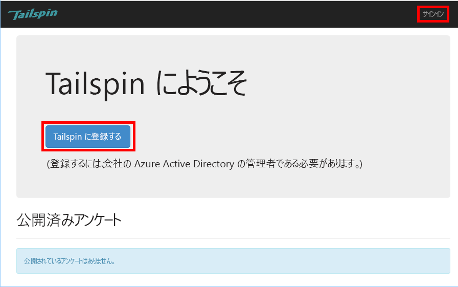
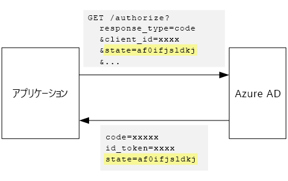

# <a name="tenant-sign-up-and-onboarding"></a><span data-ttu-id="a777d-103">テナントのサインアップとオンボード</span><span class="sxs-lookup"><span data-stu-id="a777d-103">Tenant sign-up and onboarding</span></span>

<span data-ttu-id="a777d-104">[ サンプル コード][sample application]</span><span class="sxs-lookup"><span data-stu-id="a777d-104">[ Sample code][sample application]</span></span>

<span data-ttu-id="a777d-105">この記事では、マルチテナント アプリケーションに *サインアップ* プロセスを実装し、顧客がアプリケーションに、組織をサインアップできるようにする方法について説明します。</span><span class="sxs-lookup"><span data-stu-id="a777d-105">This article describes how to implement a *sign-up* process in a multi-tenant application, which allows a customer to sign up their organization for your application.</span></span>
<span data-ttu-id="a777d-106">サインアップ プロセスを実装する理由はいくつかあります。</span><span class="sxs-lookup"><span data-stu-id="a777d-106">There are several reasons to implement a sign-up process:</span></span>

* <span data-ttu-id="a777d-107">AD 管理者が、顧客の組織全体がアプリケーションを使用することに同意できるようにするため。</span><span class="sxs-lookup"><span data-stu-id="a777d-107">Allow an AD admin to consent for the customer's entire organization to use the application.</span></span>
* <span data-ttu-id="a777d-108">クレジット カードの支払いなど、顧客情報を収集するため。</span><span class="sxs-lookup"><span data-stu-id="a777d-108">Collect credit card payment or other customer information.</span></span>
* <span data-ttu-id="a777d-109">アプリケーションに必要な 1 回限りのテナント別セットアップを実行するため。</span><span class="sxs-lookup"><span data-stu-id="a777d-109">Perform any one-time per-tenant setup needed by your application.</span></span>

## <a name="admin-consent-and-azure-ad-permissions"></a><span data-ttu-id="a777d-110">管理者の同意と Azure AD のアクセス許可</span><span class="sxs-lookup"><span data-stu-id="a777d-110">Admin consent and Azure AD permissions</span></span>
<span data-ttu-id="a777d-111">Azure AD に対して認証するには、アプリケーションがユーザーのディレクトリにアクセスできる必要があります。</span><span class="sxs-lookup"><span data-stu-id="a777d-111">In order to authenticate with Azure AD, an application needs access to the user's directory.</span></span> <span data-ttu-id="a777d-112">少なくとも、アプリケーションがユーザーのプロファイルを読み取ることができるアクセス許可が必要です。</span><span class="sxs-lookup"><span data-stu-id="a777d-112">At a minimum, the application needs permission to read the user's profile.</span></span> <span data-ttu-id="a777d-113">初めてユーザーがサインインすると、Azure AD は、要求されたアクセス許可の一覧が表示された同意ページを表示します。</span><span class="sxs-lookup"><span data-stu-id="a777d-113">The first time that a user signs in, Azure AD shows a consent page that lists the permissions being requested.</span></span> <span data-ttu-id="a777d-114">ユーザーが **[同意する]**をクリックすると、アプリケーションに対するアクセス許可が付与されます。</span><span class="sxs-lookup"><span data-stu-id="a777d-114">By clicking **Accept**, the user grants permission to the application.</span></span>

<span data-ttu-id="a777d-115">既定では、同意はユーザーごとに求められます。</span><span class="sxs-lookup"><span data-stu-id="a777d-115">By default, consent is granted on a per-user basis.</span></span> <span data-ttu-id="a777d-116">サインインするユーザーすべてに、同意ページが表示されます。</span><span class="sxs-lookup"><span data-stu-id="a777d-116">Every user who signs in sees the consent page.</span></span> <span data-ttu-id="a777d-117">ただし、Azure AD では*管理者の同意*もサポートしており、組織全体を代表して AD 管理者が同意することも可能です。</span><span class="sxs-lookup"><span data-stu-id="a777d-117">However, Azure AD also supports  *admin consent*, which allows an AD administrator to consent for an entire organization.</span></span>

<span data-ttu-id="a777d-118">管理者の同意フローを使用すると、同意ページには、AD 管理者がテナント全体の代わりにアクセス許可を付与しているというメッセージが表示されます。</span><span class="sxs-lookup"><span data-stu-id="a777d-118">When the admin consent flow is used, the consent page states that the AD admin is granting permission on behalf of the entire tenant:</span></span>


<span data-ttu-id="a777d-120">管理者が **[同意する]**をクリックすると、同じテナント内の他のユーザーはサインインできるようになり、Azure AD の同意画面はスキップされます。</span><span class="sxs-lookup"><span data-stu-id="a777d-120">After the admin clicks **Accept**, other users within the same tenant can sign in, and Azure AD will skip the consent screen.</span></span>

<span data-ttu-id="a777d-121">組織全体を代表して権限を付与することになるため、管理者の同意を行えるのは、AD 管理者のみとなっています。</span><span class="sxs-lookup"><span data-stu-id="a777d-121">Only an AD administrator can give admin consent, because it grants permission on behalf of the entire organization.</span></span> <span data-ttu-id="a777d-122">管理者以外のユーザーが、管理者の同意のフローを用いて認証を試みると、Azure AD によって次のエラーが表示されます。</span><span class="sxs-lookup"><span data-stu-id="a777d-122">If a non-administrator tries to authenticate with the admin consent flow, Azure AD displays an error:</span></span>


<span data-ttu-id="a777d-124">後で、アプリケーションに追加のアクセス許可が必要になった場合、顧客はもう一度サインアップし、更新されたアクセス許可に同意する必要があります。</span><span class="sxs-lookup"><span data-stu-id="a777d-124">If the application requires additional permissions at a later point, the customer will need to sign up again and consent to the updated permissions.</span></span>  

## <a name="implementing-tenant-sign-up"></a><span data-ttu-id="a777d-125">テナントのサインアップを実装する</span><span class="sxs-lookup"><span data-stu-id="a777d-125">Implementing tenant sign-up</span></span>
<span data-ttu-id="a777d-126">[Tailspin Surveys][Tailspin] アプリケーションのサインアップ プロセスでは、いくつかの要件が定義されています。</span><span class="sxs-lookup"><span data-stu-id="a777d-126">For the [Tailspin Surveys][Tailspin] application,  we defined several requirements for the sign-up process:</span></span>

* <span data-ttu-id="a777d-127">ユーザーがサインインするには、テナントのサインアップを完了する必要があります。</span><span class="sxs-lookup"><span data-stu-id="a777d-127">A tenant must sign up before users can sign in.</span></span>
* <span data-ttu-id="a777d-128">サインアップには、管理者の同意フローを使用します。</span><span class="sxs-lookup"><span data-stu-id="a777d-128">Sign-up uses the admin consent flow.</span></span>
* <span data-ttu-id="a777d-129">サインアップによって、ユーザーのテナントがアプリケーション データベースに追加されます。</span><span class="sxs-lookup"><span data-stu-id="a777d-129">Sign-up adds the user's tenant to the application database.</span></span>
* <span data-ttu-id="a777d-130">テナントがサインアップすると、アプリケーションにはオンボーディング ページが表示されます。</span><span class="sxs-lookup"><span data-stu-id="a777d-130">After a tenant signs up, the application shows an onboarding page.</span></span>

<span data-ttu-id="a777d-131">ここでは、サインアップ プロセスの実装手順について説明します。</span><span class="sxs-lookup"><span data-stu-id="a777d-131">In this section, we'll walk through our implementation of the sign-up process.</span></span>
<span data-ttu-id="a777d-132">"サインアップ" と "サインイン" はアプリケーションの概念である点を理解することが重要です。</span><span class="sxs-lookup"><span data-stu-id="a777d-132">It's important to understand that "sign up" versus "sign in" is an application concept.</span></span> <span data-ttu-id="a777d-133">認証フローで、Azure AD はユーザーがサインアップのプロセス中かどうかを本質的に認識していません。</span><span class="sxs-lookup"><span data-stu-id="a777d-133">During the authentication flow, Azure AD does not inherently know whether the user is in process of signing up.</span></span> <span data-ttu-id="a777d-134">コンテキストを継続的に追跡するのは、アプリケーションの役割です。</span><span class="sxs-lookup"><span data-stu-id="a777d-134">It's up to the application to keep track of the context.</span></span>

<span data-ttu-id="a777d-135">匿名ユーザーが Surveys アプリケーションにアクセスすると、サインイン用ボタンと、会社の登録 (サインアップ) 用ボタンの、2 つのボタンが表示されます。</span><span class="sxs-lookup"><span data-stu-id="a777d-135">When an anonymous user visits the Surveys application, the user is shown two buttons, one to sign in, and one to "enroll your company" (sign up).</span></span>



<span data-ttu-id="a777d-137">これらのボタンをクリックすると、 `AccountController` クラスのアクションが呼び出されます。</span><span class="sxs-lookup"><span data-stu-id="a777d-137">These buttons invoke actions in the `AccountController` class.</span></span>

<span data-ttu-id="a777d-138">`SignIn` アクションは、**ChallegeResult** を返します。これにより、OpenID Connect ミドルウェアが認証エンドポイントにリダイレクトされます。</span><span class="sxs-lookup"><span data-stu-id="a777d-138">The `SignIn` action returns a **ChallegeResult**, which causes the OpenID Connect middleware to redirect to the authentication endpoint.</span></span> <span data-ttu-id="a777d-139">ASP.NET Core では、これが認証をトリガーする既定の方法となっています。</span><span class="sxs-lookup"><span data-stu-id="a777d-139">This is the default way to trigger authentication in ASP.NET Core.</span></span>  

```csharp
[AllowAnonymous]
public IActionResult SignIn()
{
    return new ChallengeResult(
        OpenIdConnectDefaults.AuthenticationScheme,
        new AuthenticationProperties
        {
            IsPersistent = true,
            RedirectUri = Url.Action("SignInCallback", "Account")
        });
}
```

<span data-ttu-id="a777d-140">次に `SignUp` アクションと比較してみましょう。</span><span class="sxs-lookup"><span data-stu-id="a777d-140">Now compare the `SignUp` action:</span></span>

```csharp
[AllowAnonymous]
public IActionResult SignUp()
{
    var state = new Dictionary<string, string> { { "signup", "true" }};
    return new ChallengeResult(
        OpenIdConnectDefaults.AuthenticationScheme,
        new AuthenticationProperties(state)
        {
            RedirectUri = Url.Action(nameof(SignUpCallback), "Account")
        });
}
```

<span data-ttu-id="a777d-141">`SignIn` と同様に、`SignUp` アクションも `ChallengeResult` を返します。</span><span class="sxs-lookup"><span data-stu-id="a777d-141">Like `SignIn`, the `SignUp` action also returns a `ChallengeResult`.</span></span> <span data-ttu-id="a777d-142">ただし、今回は 1 つの状態情報を `AuthenticationProperties` in the `ChallengeResult`に追加します。</span><span class="sxs-lookup"><span data-stu-id="a777d-142">But this time, we add a piece of state information to the `AuthenticationProperties` in the `ChallengeResult`:</span></span>

* <span data-ttu-id="a777d-143">サインアップ: ユーザーによるサインアップ プロセスを開始したことを示す、ブール型フラグ。</span><span class="sxs-lookup"><span data-stu-id="a777d-143">signup: A Boolean flag, indicating that the user has started the sign-up process.</span></span>

<span data-ttu-id="a777d-144">`AuthenticationProperties` の状態情報が OpenID Connect [状態] パラメーターに追加され、認証フローの際にラウンド トリップします。</span><span class="sxs-lookup"><span data-stu-id="a777d-144">The state information in `AuthenticationProperties` gets added to the OpenID Connect [state] parameter, which round trips during the authentication flow.</span></span>



<span data-ttu-id="a777d-146">ユーザーが Azure AD で認証され、元のアプリケーションにリダイレクトされると、認証チケットに状態が含まれています。</span><span class="sxs-lookup"><span data-stu-id="a777d-146">After the user authenticates in Azure AD and gets redirected back to the application, the authentication ticket contains the state.</span></span> <span data-ttu-id="a777d-147">ここでは、このファクトを使用して、"signup" 値が認証フロー全体で継続されていることを確認します。</span><span class="sxs-lookup"><span data-stu-id="a777d-147">We are using this fact to make sure the "signup" value persists across the entire authentication flow.</span></span>

## <a name="adding-the-admin-consent-prompt"></a><span data-ttu-id="a777d-148">管理者の同意プロンプトを追加する</span><span class="sxs-lookup"><span data-stu-id="a777d-148">Adding the admin consent prompt</span></span>
<span data-ttu-id="a777d-149">Azure AD の管理者の同意フローは、認証要求のクエリ文字列に "prompt" パラメーターを追加することでトリガーされます。</span><span class="sxs-lookup"><span data-stu-id="a777d-149">In Azure AD, the admin consent flow is triggered by adding a "prompt" parameter to the query string in the authentication request:</span></span>

```
/authorize?prompt=admin_consent&...
```

<span data-ttu-id="a777d-150">Surveys アプリケーションでは、 `RedirectToAuthenticationEndpoint` イベント中に prompt が追加されます。</span><span class="sxs-lookup"><span data-stu-id="a777d-150">The Surveys application adds the prompt during the `RedirectToAuthenticationEndpoint` event.</span></span> <span data-ttu-id="a777d-151">このイベントは、ミドルウェアが認証エンドポイントにリダイレクトする直前に呼び出されます。</span><span class="sxs-lookup"><span data-stu-id="a777d-151">This event is called right before the middleware redirects to the authentication endpoint.</span></span>

```csharp
public override Task RedirectToAuthenticationEndpoint(RedirectContext context)
{
    if (context.IsSigningUp())
    {
        context.ProtocolMessage.Prompt = "admin_consent";
    }

    _logger.RedirectToIdentityProvider();
    return Task.FromResult(0);
}
```

<span data-ttu-id="a777d-152">` ProtocolMessage.Prompt` を設定すると、ミドルウェアによって "prompt" パラメーターが認証要求に追加されます。</span><span class="sxs-lookup"><span data-stu-id="a777d-152">Setting` ProtocolMessage.Prompt` tells the middleware to add the "prompt" parameter to the authentication request.</span></span>

<span data-ttu-id="a777d-153">prompt はサインアップ中にのみ必要です。</span><span class="sxs-lookup"><span data-stu-id="a777d-153">Note that the prompt is only needed during sign-up.</span></span> <span data-ttu-id="a777d-154">通常のサインインには含めないでください。</span><span class="sxs-lookup"><span data-stu-id="a777d-154">Regular sign-in should not include it.</span></span> <span data-ttu-id="a777d-155">サインアップとサインインを区別するには、認証状態の `signup` 値を確認します。</span><span class="sxs-lookup"><span data-stu-id="a777d-155">To distinguish between them, we check for the `signup` value in the authentication state.</span></span> <span data-ttu-id="a777d-156">次の拡張メソッドで、この条件を確認します。</span><span class="sxs-lookup"><span data-stu-id="a777d-156">The following extension method checks for this condition:</span></span>

```csharp
internal static bool IsSigningUp(this BaseControlContext context)
{
    Guard.ArgumentNotNull(context, nameof(context));

    string signupValue;
    // Check the HTTP context and convert to string
    if ((context.Ticket == null) ||
        (!context.Ticket.Properties.Items.TryGetValue("signup", out signupValue)))
    {
        return false;
    }

    // We have found the value, so see if it's valid
    bool isSigningUp;
    if (!bool.TryParse(signupValue, out isSigningUp))
    {
        // The value for signup is not a valid boolean, throw                
        throw new InvalidOperationException($"'{signupValue}' is an invalid boolean value");
    }

    return isSigningUp;
}
```

## <a name="registering-a-tenant"></a><span data-ttu-id="a777d-157">テナントを登録する</span><span class="sxs-lookup"><span data-stu-id="a777d-157">Registering a Tenant</span></span>
<span data-ttu-id="a777d-158">Surveys アプリケーションは、各テナントとユーザーに関する一部の情報をアプリケーション データベースに保存します。</span><span class="sxs-lookup"><span data-stu-id="a777d-158">The Surveys application stores some information about each tenant and user in the application database.</span></span>


<span data-ttu-id="a777d-160">Tenant テーブルの IssuerValue は、テナントの発行者要求の値です。</span><span class="sxs-lookup"><span data-stu-id="a777d-160">In the Tenant table, IssuerValue is the value of the issuer claim for the tenant.</span></span> <span data-ttu-id="a777d-161">Azure AD では、これは `https://sts.windows.net/<tentantID>` であり、テナントごとに一意の値が付与されます。</span><span class="sxs-lookup"><span data-stu-id="a777d-161">For Azure AD, this is `https://sts.windows.net/<tentantID>` and gives a unique value per tenant.</span></span>

<span data-ttu-id="a777d-162">新しいテナントがサインアップすると、Surveys アプリケーションでテナント レコードがデータベースに書き込まれます。</span><span class="sxs-lookup"><span data-stu-id="a777d-162">When a new tenant signs up, the Surveys application writes a tenant record to the database.</span></span> <span data-ttu-id="a777d-163">この処理は、 `AuthenticationValidated` イベント内で発生します(このイベント前には実行しないでください。</span><span class="sxs-lookup"><span data-stu-id="a777d-163">This happens inside the `AuthenticationValidated` event.</span></span> <span data-ttu-id="a777d-164">ID トークンはまだ検証されていないため、要求値を信頼できません)。</span><span class="sxs-lookup"><span data-stu-id="a777d-164">(Don't do it before this event, because the ID token won't be validated yet, so you can't trust the claim values.</span></span> <span data-ttu-id="a777d-165">[認証]に関するページを参照してください。</span><span class="sxs-lookup"><span data-stu-id="a777d-165">See [Authentication].</span></span>

<span data-ttu-id="a777d-166">Surveys アプリケーションの関連するコードを次に示します。</span><span class="sxs-lookup"><span data-stu-id="a777d-166">Here is the relevant code from the Surveys application:</span></span>

```csharp
public override async Task TokenValidated(TokenValidatedContext context)
{
    var principal = context.AuthenticationTicket.Principal;
    var userId = principal.GetObjectIdentifierValue();
    var tenantManager = context.HttpContext.RequestServices.GetService<TenantManager>();
    var userManager = context.HttpContext.RequestServices.GetService<UserManager>();
    var issuerValue = principal.GetIssuerValue();
    _logger.AuthenticationValidated(userId, issuerValue);

    // Normalize the claims first.
    NormalizeClaims(principal);
    var tenant = await tenantManager.FindByIssuerValueAsync(issuerValue)
        .ConfigureAwait(false);

    if (context.IsSigningUp())
    {
        if (tenant == null)
        {
            tenant = await SignUpTenantAsync(context, tenantManager)
                .ConfigureAwait(false);
        }

        // In this case, we need to go ahead and set up the user signing us up.
        await CreateOrUpdateUserAsync(context.Ticket, userManager, tenant)
            .ConfigureAwait(false);
    }
    else
    {
        if (tenant == null)
        {
            _logger.UnregisteredUserSignInAttempted(userId, issuerValue);
            throw new SecurityTokenValidationException($"Tenant {issuerValue} is not registered");
        }

        await CreateOrUpdateUserAsync(context.Ticket, userManager, tenant)
            .ConfigureAwait(false);
    }
}
```

<span data-ttu-id="a777d-167">このコードは、次の処理を実行します。</span><span class="sxs-lookup"><span data-stu-id="a777d-167">This code does the following:</span></span>

1. <span data-ttu-id="a777d-168">テナントの発行者値がデータベース内に既にあるかどうかを確認します。</span><span class="sxs-lookup"><span data-stu-id="a777d-168">Check if the tenant's issuer value is already in the database.</span></span> <span data-ttu-id="a777d-169">テナントがサインアップしていない場合、 `FindByIssuerValueAsync` は null を返します。</span><span class="sxs-lookup"><span data-stu-id="a777d-169">If the tenant has not signed up, `FindByIssuerValueAsync` returns null.</span></span>
2. <span data-ttu-id="a777d-170">ユーザーがサインアップ中の場合:</span><span class="sxs-lookup"><span data-stu-id="a777d-170">If the user is signing up:</span></span>
   1. <span data-ttu-id="a777d-171">テナントをデータベースに追加します (`SignUpTenantAsync`)。</span><span class="sxs-lookup"><span data-stu-id="a777d-171">Add the tenant to the database (`SignUpTenantAsync`).</span></span>
   2. <span data-ttu-id="a777d-172">認証されたユーザーをデータベースに追加します (`CreateOrUpdateUserAsync`)。</span><span class="sxs-lookup"><span data-stu-id="a777d-172">Add the authenticated user to the database (`CreateOrUpdateUserAsync`).</span></span>
3. <span data-ttu-id="a777d-173">それ以外の場合、通常のサインイン フローを完了します。</span><span class="sxs-lookup"><span data-stu-id="a777d-173">Otherwise complete the normal sign-in flow:</span></span>
   1. <span data-ttu-id="a777d-174">テナントの発行者がデータベース内に見つからなかった場合、テナントが登録されておらず、顧客がサインアップする必要があることを意味します。</span><span class="sxs-lookup"><span data-stu-id="a777d-174">If the tenant's issuer was not found in the database, it means the tenant is not registered, and the customer needs to sign up.</span></span> <span data-ttu-id="a777d-175">この場合、例外をスローして認証を失敗させます。</span><span class="sxs-lookup"><span data-stu-id="a777d-175">In that case, throw an exception to cause the authentication to fail.</span></span>
   2. <span data-ttu-id="a777d-176">それ以外の場合、ユーザーのデータベース レコードがなければ作成します (`CreateOrUpdateUserAsync`)。</span><span class="sxs-lookup"><span data-stu-id="a777d-176">Otherwise, create a database record for this user, if there isn't one already (`CreateOrUpdateUserAsync`).</span></span>

<span data-ttu-id="a777d-177">テナントをデータベースに追加する `SignUpTenantAsync` メソッドの例を次に示します。</span><span class="sxs-lookup"><span data-stu-id="a777d-177">Here is the `SignUpTenantAsync` method that adds the tenant to the database.</span></span>

```csharp
private async Task<Tenant> SignUpTenantAsync(BaseControlContext context, TenantManager tenantManager)
{
    Guard.ArgumentNotNull(context, nameof(context));
    Guard.ArgumentNotNull(tenantManager, nameof(tenantManager));

    var principal = context.Ticket.Principal;
    var issuerValue = principal.GetIssuerValue();
    var tenant = new Tenant
    {
        IssuerValue = issuerValue,
        Created = DateTimeOffset.UtcNow
    };

    try
    {
        await tenantManager.CreateAsync(tenant)
            .ConfigureAwait(false);
    }
    catch(Exception ex)
    {
        _logger.SignUpTenantFailed(principal.GetObjectIdentifierValue(), issuerValue, ex);
        throw;
    }

    return tenant;
}
```

<span data-ttu-id="a777d-178">Surveys アプリケーションの全体的なサインアップ フローの概要を次に示します。</span><span class="sxs-lookup"><span data-stu-id="a777d-178">Here is a summary of the entire sign-up flow in the Surveys application:</span></span>

1. <span data-ttu-id="a777d-179">ユーザーが **[Sign Up]** ボタンをクリックします。</span><span class="sxs-lookup"><span data-stu-id="a777d-179">The user clicks the **Sign Up** button.</span></span>
2. <span data-ttu-id="a777d-180">`AccountController.SignUp` アクションからチャレンジの結果が返されます。</span><span class="sxs-lookup"><span data-stu-id="a777d-180">The `AccountController.SignUp` action returns a challege result.</span></span>  <span data-ttu-id="a777d-181">認証の状態に "signup" 値が含まれます。</span><span class="sxs-lookup"><span data-stu-id="a777d-181">The authentication state includes "signup" value.</span></span>
3. <span data-ttu-id="a777d-182">`RedirectToAuthenticationEndpoint` イベントで、`admin_consent` プロンプトを追加します。</span><span class="sxs-lookup"><span data-stu-id="a777d-182">In the `RedirectToAuthenticationEndpoint` event, add the `admin_consent` prompt.</span></span>
4. <span data-ttu-id="a777d-183">OpenID Connect ミドルウェアによって Azure AD にリダイレクトされ、ユーザーが認証されます。</span><span class="sxs-lookup"><span data-stu-id="a777d-183">The OpenID Connect middleware redirects to Azure AD and the user authenticates.</span></span>
5. <span data-ttu-id="a777d-184">`AuthenticationValidated` イベントで、"signup" 状態を確認します。</span><span class="sxs-lookup"><span data-stu-id="a777d-184">In the `AuthenticationValidated` event, look for the "signup" state.</span></span>
6. <span data-ttu-id="a777d-185">テナントをデータベースに追加します。</span><span class="sxs-lookup"><span data-stu-id="a777d-185">Add the tenant to the database.</span></span>

<span data-ttu-id="a777d-186">[**次へ**][app roles]</span><span class="sxs-lookup"><span data-stu-id="a777d-186">[**Next**][app roles]</span></span>

<!-- Links -->
[app roles]: app-roles.md
[Tailspin]: tailspin.md

[状態]: http://openid.net/specs/openid-connect-core-1_0.html#AuthRequest
[state]: http://openid.net/specs/openid-connect-core-1_0.html#AuthRequest
[認証]: authenticate.md
[Authentication]: authenticate.md
[sample application]: https://github.com/mspnp/multitenant-saas-guidance
