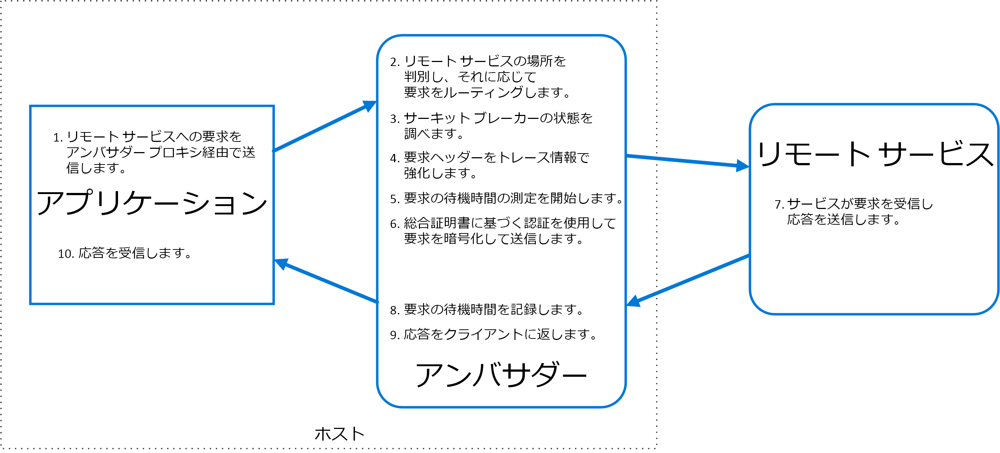

# アンバサダー パターンAmbassador pattern

コンシューマー サービスまたはアプリケーションの代わりにネットワーク要求を送信するヘルパー サービスを作成します。Create helper services that send network requests on behalf of a consumer service or application. アンバサダー サービスは、クライアントに併置されているプロセス外のプロキシと考えることができます。An ambassador service can be thought of as an out-of-process proxy that is co-located with the client.

このパターンは、監視、ログ記録、ルーティング、セキュリティ (TLS など)、[回復性パターン][ resiliency-patterns]といった一般的なクライアント接続のタスクを言語に関係ない方法でオフロードするのに役立ちます。This pattern can be useful for offloading common client connectivity tasks such as monitoring, logging, routing, security (such as TLS), and [resiliency patterns][resiliency-patterns] in a language agnostic way. これは、レガシ アプリケーションまたは変更が困難なアプリケーションで、ネットワーク機能を拡張するためによく使用されます。It is often used with legacy applications, or other applications that are difficult to modify, in order to extend their networking capabilities. 専門のチームでこれらの機能を実装することもできます。It can also enable a specialized team to implement those features.

## コンテキストと問題Context and problem

回復力のあるクラウド ベースのアプリケーションには、[サーキット ブレーク](./circuit-breaker.md)、ルーティング、計測と監視、ネットワークに関連する構成を更新する機能などの機能が必要です。Resilient cloud-based applications require features such as [circuit breaking](./circuit-breaker.md), routing, metering and monitoring, and the ability to make network-related configuration updates. こうした機能を追加するためにレガシ アプリケーションまたは既存のコード ライブラリを更新するのは、コードがもはや管理されていないか、開発チームで変更するのが容易ではないために、困難あるいは不可能な場合があります。It may be difficult or impossible to update legacy applications or existing code libraries to add these features, because the code is no longer maintained or can't be easily modified by the development team.

ネットワークの呼び出しも、接続、認証、および承認について大幅な構成が必要かもしれません。Network calls may also require substantial configuration for connection, authentication, and authorization. これらの呼び出しが、複数の言語とフレームワークで構築された複数のアプリケーションで使用されている場合、こうしたインスタンスの各々について呼び出しを構成しなければいけません。If these calls are used across multiple applications, built using multiple languages and frameworks, the calls must be configured for each of these instances. さらに、ネットワークとセキュリティの機能は、組織内の中核チームによって管理される必要があるかもしれません。In addition, network and security functionality may need to be managed by a central team within your organization. 大規模なコード ベースでは、そうしたチームがなじみのないアプリケーション コードを更新するのは危険な場合があります。With a large code base, it can be risky for that team to update application code they aren't familiar with.

## 解決策Solution

クライアント フレームワークおよびライブラリを、アプリケーションと外部サービス間のプロキシとして機能する外部プロセスに配置します。Put client frameworks and libraries into an external process that acts as a proxy between your application and external services. アプリケーションと同じホスト環境にプロキシを展開して、ルーティング、回復性、セキュリティ機能の制御を許可し、ホストに関連するアクセス制限を回避します。Deploy the proxy on the same host environment as your application to allow control over routing, resiliency, security features, and to avoid any host-related access restrictions. アンバサダー パターンを使用して、インストルメンテーションを標準化および拡張することもできます。You can also use the ambassador pattern to standardize and extend instrumentation. プロキシは、待機時間やリソース使用率などのパフォーマンス メトリックを監視することができ、この監視はアプリケーションと同じホスト環境で行われます。The proxy can monitor performance metrics such as latency or resource usage, and this monitoring happens in the same host environment as the application.

アンバサダーにオフロードされる機能は、アプリケーションとは別に管理できます。Features that are offloaded to the ambassador can be managed independently of the application. アンバサダーは、アプリケーションの従来の機能を妨げることなく、更新および変更することができます。You can update and modify the ambassador without disturbing the application's legacy functionality. さらに別の専門チームが、アンバサダーに移動されたセキュリティ、ネットワーク、認証の機能を実装および管理することも可能です。It also allows for separate, specialized teams to implement and maintain security, networking, or authentication features that have been moved to the ambassador.

アンバサダー サービスは、使用するアプリケーションまたはサービスのライフ サイクルを伴う[サイドカー](./sidecar.md)としてデプロイすることができます。Ambassador services can be deployed as a [sidecar](./sidecar.md) to accompany the lifecycle of a consuming application or service. あるいは、アンバサダーが共通のホストで複数の個別のプロセスによって共有されている場合は、デーモンまたは Windows サービスとしてデプロイできます。Alternatively, if an ambassador is shared by multiple separate processes on a common host, it can be deployed as a daemon or Windows service. 使用するサービスがコンテナー化されている場合は、アンバサダーは通信用に構成した適切なリンクとともに、同じホスト上の別のコンテナーとして作成する必要があります。If the consuming service is containerized, the ambassador should be created as a separate container on the same host, with the appropriate links configured for communication.

## 問題と注意事項Issues and considerations

- このプロキシは、待機時間のオーバーヘッドをもたらします。The proxy adds some latency overhead. アプリケーションによって直接呼び出されるクライアント ライブラリのほうがより適切な方法かもしれませんので、検討してください。Consider whether a client library, invoked directly by the application, is a better approach.
- プロキシに汎用的な機能を含めることで考えられる影響を考慮してください。Consider the possible impact of including generalized features in the proxy. たとえば、アンバサダーは再試行を処理する可能性がありますが、すべての操作がべき等でない限り、それは安全ではないかもしれません。For example, the ambassador could handle retries, but that might not be safe unless all operations are idempotent.
- クライアントがコンテキストをプロキシに渡すだけでなく、そのクライアントに返すこともできるようなメカニズムを検討してください。Consider a mechanism to allow the client to pass some context to the proxy, as well as back to the client. たとえば、再試行を除外する、または再試行の最大回数を指定する HTTP 要求ヘッダーを含めます。For example, include HTTP request headers to opt out of retry or specify the maximum number of times to retry.
- プロキシをどのようにパッケージ化しデプロイするか検討してください。Consider how you will package and deploy the proxy.
- すべてのクライアントに 1 つの共有インスタンスを使用するか、各クライアントに 1 つのインスタンスを使用するか、検討してください。Consider whether to use a single shared instance for all clients or an instance for each client.

## このパターンを使用する状況When to use this pattern

このパターンは次の状況で使用します。Use this pattern when you:

- 複数の言語やフレームワークに、クライアント接続機能の共通セットを構築する必要がある。Need to build a common set of client connectivity features for multiple languages or frameworks.
- インフラストラクチャの開発者または他のさらに特殊化されたチームに、横断的なクライアント接続の懸案事項をまかせる必要がある。Need to offload cross-cutting client connectivity concerns to infrastructure developers or other more specialized teams.
- レガシ アプリケーションまたは変更が困難なアプリケーションで、クラウドまたはクラスターの接続要件をサポートする必要がある。Need to support cloud or cluster connectivity requirements in a legacy application or an application that is difficult to modify.

このパターンは次の状況では適切でない可能性があります。This pattern may not be suitable:

- ネットワーク要求の待機時間が重要である場合。When network request latency is critical. プロキシによって、わずかだとしてもオーバーヘッドが発生し、場合によってはそれがアプリケーションに影響を与える可能性があります。A proxy will introduce some overhead, although minimal, and in some cases this may affect the application.
- クライアント接続の機能が、単一言語によって使用されている場合。When client connectivity features are consumed by a single language. その場合、パッケージとして開発チームに配布するクライアント ライブラリが、より適切な選択かもしれません。In that case, a better option might be a client library that is distributed to the development teams as a package.
- 接続機能を一般化することができず、クライアント アプリケーションとの緊密な統合が必要な場合。When connectivity features cannot be generalized and require deeper integration with the client application.

## 例Example

次の図は、アンバサダー プロキシを経由してリモート サービスに要求を送るアプリケーションを示しています。The following diagram shows an application making a request to a remote service via an ambassador proxy. アンバサダーは、ルーティング、サーキット ブレーキ、およびログ記録を提供します。The ambassador provides routing, circuit breaking, and logging. リモート サービスを呼び出してから、クライアント アプリケーションへ応答を返します。It calls the remote service and then returns the response to the client application:

## 関連するガイダンスRelated guidance

- [サイドカー パターンSidecar pattern](./sidecar.md)

<!-- links -->

[resiliency-patterns]: ./category/resiliency.md
