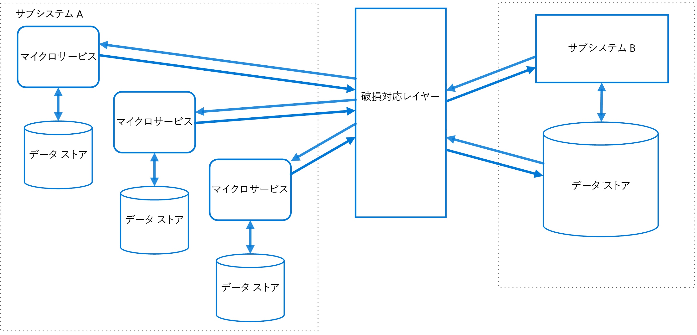

# 破損対策レイヤー パターンAnti-Corruption Layer pattern

最新アプリケーションと、そのアプリケーションが依存するレガシ システムの間にファサード、すなわちアダプター レイヤーを実装します。Implement a façade or adapter layer between a modern application and a legacy system that it depends on. このレイヤーにより、最新アプリケーションとレガシ システムの間の要求が変換されます。This layer translates requests between the modern application and the legacy system. このパターンを使用して、アプリケーションの設計が、レガシ システムへの依存関係で制限されないようにします。Use this pattern to ensure that an application's design is not limited by dependencies on legacy systems.

## コンテキストと問題Context and problem

アプリケーションのほとんどが、そのデータや機能の一部について、他のシステムに依存しています。Most applications rely on other systems for some data or functionality. たとえば、レガシ アプリケーションを最新のシステムに移行するとき、そのレガシ アプリケーションは、引き続き既存のレガシ リソースを必要とする可能性があります。For example, when a legacy application is migrated to a modern system, it may still need existing legacy resources. レガシ システムは、新しい機能で呼び出すことができなければなりません。New features must be able to call the legacy system. これは、特に、段階的な移行の場合に当てはまります。こうした移行では、大規模なアプリケーションのさまざまな機能が、時間をかけて最新システムに移動します。This is especially true of gradual migrations, where different features of a larger application are moved to a modern system over time.

このようなレガシ システムには、多くの場合、データ スキーマが複雑、API が古いなど、品質に関する問題があります。Often these legacy systems suffer from quality issues such as convoluted data schemas or obsolete APIs. レガシ システムで使用されている機能とテクノロジは、最新のシステムとは大きく異なる可能性があります。The features and technologies used in legacy systems can vary widely from more modern systems. レガシ システムと相互運用するには、新しいアプリケーションには、最新アプリケーションに組み込まない古いインフラストラクチャ、プロトコル、データ モデル、API、またはその他の機能のサポートが必要になることがあります。To interoperate with the legacy system, the new application may need to support outdated infrastructure, protocols, data models, APIs, or other features that you wouldn't otherwise put into a modern application.

新しいシステムとレガシ システムの間のアクセスを維持することによって、新しいシステムは、少なくともレガシ システムの API または他のセマンティクスの一部に強制的に従うことになります。Maintaining access between new and legacy systems can force the new system to adhere to at least some of the legacy system's APIs or other semantics. こうしたレガシ機能の品質に問題がある場合、その機能をサポートすることで、正常に設計された最新のアプリケーションが "破損" する場合があります。When these legacy features have quality issues, supporting them "corrupts" what might otherwise be a cleanly designed modern application. 

## 解決策Solution

レガシ システムと最新システムの間に破損対策レイヤーを配置し、これらを切り離します。Isolate the legacy and modern systems by placing an anti-corruption layer between them. このレイヤーは、2 つのシステム間の通信を変換するもので、レガシ システムはそのままで、最新のアプリケーションの設計と技術的アプローチも損なわれません。This layer translates communications between the two systems, allowing the legacy system to remain unchanged while the modern application can avoid compromising its design and technological approach.

 

最新のアプリケーションと破損対策レイヤーの間の通信では、常に、アプリケーションのデータ モデルとアーキテクチャが使用されます。Communication between the modern application and the anti-corruption layer always uses the application's data model and architecture. 破損対策レイヤーからレガシ システムへの呼び出しは、そのシステムのデータ モデルまたはメソッドに準拠します。Calls from the anti-corruption layer to the legacy system conform to that system's data model or methods. 破損対策レイヤーには、2 つのシステム間の変換に必要なロジックがすべて含まれます。The anti-corruption layer contains all of the logic necessary to translate between the two systems. レイヤーは、アプリケーション内でコンポーネントとして実装できます。また、独立したサービスとして実装することもできます。The layer can be implemented as a component within the application or as an independent service.

## 問題と注意事項Issues and considerations

- 破損対策レイヤーにより、2 つのシステム間で行われた呼び出しで、待ち時間が追加される場合があります。The anti-corruption layer may add latency to calls made between the two systems.
- 破損対策レイヤーにより、管理および保守しなければならない追加サービスが増えます。The anti-corruption layer adds an additional service that must be managed and maintained.
- 破損対策レイヤーをスケールする方法を検討してください。Consider how your anti-corruption layer will scale.
- 複数の破損対策レイヤーが必要かどうかを検討してください。Consider whether you need more than one anti-corruption layer. さまざまなテクノロジや言語を使用して、機能を複数のサービスに分解できます。破損対策レイヤーをパーティション分割する理由が他に存在する可能性もあります。You may want to decompose functionality into multiple services using different technologies or languages, or there may be other reasons to partition the anti-corruption layer.
- 他のアプリケーションまたはサービスとの関係で、破損対策レイヤーがどのように管理されるかを考慮してください。Consider how the anti-corruption layer will be managed in relation with your other applications or services. これは、監視、リリース、および構成プロセスにどのように統合されますか。How will it be integrated into your monitoring, release, and configuration processes?
- トランザクションおよびデータの整合性は保持され、監視できることを確認してください。Make sure transaction and data consistency are maintained and can be monitored.
- 破損対策レイヤーが処理する必要があるのが、レガシ システムと最新システムの間のすべての通信か、または機能のサブセットのみかを検討してください。Consider whether the anti-corruption layer needs to handle all communication between legacy and modern systems, or just a subset of features. 
- 破損対策レイヤーを永続的に使うか、いずれ、すべてのレガシ機能が移行された時点で使用をやめるのかを検討します。Consider whether the anti-corruption layer is meant to be permanent, or eventually retired once all legacy functionality has been migrated.

## このパターンを使用する状況When to use this pattern

このパターンは次の状況で使用します。Use this pattern when:

- 複数の段階にわたって移行が発生するが、新しいシステムとレガシ システムの間の統合を保持する必要があるとき。A migration is planned to happen over multiple stages, but integration between new and legacy systems needs to be maintained.
- 新しいシステムとレガシ システムでセマンティクスが異なるが、通信する必要があるとき。New and legacy system have different semantics, but still need to communicate.

新しいシステムとレガシ システムの間で大きなセマンティクスの違いがない場合、このパターンは適切でない可能性があります。This pattern may not be suitable if there are no significant semantic differences between new and legacy systems. 

## 関連するガイダンスRelated guidance

- [ストラングラー パターン][strangler][Strangler pattern][strangler]

[strangler]: ./strangler.md
