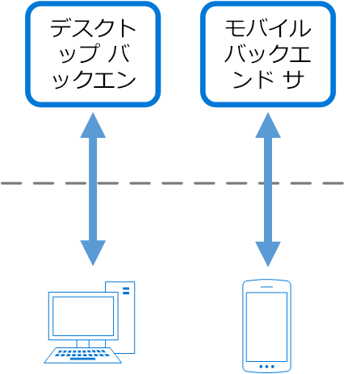

# フロント エンド用バックエンドのパターン

特定のフロント エンド アプリケーションやインターフェイスによって使用される個別のバックエンド サービスを作成します。 このパターンは、複数のインターフェイスのために 1 つのバックエンドをカスタマイズすることが非効率な場合に役立ちます。 このパターンは、Sam Newman が初めて説明しました。

## コンテキストと問題

アプリケーションは、当初デスクトップの Web UI 用に導入される場合があります。 通常、バックエンド サービスは、その UI に必要な機能を提供するために、並行して開発されます。 アプリケーションのユーザー ベースが増えてくると、同じバックエンドとやりとりする、モバイル アプリケーションが開発されます。 その結果、バックエンド サービスは、デスクトップとモバイルの両方のインターフェイスの要件に対応する、汎用的なバックエンドになります。

しかし、モバイル デバイスの機能は、デスクトップ ブラウザーとは大きく異なります (画面サイズ、パフォーマンス、ディスプレイ制限など)。 結果として、モバイル アプリケーションのバックエンド要件も、デスクトップ Web UI のものとは異なります。 

これらの違いにより、バックエンドの要件に競合が発生するようになります。 デスクトップ Web UI とモバイル アプリケーションの両方に対応するには、バックエンドを定期的に、かつ大幅に変更する必要があります。 多くの場合、各フロント エンドでは個別のインターフェイス チームが作業するため、バックエンドは開発プロセスのボトルネックになります。 更新要件が競合している場合、両方のフロント エンドに対するサービス提供を維持しようとすると、1 つのリソースをデプロイするのにも、多くの労力が費やされることになります。

 

開発アクティビティではバックエンド サービスに重点が置かれるため、バックエンドの管理と保守に個別のチームが配備されることがあります。 このことは最終的に、インターフェイスとバックエンドの開発チーム間の分断につながり、各 UI チームのさまざまな要件を調整する必要が生じて、バックエンド チームに負担がかかることになります。 あるインターフェイス チームでバックエンドを変更する必要が生じても、それらの変更を他のインターフェイス チームで検証してからでないと、変更をバックエンドに統合することはできません。 

## 解決策

ユーザー インターフェイスごとに 1 つのバックエンドを作成します。 そうすれば、フロントエンド環境のニーズに応じて各バックエンドの動作やパフォーマンスを調整しても、他のフロントエンドの動作に影響する心配はなくなります。

 

各バックエンドが 1 つのインターフェイスに対応するので、バックエンドをそのインターフェイス用に最適化できます。 その結果、すべてのインターフェイスの要件を満たそうとする汎用バックエンドよりも、サイズが小さくなり、複雑さが軽減され、多くの場合は処理速度も速くなります。 各インターフェイス チームは、専用のバックエンドを自律的に制御できるようになり、中央のバックエンド開発チームに依存しなくて済むようになります。 その結果インターフェイス チームは、言語の選択、リリース間隔、ワークロードの優先度、およびバックエンドでの機能統合を、柔軟に決められるようになります。

詳細については、「[Pattern: Backends For Frontends (パターン: フロントエンド用バックエンド)](http://samnewman.io/patterns/architectural/bff/)」をご覧ください。

## 問題と注意事項

- デプロイするバックエンドの数を検討してください。
- 複数の異なるインターフェイス (モバイル クライアントなど) が同じ要求をする場合は、インターフェイスごとにバックエンドを実装する必要があるか、それとも 1 つのバックエンドで十分かを検討してください。
- このパターンを実装すると、サービス間でコードが重複する可能性が高くなります。
- フロントエンドに特化したバックエンド サービスでは、クライアント固有のロジックと動作だけを実装するようにしてください。 汎用的なビジネス ロジックやその他のグローバル機能は、アプリケーション内の別の場所で管理するようにしてください。
- このパターンが、開発チームの担当業務にどのように影響するかを考えてください。
- このパターンを実装するのにかかる時間を検討してください。 新しいバックエンドの構築によって技術的負債が発生し、既存の汎用バックエンドもサポートし続けなければならなくなりますか。

## このパターンを使用する状況

このパターンは次の状況で使用します。

- 共有または汎用目的のバックエンド サービスを保守するために、多大な開発オーバーヘッドが生じている。
- 特定のクライアント インターフェイスの要件に合わせて、バックエンドを最適化する必要がある。
- 複数のインターフェイスに対応するために、汎用バックエンドのカスタマイズが行われている。
- 他のユーザー インターフェイスのバックエンドには、別の言語を使用したほうが望ましい。

このパターンは、次の場合には適切でない可能性があります。

- 各インターフェイスが、バックエンドに対して同一または類似の要求をする。
- バックエンドとのやりとりに使用されされるインターフェイスが 1 つしかない。

## 関連するガイダンス

- [Gateway Aggregation pattern](./gateway-aggregation.md) (ゲートウェイ集約パターン)
- [Gateway Offloading pattern](./gateway-offloading.md) (ゲートウェイ オフロード パターン)
- [Gateway Routing pattern](./gateway-routing.md) (ゲートウェイ ルーティング パターン)

