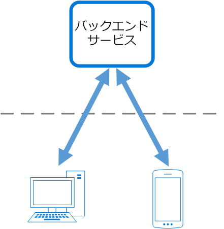

# フロント エンド用バックエンドのパターンBackends for Frontends pattern

特定のフロント エンド アプリケーションやインターフェイスによって使用される個別のバックエンド サービスを作成します。Create separate backend services to be consumed by specific frontend applications or interfaces. このパターンは、複数のインターフェイスのために 1 つのバックエンドをカスタマイズすることが非効率な場合に役立ちます。This pattern is useful when you want to avoid customizing a single backend for multiple interfaces. このパターンは、Sam Newman が初めて説明しました。This pattern was first described by Sam Newman.

## コンテキストと問題Context and problem

アプリケーションは、当初デスクトップの Web UI 用に導入される場合があります。An application may initially be targeted at a desktop web UI. 通常、バックエンド サービスは、その UI に必要な機能を提供するために、並行して開発されます。Typically, a backend service is developed in parallel that provides the features needed for that UI. アプリケーションのユーザー ベースが増えてくると、同じバックエンドとやりとりする、モバイル アプリケーションが開発されます。As the application's user base grows, a mobile application is developed that must interact with the same backend. その結果、バックエンド サービスは、デスクトップとモバイルの両方のインターフェイスの要件に対応する、汎用的なバックエンドになります。The backend service becomes a general-purpose backend, serving the requirements of both the desktop and mobile interfaces.

しかし、モバイル デバイスの機能は、デスクトップ ブラウザーとは大きく異なります (画面サイズ、パフォーマンス、ディスプレイ制限など)。But the capabilities of a mobile device differ significantly from a desktop browser, in terms of screen size, performance, and display limitations. 結果として、モバイル アプリケーションのバックエンド要件も、デスクトップ Web UI のものとは異なります。As a result, the requirements for a mobile application backend differ from the desktop web UI. 

これらの違いにより、バックエンドの要件に競合が発生するようになります。These differences result in competing requirements for the backend. デスクトップ Web UI とモバイル アプリケーションの両方に対応するには、バックエンドを定期的に、かつ大幅に変更する必要があります。The backend requires regular and significant changes to serve both the desktop web UI and the mobile application. 多くの場合、各フロント エンドでは個別のインターフェイス チームが作業するため、バックエンドは開発プロセスのボトルネックになります。Often, separate interface teams work on each frontend, causing the backend to become a bottleneck in the development process. 更新要件が競合している場合、両方のフロント エンドに対するサービス提供を維持しようとすると、1 つのリソースをデプロイするのにも、多くの労力が費やされることになります。Conflicting update requirements, and the need to keep the service working for both frontends, can result in spending a lot of effort on a single deployable resource.

 

開発アクティビティではバックエンド サービスに重点が置かれるため、バックエンドの管理と保守に個別のチームが配備されることがあります。As the development activity focuses on the backend service, a separate team may be created to manage and maintain the backend. このことは最終的に、インターフェイスとバックエンドの開発チーム間の分断につながり、各 UI チームのさまざまな要件を調整する必要が生じて、バックエンド チームに負担がかかることになります。Ultimately, this results in a disconnect between the interface and backend development teams, placing a burden on the backend team to balance the competing requirements of the different UI teams. あるインターフェイス チームでバックエンドを変更する必要が生じても、それらの変更を他のインターフェイス チームで検証してからでないと、変更をバックエンドに統合することはできません。When one interface team requires changes to the backend, those changes must be validated with other interface teams before they can be integrated into the backend. 

## 解決策Solution

ユーザー インターフェイスごとに 1 つのバックエンドを作成します。Create one backend per user interface. そうすれば、フロントエンド環境のニーズに応じて各バックエンドの動作やパフォーマンスを調整しても、他のフロントエンドの動作に影響する心配はなくなります。Fine tune the behavior and performance of each backend to best match the needs of the frontend environment, without worrying about affecting other frontend experiences.

 

各バックエンドが 1 つのインターフェイスに対応するので、バックエンドをそのインターフェイス用に最適化できます。Because each backend is specific to one interface, it can be optimized for that interface. その結果、すべてのインターフェイスの要件を満たそうとする汎用バックエンドよりも、サイズが小さくなり、複雑さが軽減され、多くの場合は処理速度も速くなります。As a result, it will be smaller, less complex, and likely faster than a generic backend that tries to satisfy the requirements for all interfaces. 各インターフェイス チームは、専用のバックエンドを自律的に制御できるようになり、中央のバックエンド開発チームに依存しなくて済むようになります。Each interface team has autonomy to control their own backend and doesn't rely on a centralized backend development team. その結果インターフェイス チームは、言語の選択、リリース間隔、ワークロードの優先度、およびバックエンドでの機能統合を、柔軟に決められるようになります。This gives the interface team flexibility in language selection, release cadence, prioritization of workload, and feature integration in their backend.

詳細については、「[Pattern: Backends For Frontends (パターン: フロントエンド用バックエンド)](http://samnewman.io/patterns/architectural/bff/)」をご覧ください。For more information, see [Pattern: Backends For Frontends](http://samnewman.io/patterns/architectural/bff/).

## 問題と注意事項Issues and considerations

- デプロイするバックエンドの数を検討してください。Consider how many backends to deploy.
- 複数の異なるインターフェイス (モバイル クライアントなど) が同じ要求をする場合は、インターフェイスごとにバックエンドを実装する必要があるか、それとも 1 つのバックエンドで十分かを検討してください。If different interfaces (such as mobile clients) will make the same requests, consider whether it is necessary to implement a backend for each interface, or if a single backend will suffice.
- このパターンを実装すると、サービス間でコードが重複する可能性が高くなります。Code duplication across services is highly likely when implementing this pattern.
- フロントエンドに特化したバックエンド サービスでは、クライアント固有のロジックと動作だけを実装するようにしてください。Frontend-focused backend services should only contain client-specific logic and behavior. 汎用的なビジネス ロジックやその他のグローバル機能は、アプリケーション内の別の場所で管理するようにしてください。General business logic and other global features should be managed elsewhere in your application.
- このパターンが、開発チームの担当業務にどのように影響するかを考えてください。Think about how this pattern might be reflected in the responsibilities of a development team.
- このパターンを実装するのにかかる時間を検討してください。Consider how long it will take to implement this pattern. 新しいバックエンドの構築によって技術的負債が発生し、既存の汎用バックエンドもサポートし続けなければならなくなりますか。Will the effort of building the new backends incur technical debt, while you continue to support the existing generic backend?

## このパターンを使用する状況When to use this pattern

このパターンは次の状況で使用します。Use this pattern when:

- 共有または汎用目的のバックエンド サービスを保守するために、多大な開発オーバーヘッドが生じている。A shared or general purpose backend service must be maintained with significant development overhead.
- 特定のクライアント インターフェイスの要件に合わせて、バックエンドを最適化する必要がある。You want to optimize the backend for the requirements of specific client interfaces.
- 複数のインターフェイスに対応するために、汎用バックエンドのカスタマイズが行われている。Customizations are made to a general-purpose backend to accommodate multiple interfaces.
- 他のユーザー インターフェイスのバックエンドには、別の言語を使用したほうが望ましい。An alternative language is better suited for the backend of a different user interface.

このパターンは、次の場合には適切でない可能性があります。This pattern may not be suitable:

- 各インターフェイスが、バックエンドに対して同一または類似の要求をする。When interfaces make the same or similar requests to the backend.
- バックエンドとのやりとりに使用されされるインターフェイスが 1 つしかない。When only one interface is used to interact with the backend.

## 関連するガイダンスRelated guidance

- [Gateway Aggregation pattern](./gateway-aggregation.md) (ゲートウェイ集約パターン)[Gateway Aggregation pattern](./gateway-aggregation.md)
- [Gateway Offloading pattern](./gateway-offloading.md) (ゲートウェイ オフロード パターン)[Gateway Offloading pattern](./gateway-offloading.md)
- [Gateway Routing pattern](./gateway-routing.md) (ゲートウェイ ルーティング パターン)[Gateway Routing pattern](./gateway-routing.md)

