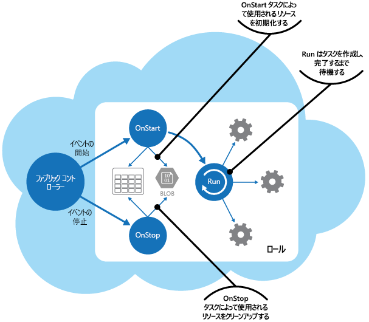

# <a name="compute-resource-consolidation-pattern"></a>コンピューティング リソース統合パターン

[!INCLUDE [header](../_includes/header.md)]

複数のタスクまたは操作を 1 つのコンピューティング単位に統合します。 これにより、コンピューティング リソースの使用率を高め、クラウドでホストされるアプリケーションでコンピューティング処理を実行することに関連するコストと管理オーバーヘッドを削減できます。

## <a name="context-and-problem"></a>コンテキストと問題

多くの場合、クラウド アプリケーションはさまざまな操作を実装しています。 一部のソリューションでは、最初に問題分離の設計原則に従い、これらの操作を、独立してホストされ、デプロイされる別個のコンピューティング単位 (別個の App Service Web アプリ、別個の仮想マシン、または別個の Cloud Service ロール) に分割するのが理にかなっています。 ただしこの戦略は、ソリューションの論理設計を簡略化する助けにはなりますが、多数のコンピューティング単位を同じアプリケーションの一部としてデプロイすることで、実行時のホストのコストが増加し、システムの管理がより複雑になる可能性があります。

例として、図に、複数のコンピューティング単位を使用して実装された、クラウドでホストされるソリューションの簡略化された構造を示します。 各コンピューティング単位は、独自の仮想環境で実行されます。 各機能は、独自のコンピューティング単位で実行される別個のタスク (タスク A からタスク E までラベル付けされてます) として実装されています。


各コンピューティング単位は、アイドル状態や軽い負荷で使用されているときでも課金対象のリソースを消費します。 そのため、これが常に最もコスト効果の高いソリューションであるとは限りません。

Azure では、この問題は Cloud Service、App Services、および仮想マシンのロールにも当てはまります。 これらの項目は、独自の仮想環境で実行されます。 適切に定義された操作のセットを実行するために設計されていても、単一ソリューションの一部として通信し、連携する必要がある別個のロール、Web サイト、または仮想マシンのコレクションを実行すると、リソースを非効率的に使用することになる可能性があります。

## <a name="solution"></a>解決策

コストの削減、使用率の向上、通信速度の向上、および管理の削減に役立つように、複数のタスクや操作を 1 つのコンピューティング単位に統合することが可能です。

タスクは、環境によって提供される機能と、それらの機能に関連するコストに基づく条件に従ってグループ化できます。 よく使われるのは、スケーラビリティ、有効期間、および処理の要件に関するプロファイルが類似しているタスクを探す方法です。 これらを一緒にグループ化すると、単位としてスケールできます。 多くのクラウド環境で提供される柔軟性により、コンピューティング単位の追加インスタンスをワークロードに従って開始および停止できます。 たとえば Azure には、Cloud Service、App Services、および仮想マシンのロールに適用できる自動スケールが用意されています。 詳細については、「[自動スケールのガイダンス](https://msdn.microsoft.com/library/dn589774.aspx)」を参照してください。

どの操作を一緒にグループ化してはいけないかを確認するため、スケーラビリティをどう使用できるかを示す逆の例として、次の 2 つのタスクについて考えてみてください。

- タスク 1 では、低い頻度でキューに送信される、時間的区別がないメッセージをポーリングします。
- タスク 2 では、急増する大量のネットワーク トラフィックを処理します。

2 番目のタスクでは、コンピューティング単位の多数のインスタンスの開始と停止を伴うことがある弾力性が求められます。 同じスケールを最初のタスクに適用すると、同じキューで頻度が低いメッセージをリッスンするタスクが増える結果となるだけで、それはリソースの無駄です。

多くのクラウド環境では、CPU コアの数、メモリ、ディスク領域などの点で、コンピューティング単位が使用できるリソースを指定することが可能です。 一般に、多くのリソースを指定するだけコストが増加します。 コストを節約するには、高価なコンピューティング単位が実行する作業を最大化し、長期間にわたってコンピューティング単位が非アクティブにならないようにすることが重要です。

短時間に CPU パワーを大量に必要とする複数のタスクがある場合、それらのタスクを、必要なパワーを提供する 1 つのコンピューティング単位に統合することを検討してください。 ただし、高価なリソースをビジー状態に維持する必要性と、リソースに負荷が掛りすぎた場合に発生する可能性がある競合とのバランスを取ることが重要です。 たとえば、実行時間が長く、多くのコンピューティング処理を要するタスクで同じコンピューティング単位を共有しないでください。

## <a name="issues-and-considerations"></a>問題と注意事項

このパターンを実装するときには、以下の点を考慮に入れてください。

**スケーラビリティと弾力性**。 多くのクラウド ソリューションでは、単位のインスタンスを開始および停止することで、コンピューティング単位のレベルでスケーラビリティと弾力性を実装しています。 スケーラビリティの要件が競合するタスクを、同じコンピューティング単位内にグループ化することは避けてください。

**有効期間**。 クラウド インフラストラクチャは、コンピューティング単位をホストする仮想環境を定期的にリサイクルします。 コンピューティング単位内に実行時間の長いタスクが多数あるときには、これらのタスクが完了するまで単位が再利用されないように単位を構成することが必要な場合があります。 または、チェックポイント型のアプローチを使用してタスクを設計します。これは、タスクを正常に停止し、コンピューティング単位が再開されたときにタスクの中断点から続行できるようにするアプローチです。

**リリースの周期**。 タスクの実装や構成が頻繁に変更される場合、更新されたコードをホストしているコンピューティング単位を停止し、単位の再構成と再デプロイをしてから、単位を再開する必要が生じることがあります。 このプロセスでは、同じコンピューティング単位内の他のタスクをすべて停止、再デプロイ、および再開することも必要になります。

**セキュリティ**。 同じコンピューティング単位内のタスクは、同じセキュリティ コンテキストを共有していて、同じリソースにアクセスできる可能性があります。 タスク間には高いレベルの信頼性があり、1 つのタスクが壊れたり他方に悪影響を及ぼしたりしないという確実性が存在する必要があります。 さらに、コンピューティング単位内で実行されるタスクの数を増やすことで、単位の攻撃対象領域が拡大します。 各タスクは、最も脆弱性が多いタスクと同じだけ安全です。

**フォールト トレランス**。 1 つのコンピューティング単位が失敗したり異常動作を起こしたりした場合、同じ単位内で実行中の他のタスクに影響する可能性があります。 たとえば、1 つのタスクが正常に起動できなかった場合、そのコンピューティング単位のスタートアップ ロジック全体の失敗が発生し、同じ単位内の他のタスクが実行されない可能性があります。

**競合**。 同じコンピューティング単位内のリソースに対して競合する、タスク間の競合が引き起こされないようにしてください。 理想的には、同じコンピューティング単位を共有するタスクは、異なるリソース使用率の特性を示す必要があります。 たとえば、多くのコンピューティング処理を要するタスクが 2 つある場合、それらはおそらく同じコンピューティング単位内にあってはならず、2 つのタスクはどちらも大量のメモリを消費してはいけません。 ただし、多くのコンピューティング処理を要するタスクと、大量のメモリを必要とするタスクは、混在を実現できる組み合わせです。

> [!NOTE]
>  オペレーターや開発者がシステムを監視し、各タスクが異なるリソースをどのように利用しているかを識別する_ヒート マップ_を作成できるように、一定期間にわたって運用環境にあったシステムだけのためにコンピューティング リソースを統合することを検討してください。 このマップを使用して、どのタスクがコンピューティング リソースを共有するのに適した候補であるかを特定できます。

**複雑さ**。 複数のタスクを 1 つのコンピューティング単位に組み合わせると、単位のコードの複雑さを高めることになり、テスト、デバッグ、および管理がより難しくなる可能性があります。

**安定した論理アーキテクチャ**。 タスクが実行される物理環境が実際に変わった場合でもコードの変更が必要にならないように、各タスクのコードを設計して実装します。

**その他の戦略**。 コンピューティング リソースの統合は、複数のタスクを同時に実行することに関連するコストの削減に役立つ方法の 1 つにすぎません。 それが効果的なアプローチであり続けるようにするには、慎重な計画と監視が必要です。 作業の性質や、これらのタスクを実行しているユーザーの所在地によっては、他の戦略がより適切な場合もあります。 たとえば (「[計算分割ガイダンス](https://msdn.microsoft.com/library/dn589773.aspx)」で説明されている) ワークロードの機能的分解が、より適したオプションとなる場合があります。

## <a name="when-to-use-this-pattern"></a>このパターンを使用する状況

このパターンは、独自のコンピューティング単位で実行されるとコスト効果が高くないタスクに使用してください。 タスクがその時間の多くをアイドル状態で費やしている場合、このタスクを専用の単位で実行するのはコスト高の可能性があります。

このパターンは、重要なフォールト トレランス操作を実行するタスクや、機密性の高いデータまたはプライベート データを処理し、独自のセキュリティ コンテキストを必要とするタスクには適さない場合があります。 これらのタスクは、別個のコンピューティング単位で、独自の分離された環境において実行する必要があります。

## <a name="example"></a>例

Azure でクラウド サービスを作成するときに、複数のタスクで実行される処理を 1 つのロールに統合することが可能です。 通常これは、バック グラウンド タスクまたは非同期処理タスクを実行する worker ロールです。

> 場合によっては、Web ロールにバック グラウンド タスクまたは非同期処理タスクを含めることができます。 この手法は、Web ロールで提供される、公開されたインターフェイスのスケーラビリティと応答性に影響を及ぼす場合がありますが、コストを削減し、デプロイを簡略化するのに役立ちます。 「[Combining Multiple Azure Worker Roles into an Azure Web Role (複数の Azure ワーカー ロールを 1 つの Azure Web ロールに集約)](http://www.31a2ba2a-b718-11dc-8314-0800200c9a66.com/2012/02/combining-multiple-azure-worker-roles.html)」という記事には、Web ロールにバック グラウンド タスクまたは非同期処理タスクを実装することの詳細な説明が含まれています。

このロールが、タスクの開始と停止を行います。 Azure ファブリック コント ローラーがロールを読み込むと、そのロールの `Start` イベントが発生します。 `WebRole` または `WorkerRole` クラスの `OnStart` メソッドデータをオーバーライドし、このイベントを処理できます。このメソッド内のタスクが依存するデータおよびその他のリソースを初期化するなどです。

`OnStart` メソッドが完了すると、ロールは要求への応答を開始できます。 ロールでの `OnStart` メソッドと `Run` メソッドの使用に関する詳細とガイダンスは、パターンとプラクティスに関するガイド「[Moving Applications to the Cloud (アプリケーションのクラウドへの移行)](https://msdn.microsoft.com/library/ff728592.aspx)」の「[Application Startup Processes (アプリケーションのスタートアップ プロセス)](https://msdn.microsoft.com/library/ff803371.aspx#sec16)」セクションに記載されています。

> `OnStart` メソッド内のコードはできるだけ簡潔に保ってください。 Azure はこのメソッドを完了するのにかかる時間に制限を適用しませんが、ロールは、このメソッドが完了するまで、送信されたネットワーク要求への応答を開始できません。

`OnStart` メソッドが完了すると、ロールは `Run` メソッドを実行します。 この時点で、ファブリック コント ローラーはロールへの要求の送信を開始できます。

実際にタスクを作成するコードを `Run` メソッド内に配置します。 `Run` メソッドがロール インスタンスの有効期間を定義することに注意してください。 このメソッドが完了したら、ファブリック コント ローラーが、シャット ダウンされるロールを準備します。

ロールがシャット ダウンまたはリサイクルされると、ファブリック コント ローラーは受信要求をロード バランサーからこれ以上受信しないようにして、`Stop` イベントを発生させます。 ロールの `OnStop` メソッドをオーバーライドすることでこのイベントをキャプチャし、ロールが終了する前に必要なすべての後処理を実行できます。

> `OnStop` メソッドで実行されるアクションはすべて、5 分 (ローカル コンピューターで Azure エミュレーターを使用している場合は 30 秒) 以内に完了する必要があります。 それ以外の場合、Azure ファブリック コント ローラーはロールが停止したと見なし、ロールを強制的に停止します。

タスクは、タスクが完了するまで待機する `Run` メソッドによって開始されます。 タスクはクラウド サービスのビジネス ロジックを実装し、Azure ロード バランサー経由でロールに投稿されたメッセージに応答できます。 図は、Azure クラウド サービスのロールのタスクとリソースのライフサイクルを示しています。




_ComputeResourceConsolidation.Worker_ プロジェクト内の _WorkerRole.cs_ ファイルに、Azure クラウド サービスにこのパターンを実装する方法の例が示されています。

> _ComputeResourceConsolidation.Worker_ プロジェクトは、[GitHub](https://github.com/mspnp/cloud-design-patterns/tree/master/compute-resource-consolidation) からダウンロードできる _ComputeResourceConsolidation_ ソリューションの一部です。

`MyWorkerTask1` メソッドと `MyWorkerTask2` メソッドは、同じ worker ロール内で異なるタスクを実行する方法を示しています。 次のコードは `MyWorkerTask1` を示しています。 これは、30 秒間スリープ状態になり、その後トレース メッセージを出力する単純なタスクです。 タスクが取り消されるまで、このプロセスが繰り返されます。 `MyWorkerTask2` 内のコードは同様です。

```csharp
// A sample worker role task.
private static async Task MyWorkerTask1(CancellationToken ct)
{
  // Fixed interval to wake up and check for work and/or do work.
  var interval = TimeSpan.FromSeconds(30);

  try
  {
    while (!ct.IsCancellationRequested)
    {
      // Wake up and do some background processing if not canceled.
      // TASK PROCESSING CODE HERE
      Trace.TraceInformation("Doing Worker Task 1 Work");

      // Go back to sleep for a period of time unless asked to cancel.
      // Task.Delay will throw an OperationCanceledException when canceled.
      await Task.Delay(interval, ct);
    }
  }
  catch (OperationCanceledException)
  {
    // Expect this exception to be thrown in normal circumstances or check
    // the cancellation token. If the role instances are shutting down, a
    // cancellation request will be signaled.
    Trace.TraceInformation("Stopping service, cancellation requested");

    // Rethrow the exception.
    throw;
  }
}
```

> サンプル コードは、バックグラウンド プロセスの一般的な実装を示しています。 実際のアプリケーションでは、キャンセル要求を待機するループの本体に独自の処理ロジックを配置する必要がある点を除いて、これと同じ構造にならうことができます。

worker ロールが、使用するリソースを初期化した後、`Run` メソッドは、次に示すように 2 つのタスクを同時に開始します。

```csharp
/// <summary>
/// The cancellation token source use to cooperatively cancel running tasks
/// </summary>
private readonly CancellationTokenSource cts = new CancellationTokenSource();

/// <summary>
/// List of running tasks on the role instance
/// </summary>
private readonly List<Task> tasks = new List<Task>();

// RoleEntry Run() is called after OnStart().
// Returning from Run() will cause a role instance to recycle.
public override void Run()
{
  // Start worker tasks and add to the task list
  tasks.Add(MyWorkerTask1(cts.Token));
  tasks.Add(MyWorkerTask2(cts.Token));

  foreach (var worker in this.workerTasks)
  {
      this.tasks.Add(worker);
  }

  Trace.TraceInformation("Worker host tasks started");
  // The assumption is that all tasks should remain running and not return,
  // similar to role entry Run() behavior.
  try
  {
    Task.WaitAll(tasks.ToArray());
  }
  catch (AggregateException ex)
  {
    Trace.TraceError(ex.Message);

    // If any of the inner exceptions in the aggregate exception
    // are not cancellation exceptions then re-throw the exception.
    ex.Handle(innerEx => (innerEx is OperationCanceledException));
  }

  // If there wasn't a cancellation request, stop all tasks and return from Run()
  // An alternative to canceling and returning when a task exits would be to
  // restart the task.
  if (!cts.IsCancellationRequested)
  {
    Trace.TraceInformation("Task returned without cancellation request");
    Stop(TimeSpan.FromMinutes(5));
  }
}
...
```

この例では、`Run` メソッドはタスクが完了するのを待機します。 タスクが取り消された場合、`Run` メソッドはロールがシャット ダウンされようとしていると見なし、終了する前に残りのタスクが取り消されるのを待ちます (最大で 5 分待機してから終了します)。 予期された例外のためにタスクが失敗した場合、`Run` メソッドはタスクを取り消します。

> `Run` メソッドには、失敗したタスクを再開したり、ロールが個々のタスクの停止と開始を行えるようにするコードを含めたりなど、より包括的な監視および例外処理の戦略を実装してもかまいません。

次のコードに示した `Stop` メソッドは、ファブリック コント ローラーがロール インスタンスをシャットダウンすると呼び出されます (`OnStop` メソッドから呼び出されます)。 コードは、タスクを取り消すと、適切に各タスクを停止します。 完了するまで 5 分以上かかったタスクがあると、`Stop` メソッド内の取り消し処理によって待機が終わり、ロールが終了されます。

```csharp
// Stop running tasks and wait for tasks to complete before returning
// unless the timeout expires.
private void Stop(TimeSpan timeout)
{
  Trace.TraceInformation("Stop called. Canceling tasks.");
  // Cancel running tasks.
  cts.Cancel();

  Trace.TraceInformation("Waiting for canceled tasks to finish and return");

  // Wait for all the tasks to complete before returning. Note that the
  // emulator currently allows 30 seconds and Azure allows five
  // minutes for processing to complete.
  try
  {
    Task.WaitAll(tasks.ToArray(), timeout);
  }
  catch (AggregateException ex)
  {
    Trace.TraceError(ex.Message);

    // If any of the inner exceptions in the aggregate exception
    // are not cancellation exceptions then rethrow the exception.
    ex.Handle(innerEx => (innerEx is OperationCanceledException));
  }
}
```

## <a name="related-patterns-and-guidance"></a>関連のあるパターンとガイダンス

このパターンを実装する場合は、次のパターンとガイダンスも関連している可能性があります。

- [自動スケール ガイダンス](https://msdn.microsoft.com/library/dn589774.aspx)。 処理で予想される需要に応じて、コンピューティング リソースをホストしているサービスのインスタンスを開始および停止するために、自動スケールを使用できます。

- [計算分割ガイダンス](https://msdn.microsoft.com/library/dn589773.aspx)。 サービスのスケーラビリティ、パフォーマンス、可用性、およびセキュリティを維持しながら実行コストを最小限に抑える 1 つの方法として、クラウド サービスのサービスとコンポーネントを割り当てる方法について説明します。

- このパターンには、ダウンロード可能な[サンプル アプリケーション](https://github.com/mspnp/cloud-design-patterns/tree/master/compute-resource-consolidation)が含まれています。
