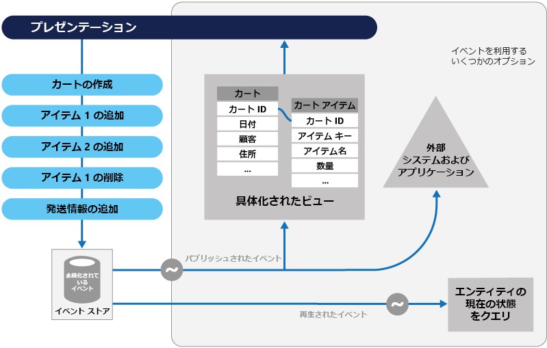
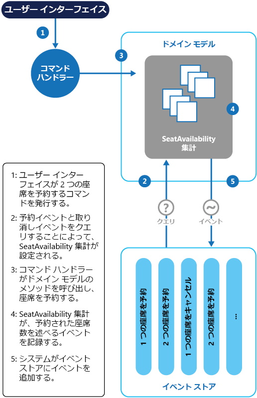

# イベント ソーシング パターン

[!INCLUDE [header](../_includes/header.md)]

ドメインに、データの現在の状態だけを格納する代わりに、追加専用ストアを使用して、そのデータに対して実行された一連のすべてのアクションを記録します。
ストアは、レコードのシステムとして機能し、ドメイン オブジェクトを具体化するために使用できます。 これにより、データ モデルとビジネス ドメインの同期の必要性を避けることで、パフォーマンス、スケーラビリティ、および応答性を向上させながら、複合ドメインでのタスクを簡略化できます。 さらに、トランザクション データの整合性を提供し、補正アクションを有効にできる完全な監査証跡と履歴を保持することもできます。

## コンテキストと問題

ほとんどのアプリケーションはデータを操作します。またアプリケーションの一般的なアプローチは、ユーザーがデータを操作したら、データを更新して、データの最新の状態を維持することです。 たとえば、従来の作成、読み取り、更新、および削除 (CRUD) モデルでの一般的なデータ処理は、ストアからデータを読み取り、何らかの変更を行い、(多くの場合にデータをロックするトランザクションを使用して) データの現在の状態を新しい値で更新することです。

CRUD アプローチにはいくつかの制限があります。

- CRUD システムは、データ ストアに対して直接更新操作を実行しますが、これにより、必要とする処理オーバーヘッドのためにパフォーマンスと応答性が低下し、スケーラビリティが制限される可能性があります。

- 多くの同時実行ユーザーがいるコラボレーション ドメインでは、更新操作がデータの単一のアイテムに対して行われるため、データ更新の競合が発生する可能性が高まります。

- 各操作の詳細を個別のログに記録する追加の監査メカニズムがない限り、履歴が失われます。

> CRUD アプローチの制限の詳細については、「[CRUD, Only When You Can Afford It](https://blogs.msdn.microsoft.com/maarten_mullender/2004/07/23/crud-only-when-you-can-afford-it-revisited/)」 (余裕がある場合にのみ CRUD を使用する) をご覧ください。

## 解決策

イベント ソーシング パターンは、一連のイベントによって制御されるデータへの操作の処理方法を定義し、各イベントが追加専用のストアに記録されます。 アプリケーション コードは、データに対して発生した各アクションを強制的に記述する一連のイベントをイベント ストアに送信し、そこでそれらが保持されます。 各イベントは、データに対する一連の変更を表します (`AddedItemToOrder` など)。

イベントは、データの現在の状態に関するレコードのシステム (権限のあるデータ ソース) として機能するイベント ストアに保持されます。 イベント ストアは、一般にこれらのイベントを公開し、コンシューマーが通知を受け取り、必要に応じてそれらを処理できるようにします。 コンシューマーはたとえば、イベント内の操作を他のシステムに適用するタスクを開始したり、操作を実行するために必要なその他の関連アクションを実行したりすることができます。 イベントを生成するアプリケーション コードは、イベントにサブスクライブするシステムから分離されていることに注意してください。

イベント ストアによって公開されているイベントの一般的な用途は、アプリケーションのアクションによってエンティティが変更されたとき、および外部システムとの統合のために、エンティティの具体化されたビューを保持することです。 たとえば、システムは、UI の一部の入力に使用されるすべての顧客注文の具体化されたビューを保持できます。 アプリケーションが新しい注文を追加したり、注文の商品を追加または削除したり、出荷情報を追加したりすると、これらの変更を記述するイベントを処理し、使用して、[具体化されたビュー](materialized-view.md)を更新できます。

また、いつでも、アプリケーションでイベントの履歴を読み取り、それを使用して、エンティティに関連するすべてのイベントを再生し、使用することで、そのエンティティの現在の状態を具体化できます。 これは、要求の処理時またはスケジュールされたタスクによって、オンデマンドでドメイン オブジェクトを具体化するために行うことができるため、プレゼンテーション層をサポートするために、エンティティの状態を具体化されたビューとして保存できます。

図は、具体化されたビューの作成、外部アプリケーションおよびシステムとのイベントの統合、特定のエンティティの現在の状態のプロジェクションを作成するためのイベントの再生などのイベント ストリームを使用する場合のいくつかのオプションを含む、パターンの概要を示しています。

イベント ソーシング パターンには次の利点があります。

イベントは不変であり、追加専用の操作を使用して保存できます。 イベントを開始したユーザー インターフェイス、ワークフロー、またはプロセスは続行でき、イベントを処理するタスクはバック グラウンドで実行できます。 これと、トランザクションの処理中に競合が発生しないことの組み合わせにより、特にプレゼンテーション レベルやユーザー インターフェイスで、アプリケーションのパフォーマンスとスケーラビリティが大幅に向上する可能性があります。

イベントは、イベントによって表されるアクションを記述するために必要な関連データと共に、発生したいくつかのアクションを記述する単純なオブジェクトです。 イベントは直接データ ストアを更新しません。 それらは、適時に処理するために記録されるだけです。 これにより、実装と管理が簡単になる可能性があります。

イベントは一般にドメイン専門家にとって意味がありますが、[オブジェクトリレーショナル インピーダンス ミスマッチ](https://en.wikipedia.org/wiki/Object-relational_impedance_mismatch)により、データベース テーブルが複雑になり、理解しにくくなる可能性があります。 テーブルは発生したイベントを表すのではなく、システムの現在の状態を表す人工的な構造物です。

イベント ソーシングは、データ ストア内のオブジェクトを直接更新する必要性を避けるため、同時更新による競合の発生を防ぐのに役立つ可能性があります。 ただし、ドメイン モデルは、不整合な状態になる可能性がある要求から、それ自体を保護するように設計する必要があります。

イベントの追加専用記憶域は、データ ストアに対して実行されるアクションを監視し、いつでもイベントを再生することによって、具体化されたビューまたはプロジェクションとして、現在の状態を再生成し、システムのテストおよびデバッグに役立てるために使用できる監査証跡を提供します。 さらに、変更を取り消すために補正イベントを使用するという要件は、元に戻された変更の履歴を提供しますが、これはモデルが現在の状態を保存しただけの場合には当てはまりません。 イベントのリストは、アプリケーションのパフォーマンスを分析したり、ユーザーの動作傾向を検出したり、またはその他の有益なビジネス情報を取得したりするために使用することもできます。

イベント ストアがイベントを発生し、タスクがそれらのイベントに対応して操作を実行します。 このイベントからのタスクの分離により、柔軟性と拡張性を提供します。 タスクは、イベントの種類とイベント データを認識しますが、イベントをトリガーした操作を認識しません。 さらに、複数のタスクで、各イベントを処理することができます。 これにより、イベント ストアによって生成された新しいイベントのみをリッスンする他のサービスやシステムと簡単に統合できます。 ただし、イベント ソーシング イベントは、きわめて低いレベルになる傾向があるため、代わりに特定の統合イベントを生成する必要がある可能性があります。

> イベント ソーシングは、イベントに対応して、データ管理タスクを実行することによって、および保存されたイベントからビューを具体化することによって、一般的に CQRS パターンと組み合わされます。

## 問題と注意事項

このパターンの実装方法を決めるときには、以下の点に注意してください。

システムは、イベントを再生することによって、具体化されたビューを作成するか、データのプロジェクションを生成するときに、最終的にのみ整合されます。 要求の処理の結果としてイベント ストアにイベントを追加するアプリケーション、公開されるイベント、およびそれらを処理するイベントのコンシューマー間にはいくらかの遅延が発生します。 この期間に、エンティティへの追加の変更を記述する新しいイベントがイベント ストアに到着している可能性があります。

> [!NOTE]
> 結果整合性に関する情報については、「[Data consistency primer](https://msdn.microsoft.com/library/dn589800.aspx)」 (データ整合性入門) をご覧ください。

イベント ストアは情報の永続的なソースであるため、イベント データが更新されてはなりません。 エンティティを更新して、変更を元に戻す唯一の方法は、補正イベントをイベント ストアに追加することです。 おそらく移行時に、永続化されたイベントの形式 (データはなく) を変更する必要がある場合、ストア内の既存のイベントと新しいバージョンを結合することが難しい可能性があります。 変更を行うすべてのイベントを、新しい形式に準拠するように反復処理するか、新しい形式を使用する新しいイベントを追加する必要がある可能性があります。 新旧両方のイベント形式を維持するには、イベント スキーマの各バージョンのバージョン スタンプを使用することを検討してください。

マルチスレッド アプリケーションとアプリケーションの複数インスタンスがイベント ストアにイベントを保存する可能性があります。 イベント ストア内のイベントの整合性は重要であり、特定のエンティティに影響するイベントの順序も重要です (エンティティに対して発生した変更の順序は、その現在の状態に影響します)。 すべてのイベントにタイムスタンプを追加すると、問題の回避に役立ちます。 別の一般的な方法は、要求の結果としての各イベントに、増分識別子で注釈を付けることです。 2 つのアクションが同時に同じエンティティについてのイベントを追加しようとした場合に、イベント ストアは、既存のエンティティ識別子およびイベント識別子に一致するイベントを拒否できます。

イベントを読み取って情報を取得するための標準のアプローチや SQL クエリのような既存のメカニズムはありません。 抽出できる唯一のデータは、条件としてイベント識別子を使用するイベントのストリームです。 イベント ID は一般に個別のエンティティにマップします。 エンティティの現在の状態は、そのエンティティの元の状態に照らして、それに関連するすべてのイベントを再生することによってのみ判断できます。

各イベント ストリームの長さは、システムの管理と更新に影響します。 ストリームが大きい場合、指定した数のイベントなどの特定の間隔でスナップショットを作成することを検討してください。 エンティティの現在の状態は、スナップショットから、および特定の時点以降に発生したイベントを再生することにより、取得できます。 データのスナップショットの作成の詳細については、[Martin Fowler のエンタープライズ アプリケーション アーキテクチャのスナップショット Web サイト](http://martinfowler.com/eaaDev/Snapshot.html)と「[Master-Subordinate Snapshot Replication](https://msdn.microsoft.com/library/ff650012.aspx)」 (マスター/従属スナップショット レプリケーション) をご覧ください。

イベント ソーシングは、データへの更新の競合の可能性を最小にしますが、それでもなおアプリケーションでは結果整合性とトランザクションの欠如の結果としての不整合を処理できる必要があります。 たとえば、その商品の注文が行われている間に、在庫ストックの減少を示すイベントがデータ ストアに到着したため、結果として顧客にアドバイスするか、取り寄せ注文を作成することによって、2 つの操作を調整する要件が発生することがあります。

イベントの公開は「少なくとも 1 回」になるため、イベントのコンシューマーはべき等である必要があります。 それらは、イベントが複数回処理される場合に、イベントに記述されている更新を再適用すべきではありません。 たとえば、コンシューマーの複数のインスタンスが、発注の合計数などのエンティティのプロパティを保持し、集計する場合に、発注イベントが発生したときに、1 つのインスタンスのみが集計の増分に成功する必要があります。 これは、イベント ソーシングの主要な特性ではありませんが、一般的な実装上の決定です。

## このパターンを使用する状況

このパターンは、次のシナリオで使用します。

- データ内のインテント、目的、または理由をキャプチャする場合。 たとえば、顧客エンティティの変更を、_転居_、_アカウントの削除_、または_死亡_などの一連の特定のイベントの種類として、キャプチャできます。

- データへの更新の競合の発生を最小限に抑えるか、完全に避けることが不可欠な場合。

- 発生するイベントを記録したり、システムの状態を復元するためにそれらを再生できるようにしたり、変更をロールバックしたり、履歴および監査ログを記録したりする場合。 たとえばタスクに、更新を元に戻すアクションを実行するために必要な複数のステップが含まれ、さらに、データを整合性のある状態に戻すいくつかのステップを再生する場合などです。

- イベントの使用は、アプリケーションの操作の自然な機能であり、追加の開発や実装作業はほとんど必要ありません。

- これらのアクションを適用するために必要なタスクから、データの入力や更新のプロセスを分離する必要がある場合。 これにより、UI パフォーマンスが向上したり、イベントが発生したときにアクションを実行する他のリスナーにイベントを配布したりすることができます。 たとえば、給与支払いシステムと経費提出 Web サイトを統合し、Web サイトで行われたデータ更新への対応で、イベント ストアによって発行されたイベントが、Web サイトと給与支払いシステムの両方で使用されるようにします。

- 具体化されたモデルとエンティティ データの形式を変更できるようにする柔軟性が必要な場合、または &mdash;CQRS と組み合わせて使用する&mdash;場合は、データを公開する読み取りモデルまたはビューを適合させる必要があります。

- CQRS と組み合わせて使用し、読み取りモデルの更新中に、結果整合性が許容できる場合、またはイベント ストリームからのエンティティおよびデータのリハイドレート中のパフォーマンスへの影響が許容できる場合。

このパターンは、次の状況では有効でない場合があります。

- 小規模または単純なドメイン、ビジネス ロジックがほとんどまたはまったく含まれていないシステム、または従来の CRUD データ管理メカニズムと自然にうまく連携する非ドメイン システム。

- データのビューの整合性とリアルタイムの更新が必要なシステム。

- 監査証跡、履歴、およびアクションをロールバックし、再生する機能が必要でないシステム。

- 基になるデータへの更新の競合の発生がきわめて少ないシステム。 たとえば、データを更新せずに、ほとんどデータを追加するシステムなどです。

## 例

会議管理システムでは、可能性のある出席者が予約しようとするときに、席がまだ空いているかどうかを確認できるように、完了した会議の予約の数を追跡する必要があります。 システムでは、少なくとも 2 つの方法で、会議の予約の合計数を格納できます。

- システムは、予約情報を保持するデータベース内の個別のエンティティとして、予約の合計数に関する情報を格納できます。 予約が行われるか、取り消されると、システムは必要に応じてこの数を増分または減分できます。 このアプローチは理論上は単純ですが、多数の出席者が短時間に席を予約しようとした場合に、スケーラビリティの問題が発生する可能性があります。 たとえば、予約期間が終わる前の最終日などです。

- システムは、イベント ストアに保持されるイベントとして、予約と取り消しに関する情報を格納できます。 さらに、これらのイベントを再生することにより、空席数を計算できます。 このアプローチは、イベントの不変性のため、スケーラビリティが向上する可能性があります。 システムは、イベント ストアからデータを読み取ったり、イベント ストアにデータを追加したりできる必要があるだけです。 予約と取り消しに関するイベント情報が変更されることはありません。

次の図は、イベント ソーシングを使用して、会議管理システムの座席予約サブシステムを実装する方法を示しています。

2 つの座席を予約するためのアクションのシーケンスは次のようになります。

1. ユーザー インターフェイスは、2 名の出席者の座席を予約するコマンドを発行します。 コマンドは、個別のコマンド ハンドラーによって処理されます。 ユーザー インターフェイスから分離され、コマンドとして投稿された要求の処理を担当するロジックの一部。

2. 予約と取り消しを示すイベントをクエリすることによって、会議のすべての予約に関する情報を含む集計が構築されます。 この集計は、`SeatAvailability` と呼ばれ、集計内のデータのクエリと変更のメソッドを公開するドメイン モデル内に含まれます。

    > 考慮すべきいくつかの最適化は、スナップショットの使用 (集計の現在の状態を取得するために、すべてのイベントをクエリし、再生する必要がないように) とメモリ内に集計のキャッシュされたコピーを保持することです。

3. コマンド ハンドラーは、ドメイン モデルによって公開されたメソッドを呼び出し、予約を行います。

4. `SeatAvailability` 集計は予約された座席数を格納するイベントを記録します。 次回にイベントに集計が適用されたときに、すべての予約を使用して、残席数が計算されます。

5. システムは、イベント ストア内のイベントの一覧に新しいイベントを追加します。

ユーザーが座席をキャンセルした場合、コマンド ハンドラーが座席取り消しイベントを生成し、それをイベント ストアに追加することを除いて、システムは同様のプロセスに従います。

スケーラビリティのためのスコープの拡大に加えて、イベント ストアを使用することで、会議の予約と取り消しの完全な履歴または監査証跡も提供します。 イベント ストア内のイベントは、正確なレコードです。 システムはイベントを簡単に再生し、任意の時点に状態を復元できるため、他の方法で集計を保持する必要はありません。

> この例の詳細については、「[Introducing Event Sourcing](https://msdn.microsoft.com/library/jj591559.aspx)」 (イベント ソーシングの導入) をご覧ください。

## 関連のあるパターンとガイダンス

このパターンを実装する場合は、次のパターンとガイダンスも関連している可能性があります。

- [コマンド クエリ責務分離 (CQRS) パターン](cqrs.md)。 CQRS 実装についての情報の永続的なソースを提供する書き込みストアは、イベント ソーシング パターンの実装に基づくことがあります。 個別のインターフェイスを使用して、データを更新する操作から、アプリケーションでデータを読み取る操作を分離する方法について説明します。

- [具体化されたビュー パターン](materialized-view.md)。 イベント ソーシングに基づいて、システムで使用されるデータ ストアは、一般に効率的なクエリに適していません。 代わりに、一般的なアプローチは、一定の間隔で、またはデータが変更されたときに、データの事前設定済みのビューを生成することです。 この実行方法を示します。

- [補正トランザクション パターン](compensating-transaction.md)。 イベント ソーシング ストア内の既存のデータは更新されず、代わりにエンティティの状態を新しい値に切り替える新しいエントリが追加されます。 変更を元に戻すには、単純に以前の変更を元に戻すことができないため、補正エントリを使用します。 以前の操作によって実行された作業を元に戻す方法について説明します。

- [Data consistency primer (データ整合性入門)](https://msdn.microsoft.com/library/dn589800.aspx)。 個別の読み取りストアまたは具体化されたビューでイベント ソーシングを使用すると、読み取られたデータはすぐに整合されるのではなく、最終的にのみ整合されます。 分散データの整合性の維持に関連する問題をまとめています。

- [データのパーティション分割のガイダンス](https://msdn.microsoft.com/library/dn589795.aspx)。 イベント ソーシングを使用してスケーラビリティを向上させ、競合を少なくし、パフォーマンスを最適化する際に、データをパーティション分割することがあります。 データを個別のパーティションに分割する方法と発生する可能性がある問題について説明します。

- Greg Young の投稿「[Why use Event Sourcing?](http://codebetter.com/gregyoung/2010/02/20/why-use-event-sourcing/)」 (イベント ソーシングを使用する理由)。
