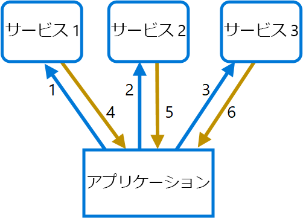
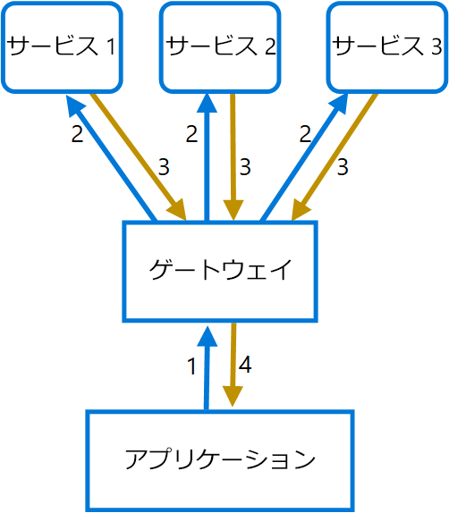

# <a name="gateway-aggregation-pattern"></a><span data-ttu-id="190fe-104">ゲートウェイ集約パターン</span><span class="sxs-lookup"><span data-stu-id="190fe-104">Gateway Aggregation pattern</span></span>

<span data-ttu-id="190fe-105">ゲートウェイを使用して、複数の個々の要求を 1 つの要求に集約します。</span><span class="sxs-lookup"><span data-stu-id="190fe-105">Use a gateway to aggregate multiple individual requests into a single request.</span></span> <span data-ttu-id="190fe-106">このパターンは、クライアントが操作を実行するために、さまざまなバックエンド システムに複数の呼び出しを行う必要がある場合に便利です。</span><span class="sxs-lookup"><span data-stu-id="190fe-106">This pattern is useful when a client must make multiple calls to different backend systems to perform an operation.</span></span>

## <a name="context-and-problem"></a><span data-ttu-id="190fe-107">コンテキストと問題</span><span class="sxs-lookup"><span data-stu-id="190fe-107">Context and problem</span></span>

<span data-ttu-id="190fe-108">1 つのタスクを実行するには、クライアントはさまざまなバックエンド サービスへの呼び出しを行う必要があります。</span><span class="sxs-lookup"><span data-stu-id="190fe-108">To perform a single task, a client may have to make multiple calls to various backend services.</span></span> <span data-ttu-id="190fe-109">タスクを実行するのに多くのサービスに依存するアプリケーションでは、要求ごとにリソースを展開する必要があります。</span><span class="sxs-lookup"><span data-stu-id="190fe-109">An application that relies on many services to perform a task must expend resources on each request.</span></span> <span data-ttu-id="190fe-110">アプリケーションに新しい機能やサービスが追加されると、追加の要求が必要になり、リソース要件およびネットワーク呼び出しが増加します。</span><span class="sxs-lookup"><span data-stu-id="190fe-110">When any new feature or service is added to the application, additional requests are needed, further increasing resource requirements and network calls.</span></span> <span data-ttu-id="190fe-111">このクライアントとバックエンド間の頻繁な通信が、アプリケーションのパフォーマンスとスケールに悪影響を及ぼす可能性があります。</span><span class="sxs-lookup"><span data-stu-id="190fe-111">This chattiness between a client and a backend can adversely impact the performance and scale of the application.</span></span>  <span data-ttu-id="190fe-112">サービス間で大量の呼び出しがある小さなサービスを中心にアプリケーションが構築されるマイクロサービス アーキテクチャでは、より頻繁にこの問題が発生します。</span><span class="sxs-lookup"><span data-stu-id="190fe-112">Microservice architectures have made this problem more common, as applications built around many smaller services naturally have a higher amount of cross-service calls.</span></span>

<span data-ttu-id="190fe-113">次の図では、クライアントは、各サービスに要求を送信します (1、2、3)。</span><span class="sxs-lookup"><span data-stu-id="190fe-113">In the following diagram, the client sends requests to each service (1,2,3).</span></span> <span data-ttu-id="190fe-114">サービスはそれぞれ要求メッセージを処理し、アプリケーションに応答を送り返します (4、5、6)。</span><span class="sxs-lookup"><span data-stu-id="190fe-114">Each service processes the request and sends the response back to the application (4,5,6).</span></span> <span data-ttu-id="190fe-115">一般的に待機時間の長い携帯ネットワークでは、この方法で個々の要求を使用することは効率が悪く、接続が切断されたり、要求が不完全になったりする可能性があります。</span><span class="sxs-lookup"><span data-stu-id="190fe-115">Over a cellular network with typically high latency, using individual requests in this manner is inefficient and could result in broken connectivity or incomplete requests.</span></span> <span data-ttu-id="190fe-116">要求は並列で実行できますが、アプリケーションは各要求のデータをすべて個別の接続で送信、待機、および処理する必要があるため、エラーが発生する可能性が高くなります。</span><span class="sxs-lookup"><span data-stu-id="190fe-116">While each request may be done in parallel, the application must send, wait, and process data for each request, all on separate connections, increasing the chance of failure.</span></span>



## <a name="solution"></a><span data-ttu-id="190fe-118">解決策</span><span class="sxs-lookup"><span data-stu-id="190fe-118">Solution</span></span>

<span data-ttu-id="190fe-119">ゲートウェイを使用すると、クライアントとサービス間の頻繁な通信を削減できます。</span><span class="sxs-lookup"><span data-stu-id="190fe-119">Use a gateway to reduce chattiness between the client and the services.</span></span> <span data-ttu-id="190fe-120">ゲートウェイはクライアント要求を受信し、さまざまなバックエンド システムに要求をディスパッチして結果を集計し、それらを要求元のクライアントに送り返します。</span><span class="sxs-lookup"><span data-stu-id="190fe-120">The gateway receives client requests, dispatches requests to the various backend systems, and then aggregates the results and sends them back to the requesting client.</span></span>

<span data-ttu-id="190fe-121">このパターンでは、アプリケーションがバックエンド サービスに対して行う要求の数を削減して、待機時間の長いネットワーク経由でのアプリケーションのパフォーマンスを向上することができます。</span><span class="sxs-lookup"><span data-stu-id="190fe-121">This pattern can reduce the number of requests that the application makes to backend services, and improve application performance over high-latency networks.</span></span>

<span data-ttu-id="190fe-122">次の図では、アプリケーションはゲートウェイに要求を送信します (1)。</span><span class="sxs-lookup"><span data-stu-id="190fe-122">In the following diagram, the application sends a request to the gateway (1).</span></span> <span data-ttu-id="190fe-123">要求には、追加の要求のパッケージが含まれています。</span><span class="sxs-lookup"><span data-stu-id="190fe-123">The request contains a package of additional requests.</span></span> <span data-ttu-id="190fe-124">ゲートウェイがこれらを分解し、関連するサービスに各要求を送信して (2) 処理します。</span><span class="sxs-lookup"><span data-stu-id="190fe-124">The gateway decomposes these and processes each request by sending it to the relevant service (2).</span></span> <span data-ttu-id="190fe-125">各サービスが応答をゲートウェイに返します (3)。</span><span class="sxs-lookup"><span data-stu-id="190fe-125">Each service returns a response to the gateway (3).</span></span> <span data-ttu-id="190fe-126">ゲートウェイは、各サービスからの応答を結合し、アプリケーションに応答を送信します (4)。</span><span class="sxs-lookup"><span data-stu-id="190fe-126">The gateway combines the responses from each service and sends the response to the application (4).</span></span> <span data-ttu-id="190fe-127">アプリケーションは、1 つの要求を行い、ゲートウェイから 1 つの応答のみを受信します。</span><span class="sxs-lookup"><span data-stu-id="190fe-127">The application makes a single request and receives only a single response from the gateway.</span></span>



## <a name="issues-and-considerations"></a><span data-ttu-id="190fe-129">問題と注意事項</span><span class="sxs-lookup"><span data-stu-id="190fe-129">Issues and considerations</span></span>

- <span data-ttu-id="190fe-130">ゲートウェイがバックエンド間のサービス結合を行わないようにする必要があります。</span><span class="sxs-lookup"><span data-stu-id="190fe-130">The gateway should not introduce service coupling across the backend services.</span></span>
- <span data-ttu-id="190fe-131">できる限り待機時間を短縮するため、ゲートウェイはバックエンド サービスの近くに配置する必要があります。</span><span class="sxs-lookup"><span data-stu-id="190fe-131">The gateway should be located near the backend services to reduce latency as much as possible.</span></span>
- <span data-ttu-id="190fe-132">ゲートウェイ サービスによって、単一障害点が生じる可能性があります。</span><span class="sxs-lookup"><span data-stu-id="190fe-132">The gateway service may introduce a single point of failure.</span></span> <span data-ttu-id="190fe-133">アプリケーションの可用性の要件が満たされるように、ゲートウェイが適切に設計されていることを確認してください。</span><span class="sxs-lookup"><span data-stu-id="190fe-133">Ensure the gateway is properly designed to meet your application's availability requirements.</span></span>
- <span data-ttu-id="190fe-134">ゲートウェイによって、ボトルネックが生じる可能性があります。</span><span class="sxs-lookup"><span data-stu-id="190fe-134">The gateway may introduce a bottleneck.</span></span> <span data-ttu-id="190fe-135">負荷を処理するための適切なパフォーマンスがゲートウェイに備わっており、予測した成長に応じて拡張できることを確認してください。</span><span class="sxs-lookup"><span data-stu-id="190fe-135">Ensure the gateway has adequate performance to handle load and can be scaled to meet your anticipated growth.</span></span>
- <span data-ttu-id="190fe-136">サービスの連鎖的なエラーが発生しないように、ゲートウェイに対してロード テストを実行します。</span><span class="sxs-lookup"><span data-stu-id="190fe-136">Perform load testing against the gateway to ensure you don't introduce cascading failures for services.</span></span>
- <span data-ttu-id="190fe-137">[バルクヘッド][bulkhead]、[サーキット ブレーク][circuit-breaker]、[再試行][retry]、タイムアウトなどの手法を使用して、耐障害性のある設計を実装します。</span><span class="sxs-lookup"><span data-stu-id="190fe-137">Implement a resilient design, using techniques such as [bulkheads][bulkhead], [circuit breaking][circuit-breaker], [retry][retry], and timeouts.</span></span>
- <span data-ttu-id="190fe-138">1 つまたは複数のサービスの呼び出しに時間がかかりすぎる場合、タイムアウトが許容され、データの部分的なセットが返されることがあります。</span><span class="sxs-lookup"><span data-stu-id="190fe-138">If one or more service calls takes too long, it may be acceptable to timeout and return a partial set of data.</span></span> <span data-ttu-id="190fe-139">アプリケーションがこのシナリオを処理する方法を検討してください。</span><span class="sxs-lookup"><span data-stu-id="190fe-139">Consider how your application will handle this scenario.</span></span>
- <span data-ttu-id="190fe-140">非同期 I/O を使用して、バックエンドでの遅延によってアプリケーションでパフォーマンスの問題が発生しないようにしてください。</span><span class="sxs-lookup"><span data-stu-id="190fe-140">Use asynchronous I/O to ensure that a delay at the backend doesn't cause performance issues in the application.</span></span>
- <span data-ttu-id="190fe-141">相関 ID を使用して分散トレースを実装し、個々の呼び出しを追跡します。</span><span class="sxs-lookup"><span data-stu-id="190fe-141">Implement distributed tracing using correlation IDs to track each individual call.</span></span>
- <span data-ttu-id="190fe-142">要求メトリックおよび応答のサイズを監視します。</span><span class="sxs-lookup"><span data-stu-id="190fe-142">Monitor request metrics and response sizes.</span></span>
- <span data-ttu-id="190fe-143">エラーを処理するため、キャッシュ データをフェールオーバー戦略として返すことを検討してください。</span><span class="sxs-lookup"><span data-stu-id="190fe-143">Consider returning cached data as a failover strategy to handle failures.</span></span>
- <span data-ttu-id="190fe-144">ゲートウェイに集約を構築する代わりに、ゲートウェイの背後に集約サービスを配置することを検討してください。</span><span class="sxs-lookup"><span data-stu-id="190fe-144">Instead of building aggregation into the gateway, consider placing an aggregation service behind the gateway.</span></span> <span data-ttu-id="190fe-145">要求の集約には、ゲートウェイの他のサービスとは異なるリソース要件がある可能性があり、ゲートウェイのルーティングおよびオフロード機能に影響を及ぼすことがあります。</span><span class="sxs-lookup"><span data-stu-id="190fe-145">Request aggregation will likely have different resource requirements than other services in the gateway and may impact the gateway's routing and offloading functionality.</span></span>

## <a name="when-to-use-this-pattern"></a><span data-ttu-id="190fe-146">このパターンを使用する状況</span><span class="sxs-lookup"><span data-stu-id="190fe-146">When to use this pattern</span></span>

<span data-ttu-id="190fe-147">このパターンは次の状況で使用します。</span><span class="sxs-lookup"><span data-stu-id="190fe-147">Use this pattern when:</span></span>

- <span data-ttu-id="190fe-148">クライアントは、操作を実行するために、複数のバックエンド サービスと通信する必要があります。</span><span class="sxs-lookup"><span data-stu-id="190fe-148">A client needs to communicate with multiple backend services to perform an operation.</span></span>
- <span data-ttu-id="190fe-149">クライアントは、携帯ネットワークなどの待機時間が長いネットワークを使用することがあります。</span><span class="sxs-lookup"><span data-stu-id="190fe-149">The client may use networks with significant latency, such as cellular networks.</span></span>

<span data-ttu-id="190fe-150">このパターンは、次の状況では適切でない可能性があります。</span><span class="sxs-lookup"><span data-stu-id="190fe-150">This pattern may not be suitable when:</span></span>

- <span data-ttu-id="190fe-151">複数の操作で、クライアントと 1 つのサービス間の呼び出しの回数を削減したい場合。</span><span class="sxs-lookup"><span data-stu-id="190fe-151">You want to reduce the number of calls between a client and a single service across multiple operations.</span></span> <span data-ttu-id="190fe-152">このシナリオでは、サービスにバッチ操作を追加すると効果的である可能性があります。</span><span class="sxs-lookup"><span data-stu-id="190fe-152">In that scenario, it may be better to add a batch operation to the service.</span></span>
- <span data-ttu-id="190fe-153">クライアントまたはアプリケーションがバックエンド サービスの近くに配置されており、待機時間が重要な要因ではない場合。</span><span class="sxs-lookup"><span data-stu-id="190fe-153">The client or application is located near the backend services and latency is not a significant factor.</span></span>

## <a name="example"></a><span data-ttu-id="190fe-154">例</span><span class="sxs-lookup"><span data-stu-id="190fe-154">Example</span></span>

<span data-ttu-id="190fe-155">次の例では、Lua を使用してシンプルなゲートウェイ集約 NGINX サービスを作成する方法を示します。</span><span class="sxs-lookup"><span data-stu-id="190fe-155">The following example illustrates how to create a simple a gateway aggregation NGINX service using Lua.</span></span>

```lua
worker_processes  4;

events {
  worker_connections 1024;
}

http {
  server {
    listen 80;

    location = /batch {
      content_by_lua '
        ngx.req.read_body()

        -- read json body content
        local cjson = require "cjson"
        local batch = cjson.decode(ngx.req.get_body_data())["batch"]

        -- create capture_multi table
        local requests = {}
        for i, item in ipairs(batch) do
          table.insert(requests, {item.relative_url, { method = ngx.HTTP_GET}})
        end

        -- execute batch requests in parallel
        local results = {}
        local resps = { ngx.location.capture_multi(requests) }
        for i, res in ipairs(resps) do
          table.insert(results, {status = res.status, body = cjson.decode(res.body), header = res.header})
        end

        ngx.say(cjson.encode({results = results}))
      ';
    }

    location = /service1 {
      default_type application/json;
      echo '{"attr1":"val1"}';
    }

    location = /service2 {
      default_type application/json;
      echo '{"attr2":"val2"}';
    }
  }
}
```

## <a name="related-guidance"></a><span data-ttu-id="190fe-156">関連するガイダンス</span><span class="sxs-lookup"><span data-stu-id="190fe-156">Related guidance</span></span>

- [<span data-ttu-id="190fe-157">フロントエンド パターン用バックエンド</span><span class="sxs-lookup"><span data-stu-id="190fe-157">Backends for Frontends pattern</span></span>](./backends-for-frontends.md)
- <span data-ttu-id="190fe-158">[Gateway Offloading pattern](./gateway-offloading.md) (ゲートウェイ オフロード パターン)</span><span class="sxs-lookup"><span data-stu-id="190fe-158">[Gateway Offloading pattern](./gateway-offloading.md)</span></span>
- <span data-ttu-id="190fe-159">[Gateway Routing pattern](./gateway-routing.md) (ゲートウェイ ルーティング パターン)</span><span class="sxs-lookup"><span data-stu-id="190fe-159">[Gateway Routing pattern](./gateway-routing.md)</span></span>

[bulkhead]: ./bulkhead.md
[circuit-breaker]: ./circuit-breaker.md
[retry]: ./retry.md