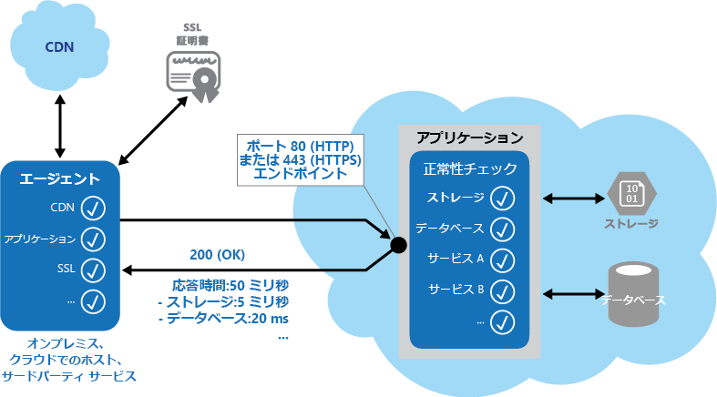

# <a name="health-endpoint-monitoring-pattern"></a>正常性エンドポイントの監視パターン

[!INCLUDE [header](../_includes/header.md)]

公開されたエンドポイントを通じて外部ツールが定期的にアクセスできる機能チェックをアプリケーションに実装します。 これは、アプリケーションとサービスが正常に実行されていることを確認するのに役立ちます。

## <a name="context-and-problem"></a>コンテキストと問題

Web アプリケーションとバックエンド サービスを監視して、それらが利用可能で正しく実行されるようにすることは、望ましい取り組みであり、多くの場合、ビジネスの要件でもあります。 しかし、クラウドで実行されているサービスの監視は、オンプレミスのサービスの監視よりも困難です。 たとえば、ホスティング環境は完全に制御することができません。また、サービスは通常、プラットフォーム ベンダーなどが提供する他のサービスに依存しています。

クラウドでホストされているアプリケーションに影響する要素は、ネットワーク待ち時間、基盤となるコンピューティング システムおよびストレージ システムのパフォーマンスと可用性、それらの間のネットワーク帯域幅など、多数あります。 サービスは、これらの要素のいずれかが原因で、完全に失敗することもあれば、部分的に失敗することもあります。 そのため、必要なレベルの可用性が確保されるよう、サービスが正常に実行されていることを定期的に確認する必要があります。これは、場合によってはサービス レベル アグリーメント (SLA) に含まれています。

## <a name="solution"></a>解決策

アプリケーションのエンドポイントに要求を送信して、正常性の監視を実装します。 アプリケーションによって必要なチェックが実行され、その状態を示す値が返されます。

通常、正常性の監視のチェックでは 2 つの要素が組み合わされます。

- 正常性確認エンドポイントへの要求に応じて、アプリケーションまたはサービスによって実行されるチェック (ある場合)。
- 正常性確認チェックを実行するツールまたはフレームワークによる結果の分析。

応答コードは、アプリケーションの状態のほか、必要に応じて、そのアプリケーションで使用されているコンポーネントまたはサービスの状態も示します。 待ち時間または応答時間のチェックは、監視ツールまたはフレームワークによって実行されます。 この図は、パターンの概要を示しています。



アプリケーションの正常性監視コードによって実行されるその他のチェックには、以下があります。

- クラウド ストレージまたはデータベースの可用性と応答時間のチェック。
- アプリケーション内にあるその他のリソースやサービス、または他の場所にあるがアプリケーションで使用されるその他のリソースやサービスのチェック。

Web アプリケーションを監視するサービスとツールを利用できます。Web アプリケーションを監視するには、構成可能な一連のエンドポイントに要求を送信し、構成可能な一連のルールに基づいて結果を評価します。 システムでいくつかの機能テストを実行することだけが目的のサービス エンドポイントの作成は比較的簡単です。

監視ツールで実行できる一般的なチェックには、以下があります。

- 応答コードの確認。 たとえば HTTP 応答 200 (OK) は、アプリケーションがエラーなしで応答したことを示します。 監視システムは、より包括的な結果が得られるように、他の応答コードをチェックする場合もあります。
- 200 (OK) 状態コードが返された場合でもエラーを検出することを目的とした、応答の内容のチェック。 これにより、返された Web ページまたはサービスの応答の一部にのみ影響するエラーを検出できます。 たとえば、ページのタイトルのチェックや、正しいページが返されたことを示す特定のフレーズの検索です。
- 応答時間の測定。この応答時間は、ネットワーク待ち時間とアプリケーションが要求の実行に要した時間を足した時間を指します。 値が大きくなると、アプリケーションまたはネットワークで新しく発生した問題を示唆している可能性があります。
- アプリケーション外のリソースまたはサービスのチェック (グローバルなキャッシュからコンテンツを配信するためにアプリケーションで使用されているコンテンツ配信ネットワークなど)。
- SSL 証明書の期限切れのチェック。
- DNS の待ち時間およびエラーを測定することを目的とした、アプリケーションの URL に対する DNS 参照の応答時間の測定。
- 正しいエントリを確保することを目的とした、DNS 参照によって返される URL の検証。 これは、DNS サーバーへの攻撃が成功して悪意のある要求リダイレクトが行われるのを防ぐうえで役に立ちます。

また、可能であれば、これらのチェックをさまざまなオンプレミスの場所またホストされた場所から実行し、応答時間の測定と比較を行うことも役立ちます。 理想的には、顧客に近い場所からアプリケーションを監視し、それぞれの場所からのパフォーマンスを正確に把握することが推奨されます。 チェック メカニズムの堅牢性を高めることができるうえ、アプリケーションのデプロイ場所を決定したり、それを複数のデータセンターにデプロイするかどうかを決定したりする際に、結果が役に立ちます。

またテストは、顧客が使用するすべてのサービス インスタンスに対して実行し、アプリケーションがすべての顧客に対して正常に動作していることを確認する必要があります。 たとえば、顧客のストレージが複数のストレージ アカウントに分散されている場合、監視プロセスではこれらをすべてチェックする必要があります。

## <a name="issues-and-considerations"></a>問題と注意事項

このパターンの実装方法を決めるときには、以下の点に注意してください。

応答を確認する方法。 たとえば、アプリケーションが正常に動作していることを確認するには、200 (OK) 状態コードだけで十分でしょうか。 これは、アプリケーション可用性の最も基本的な基準であり、このパターンの最低限の実装である一方、アプリケーションの動作、傾向、問題発生の可能性に関する情報をほとんど提供してくれません。

   > 200 (OK) がアプリケーションによって正常に返されるのは、ターゲット リソースが見つかって処理された場合のみであることを確認してください。 一部のシナリオ (ターゲット Web ページのホストにマスター ページを使用している場合など) では、ターゲットのコンテンツ ページが見つからなかった場合でも、サーバーから 404 (見つかりません) コードではなく 200 (OK) 状態コードが返されます。

アプリケーション用に公開されるエンドポイントの数。 1 つのアプローチとしては、アプリケーションによって使用されるコア サービス用に少なくとも 1 つのエンドポイントを公開し、優先度の低いサービス用に別のエンドポイントを公開する方法があります。これにより、それぞれの監視結果に異なる重要度を割り当てることができます。 また、監視の粒度を高めるために、(コア サービスごとに 1 つなど) 公開するエンドポイントを増やすことも検討します。 たとえば、正常性確認チェックでは、アプリケーションで使用されるデータベース、ストレージ、外部のジオコーディング サービスをチェックする場合があります。これらはそれぞれ、異なるレベルのアップタイムと応答時間が必要とされています。 ジオコーディング サービスやその他のバックグラウンド タスクが数分間利用できない場合でも、アプリケーションは依然として正常である可能性があります。

監視用のエンドポイントに一般的なアクセスと同じエンドポイントを使用するかどうか (ただし、一般のアクセス エンドポイント上に正常性確認チェック用の固有のパス (例: /HealthCheck/{GUID}/) を作成)。 これにより、一般のアクセス エンドポイントが利用可能であることを確認しながら、監視ツールでアプリケーションの一部の機能テストを実行できます (新しいユーザー登録の追加、サインイン、テストの注文など)。

監視の要求に応じてサービスで収集される情報の種類と、その情報を返す方法。 ほとんどの既存のツールとフレームワークでは、エンドポイントから返された HTTP 状態コードしか表示されません。 その他の情報が返されて確認できるようにするには、カスタム監視ユーティリティまたはサービスの作成が必要な場合があります。

収集する情報の量。 チェック中に過剰な処理を実行すると、アプリケーションのオーバーロードが発生し、他のユーザーに影響が及ぶ可能性があります。 所要時間が監視システムのタイムアウト時間を超える場合があり、そうなると、アプリケーションが利用不可としてマークされます。 ほとんどのアプリケーションには、パフォーマンスと詳細なエラー情報を記録するエラー ハンドラーやパフォーマンス カウンターなど、インストルメンテーションが備わっています。正常性確認チェックで追加の情報が返されるようにしなくても、それで十分な場合があります。

エンドポイントの状態のキャッシュ。 正常性チェックを実行する頻度が高すぎると、コストが高くなる可能性があります。 たとえば、正常性の状態がダッシュボード経由で報告される場合、正常性チェックのトリガーには、ダッシュボードのすべての要求が必要なわけではありません。 その代わり、定期的にシステムの正常性をチェックし、状態をキャッシュします。 キャッシュされた状態を返すエンドポイントを公開します。

パブリック アクセスから監視エンドポイントを保護するためのセキュリティを構成する方法。パブリック アクセスでは、アプリケーションが悪意のある攻撃にさらされるほか、機密情報の漏洩のリスクが生じたり、サービス拒否 (DoS) 攻撃が誘発されたりする可能性があります。 これは通常、アプリケーションを再起動せずに簡単に更新できるよう、アプリケーション構成で行う必要があります。 以下の手法を 1 つ以上使用することを検討してください。

- 認証を要求することでエンドポイントをセキュリティで保護する。 これを行うには、監視サービスまたは監視ツールで認証がサポートされているという条件で、要求ヘッダーで認証セキュリティ キーを使用するか、要求と共に資格情報を渡します。

  - 不明瞭なエンドポイントまたは非表示のエンドポイントを使用する。 たとえば、別の IP アドレスのエンドポイントを既定のアプリケーション URL で使用される IP アドレスに公開したり、非標準の HTTP ポートでエンドポイントを構成したり、テスト ページに複雑なパスを使用したりします。 通常、アプリケーション構成で追加のエンドポイント アドレスとポートを指定できます。また必要な場合は、IP アドレスを直接指定しなくてもよいように、これらのエンドポイントのエントリを DNS サーバーに追加できます。

  - キー値や操作モード値などのパラメーターを受け入れるメソッドをエンドポイントで公開する。 このパラメーターに指定された値に応じて、要求が受信された際に、コードは特定のテストまたは一連のテストを実行できます。また、パラメーター値が認識されない場合は 404 (見つかりません) エラーが返されます。 認識されるパラメーター値は、アプリケーション構成で設定できます。

     >  アプリケーションの操作が損なわれることなく基本的な機能テストが実行される別個のエンドポイントへの影響は、多くの場合、DoS 攻撃の及ぼす影響が少なくなります。 機密情報の漏洩につながる可能性のあるテストの使用は避けるのが理想的です。 攻撃者にとって有益な情報を返す必要がある場合は、エンドポイントとデータを未承認のアクセスから防ぐ方法を検討してください。 この場合、不明瞭さに依存するだけでは不十分です。 サーバーの負荷を増加させることになりますが、HTTPS 接続の使用と機密データの暗号化も検討する必要があります。

- 認証を使用してセキュリティで保護されているエンドポイントにアクセスする方法。 正常性確認要求での資格情報の追加は、すべてのツールとフレームワークで構成できるわけではありません。 たとえば、Microsoft Azure の組み込みの正常性確認機能では、認証資格情報を指定できません。 サードパーティの選択肢には、[Pingdom](https://www.pingdom.com/)、[Panopta](https://www.panopta.com/)、[NewRelic](https://newrelic.com/)、[Statuscake](https://www.statuscake.com/) があります。

- 監視エージェントが正しく実行されるようにする方法。 1 つの手法として、アプリケーション構成からの値、またはエージェントのテストに使用できるランダムな値を返すだけのエンドポイントを公開します。

   >  また、誤検知の結果の発行を防ぐため、監視システムでそれ自体のチェック (自己テストや組み込みのテストなど) が実行されるようにします。

## <a name="when-to-use-this-pattern"></a>このパターンを使用する状況

このパターンは次の目的に役立ちます。

- Web サイトと Web アプリケーションを監視して可用性を確認する。
- Web サイトと Web アプリケーションを監視して動作の正常性をチェックする。
- 中間層または共有のサービスを監視し、他のアプリケーションを中断させる可能性があるエラーを検出して分離する。
- アプリケーションの既存のインストルメンテーション (パフォーマンス カウンターやエラー ハンドラーなど) を補完する。 正常性確認チェックは、アプリケーションのログと監査に関する要件に代わるものではありません。 インストルメンテーションからは、エラーやその他の問題を検出するためにカウンターとエラー ログを監視する既存のフレームワークに関して、有益な情報を提供できます。 しかし、アプリケーションが利用できない場合、情報は提供できません。

## <a name="example"></a>例

`HealthCheckController` クラス (このパターンを紹介するサンプルは [GitHub](https://github.com/mspnp/cloud-design-patterns/tree/master/health-endpoint-monitoring) で入手できます) から抜粋された次のコード サンプルでは、さまざまな正常性チェックを実行するためのエンドポイントの公開を示しています。

下に示す C# の `CoreServices` メソッドでは、アプリケーションで使用されるサービスに対して一連のチェックを実行します。 すべてのテストがエラーなしで実行されると、このメソッドは 200 (OK) 状態コードを返します。 いずれかのテストで例外が発生すると、このメソッドは 500 (内部エラー) 状態コードを返します。 監視ツールまたは監視フレームワークでこのメソッドを使用できる場合、エラーが発生したときにオプションで追加の情報が返されることがあります。

```csharp
public ActionResult CoreServices()
{
  try
  {
    // Run a simple check to ensure the database is available.
    DataStore.Instance.CoreHealthCheck();

    // Run a simple check on our external service.
    MyExternalService.Instance.CoreHealthCheck();
  }
  catch (Exception ex)
  {
    Trace.TraceError("Exception in basic health check: {0}", ex.Message);

    // This can optionally return different status codes based on the exception.
    // Optionally it could return more details about the exception.
    // The additional information could be used by administrators who access the
    // endpoint with a browser, or using a ping utility that can display the
    // additional information.
    return new HttpStatusCodeResult((int)HttpStatusCode.InternalServerError);
  }
  return new HttpStatusCodeResult((int)HttpStatusCode.OK);
}
```

`ObscurePath` メソッドは、アプリケーション構成からパスを読み取り、それをテストのエンドポイントとして使用する方法を示します。 この例 (C#) では、ID をパラメーターとして受け取り、それを使用して有効な要求をチェックする方法も示します。

```csharp
public ActionResult ObscurePath(string id)
{
  // The id could be used as a simple way to obscure or hide the endpoint.
  // The id to match could be retrieved from configuration and, if matched,
  // perform a specific set of tests and return the result. If not matched it
  // could return a 404 (Not Found) status.

  // The obscure path can be set through configuration to hide the endpoint.
  var hiddenPathKey = CloudConfigurationManager.GetSetting("Test.ObscurePath");

  // If the value passed does not match that in configuration, return 404 (Not Found).
  if (!string.Equals(id, hiddenPathKey))
  {
    return new HttpStatusCodeResult((int)HttpStatusCode.NotFound);
  }

  // Else continue and run the tests...
  // Return results from the core services test.
  return this.CoreServices();
}
```

`TestResponseFromConfig` メソッドは、指定した構成設定値のチェックを実行するエンドポイントを公開する方法を示します。

```csharp
public ActionResult TestResponseFromConfig()
{
  // Health check that returns a response code set in configuration for testing.
  var returnStatusCodeSetting = CloudConfigurationManager.GetSetting(
                                                          "Test.ReturnStatusCode");

  int returnStatusCode;

  if (!int.TryParse(returnStatusCodeSetting, out returnStatusCode))
  {
    returnStatusCode = (int)HttpStatusCode.OK;
  }

  return new HttpStatusCodeResult(returnStatusCode);
}
```

## <a name="monitoring-endpoints-in-azure-hosted-applications"></a>Azure でホストされているアプリケーションのエンドポイントの監視

Azure アプリケーションのエンドポイントの監視には、いくつかのオプションがあります。

- Azure の組み込みの監視機能を使用する。

- サードパーティのサービスまたはフレームワークを使用する (Microsoft System Center Operations Manager など)。

- 独自のサーバーまたはホストされているサーバーで実行されるカスタム ユーティリティまたはサービスを作成する。

   >  Azure には、かなり包括的な一連の監視オプションが用意されていますが、さらに情報を得るために、その他のサービスとツールを使用できます。 Azure 管理サービスには、アラート ルール用の組み込みの監視メカニズムがあります。 Azure Portal にある管理サービス ページのアラート セクションで、サービスのサブスクリプションあたり最大 10 個のアラート ルールを構成できます。 これらのルールでは、サービスの条件としきい値 (CPU 負荷など) や、1 秒あたりの要求またはエラーの数を指定します。そしてサービスは、それぞれのルールで定義されたアドレスに電子メール通知を自動で送信できます。

監視できる条件は、アプリケーションに選択したホスティング メカニズム (Websites、Cloud Services、Virtual Machines、Mobile Services など) によって異なりますが、これらすべてのメカニズムでは、サービスに関する設定で指定した Web エンドポイントが使用されるアラート ルールを作成できます。 アプリケーションが正常に動作していることをアラート システムが検出できるように、このエンドポイントは迅速に応答する必要があります。

> 詳細については、[アラート通知の作成][portal-alerts]に関するページを参照してください。

Azure Cloud Services Web ロールおよび worker ロール、または Virtual Machines でアプリケーションをホストする場合、Azure の組み込みサービスの 1 つである Traffic Manager を活用できます。 Traffic Manager は、ルーティングおよび負荷分散サービスであり、さまざまなルールと設定に基づいて、Cloud Services でホストされたアプリケーションの固有のインスタンスに要求を分散できます。

Traffic Manager は要求をルーティングするほか、指定された URL、ポート、相対パスに対して定期的に ping を実行します。これにより、ルールで定義されたアプリケーションのインスタンスのうち、どれがアクティブであり、要求に応答しているのかを特定します。 状態コード 200 (OK) が検出されると、アプリケーションは利用可能としてマークされます。 他のいずれかの状態コードの場合は、アプリケーションはオフラインとしてマークされます。 状態は Traffic Manager コンソールで確認できます。また、応答中の他のアプリケーション インスタンスに要求を再ルーティングするようルールを構成できます。

ただし、Traffic Manager は、監視対象の URL からの応答を受け取るために 10 秒しか待機しません。 そのため、この時間内に正常性確認コードが実行されるようにする必要があります。そうすることで、Traffic Manager とアプリケーションの間のラウンド トリップのネットワーク待ち時間に対応できます。

> 詳細については、[アプリケーションの監視での Traffic Manager の使用](/azure/traffic-manager/)に関するページを参照してください。 Traffic Manager については、「[Multiple Datacenter Deployment Guidance (複数のデータセンターへのデプロイ ガイダンス)](https://msdn.microsoft.com/library/dn589779.aspx)」でも説明されています。

## <a name="related-guidance"></a>関連するガイダンス

次のガイダンスは、このパターンを実装する際に役に立ちます。

- [Instrumentation and Telemetry Guidance (インストルメンテーションと製品利用統計情報のガイダンス)](https://msdn.microsoft.com/library/dn589775.aspx)。 サービスとコンポーネントの正常性のチェックは、通常プローブで行います。しかし、アプリケーションのパフォーマンスを監視し、実行時に発生したイベントを検出するための情報を整理することも有用です。 このデータは、正常性監視に関する追加の情報として監視ツールに送り返すことができます。 インストルメンテーションとテレメトリに関するガイダンスでは、アプリケーションのインストルメンテーションで収集されるリモート診断情報の収集について説明しています。
- [アラート通知の受信][portal-alerts]。
- このパターンには、ダウンロード可能な[サンプル アプリケーション](https://github.com/mspnp/cloud-design-patterns/tree/master/health-endpoint-monitoring)が含まれています。

[portal-alerts]: /azure/azure-monitor/platform/alerts-metric
