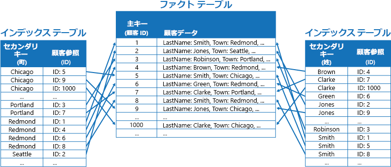

# インデックス テーブル パターン

[!INCLUDE [header](../_includes/header.md)]

クエリによって頻繁に参照されるデータ ストア内のフィールドにインデックスを作成します。 このパターンによって、アプリケーションがデータ ストアから目的のデータを取得するまでの時間が短縮されるため、クエリのパフォーマンスが向上します。

## コンテキストと問題

多くのデータ ストアでは、エンティティの集合体を表すデータが主キーを使って整理されます。 アプリケーションは、このキーを使ってデータを探し、取得することができます。 この図は、顧客情報を保持するデータ ストアの例です。 主キーは Customer ID です。 この図を見ると、顧客情報が主キー (Customer ID) によって整理されていることがわかります。

主キーは、その値に基づいてデータをフェッチするクエリには有効な手段となりますが、アプリケーションから他のフィールドに基づいてデータを取得する必要がある場合には、主キーを使うことが難しくなります。 この顧客情報の例で言えば、顧客の所在地 (Town) など、主キー (Customer ID) 以外の属性の値を参照してデータを照会するだけでは、顧客を取得することができません。 そのようなクエリを実行するためには、アプリケーションですべての顧客レコードをフェッチして調べる必要があり、処理が遅くなる可能性があります。

多くのリレーショナル データベース管理システムでは、セカンダリ インデックスがサポートされています。 セカンダリ インデックスは、主キー以外 (セカンダリ) のキー フィールドによって体系化される独立したデータ構造であり、インデックス付けされた値がそれぞれどこに保存されているかを示すものです。 セカンダリ インデックス内の要素は通常、高速にデータを検索できるようセカンダリ キーの値で並べ替えられます。 これらのインデックスの管理は通常、データベース管理システムによって自動的に行われます。

実際のアプリケーションで実行されるさまざまなクエリに対応するために、必要に応じていくつでもセカンダリ インデックスを作成できます。 たとえば、Customer ID を主キーとする Customers テーブルがリレーショナル データベースにあるとき、アプリケーションから顧客をその所在地で検索することが多ければ、Town フィールドにセカンダリ インデックスを追加することを検討します。

ところが、リレーショナル システムではセカンダリ インデックスが当たり前のように存在しますが、クラウド アプリケーションで使用される NoSQL データ ストアには、ほとんどの場合、同等の機能が備わっていません。

## 解決策

データ ストアでセカンダリ インデックスがサポートされていない場合は、独自のインデックス テーブルを作成することにより、それらを手動でエミュレートすることができます。 インデックス テーブルでは、指定されたキーでデータが整理されます。 インデックス テーブルを構造化する場合、必要なセカンダリ インデックスの数とアプリケーションで実行するクエリの特性に応じて、一般に 3 つの方法が使用されます。

1 つ目は、各インデックス テーブル内のデータを異なるキーで整理しつつ複製する方法です (完全非正規化)。 次の図は、同じ顧客情報を Town と LastName で整理したインデックス テーブルを示しています。

この方法は、それぞれのキーを使用してデータが照会される回数に比べて、データの変動が相対的に小さい場合に適しています。 データの変動が大きいと、それぞれのインデックス テーブルを管理する処理オーバーヘッドが大きくなりすぎて、このアプローチでは実用に耐えなくなってきます。 また、データが膨大な量になった場合、複製データを格納するために必要な領域の量もかなり大きくなります。

2 つ目は、異なるキーで整理された正規化インデックス テーブルを作成する方法です。データを複製するのではなく、主キーを使って元のデータを参照します。そのようすを示したのが次の図です。 元のデータは、ファクト テーブルと呼ばれます。

この手法なら、領域が節約され、重複データを管理するオーバーヘッドも小さくて済みます。 短所は、セカンダリ キーを使ってデータを探すために、アプリケーションで 2 回の検索操作を実行する必要がある点です。 データの主キーをインデックス テーブルで見つけてから、その主キーを使ってファクト テーブル内のデータを検索する必要があります。

3 つ目は、頻繁に取得されるフィールドを複製し、異なるキーで整理して部分的に正規化したインデックス テーブルを作成する方法です。 アクセスされる頻度の低いフィールドには、ファクト テーブルを参照してアクセスします。 次の図は、アクセス頻度の高いデータがそれぞれのインデックス テーブルにどのように複製されるかを示したものです。

この方法を使用すると、前述した 2 つのアプローチをうまく両立させることができます。 頻繁に照会されるデータは 1 回の検索ですばやく取得することができ、しかも領域と管理のオーバーヘッドは、データセット全体を複製した場合ほど大きくならずに済みます。

"Redmond 在住で、かつ姓が Smith であるすべての顧客" を検索するなど、値の組み合わせを指定してアプリケーションで頻繁にデータを照会する場合、インデックス テーブルに格納される項目のキーを、Town 属性と LastName 属性を連結した文字列として実装することもできます。 次の図は、複合キーに基づくインデックス テーブルを示しています。 キーは、まず Town で並べ替えられた後、Town に関して同じ値を備えたレコードごとに LastName で並べ替えられます。

シャード化されたデータに対するクエリ操作は、インデックス テーブルによって高速化できます。シャード キーがハッシュされている場合は特にそれが当てはまります。 以下の図は、シャード キーが Customer ID のハッシュになっている例です。 このインデックス テーブルは、ハッシュされていない値 (Town と LastName) でデータを整理し、ハッシュされたシャード キーを参照データとして返すことができます。 そのため、ある範囲内のデータを取得する必要がある場合や、ハッシュされていないキーの順序でデータをフェッチする必要がある場合に、ハッシュ キーを繰り返し計算 (コストの大きい操作) する負担からアプリケーションが開放されます。 たとえば "Redmond 在住のすべての顧客を検索" するクエリは、一致する項目 (いずれも連続するブロックに存在) をインデックス テーブルで特定することによってすぐに解決できます。 その後、インデックス テーブルに格納されているシャード キーを使用し、参照情報をたどって顧客データにアクセスします。

## 問題と注意事項

このパターンの実装方法を決めるときには、以下の点に注意してください。

- セカンダリ インデックスの管理オーバーヘッドが著しく大きくなる場合があります。 実際のアプリケーションで使用するクエリを分析して理解する必要があります。 インデックス テーブルは、定期的に使用する可能性が高い場合にのみ作成してください。 アプリケーションで実行する機会のないクエリや、まれにしか実行しないクエリをサポートするために、思いつきでインデックス テーブルを作成しないでください。
- インデックス テーブルにデータを複製することで、データのコピーを複数保持することに伴うストレージ コストや手間において、著しく大きなオーバーヘッドが生じる可能性があります。
- 元のデータを参照する正規化された構造としてインデックス テーブルを実装する場合、アプリケーションは、データを見つけ出すために 2 回の検索操作を実行する必要があります。 1 回目の検索操作でインデックス テーブルから主キーを取得し、2 回目の操作でその主キーを使って目的のデータをフェッチします。
- 非常に大きなデータ セットを対象にしたインデックス テーブルを 1 つのシステムに多数組み込んだ場合、インデックス テーブルと元のデータとの間の整合性を維持することが難しくなる可能性があります。 そのような場合は、結果整合性モデルでアプリケーションを設計することを検討してください。 たとえばデータの挿入、更新、削除を行うために、アプリケーションからメッセージをキューにポストしておき、独立したタスクで非同期的に操作を実行したり、対象データを参照するインデックス テーブルを管理したりすることができます。 結果整合性を実装する方法の詳細については、「[Data consistency primer (データ整合性入門)](https://msdn.microsoft.com/library/dn589800.aspx)」をご覧ください。

   >  Microsoft Azure Storage テーブルは、同じパーティションに保持されているデータへの変更に関して、トランザクション更新をサポートしています (エンティティ グループ トランザクションと呼ばれます)。 1 つのファクト テーブルのデータと 1 つまたは複数のインデックス テーブルのデータを同じパーティションに格納できる場合、この機能を利用して整合性を確保することができます。

- インデックス テーブルは、それ自体がパーティション分割されていたり、シャード化されていたりする可能性があります。

## このパターンを使用する状況

アプリケーションで主キー (またはシャード キー) 以外のキーを使って頻繁にデータを取得する必要がある場合、このパターンを使用してクエリ パフォーマンスを強化してください。

このパターンが適さない状況

- データの変化が激しい。 インデックス テーブルがすぐに古くなり、効率が悪化したり、インデックス テーブルを使用することによって得られるメリットよりも、管理オーバーヘッドの方が大きくなったりします。
- インデックス テーブルのセカンダリ キーとして選択するフィールドにデータの識別性がなく、ごくわずかな値の組み合わせしか保持できない (性別など)。
- インデックス テーブルのセカンダリ キーとして選択するフィールドに格納されているデータの値の偏りが大きい。 たとえば 90% のレコードがあるフィールドに同じ値を格納している場合、そのフィールドに基づいてデータを検索するためのインデックス テーブルを作成、維持することは、データの先頭から逐次的にスキャンするよりもオーバーヘッドが大きくなる可能性があります。 ただしクエリで頻繁に検索する値が残りの 10% に存在するのであれば、このインデックスは役に立つ可能性があります。 実際のアプリケーションで実行するクエリとその実行頻度を把握しておくことが大切です。

## 例

Azure Storage テーブルは、クラウドで実行されるアプリケーションのためのスケーラビリティに優れたキー/値型のデータ ストアです。 アプリケーションは、キーを指定することによってデータ値を格納したり取得したりします。 データ値には、複数のフィールドを含めることができますが、テーブル ストレージからはデータ項目の構造が見えません。データ項目は単にバイトの配列として扱われます。

Azure Storage テーブルではシャーディングもサポートされます。 シャーディング キーは、パーティション キーと行キーの 2 つの要素を含んでいます。 同じパーティション キーを備えた項目は同じパーティション (シャード) に格納され、項目はシャード内の行キーの順序で格納されます。 テーブル ストレージは、同じパーティション内の行キーの値が連続する範囲内にあるデータをフェッチするクエリに最適化されています。 Azure テーブルに情報を格納するクラウド アプリケーションを作成する場合は、この特徴を踏まえてデータの構造を決める必要があります。

たとえば、映画に関する情報を格納するアプリケーションがあるとします。 そのアプリケーションでは、ジャンル (アクション、ドキュメンタリー、歴史、コメディ、ドラマなど) で映画を検索するクエリが頻繁に実行されます。 この場合、ジャンルごとにパーティション分割された Azure テーブルを作成することが考えられます。次の図のように、ジャンルをパーティション キーとし、映画の名前を行キーとして指定します。

この方法は、主演俳優で映画を照会する必要がある場合、効果が下がります。 その場合は、別途インデックス テーブルとして機能する Azure テーブルを作成することができます。 パーティション キーを俳優に、行キーを映画名にします。 俳優ごとに、別々のパーティションにデータが格納されます。 複数の俳優が出演している場合、同じ映画が複数のパーティションに格納されることになります。

前出の「解決策」セクションで取り上げた 1 つ目の方法を採用すれば、各パーティションが保持する値に映画のデータを複製することができます。 ただし、1 つの映画が複数回 (俳優 1 人につき 1 回) にわたって複製される可能性が高いので、データを部分的に非正規化した方が効率がよいでしょう。完全な情報を見つけ出すために必要なパーティション キーをジャンル パーティションに含めることで、使用頻度の非常に高いクエリ (他の俳優の名前など) に対応し、アプリケーションで残りの詳細データを取得することができます。 この方法は、「解決策」セクションの 3 つ目の選択肢で説明しています。 その方法を示したのが次の図です。

## 関連のあるパターンとガイダンス

このパターンを実装する場合は、次のパターンとガイダンスも関連している可能性があります。

- [Data consistency primer (データ整合性入門)](https://msdn.microsoft.com/library/dn589800.aspx)。 インデックス テーブルは、インデックスの対象となるデータが変化するので、メンテナンスが必要です。 データに変更を加える同じトランザクションの一環としてインデックスを更新する操作は、クラウドでは実行できないか、できたとしても適切でない可能性があります。 その場合は、結果整合性のアプローチの方が適しています。 このドキュメントには、結果整合性に関する問題についての情報が取り上げられています。
- [シャーディング パターン](https://msdn.microsoft.com/library/dn589797.aspx)。 一般にインデックス テーブル パターンは、シャードを使ってパーティション分割されたデータと組み合わせて使用します。 「Sharding pattern (シャーディング パターン)」では、データ ストアを一連のシャードに分割する方法について詳しく取り上げています。
- [Materialized View Pattern (具体化されたビュー パターン)](materialized-view.md) インデックスを作成することによってデータの概要を抽出するクエリをサポートするよりも、具体化されたデータのビューを作成した方がよい場合があります。 データの事前設定されたビューを生成することによって効率的な概要クエリをサポートする方法が説明されています。
