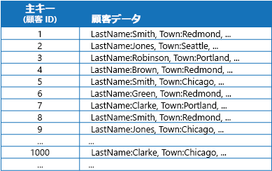
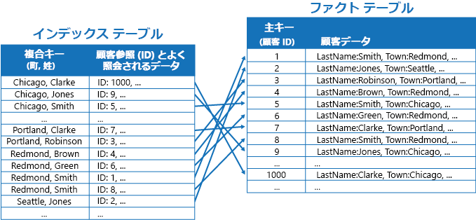
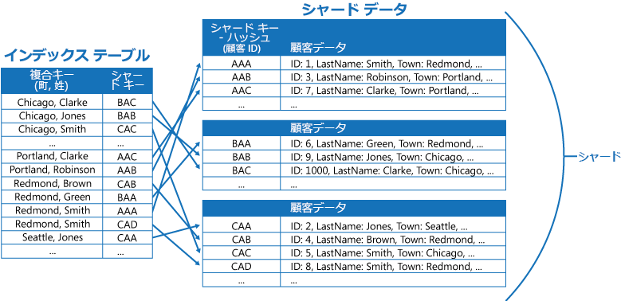

# インデックス テーブル パターンIndex Table pattern

[!INCLUDE [header](../_includes/header.md)]

クエリによって頻繁に参照されるデータ ストア内のフィールドにインデックスを作成します。Create indexes over the fields in data stores that are frequently referenced by queries. このパターンによって、アプリケーションがデータ ストアから目的のデータを取得するまでの時間が短縮されるため、クエリのパフォーマンスが向上します。This pattern can improve query performance by allowing applications to more quickly locate the data to retrieve from a data store.

## コンテキストと問題Context and problem

多くのデータ ストアでは、エンティティの集合体を表すデータが主キーを使って整理されます。Many data stores organize the data for a collection of entities using the primary key. アプリケーションは、このキーを使ってデータを探し、取得することができます。An application can use this key to locate and retrieve data. この図は、顧客情報を保持するデータ ストアの例です。The figure shows an example of a data store holding customer information. 主キーは Customer ID です。The primary key is the Customer ID. この図を見ると、顧客情報が主キー (Customer ID) によって整理されていることがわかります。The figure shows customer information organized by the primary key (Customer ID).

主キーは、その値に基づいてデータをフェッチするクエリには有効な手段となりますが、アプリケーションから他のフィールドに基づいてデータを取得する必要がある場合には、主キーを使うことが難しくなります。While the primary key is valuable for queries that fetch data based on the value of this key, an application might not be able to use the primary key if it needs to retrieve data based on some other field. この顧客情報の例で言えば、顧客の所在地 (Town) など、主キー (Customer ID) 以外の属性の値を参照してデータを照会するだけでは、顧客を取得することができません。In the customers example, an application can't use the Customer ID primary key to retrieve customers if it queries data solely by referencing the value of some other attribute, such as the town in which the customer is located. そのようなクエリを実行するためには、アプリケーションですべての顧客レコードをフェッチして調べる必要があり、処理が遅くなる可能性があります。To perform a query such as this, the application might have to fetch and examine every customer record, which could be a slow process.

多くのリレーショナル データベース管理システムでは、セカンダリ インデックスがサポートされています。Many relational database management systems support secondary indexes. セカンダリ インデックスは、主キー以外 (セカンダリ) のキー フィールドによって体系化される独立したデータ構造であり、インデックス付けされた値がそれぞれどこに保存されているかを示すものです。A secondary index is a separate data structure that's organized by one or more nonprimary (secondary) key fields, and it indicates where the data for each indexed value is stored. セカンダリ インデックス内の要素は通常、高速にデータを検索できるようセカンダリ キーの値で並べ替えられます。The items in a secondary index are typically sorted by the value of the secondary keys to enable fast lookup of data. これらのインデックスの管理は通常、データベース管理システムによって自動的に行われます。These indexes are usually maintained automatically by the database management system.

実際のアプリケーションで実行されるさまざまなクエリに対応するために、必要に応じていくつでもセカンダリ インデックスを作成できます。You can create as many secondary indexes as you need to support the different queries that your application performs. たとえば、Customer ID を主キーとする Customers テーブルがリレーショナル データベースにあるとき、アプリケーションから顧客をその所在地で検索することが多ければ、Town フィールドにセカンダリ インデックスを追加することを検討します。For example, in a Customers table in a relational database where the Customer ID is the primary key, it's beneficial to add a secondary index over the town field if the application frequently looks up customers by the town where they reside.

ところが、リレーショナル システムではセカンダリ インデックスが当たり前のように存在しますが、クラウド アプリケーションで使用される NoSQL データ ストアには、ほとんどの場合、同等の機能が備わっていません。However, although secondary indexes are common in relational systems, most NoSQL data stores used by cloud applications don't provide an equivalent feature.

## 解決策Solution

データ ストアでセカンダリ インデックスがサポートされていない場合は、独自のインデックス テーブルを作成することにより、それらを手動でエミュレートすることができます。If the data store doesn't support secondary indexes, you can emulate them manually by creating your own index tables. インデックス テーブルでは、指定されたキーでデータが整理されます。An index table organizes the data by a specified key. インデックス テーブルを構造化する場合、必要なセカンダリ インデックスの数とアプリケーションで実行するクエリの特性に応じて、一般に 3 つの方法が使用されます。Three strategies are commonly used for structuring an index table, depending on the number of secondary indexes that are required and the nature of the queries that an application performs.

1 つ目は、各インデックス テーブル内のデータを異なるキーで整理しつつ複製する方法です (完全非正規化)。The first strategy is to duplicate the data in each index table but organize it by different keys (complete denormalization). 次の図は、同じ顧客情報を Town と LastName で整理したインデックス テーブルを示しています。The next figure shows index tables that organize the same customer information by Town and LastName.

この方法は、それぞれのキーを使用してデータが照会される回数に比べて、データの変動が相対的に小さい場合に適しています。This strategy is appropriate if the data is relatively static compared to the number of times it's queried using each key. データの変動が大きいと、それぞれのインデックス テーブルを管理する処理オーバーヘッドが大きくなりすぎて、このアプローチでは実用に耐えなくなってきます。If the data is more dynamic, the processing overhead of maintaining each index table becomes too large for this approach to be useful. また、データが膨大な量になった場合、複製データを格納するために必要な領域の量もかなり大きくなります。Also, if the volume of data is very large, the amount of space required to store the duplicate data is significant.

2 つ目は、異なるキーで整理された正規化インデックス テーブルを作成する方法です。データを複製するのではなく、主キーを使って元のデータを参照します。そのようすを示したのが次の図です。The second strategy is to create normalized index tables organized by different keys and reference the original data by using the primary key rather than duplicating it, as shown in the following figure. 元のデータは、ファクト テーブルと呼ばれます。The original data is called a fact table.

この手法なら、領域が節約され、重複データを管理するオーバーヘッドも小さくて済みます。This technique saves space and reduces the overhead of maintaining duplicate data. 短所は、セカンダリ キーを使ってデータを探すために、アプリケーションで 2 回の検索操作を実行する必要がある点です。The disadvantage is that an application has to perform two lookup operations to find data using a secondary key. データの主キーをインデックス テーブルで見つけてから、その主キーを使ってファクト テーブル内のデータを検索する必要があります。It has to find the primary key for the data in the index table, and then use the primary key to look up the data in the fact table.

3 つ目は、頻繁に取得されるフィールドを複製し、異なるキーで整理して部分的に正規化したインデックス テーブルを作成する方法です。The third strategy is to create partially normalized index tables organized by different keys that duplicate frequently retrieved fields. アクセスされる頻度の低いフィールドには、ファクト テーブルを参照してアクセスします。Reference the fact table to access less frequently accessed fields. 次の図は、アクセス頻度の高いデータがそれぞれのインデックス テーブルにどのように複製されるかを示したものです。The next figure shows how commonly accessed data is duplicated in each index table.

この方法を使用すると、前述した 2 つのアプローチをうまく両立させることができます。With this strategy, you can strike a balance between the first two approaches. 頻繁に照会されるデータは 1 回の検索ですばやく取得することができ、しかも領域と管理のオーバーヘッドは、データセット全体を複製した場合ほど大きくならずに済みます。The data for common queries can be retrieved quickly by using a single lookup, while the space and maintenance overhead isn't as significant as duplicating the entire data set.

"Redmond 在住で、かつ姓が Smith であるすべての顧客" を検索するなど、値の組み合わせを指定してアプリケーションで頻繁にデータを照会する場合、インデックス テーブルに格納される項目のキーを、Town 属性と LastName 属性を連結した文字列として実装することもできます。If an application frequently queries data by specifying a combination of values (for example, “Find all customers that live in Redmond and that have a last name of Smith”), you could implement the keys to the items in the index table as a concatenation of the Town attribute and the LastName attribute. 次の図は、複合キーに基づくインデックス テーブルを示しています。The next figure shows an index table based on composite keys. キーは、まず Town で並べ替えられた後、Town に関して同じ値を備えたレコードごとに LastName で並べ替えられます。The keys are sorted by Town, and then by LastName for records that have the same value for Town.

シャード化されたデータに対するクエリ操作は、インデックス テーブルによって高速化できます。シャード キーがハッシュされている場合は特にそれが当てはまります。Index tables can speed up query operations over sharded data, and are especially useful where the shard key is hashed. 以下の図は、シャード キーが Customer ID のハッシュになっている例です。The next figure shows an example where the shard key is a hash of the Customer ID. このインデックス テーブルは、ハッシュされていない値 (Town と LastName) でデータを整理し、ハッシュされたシャード キーを参照データとして返すことができます。The index table can organize data by the nonhashed value (Town and LastName), and provide the hashed shard key as the lookup data. そのため、ある範囲内のデータを取得する必要がある場合や、ハッシュされていないキーの順序でデータをフェッチする必要がある場合に、ハッシュ キーを繰り返し計算 (コストの大きい操作) する負担からアプリケーションが開放されます。This can save the application from repeatedly calculating hash keys (an expensive operation) if it needs to retrieve data that falls within a range, or it needs to fetch data in order of the nonhashed key. たとえば "Redmond 在住のすべての顧客を検索" するクエリは、一致する項目 (いずれも連続するブロックに存在) をインデックス テーブルで特定することによってすぐに解決できます。For example, a query such as “Find all customers that live in Redmond” can be quickly resolved by locating the matching items in the index table, where they're all stored in a contiguous block. その後、インデックス テーブルに格納されているシャード キーを使用し、参照情報をたどって顧客データにアクセスします。Then, follow the references to the customer data using the shard keys stored in the index table.

## 問題と注意事項Issues and considerations

このパターンの実装方法を決めるときには、以下の点に注意してください。Consider the following points when deciding how to implement this pattern:

- セカンダリ インデックスの管理オーバーヘッドが著しく大きくなる場合があります。The overhead of maintaining secondary indexes can be significant. 実際のアプリケーションで使用するクエリを分析して理解する必要があります。You must analyze and understand the queries that your application uses. インデックス テーブルは、定期的に使用する可能性が高い場合にのみ作成してください。Only create index tables when they're likely to be used regularly. アプリケーションで実行する機会のないクエリや、まれにしか実行しないクエリをサポートするために、思いつきでインデックス テーブルを作成しないでください。Don't create speculative index tables to support queries that an application doesn't perform, or performs only occasionally.
- インデックス テーブルにデータを複製することで、データのコピーを複数保持することに伴うストレージ コストや手間において、著しく大きなオーバーヘッドが生じる可能性があります。Duplicating data in an index table can add significant overhead in storage costs and the effort required to maintain multiple copies of data.
- 元のデータを参照する正規化された構造としてインデックス テーブルを実装する場合、アプリケーションは、データを見つけ出すために 2 回の検索操作を実行する必要があります。Implementing an index table as a normalized structure that references the original data requires an application to perform two lookup operations to find data. 1 回目の検索操作でインデックス テーブルから主キーを取得し、2 回目の操作でその主キーを使って目的のデータをフェッチします。The first operation searches the index table to retrieve the primary key, and the second uses the primary key to fetch the data.
- 非常に大きなデータ セットを対象にしたインデックス テーブルを 1 つのシステムに多数組み込んだ場合、インデックス テーブルと元のデータとの間の整合性を維持することが難しくなる可能性があります。If a system incorporates a number of index tables over very large data sets, it can be difficult to maintain consistency between index tables and the original data. そのような場合は、結果整合性モデルでアプリケーションを設計することを検討してください。It might be possible to design the application around the eventual consistency model. たとえばデータの挿入、更新、削除を行うために、アプリケーションからメッセージをキューにポストしておき、独立したタスクで非同期的に操作を実行したり、対象データを参照するインデックス テーブルを管理したりすることができます。For example, to insert, update, or delete data, an application could post a message to a queue and let a separate task perform the operation and maintain the index tables that reference this data asynchronously. 結果整合性を実装する方法の詳細については、「[Data consistency primer (データ整合性入門)](https://msdn.microsoft.com/library/dn589800.aspx)」をご覧ください。For more information about implementing eventual consistency, see the [Data Consistency Primer](https://msdn.microsoft.com/library/dn589800.aspx).

   >  Microsoft Azure Storage テーブルは、同じパーティションに保持されているデータへの変更に関して、トランザクション更新をサポートしています (エンティティ グループ トランザクションと呼ばれます)。Microsoft Azure storage tables support transactional updates for changes made to data held in the same partition (referred to as entity group transactions). 1 つのファクト テーブルのデータと 1 つまたは複数のインデックス テーブルのデータを同じパーティションに格納できる場合、この機能を利用して整合性を確保することができます。If you can store the data for a fact table and one or more index tables in the same partition, you can use this feature to help ensure consistency.

- インデックス テーブルは、それ自体がパーティション分割されていたり、シャード化されていたりする可能性があります。Index tables might themselves be partitioned or sharded.

## このパターンを使用する状況When to use this pattern

アプリケーションで主キー (またはシャード キー) 以外のキーを使って頻繁にデータを取得する必要がある場合、このパターンを使用してクエリ パフォーマンスを強化してください。Use this pattern to improve query performance when an application frequently needs to retrieve data by using a key other than the primary (or shard) key.

このパターンが適さない状況This pattern might not be useful when:

- データの変化が激しい。Data is volatile. インデックス テーブルがすぐに古くなり、効率が悪化したり、インデックス テーブルを使用することによって得られるメリットよりも、管理オーバーヘッドの方が大きくなったりします。An index table can become out of date very quickly, making it ineffective or making the overhead of maintaining the index table greater than any savings made by using it.
- インデックス テーブルのセカンダリ キーとして選択するフィールドにデータの識別性がなく、ごくわずかな値の組み合わせしか保持できない (性別など)。A field selected as the secondary key for an index table is nondiscriminating and can only have a small set of values (for example, gender).
- インデックス テーブルのセカンダリ キーとして選択するフィールドに格納されているデータの値の偏りが大きい。The balance of the data values for a field selected as the secondary key for an index table are highly skewed. たとえば 90% のレコードがあるフィールドに同じ値を格納している場合、そのフィールドに基づいてデータを検索するためのインデックス テーブルを作成、維持することは、データの先頭から逐次的にスキャンするよりもオーバーヘッドが大きくなる可能性があります。For example, if 90% of the records contain the same value in a field, then creating and maintaining an index table to look up data based on this field might create more overhead than scanning sequentially through the data. ただしクエリで頻繁に検索する値が残りの 10% に存在するのであれば、このインデックスは役に立つ可能性があります。However, if queries very frequently target values that lie in the remaining 10%, this index can be useful. 実際のアプリケーションで実行するクエリとその実行頻度を把握しておくことが大切です。You should understand the queries that your application is performing, and how frequently they're performed.

## 例Example

Azure Storage テーブルは、クラウドで実行されるアプリケーションのためのスケーラビリティに優れたキー/値型のデータ ストアです。Azure storage tables provide a highly scalable key/value data store for applications running in the cloud. アプリケーションは、キーを指定することによってデータ値を格納したり取得したりします。Applications store and retrieve data values by specifying a key. データ値には、複数のフィールドを含めることができますが、テーブル ストレージからはデータ項目の構造が見えません。データ項目は単にバイトの配列として扱われます。The data values can contain multiple fields, but the structure of a data item is opaque to table storage, which simply handles a data item as an array of bytes.

Azure Storage テーブルではシャーディングもサポートされます。Azure storage tables also support sharding. シャーディング キーは、パーティション キーと行キーの 2 つの要素を含んでいます。The sharding key includes two elements, a partition key and a row key. 同じパーティション キーを備えた項目は同じパーティション (シャード) に格納され、項目はシャード内の行キーの順序で格納されます。Items that have the same partition key are stored in the same partition (shard), and the items are stored in row key order within a shard. テーブル ストレージは、同じパーティション内の行キーの値が連続する範囲内にあるデータをフェッチするクエリに最適化されています。Table storage is optimized for performing queries that fetch data falling within a contiguous range of row key values within a partition. Azure テーブルに情報を格納するクラウド アプリケーションを作成する場合は、この特徴を踏まえてデータの構造を決める必要があります。If you're building cloud applications that store information in Azure tables, you should structure your data with this feature in mind.

たとえば、映画に関する情報を格納するアプリケーションがあるとします。For example, consider an application that stores information about movies. そのアプリケーションでは、ジャンル (アクション、ドキュメンタリー、歴史、コメディ、ドラマなど) で映画を検索するクエリが頻繁に実行されます。The application frequently queries movies by genre (action, documentary, historical, comedy, drama, and so on). この場合、ジャンルごとにパーティション分割された Azure テーブルを作成することが考えられます。次の図のように、ジャンルをパーティション キーとし、映画の名前を行キーとして指定します。You could create an Azure table with partitions for each genre by using the genre as the partition key, and specifying the movie name as the row key, as shown in the next figure.

この方法は、主演俳優で映画を照会する必要がある場合、効果が下がります。This approach is less effective if the application also needs to query movies by starring actor. その場合は、別途インデックス テーブルとして機能する Azure テーブルを作成することができます。In this case, you can create a separate Azure table that acts as an index table. パーティション キーを俳優に、行キーを映画名にします。The partition key is the actor and the row key is the movie name. 俳優ごとに、別々のパーティションにデータが格納されます。The data for each actor will be stored in separate partitions. 複数の俳優が出演している場合、同じ映画が複数のパーティションに格納されることになります。If a movie stars more than one actor, the same movie will occur in multiple partitions.

前出の「解決策」セクションで取り上げた 1 つ目の方法を採用すれば、各パーティションが保持する値に映画のデータを複製することができます。You can duplicate the movie data in the values held by each partition by adopting the first approach described in the Solution section above. ただし、1 つの映画が複数回 (俳優 1 人につき 1 回) にわたって複製される可能性が高いので、データを部分的に非正規化した方が効率がよいでしょう。完全な情報を見つけ出すために必要なパーティション キーをジャンル パーティションに含めることで、使用頻度の非常に高いクエリ (他の俳優の名前など) に対応し、アプリケーションで残りの詳細データを取得することができます。However, it's likely that each movie will be replicated several times (once for each actor), so it might be more efficient to partially denormalize the data to support the most common queries (such as the names of the other actors) and enable an application to retrieve any remaining details by including the partition key necessary to find the complete information in the genre partitions. この方法は、「解決策」セクションの 3 つ目の選択肢で説明しています。This approach is described by the third option in the Solution section. その方法を示したのが次の図です。The next figure shows this approach.

## 関連のあるパターンとガイダンスRelated patterns and guidance

このパターンを実装する場合は、次のパターンとガイダンスも関連している可能性があります。The following patterns and guidance might also be relevant when implementing this pattern:

- [Data consistency primer (データ整合性入門)](https://msdn.microsoft.com/library/dn589800.aspx)。[Data Consistency Primer](https://msdn.microsoft.com/library/dn589800.aspx). インデックス テーブルは、インデックスの対象となるデータが変化するので、メンテナンスが必要です。An index table must be maintained as the data that it indexes changes. データに変更を加える同じトランザクションの一環としてインデックスを更新する操作は、クラウドでは実行できないか、できたとしても適切でない可能性があります。In the cloud, it might not be possible or appropriate to perform operations that update an index as part of the same transaction that modifies the data. その場合は、結果整合性のアプローチの方が適しています。In that case, an eventually consistent approach is more suitable. このドキュメントには、結果整合性に関する問題についての情報が取り上げられています。Provides information on the issues surrounding eventual consistency.
- [シャーディング パターン](https://msdn.microsoft.com/library/dn589797.aspx)。[Sharding pattern](https://msdn.microsoft.com/library/dn589797.aspx). 一般にインデックス テーブル パターンは、シャードを使ってパーティション分割されたデータと組み合わせて使用します。The Index Table pattern is frequently used in conjunction with data partitioned by using shards. 「Sharding pattern (シャーディング パターン)」では、データ ストアを一連のシャードに分割する方法について詳しく取り上げています。The Sharding pattern provides more information on how to divide a data store into a set of shards.
- [Materialized View Pattern (具体化されたビュー パターン)](materialized-view.md)[Materialized View pattern](materialized-view.md). インデックスを作成することによってデータの概要を抽出するクエリをサポートするよりも、具体化されたデータのビューを作成した方がよい場合があります。Instead of indexing data to support queries that summarize data, it might be more appropriate to create a materialized view of the data. データの事前設定されたビューを生成することによって効率的な概要クエリをサポートする方法が説明されています。Describes how to support efficient summary queries by generating prepopulated views over data.
