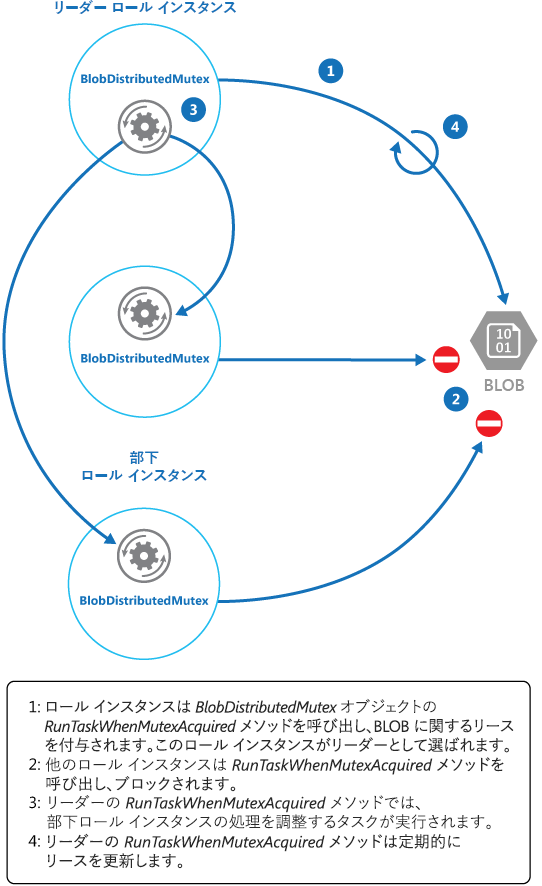

# <a name="leader-election-pattern"></a>リーダー選定パターン

[!INCLUDE [header](../_includes/header.md)]

他のインスタンスを管理する役割を担うリーダーとして 1 つのインスタンスを選択することで、分散アプリケーション内で連携するインスタンスのコレクションによって実行されるアクションを調整します。 これにより、インスタンスが互いに競合して、共有リソースとの競合を引き起こしたり、他のインスタンスが実行されている作業に誤って干渉したりしないようにできます。

## <a name="context-and-problem"></a>コンテキストと問題

一般的なクラウド アプリケーションには、協調した動きをする多くのタスクがあります。 これらのタスクはすべて、同じコードを実行し、同じリソースへのアクセスを必要とするインスタンスの可能性があります。また、複雑な計算の個々の部分を実行するために、複数のタスクが並列で動作する場合もあります。

タスク インスタンスは、大半の時間は個々に実行されますが、インスタンスが互いに競合して共有リソースとの競合を引き起こしたり、他のタスク インスタンスが実行されている作業に誤って干渉したりしないように、各インスタンスのアクションを調整する必要もあります。

例: 

- 水平方向のスケーリングを実装するクラウドベース システムでは、同一タスクの複数のインスタンスを、別のユーザーに対する各インスタンスと同時に実行できます。 これらのインスタンスが共有リソースに書き込みを行う場合、各インスタンスが他のインスタンスによって行われた変更を上書きしないようにアクションを調整する必要があります。
- タスクが複雑な計算の個々 の要素を並列で実行している場合、すべてが完了した時点で結果が集計される必要があります。

タスク インスタンスはすべてピアなので、コーディネーターやアグリゲーターとして機能できる自然なリーダーは存在しません。

## <a name="solution"></a>解決策

リーダーとして機能するように、単一のタスク インスタンスが選定される必要があります。また、このインスタンスは、他の下位のタスク インスタンスのアクションを調整する必要があります。 すべてのタスク インスタンスが同じコードを実行している場合、それぞれのインスタンスがリーダーとして機能できます。 そのため、2 つ以上のインスタンスが同時にリーダーのロールを担うことがないよう注意して、選定のプロセスを管理する必要があります。

システムは、リーダーを選定するための堅牢なメカニズムを提供する必要があります。 選定のメソッドでは、ネットワークの停止やプロセスの失敗などの事態に対処する必要があります。 多くのソリューションでは、下位のタスク インスタンスは、任意のタイプのハートビート メソッド経由またはポーリングによって、リーダーを監視します。 指定したリーダーが予期せずに終了した場合や、ネットワーク障害によってリーダーを下位のタスク インスタンスで使用できない場合は、新しいリーダーを選定する必要があります。

分散した環境にある一連のタスクからリーダーを選定するには、いくつかの戦略があります。

- 最低ランクのインスタンス ID またはプロセス ID のタスク インスタンスを選択する。
- 共有されている分散ミューテックスを獲得するために競わせる。 ミューテックスを獲得した最初のタスク インスタンスがリーダーになります。 ただし、システムは、リーダーが終了したりシステムの他の部分から切り離されたりした場合に、別のタスク インスタンスがリーダーになれるようにミューテックスが解放されることを保証する必要があります。
- [Bully Algorithm (ブリー アルゴリズム) ](https://www.cs.colostate.edu/~cs551/CourseNotes/Synchronization/BullyExample.html) や [Ring Algorithm (リング アルゴリズム) ](https://www.cs.colostate.edu/~cs551/CourseNotes/Synchronization/RingElectExample.html)など、一般的なリーダー選定のアルゴリズムの 1 つを実装する。 これらのアルゴリズムでは、選定の各候補が一意の ID を保持し、他の候補と確実に通信できることを前提としています。

## <a name="issues-and-considerations"></a>問題と注意事項

このパターンの実装方法を決めるときには、以下の点に注意してください。

- リーダー選定のプロセスでは、一時的および永続的な障害に対して復元性を備える必要があります。
- リーダーに障害が発生した場合や、使用不可能になった場合 (通信障害に起因するなど) に、検出できる必要があります。 検出の際に必要とされる迅速さは、システムによって異なります。 一部のシステムは、一時的な障害が収束するまでなどの短い時間は、リーダー不在で機能できる場合があります。 それ以外の場合は、リーダーの障害をただちに検出して、新しい選定をトリガーする必要があります。
- 水平方向の自動スケーリングを実装するシステムでは、システムが規模を縮小し、一部のコンピューティング リソースをシャットダウンした場合に、リーダーが終了する場合があります。
- 共有されている分散ミューテックスを使用すると、ミューテックスを提供している外部サービスへの依存が可能になります。 サービスは、単一障害点を構成しています。 この障害点が何らかの理由で利用できなくなった場合、システムはリーダーを選定できなくなります。
- 簡単な方法は、1 つの専用プロセスをリーダーとして使用することです。 ただし、プロセスが失敗した場合、再起動時に大幅な遅延が発生することがあります。 他のプロセスがリーダーによる操作の調整を待機している場合、結果として生じる待機時間が、それらのプロセスのパフォーマンスと応答時間に影響する可能性があります。
- いずれかのリーダー選定アルゴリズムを手動で実装すると、コードの調整と最適化を最も柔軟に行うことができます。

## <a name="when-to-use-this-pattern"></a>このパターンを使用する状況

クラウド ホスト ソリューションなどの分散アプリケーション内のタスクに慎重な調整が必要であり、自然なリーダーが存在しない場合は、このパターンを使用します。

> リーダーがシステムのボトルネックにならないようにします。 リーダーの目的は、下位のタスクの作業を調整することであり、必ずしもこの作業自体に参加する必要はありません。ただし、タスクがリーダーとして選定されていない場合は、作業に参加できる必要があります。

以下の場合は、このパターンの使用は適していません。

- 自然なリーダーまたはリーダーとして常に機能する専用のプロセスがある。 たとえば、タスク インスタンスを調整するシングルトン プロセスを実装できる場合があります。 このプロセスが失敗したり正常でなくなった場合、システムはプロセスをシャットダウンして、再起動できます。
- タスク間の調整が、より簡易的な方法を使用して実現できる。 たとえば、複数のタスク インスタンスが共有リソースへのアクセス調整を必要としている場合、アクセスを制御するために楽観的ロックまたは排他的ロックを使用すると、より優れたソリューションになります。
- サード パーティのソリューションがよりふさわしい。 たとえば、(Apache Hadoop に基づく) Microsoft Azure HDInsight サービスは、Apache Zookeeper が提供するサービスを使用してマップを調整し、データを収集して集計するタスクを減らします。

## <a name="example"></a>例

LeaderElection ソリューションの DistributedMutex プロジェクト (このパターンを示すサンプルは [GitHub](https://github.com/mspnp/cloud-design-patterns/tree/master/leader-election) で利用可能です) は、共有されている分散ミューテックスを実装するメカニズムを提供するために、Azure Storage Blob でリースを使用する方法を示しています。 Azure クラウド サービスのロール インスタンスのグループ間でリーダーを選定するために、このミューテックスを使用できます。 リースを取得する最初のロール インスタンスがリーダーに選定され、リースを解放するか、リースを更新できない時点までリーダーのままになります。 他のロール インスタンスは、リーダーが使用できなくなった場合に備えて、Blob リースの監視を続行できます。

> Blob リースは、Blob 経由での排他的な書き込みロックです。 単一の Blob は、任意の時点で 1 つのリースだけの対象になることができます。 ロール インスタンスは指定された Blob 経由でリースを要求できます。また、その他のロール インスタンスが同じ Blob 経由でリースを保持していない場合は、確実にそのリースになります。 それ以外の場合、要求は例外をスローします。
>
> リースを無期限に保持するロール インスタンスの障害を回避するために、リースの有効期限を指定します。 この有効期限が切れると、リースは使用可能になります。 ただし、ロール インスタンスがリースを保持している間は、リースの更新を要求でき、要求した後の期間は、確実にそのリースが許可されます。 ロール インスタンスは、リースを保持する必要がある場合、このプロセスを継続的に繰り返すことができます。
> Blob をリースする方法の詳細については、「[Lease Blob (REST API) (Blob のリース (REST API))](https://msdn.microsoft.com/library/azure/ee691972.aspx)」を参照してください。

以下の C# の例にある `BlobDistributedMutex` クラスには、ロール インスタンスを有効にして指定した Blob 経由でリースの取得を試行する `RunTaskWhenMutexAquired` メソッドが含まれます。 Blob (名前、コンテナー、およびストレージ アカウント) の詳細は、`BlobDistributedMutex` オブジェクトが作成されたときに (このオブジェクトは、サンプル コードに含まれている単純な構造体です)、`BlobSettings` オブジェクトのコンス トラクターに渡されます。 また、Blob 経由で正常にリースを取得してリーダーに選定された場合、ロール インスタンスが実行されるコードを参照する `Task` をそのコンストラクターで受け入れます。 リースを取得する低レベルの詳細情報を処理するコードが、`BlobLeaseManager` という名前の個々のヘルパー クラスで実装されていることに注意してください。

```csharp
public class BlobDistributedMutex
{
  ...
  private readonly BlobSettings blobSettings;
  private readonly Func<CancellationToken, Task> taskToRunWhenLeaseAcquired;
  ...

  public BlobDistributedMutex(BlobSettings blobSettings,
           Func<CancellationToken, Task> taskToRunWhenLeaseAquired)
  {
    this.blobSettings = blobSettings;
    this.taskToRunWhenLeaseAquired = taskToRunWhenLeaseAquired;
  }

  public async Task RunTaskWhenMutexAcquired(CancellationToken token)
  {
    var leaseManager = new BlobLeaseManager(blobSettings);
    await this.RunTaskWhenBlobLeaseAcquired(leaseManager, token);
  }
  ...
```

上記のコード サンプル内の `RunTaskWhenMutexAquired` メソッドは、実際にリースを取得する下記のサンプル コードに示された `RunTaskWhenBlobLeaseAcquired` メソッドを呼び出します。 `RunTaskWhenBlobLeaseAcquired` メソッドが非同期で実行されます。 リースが正常に取得されると、ロール インスタンスがリーダーを選定したことになります。 `taskToRunWhenLeaseAcquired` デリゲートの目的は、他のロール インスタンスを調整する作業を実行することです。 リースを取得しなかった場合は、リーダーとして別のロール インスタンスが選択されており、現在のロール インスタンスは下位のままになります。 `TryAcquireLeaseOrWait` メソッドは、リースを取得する `BlobLeaseManager` オブジェクトを使用しているヘルパー メソッドであることに注意してください。

```csharp
  private async Task RunTaskWhenBlobLeaseAcquired(
    BlobLeaseManager leaseManager, CancellationToken token)
  {
    while (!token.IsCancellationRequested)
    {
      // Try to acquire the blob lease.
      // Otherwise wait for a short time before trying again.
      string leaseId = await this.TryAquireLeaseOrWait(leaseManager, token);

      if (!string.IsNullOrEmpty(leaseId))
      {
        // Create a new linked cancellation token source so that if either the
        // original token is canceled or the lease can't be renewed, the
        // leader task can be canceled.
        using (var leaseCts =
          CancellationTokenSource.CreateLinkedTokenSource(new[] { token }))
        {
          // Run the leader task.
          var leaderTask = this.taskToRunWhenLeaseAquired.Invoke(leaseCts.Token);
          ...
        }
      }
    }
    ...
  }
```

リーダーによって開始されたタスクは、非同期で実行されます。 このタスクの実行中、次のサンプル コードに示された `RunTaskWhenBlobLeaseAquired` メソッドは、定期的にリースの更新を試行しています。 これにより、ロール インスタンスが確実にリーダーのままでいられます。 サンプル ソリューションでは、他のロール インスタンスがリーダーに選定されないように、更新要求同士の間に生じる遅延は、リースの期間として指定された時間よりも短くなります。 何らかの理由で更新に失敗した場合、タスクはキャンセルされます。

リースの更新に失敗した場合、またはタスクがキャンセルされた場合 (たとえば、ロール インスタンスがシャット ダウンされた結果として)、リースは解放されます。 この時点で、このロール インスタンスまたは別のロール インスタンスが、リーダーとして選定される可能性があります。 以下のコードの抜粋は、プロセスのこの部分を示しています。

```csharp
  private async Task RunTaskWhenBlobLeaseAcquired(
    BlobLeaseManager leaseManager, CancellationToken token)
  {
    while (...)
    {
      ...
      if (...)
      {
        ...
        using (var leaseCts = ...)
        {
          ...
          // Keep renewing the lease in regular intervals.
          // If the lease can't be renewed, then the task completes.
          var renewLeaseTask =
            this.KeepRenewingLease(leaseManager, leaseId, leaseCts.Token);

          // When any task completes (either the leader task itself or when it
          // couldn't renew the lease) then cancel the other task.
          await CancelAllWhenAnyCompletes(leaderTask, renewLeaseTask, leaseCts);
        }
      }
    }
  }
  ...
}
```

`KeepRenewingLease` メソッドは、リースを更新するために `BlobLeaseManager` オブジェクトを使用するもう 1 つのヘルパー メソッドです。 `CancelAllWhenAnyCompletes` メソッドは、最初の 2 つのパラメーターに指定されたタスクをキャンセルします。 次の図では、リーダーを選定して操作を調整するタスクを実行するために、`BlobDistributedMutex` クラスを使用しています。



次のコード例は、worker ロールで `BlobDistributedMutex` クラスを使用する方法を示しています。 このコードでは、開発ストレージのリースのコンテナーにある `MyLeaderCoordinatorTask` という名前の Blob 経由でリースを取得し、ロール インスタンスがリーダーに選定された場合に、`MyLeaderCoordinatorTask` メソッドに定義されたコードが実行されるように指定しています。

```csharp
var settings = new BlobSettings(CloudStorageAccount.DevelopmentStorageAccount,
  "leases", "MyLeaderCoordinatorTask");
var cts = new CancellationTokenSource();
var mutex = new BlobDistributedMutex(settings, MyLeaderCoordinatorTask);
mutex.RunTaskWhenMutexAcquired(this.cts.Token);
...

// Method that runs if the role instance is elected the leader
private static async Task MyLeaderCoordinatorTask(CancellationToken token)
{
  ...
}
```

サンプル ソリューションでは、次の点に注意してください。

- Blob は潜在的な単一障害点になります。 Blob サービスが利用できない、またはアクセスできない場合、リーダーはリースを更新できず、他のロール インスタンスもリースを取得できません。 この場合、どのロール インスタンスもリーダーとして機能できません。 しかし、Blob サービスは復元性を備えた設計になっているため、Blob サービスの致命的な障害は極めて発生しにくいと考えられています。
- リーダーが実行しているタスクが停止した場合、リーダーは引き続きリースの更新を行って、他のロール インスタンスによるリースの取得を防止し、リースのロールを引き継いでタスクを調整します。 実際の運用では、リーダーの正常性を頻繁にチェックする必要があります。
- 選定プロセスは非決定性です。 どのロール インスタンスが Blob リースを取得してリーダーになるか予測することはできません。
- Blob リースのターゲットとして使用される Blob は、他の目的には使用できません。 ロール インスタンスがこの Blob へのデータの格納を試行した場合、そのロール インスタンスがリーダーとなり Blob リースを保持していないかぎり、このデータにはアクセスできません。

## <a name="related-patterns-and-guidance"></a>関連のあるパターンとガイダンス

このパターンを実装する場合は、次のガイダンスも関連している可能性があります。

- このパターンには、ダウンロード可能な[サンプル アプリケーション](https://github.com/mspnp/cloud-design-patterns/tree/master/leader-election)が用意されています。
- [自動スケール ガイダンス](https://msdn.microsoft.com/library/dn589774.aspx)。 アプリケーションの負荷は変化するため、タスク ホストのインスタンスを開始および停止することが可能です。 自動スケーリングは、ピーク時の処理中のスループットとパフォーマンスの維持に役立ちます。
- [計算分割ガイダンス](https://msdn.microsoft.com/library/dn589773.aspx)。 このガイダンスでは、サービスのスケーラビリティ、パフォーマンス、可用性、およびセキュリティを維持しながら実行中のコストを最小限に抑える 1 つの方法として、クラウド サービスのホストにタスクを割り当てる方法について説明します。
- [タスク ベースの非同期パターン](https://msdn.microsoft.com/library/hh873175.aspx)。
- [Bully Algorithm (ブリー アルゴリズム) ](https://www.cs.colostate.edu/~cs551/CourseNotes/Synchronization/BullyExample.html)を示したサンプル。
- [Ring Algorithm (リング アルゴリズム) ](https://www.cs.colostate.edu/~cs551/CourseNotes/Synchronization/RingElectExample.html)を示したサンプル。
- Apache ZooKeeper の [Apache Curator](https://curator.apache.org/) クライアント ライブラリ。
- MSDN の記事「[Lease Blob (REST API) (Blob のリース (REST API))](https://msdn.microsoft.com/library/azure/ee691972.aspx)」。
