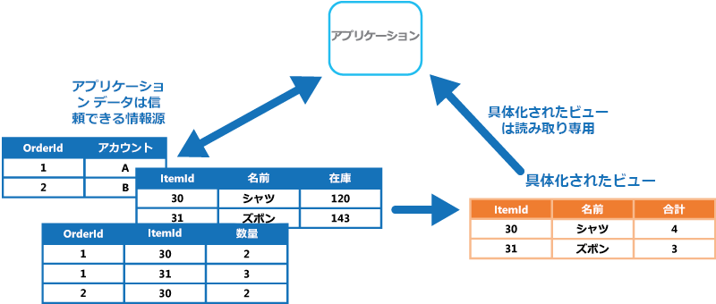
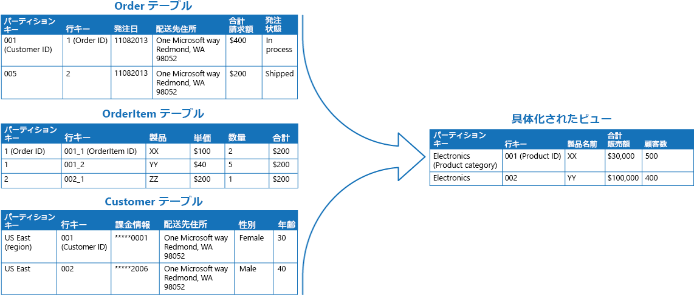

# 具体化されたビュー パターン

[!INCLUDE [header](../_includes/header.md)]

データの形式が必要なクエリ操作に適していない場合に、1 つ以上のデータ ストアのデータの事前設定されたビューを生成します。 これにより、効率的なクエリとデータ抽出をサポートできるようになり、アプリケーションのパフォーマンスが向上します。

## コンテキストと問題

データを保存するときに、開発者とデータ管理者は、多くの場合、データを読み取る方法ではなく、保存する方法を優先します。 選択されるストレージ形式は、通常、データの形式、データ サイズとデータ整合性の管理の要件、使用されているストアの種類と密接に関連しています。 たとえば、NoSQL ドキュメント ストアを使用する場合、データは一連の集計として表されることが多く、それぞれにそのエンティティのすべての情報が含まれています。

ただし、これはクエリに悪影響を及ぼす可能性があります。 クエリで一部のエンティティのデータのサブセットだけが必要な場合 (注文の詳細がまったく含まれていない、複数の顧客の注文の概要など)、必要な情報を取得するために、関連するエンティティのすべてのデータを抽出する必要があります。

## 解決策

効率的なクエリをサポートするには、一般的な解決策として、必要な結果セットに適した形式でデータを具体化するビューを事前に生成します。 具体化されたビュー パターンでは、ソース データがクエリに適した形式ではない環境、適切なクエリの生成が難しい環境、またはデータやデータ ストアの性質に起因してクエリのパフォーマンスが低い環境で、データの事前設定されたビューを生成します。

これらの具体化されたビューには、クエリに必要なデータだけが含まれているため、アプリケーションは必要な情報をすばやく取得できます。 テーブルの結合やデータ エンティティの組み合わせに加え、具体化されたビューには、計算列またはデータ項目の現在の値、データ項目の値の組み合わせまたは変換の実行の結果、クエリの一部として指定された値を含めることができます。 具体化されたビューは、1 つのクエリだけを対象に最適化することもできます。

重要なのは、具体化されたビューとそこに含まれるデータは、ソース データ ストアから完全に再構築できるため、完全に破棄可能であるという点です。 具体化されたビューはアプリケーションによって直接更新されることはないので、特殊なキャッシュと言えます。

ビューのソース データが変更されたら、ビューを更新して新しい情報を含める必要があります。 これは、自動的に実行されるようにスケジュールすることも、システムが元のデータの変更を検出したときに実行することもできます。 ビューを手動で再生成することが必要な場合もあります。 次の図は、具体化されたビュー パターンの使用方法の例を示しています。

## 問題と注意事項

このパターンの実装方法を決めるときには、以下の点に注意してください。

ビューをいつ、どのようにして更新するか。 ソース データの変更を示すイベントに応じて再生成するのが理想的ですが、ソース データの変更のペースが速い場合は、過剰なオーバーヘッドが発生する可能性があります。 代わりに、スケジュールされたタスク、外部トリガー、または手動アクションを使用してビューを再生成することを検討してください。

一部のシステムでは、イベント ソーシング パターンを使用して、データを変更したイベントだけを保存するストアを保持する場合などに、具体化されたビューが必要になります。 すべてのイベントを調べ、現在の状態を確認してビューを事前設定することが、イベント ストアから情報を取得する唯一の方法と考えられます。 イベント ソーシングを使用していない場合は、具体化されたビューが役立つかどうかを検討する必要があります。 具体化されたビューは、1 つまたは少数のクエリに合わせて調整される傾向があります。 多数のクエリを使用する場合、具体化されたビューによって、ストレージ容量の許容できない要件やストレージ コストが発生する可能性があります。

ビューの生成時とビューの更新時 (スケジュールに従って更新が実行される場合) のデータ整合性への影響を考慮します。 ビューが生成された時点でソース データが変更されると、ビュー内のデータのコピーが元のデータと完全には一致しなくなります。

ビューを保存する場所を検討します。 ビューは、元のデータと同じストアまたはパーティションに配置する必要はありません。 結合された少数の異なるパーティションのサブセットに配置できます。

ビューは失われても再構築できます。 そのため、ビューが一時的なものであり、データの現在の状態を反映してクエリのパフォーマンスを向上させたり、スケーラビリティを向上させたりするためだけに使用する場合は、キャッシュや信頼性の低い場所に保存できます。

具体化されたビューを定義するときは、既存のデータ項目の計算や変換、クエリに渡される値、またはこれらの値の組合せ (適宜) に基づいてデータ項目や列を追加することで、価値を最大化します。

ストレージ メカニズムでサポートされている場合は、パフォーマンスをさらに向上させるために、具体化されたビューのインデックス作成を検討します。 Apache Hadoop を基盤とするビッグ データ ソリューションと同様に、ほとんどのリレーショナルデータベースでビューのインデックス作成がサポートされています。

## このパターンを使用する状況

このパターンは次の状況で役立ちます。

- 直接照会することが難しいデータの具体化されたビューを作成する場合や、正規化された方法、半構造化された方法、または構造化されていない方法で格納されたデータを抽出するためにクエリを非常に複雑にする必要がある場合。
- クエリのパフォーマンスを大幅に向上させることができる一時ビュー、またはレポートや表示用に UI のソース ビューまたはデータ転送オブジェクトとして直接機能する一時ビューを作成する場合。
- データ ストアへの接続を常に利用できるわけではない接続または切断シナリオをサポートすることがある場合。 この場合、ビューをローカルにキャッシュできます。
- ソース データの形式の知識を必要としない方法で、クエリを簡素化し、実験用のデータを公開する場合。 たとえば、1 つ以上のデータベースのさまざまなテーブルや NoSQL ストアの 1 つ以上のドメインを結合して、最終的な用途に合わせてデータを書式設定する場合。
- セキュリティまたはプライバシー上の理由から、広くアクセス可能であること、変更可能であること、またはユーザーに完全に公開されることが望ましくないソース データの、特定のサブセットにアクセスできるようにする場合。
- 個々の機能を利用するために、さまざまなデータ ストアをブリッジする場合。 たとえば、効率的に書き込むことができるクラウド ストアを参照データ ストアとして使用し、具体化されたビューを保持するためにクエリと読み取りのパフォーマンスに優れたリレーショナル データベースを使用する場合。

このパターンは次の状況では役に立ちません。

- ソース データが単純で簡単に照会できる場合。
- ソース データの変更のペースが非常に速い場合や、ビューを使用しなくてもアクセスできる場合。 このような場合、ビューを作成する際の処理オーバーヘッドを回避する必要があります。
- 整合性の優先度が高い場合。 ビューが元のデータと常に完全に一致するとは限りません。

## 例

次の図は、具体化されたビュー パターンを使用して売上の概要を生成する例を示しています。 Azure ストレージ アカウント内の個別のパーティションにある Order、OrderItem、Customer の各テーブルのデータを結合して、Electronics カテゴリの各製品の総売上高と、各品目を購入した顧客数を含むビューを生成します。

この具体化されたビューを作成するには、複雑なクエリが必要です。 ただし、クエリ結果を具体化されたビューとして公開することで、ユーザーは結果を簡単に取得し、直接使用したり、別のクエリに組み込んだりできます。 このビューはレポートシステムやダッシュボードで使用される可能性が高いので、週単位などのスケジュールに従って更新できます。

> この例では Azure Table Storage を使用していますが、多くのリレーショナル データベース管理システムでも、具体化されたビューがネイティブでサポートされています。

## 関連のあるパターンとガイダンス

このパターンを実装する場合は、次のパターンとガイダンスも関連している可能性があります。

- [Data consistency primer (データ整合性入門)](https://msdn.microsoft.com/library/dn589800.aspx)。 具体化されたビューの概要情報を管理して、基になるデータ値が反映されるようにする必要があります。 データ値の変更に伴って、概要データをリアルタイムで更新するのは現実的ではありません。代わりに、最終的に一貫したアプローチを採用する必要があります。 分散型データの一貫性の維持にまつわる問題と、異なる一貫性モデルのメリットとトレードオフについて説明します。
- [コマンド クエリ責務分離 (CQRS) パターン](./cqrs.md)。 基になるデータ値が変更されたときに発生するイベントに応答して具体化されたビューの情報を更新するために使用します。
- [イベント ソーシング パターン](./event-sourcing.md)。 具体化されたビューで情報を保持するために、CQRS パターンと組み合わせて使用します。 具体化されたビューの基になっているデータ値が変更されたときに、システムはこれらの変更を示すイベントを発生させ、イベント ストアに保存できます。
- [Index Table Pattern (インデックス テーブル パターン)](./index-table.md)。 通常、具体化されたビューのデータは主キー別に整理されていますが、クエリで他のフィールドのデータを調べて、このビューから情報を取得することが必要な場合があります。 ネイティブのセカンダリ インデックスをサポートしていないデータ ストアのデータ セットのセカンダリ インデックスを作成するために使用します。
