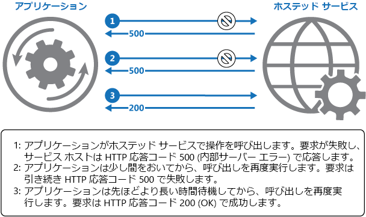

# <a name="retry-pattern"></a>再試行パターン

[!INCLUDE [header](../_includes/header.md)]

一時的な障害をアプリケーションが処理できるようにします。アプリケーションがサービスまたはネットワーク リソースに接続しようとしたときに失敗した操作を透過的に再試行します。 これにより、アプリケーションの安定性を向上させることができます。

## <a name="context-and-problem"></a>コンテキストと問題

クラウドで実行されている要素と通信するアプリケーションは、この環境で発生する一時的な障害に敏感である必要があります。 障害とは、たとえば、コンポーネントやサービスとのネットワーク接続が一瞬失われたり、サービスを一時的に利用できなくなったり、サービスがビジー状態となってタイムアウトしたりすることが該当します。

通常、これらの障害は自動修正され、障害のトリガーとなったアクションを適切な待ち時間の経過後に再試行すると、高い確率で正常に実行されます。 たとえば、多数の同時要求を処理しているデータベース サービスは、ワークロードが緩和されるまで一時的に新たな要求を拒否する調整ストラテジを実装することができます。 データベースにアクセスしようとしているアプリケーションが接続に失敗した場合は、時間をおいてから接続を再試行すれば成功する可能性があります。

## <a name="solution"></a>解決策

クラウドでは、一時的な障害は珍しいことではないため、それらを適切かつ透過的に処理するようにアプリケーションを設計する必要があります。 これにより、アプリケーションによって実行されているビジネス タスクに与える可能性がある障害の影響を最小限に抑えることができます。

アプリケーションがリモート サービスに要求を送信しようとしたときに障害が検出された場合は、次の方法を使用して障害を処理できます。

- **キャンセルする**。 障害が一時的でないか、操作を繰り返しても成功する可能性が低い場合、アプリケーションは、操作をキャンセルして例外を報告する必要があります。 たとえば、無効な資格情報を提供することで発生した認証の失敗は、何回試しても成功する見込みはありません。

- **再試行する**。 報告された特定の障害が異常であるか、めったに発生しないものである場合は、ネットワーク パケットが転送中に破損しているといった普通でない状況が原因である可能性があります。 この場合、アプリケーションは、失敗した要求をすぐに再試行できます。これは、同じ障害が繰り返される可能性は低く、要求はおそらく成功するためです。

- **時間をおいて再試行する**。 障害の原因が、一般的な接続エラーまたはビジー エラーのいずれかである場合、ネットワークまたはサービスは、接続の問題が修正されるか作業のバックログがクリアされるための時間を必要とします。 アプリケーションは、要求を再試行する前に、適切な時間、待機する必要があります。

もっと一般的な一時的な障害では、アプリケーションの複数のインスタンスからの要求をできるだけ均等に分散するように再試行の間隔を選択する必要があります。 これにより、ビジー状態にあるサービスが過負荷になる可能性が軽減されます。 アプリケーションの多数のインスタンスが再試行要求によってサービスに負荷をかけ続けると、サービスが回復するまでの時間が長くなります。

要求が失敗する場合、アプリケーションは待機してから再試行できます。 必要であれば、要求の最大最高回数に達するまで、再試行の待ち時間を長くしてこのプロセスを繰り返すことができます。 待ち時間は、障害の種類とその時間中に修正される確率に応じて、増分的または指数関数的に長くすることができます。

次の図は、このパターンを使用したホスト サービス内の操作の呼び出しを示しています。 あらかじめ定義された試行回数で要求が成功しない場合、アプリケーションは、障害を例外として適切に処理する必要があります。



アプリケーションは、リモート サービスにアクセスするすべての試みを、前述の方法のいずれかに一致する再試行ポリシーを実装するコード内にラップする必要があります。 異なるサービスに送信される要求は、異なるポリシーの対象にすることができます。 一部のベンダーは、再試行ポリシーを実装するライブラリを提供しています。アプリケーションは、再試行の最大回数、再試行の間隔、およびその他のパラメーターを指定できます。

アプリケーションは、障害と失敗した操作の詳細をログに記録する必要があります。 この情報はオペレーターにとって有益です。 サービスが頻繁に使用できなくなるかビジー状態になる場合、その原因の多くは、サービスのリソースが使い果たされていることです。 サービスをスケール アウトすることで、このような障害の頻度を軽減できます。 たとえば、データベース サービスが継続的に過負荷になる場合は、データベースをパーティション分割し、複数のサーバーに負荷を分散すると効果的である可能性があります。

> [Microsoft Entity Framework](https://docs.microsoft.com/ef/) は、データベースの操作を再試行するための機能を提供します。 ほとんどの Azure サービスとクライアント SDK にも、再試行メカニズムが組み込まれています。 詳細については、「[特定のサービスの再試行ガイダンス](/azure/architecture/best-practices/retry-service-specific)」を参照してください。

## <a name="issues-and-considerations"></a>問題と注意事項

このパターンの実装方法を決めるときは、以下の点を考慮してください。

再試行ポリシーは、アプリケーションのビジネス要件と障害の性質と一致するように調整する必要があります。 一部の重要でない操作では、再試行を複数回実行してアプリケーションのスループットに影響を与えるよりも、フェイル ファストすることをお勧めします。 たとえば、リモート サービスにアクセスする対話型の Web アプリケーションでは、数回の再試行を短い待ち時間で実行した後、適切なメッセージ (たとえば、「後でもう一度やり直してください」) をユーザーに表示することをお勧めします。 バッチ アプリケーションの場合は、再試行の待ち時間を指数関数的に長くしながら何度も再試行するほうが適切である可能性があります。

最短の待ち時間で何回も再試行を行う攻撃的な再試行ポリシーは、フル稼働しているかその状態に近いビジー状態のサービスをさらに低下させる可能性があります。 この再試行ポリシーは、障害が発生した操作を継続的に再試行しようとした場合、アプリケーションの応答性にも影響を与える可能性があります。

何回も再試行した後で要求がまだ失敗する場合、アプリケーションは、同じリソースにさらに要求を送信することを停止し、ただちに障害を報告することをお勧めします。 一定時間が経過した後で、アプリケーションは、試しに 1 つまたは複数の要求を送信して、それらが正常に実行されるかどうかを確認できます。 この方法の詳細については、「[サーキット ブレーカー パターン](./circuit-breaker.md)」を参照してください。

操作がべき等であるかどうかを検討します。 その場合、再試行は本質的に安全です。 それ以外の場合、再試行によって操作を複数回実行すると、意図しない副作用が発生する可能性があります。 たとえば、サービスは要求を受信して要求を正常に処理したが、応答の送信に失敗したとします。 その時点で、再試行ロジックは、最初の要求が受信されなかったと仮定して、要求を再送信する可能性があります。

サービスへの要求は、さまざまな理由で失敗し、障害の性質によってさまざまな例外が発生する可能性があります。 一部の例外はすぐに解決できる障害を示し、一部の例外は継続時間が長い障害を示します。 再試行ポリシーでは、再試行間隔を例外の種類に基づいて調整すると便利です。

トランザクションの一部である操作の再試行がトランザクションの全体的な一貫性に与える影響を検討します。 成功の確率を最大化し、トランザクションのすべてのステップを元に戻す必要性を軽減するように、トランザクション操作の再試行ポリシーを微調整します。

すべての再試行コードが、さまざまなエラー条件に対して完全にテストされていることを確認します。 アプリケーションのパフォーマンスや信頼性に重大な影響を与えないこと、サービスやリソースに過剰な負荷が発生しないこと、競合状態やボトルネックが生成されないことを確認します。

再試行ロジックは、失敗した操作の完全なコンテキストを理解できる場所のみに実装します。 たとえば、再試行ポリシーを含むタスクが、同じように再試行ポリシーを含む別のタスクを呼び出すと、再試行の追加によって、処理の待ち時間がさらに長くなる可能性があります。 下位レベルのタスクはフェイル ファストするように構成し、呼び出し元のタスクに失敗の理由を報告するほうが適している場合があります。 上位レベルのタスクは、独自のポリシーに基づいて障害を処理できます。

重要なのは、再試行の原因となるすべての接続障害をログに記録して、基になるアプリケーション、サービス、またはリソースの問題を識別できるようすることです。

サービスまたはリソースで最も発生する可能性がある障害を調べて、それらの障害が長く続くか末期的になる可能性があるかどうかを判断します。 該当する場合は、障害を例外として処理することをお勧めします。 アプリケーションは、例外を報告するかログに記録した後、別のサービスを呼び出す (使用可能なものがある場合) か、機能を低下させることで、続行することを試行できます。 長く続く障害を検出して処理する方法の詳細については、「[サーキット ブレーカー パターン](./circuit-breaker.md)」を参照してください。

## <a name="when-to-use-this-pattern"></a>このパターンを使用する状況

このパターンは、アプリケーションがリモート サービスと対話するかリモート リソースにアクセスするときに、一時的な障害が発生する可能性がある場合に使用します。 このような障害は長く続かないことが予想されるため、失敗した要求を繰り返し試行すれば成功する可能性があります。

以下の場合は、このパターンの使用は適していません。

- 障害が長く続きそうな場合。これは、アプリケーションの応答性に影響する可能性があるためです。 失敗する可能性が高い要求を繰り返し試行すると、アプリケーションが時間とリソースを無駄に費やすことになる可能性があります。
- 一時的な障害が原因ではない障害 (アプリケーションのビジネス ロジックのエラーが原因で発生する内部例外など) を処理するため。
- システムのスケーラビリティの問題に対応するための代替方法として。 アプリケーションがビジー状態を頻繁に経験することは、多くの場合、アクセス対象のサービスまたはリソースをスケール アップする必要があることを示すサインです。

## <a name="example"></a>例

次の C# の例は、再試行パターンの実装を示しています。 次に示す `OperationWithBasicRetryAsync` メソッドは、`TransientOperationAsync` メソッドを通して外部サービスを非同期に呼び出します。 `TransientOperationAsync` メソッドはサービス固有であるため、このサンプル コードでは省略されています。

```csharp
private int retryCount = 3;
private readonly TimeSpan delay = TimeSpan.FromSeconds(5);

public async Task OperationWithBasicRetryAsync()
{
  int currentRetry = 0;

  for (;;)
  {
    try
    {
      // Call external service.
      await TransientOperationAsync();

      // Return or break.
      break;
    }
    catch (Exception ex)
    {
      Trace.TraceError("Operation Exception");

      currentRetry++;

      // Check if the exception thrown was a transient exception
      // based on the logic in the error detection strategy.
      // Determine whether to retry the operation, as well as how
      // long to wait, based on the retry strategy.
      if (currentRetry > this.retryCount || !IsTransient(ex))
      {
        // If this isn't a transient error or we shouldn't retry,
        // rethrow the exception.
        throw;
      }
    }

    // Wait to retry the operation.
    // Consider calculating an exponential delay here and
    // using a strategy best suited for the operation and fault.
    await Task.Delay(delay);
  }
}

// Async method that wraps a call to a remote service (details not shown).
private async Task TransientOperationAsync()
{
  ...
}
```

このメソッドを呼び出すステートメントは、for ループにラップされた try/catch ブロックに含まれています。 for ループは、`TransientOperationAsync` メソッドの呼び出しが例外のスローなしで成功した場合に実行されます。 `TransientOperationAsync` メソッドが失敗した場合は、catch ブロックが失敗の理由を調べます。 一時的なエラーであると思われる場合、このコードは、操作を再試行する前に短時間待機します。

for ループは操作の試行回数も追跡し、コードが 3 回失敗した場合は、例外が長く続くとみなします。 例外が一時的ではなく、長く続く場合は、catch ハンドラーが例外をスローします。 この例外によって for ループが終了し、例外は、`OperationWithBasicRetryAsync` メソッドを呼び出すコードによってキャッチされます。

次に示す `IsTransient` メソッドは、コードが実行されている環境に関連する例外のセットをチェックします。 一時的な例外の定義は、アクセスされるリソースと操作が実行される環境によって異なります。

```csharp
private bool IsTransient(Exception ex)
{
  // Determine if the exception is transient.
  // In some cases this is as simple as checking the exception type, in other
  // cases it might be necessary to inspect other properties of the exception.
  if (ex is OperationTransientException)
    return true;

  var webException = ex as WebException;
  if (webException != null)
  {
    // If the web exception contains one of the following status values
    // it might be transient.
    return new[] {WebExceptionStatus.ConnectionClosed,
                  WebExceptionStatus.Timeout,
                  WebExceptionStatus.RequestCanceled }.
            Contains(webException.Status);
  }

  // Additional exception checking logic goes here.
  return false;
}
```

## <a name="related-patterns-and-guidance"></a>関連のあるパターンとガイダンス

- [サーキット ブレーカー パターン](./circuit-breaker.md)。 再試行パターンは、一時的な障害を処理するために役立ちます。 障害が長く続くことが予想される場合は、サーキット ブレーカー パターンを実装するほうが適切である可能があります。 再試行パターンとサーキット ブレーカー パターンを組み合わせて、障害を処理するための包括的なアプローチを提供することもできます。
- [特定のサービスの再試行ガイダンス](/azure/architecture/best-practices/retry-service-specific)
- [接続の回復性](https://docs.microsoft.com/ef/core/miscellaneous/connection-resiliency)
