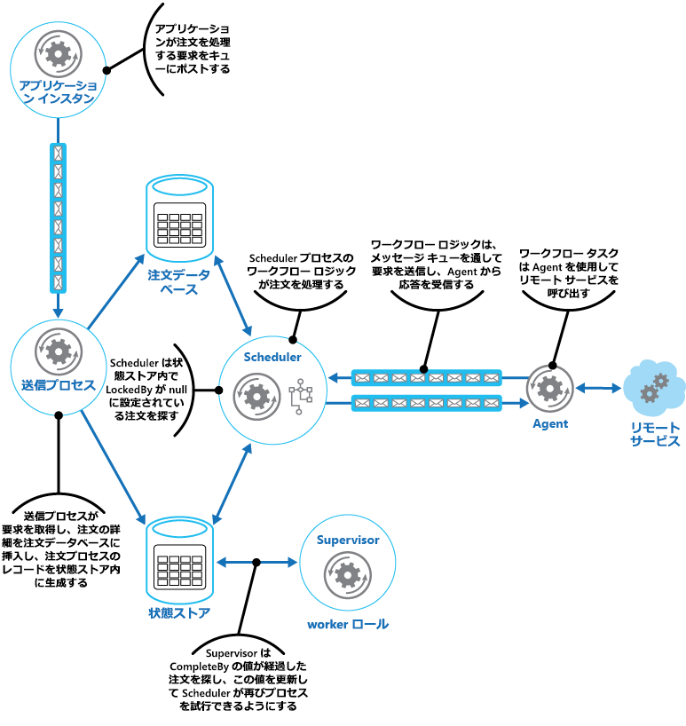

# Scheduler Agent Supervisor パターン

[!INCLUDE [header](../_includes/header.md)]

分散された一連のアクションを 1 つの操作として調整します。 いずれかのアクションが失敗した場合は、全体の操作が全体として成功または失敗するように、その失敗を透過的に処理しようとするか、または実行された作業を元に戻します。 これにより、一時的な例外、長期間続く障害、プロセスのエラーなどのために失敗したアクションを復旧して再試行することが可能になるため、分散システムに回復性が追加される場合があります。

## コンテキストと問題

アプリケーションは、その一部でリモート サービスが呼び出されたり、リモート リソースにアクセスしたりする可能性のあるいくつかの手順を含むタスクを実行します。 それぞれのステップは互いに独立しているかもしれませんが、それらを指揮するのは、タスクを実装するアプリケーションのロジックです。

可能な場合は常に、アプリケーションはタスクが完了まで実行されるようにし、リモート サービスまたはリソースへのアクセス時に発生する可能性のあるすべての障害を解決する必要があります。 障害は、さまざまな原因で発生することがあります。 たとえば、ネットワークが停止したり、通信が中断されたり、リモート サービスが無応答または不安定な状態になったり、おそらくリソースの制約のためにリモート リソースが一時的にアクセスできなくなったりすることがあります。 多くの場合、障害は一時的なものであり、[再試行パターン](./retry.md)を使用して処理できます。

アプリケーションは、容易に復旧できないより永続的な障害を検出した場合、システムを整合性のある状態に復元し、操作全体の整合性を保証できる必要があります。

## 解決策

Scheduler Agent Supervisor パターンは、次のアクターを定義します。 これらのアクターは、全体的なタスクの一部として実行される手順を調整します。

- **Scheduler** は、実行されるタスクを構成する手順を準備し、その操作を調整します。 これらの手順は、パイプラインまたはワークフローに結合できます。 Scheduler は、このワークフロー内の手順が正しい順序で実行されるようにすることに責任を負います。 各手順が実行されると、Scheduler は、"まだ開始されていない手順"、"実行中の手順"、"完了した手順" などのワークフローの状態を記録します。 状態情報にはまた、完了期限と呼ばれる、手順が完了するまでに許可される時間の上限も含まれます。 ある手順にリモート サービスまたはリソースへのアクセスが必要な場合、Scheduler は適切な Agent を呼び出し、実行される作業の詳細を渡します。 Scheduler は通常、非同期の要求/応答メッセージングを使用して Agent と通信します。 これはキューを使用して実装できますが、代わりに、その他の分散メッセージング テクノロジも使用できます。

    > Scheduler は、[Process Manager パターン](https://www.enterpriseintegrationpatterns.com/patterns/messaging/ProcessManager.html)で Process Manager に対して同様の機能を実行します。 実際のワークフローは通常、Scheduler によって制御されるワークフロー エンジンによって定義および実装されます。 このアプローチにより、ワークフロー内のビジネス ロジックが Scheduler から分離されます。

- **Agent** には、リモート サービスの呼び出し、またはタスク内の手順によって参照されるリモート リソースへのアクセスをカプセル化するロジックが含まれています。 各 Agent は通常、1 つのサービスまたはリソースの呼び出しをラップし、適切なエラー処理と再試行ロジックを実装します (後で説明される、タイムアウトの制約に従います)。 Scheduler によって実行されるワークフロー内の手順が別の手順にまたがっていくつかのサービスやリソースを使用する場合は、各手順が別の Agent を参照する可能性があります (これがパターンの実装の詳細です)。

- **Supervisor** は、Scheduler によって実行されているタスク内の手順の状態を監視します。 これは定期的に実行され (頻度はシステムに固有です)、Scheduler によって保持されている手順の状態を調べます。 いずれかの手順がタイムアウトまたは失敗したことを検出した場合は、その手順を復旧するか、または適切な是正アクション (これには手順の状態の変更が含まれることがあります) を実行する適切な Agent を準備します。 復旧または是正アクションが Scheduler と Agent によって実装されることに注意してください。 Supervisor は単純に、これらのアクションが実行されることを要求します。

Scheduler、Agent、および Supervisor は論理的なコンポーネントであり、それらの物理的な実装は使用されているテクノロジによって異なります。 たとえば、1 つの Web サービスの一部として複数の論理的な Agent が実装される可能性があります。

Scheduler は、タスクの進行状況や各手順の状態に関する情報を、状態ストアと呼ばれる持続性のあるデータ ストア内に保持します。 Supervisor は、手順が失敗したかどうかの判定に役立てるためにこの情報を使用できます。 この図は、Scheduler、Agent、Supervisor、および状態ストアの関係を示しています。

> [!NOTE]
> この図は、パターンの簡略版を示しています。 実際の実装では、それぞれがタスクのサブセットである、Scheduler の多数のインスタンスが同時に実行されることがあります。 同様に、システムが各 Agent の複数のインスタンス、場合によっては複数の Supervisor を実行する可能性があります。 この場合、各 Supervisor は自身の作業を互いに慎重に調整して、同じ失敗した手順やタスクを復旧するために競合しないようにする必要があります。 [リーダー選定パターン](./leader-election.md)は、この問題に対する 1 つの可能性のある解決策を提供します。

アプリケーションは、タスクを実行する準備が整うと Scheduler に要求を送信します。 Scheduler は、タスクとその手順に関する初期の状態情報を状態ストア内に記録した後 (たとえば、まだ開始されていない手順)、ワークフローによって定義された操作の実行を開始します。 Scheduler は、各手順を開始すると、状態ストア内のその手順の状態に関する情報を更新します (たとえば、実行中の手順)。

ある手順がリモート サービスまたはリソースを参照した場合、Scheduler は適切な Agent にメッセージを送信します。 このメッセージには、操作の完了期限に加えて、Agent がそのサービスに渡すか、またはそのリソースにアクセスするために必要な情報が含まれています。 その操作を正常に完了した場合、Agent は Scheduler に応答を返します。 その後、Scheduler は状態ストア内の状態情報を更新してから (たとえば、完了した手順)、次の手順を実行できます。 タスク全体が完了するまで、このプロセスが続行されます。

Agent は、その作業を実行するために必要な任意の再試行ロジックを実装できます。 ただし、完了期限が切れる前に Agent が作業を完了しない場合、Scheduler はその操作が失敗したと見なします。 この場合、Agent はその作業を停止し、Scheduler に何も (エラー メッセージさえ) 返そうとせず、またどのような形式の復旧も試行しません。 この制限の理由は、手順がタイムアウトまたは失敗した後、その失敗した手順を実行するために Agent の別のインスタンスがスケジュールされる可能性がある点にあります (このプロセスについては後で説明します)。

Agent が失敗した場合、Scheduler は応答を受信しません。 パターンでは、タイムアウトした手順と、純粋に失敗した手順が区別されません。

ある手順がタイムアウトまたは失敗した場合、状態ストアにはその手順が実行中であることを示すレコードが含まれますが、完了期限は切れます。 Supervisor はこのような手順を探し、それらを復旧しようとします。 1 つの可能性のある方式として、Supervisor が完了期限の値を更新して手順を完了するために使用できる時間を延長してから、タイムアウトした手順を識別するメッセージを Scheduler に送信する方法があります。その後、Scheduler はこの手順を繰り返そうとします。 ただし、この設計では、タスクが冪等である必要があります。

手順が継続的に失敗またはタイムアウトした場合は、Supervisor で、同じ手順が再試行されないようにすることが必要になる場合があります。これを行うために、Supervisor は、状態情報と共に各手順の再試行カウントを状態ストア内に保持できます。 このカウントが定義済みのしきい値を超えた場合、Supervisor は Scheduler に手順を再試行すべきことを通知する前に長期間待つことにより、この期間中に障害が解決されることを期待する方法を採用できます。 あるいは、[補正トランザクション パターン](./compensating-transaction.md)を実装することにより、Supervisor は Scheduler にメッセージを送信してタスク全体を元に戻すことを要求できます。 このアプローチは、正常に完了した手順ごとの補正操作を実装するために必要な情報を提供する Scheduler と Agent に依存します。

> Scheduler と Agent を監視し、失敗した場合にそれらを再起動することは Supervisor の目的ではありません。 システムのこの側面は、これらのコンポーネントが実行されているインフラストラクチャによって処理される必要があります。 同様に、Supervisor には、Scheduler によって実行されるタスクが実行している実際のビジネス運用の知識 (これらのタスクが失敗した場合に補正する方法を含む) もありません。 これが、Scheduler によって実装されたワークフロー ロジックの目的です。 Supervisor の責任は、ある手順が失敗したかどうかを判定し、それを繰り返すように、または失敗した手順を含むタスク全体を元に戻すように準備することだけです。

障害の後に Scheduler が再起動されたり、Scheduler によって実行されているワークフローが予期せず終了したりした場合、Scheduler は失敗したときに処理していた処理中タスクの状態を判定し、その時点からこのタスクを再開するように準備できます。 このプロセスの実装の詳細は、システム固有である可能性があります。 タスクを復旧できない場合は、そのタスクによって既に実行された作業を元に戻す操作が必要になることがあります。 これにはまた、[補正トランザクション](./compensating-transaction.md)の実装も必要になります。

このパターンの主な利点は、予期しない一時的または回復不可能な障害が発生した場合のシステムの回復性が高いことです。 システムを自己復旧するように構成できます。 たとえば、Agent または Scheduler が失敗した場合は、新しい Agent または Scheduler を開始でき、Supervisor は再開されるタスクを準備できます。 Supervisor が失敗した場合は、別のインスタンスを開始でき、そのインスタンスが障害の発生した場所から引き継ぐことができます。 Supervisor が定期的に実行されるようにスケジュールされている場合は、定義済みの間隔の後、新しいインスタンスを自動的に開始できます。 状態ストアは、さらに高い回復性を実現するためにレプリケートできます。

## 問題と注意事項

このパターンの実装方法を決めるときには、以下の点に注意してください。

- このパターンは実装が難しい場合があり、システムの可能性のある各障害モードの徹底的なテストが必要になります。

- Scheduler によって実装される復旧/再試行ロジックは複雑であり、状態ストア内に保持されている状態情報に依存します。 また、補正トランザクションを実装するために必要な情報を持続性のあるデータ ストア内に記録することも必要になる可能性があります。

- Supervisor をどれだけ頻繁に実行するかが重要になります。 失敗した手順がアプリケーションを長期間ブロックしないようにするために十分なほど頻繁に実行する必要がありますが、オーバーヘッドになるほど頻繁には実行すべきでありません。

- Agent によって実行される手順は複数回実行できます。 これらの手順を実装するロジックは冪等である必要があります。

## このパターンを使用する状況

このパターンは、クラウドなどの分散環境で実行されるプロセスの、通信障害または動作障害に対する回復性を高くする必要がある場合に使用します。

このパターンは、リモート サービスを呼び出したり、リモート リソースにアクセスしたりしないタスクには適していない可能性があります。

## 例

e コマース システムを実装する Web アプリケーションが Microsoft Azure にデプロイされました。 ユーザーは、使用可能な製品を参照して注文するためにこのアプリケーションを実行できます。 ユーザー インターフェイスは Web ロールとして実行され、アプリケーションの注文処理要素は一連の worker ロールとして実装されます。 注文処理ロジックの一部にはリモート サービスへのアクセスが含まれ、システムのこの側面が一時的な障害、またはより長期間続く障害になりやすくなる可能性があります。 このため、デザイナーは Scheduler Agent Supervisor パターンを使用して、システムの注文処理要素を実装しました。

顧客が注文を行うと、アプリケーションはその注文が記述されたメッセージを作成し、このメッセージをキューにポストします。 worker ロールで実行されている個別の送信プロセスがそのメッセージを取得し、注文の詳細を注文データベースに挿入して、注文プロセスのレコードを状態ストア内に作成します。 注文データベースと状態ストアへの挿入が同じ操作の一部として実行されることに注意してください。 送信プロセスは、両方の挿入が必ず一緒に完了するように設計されています。

送信プロセスが注文のために作成する状態情報には、次のものがあります。

- **OrderID**。 注文データベース内の注文の ID。

- **LockedBy**。 注文を処理している worker ロールのインスタンス ID。 Scheduler を実行している worker ロールの現在のインスタンスは複数存在する可能性がありますが、各注文は 1 つのインスタンスによってのみ処理される必要があります。

- **CompleteBy**。 注文を処理する必要のある期限。

- **ProcessState**。 注文を処理しているタスクの現在の状態。 可能性のある状態は次のとおりです。

  - **保留中**。 注文が作成されましたが、処理はまだ開始されていません。
  - **処理中**。 注文は現在処理されています。
  - **処理済み**。 注文は正常に処理されました。
  - **エラー**。 注文処理が失敗しました。

- **FailureCount**。 注文のために処理が試行された回数。

この状態情報では、`OrderID` フィールドは新しい注文の注文 ID からコピーされます。 `LockedBy` および `CompleteBy` フィールドは `null` に設定され、`ProcessState` フィールドは `Pending` に設定され、`FailureCount` フィールドは 0 に設定されます。

> [!NOTE]
> この例では、注文処理ロジックは比較的単純であり、リモート サービスを呼び出す手順が 1 つしか存在しません。 より複雑な複数手順のシナリオでは、送信プロセスに複数の手順が含まれるため、それぞれに個別の手順の状態が記述された複数のレコードが状態ストア内に作成される可能性があります。

Scheduler もまた worker ロールの一部として実行され、注文を処理するビジネス ロジックを実装します。 新しい注文をポーリングする Scheduler のインスタンスは、`LockedBy` フィールドが null で、`ProcessState` フィールドが保留中であるレコードがないかどうか状態ストアを調べます。 Scheduler は新しい注文を見つけると、直ちに `LockedBy` フィールドに独自のインスタンス ID を入力し、`CompleteBy` フィールドを適切な時間に設定し、`ProcessState` フィールドを処理中に設定します。 このコードは、Scheduler の 2 つの同時実行インスタンスが同じ注文を同時に処理しようと試みることができないように、排他的かつアトミックであるように設計されています。

Scheduler は次に、注文を非同期的に処理するビジネス ワークフローを実行し、それに状態ストアの `OrderID` フィールド内の値を渡します。 注文を処理しているワークフローは、注文データベースから注文の詳細を取得し、その作業を実行します。 注文処理ワークフローの手順がリモート サービスを呼び出す必要がある場合、その手順は Agent を使用します。 ワークフローの手順は、要求/応答チャンネルとして機能している 1 対の Azure Service Bus メッセージ キューを使用して Agent と通信します。 この図は、このソリューションの高レベルのビューを示しています。

ワークフローの手順から Agent に送信されるメッセージには注文が記述され、完了期限が含まれています。 Agent は、完了期限が切れる前にリモート サービスからの応答を受信した場合、ワークフローがリッスンしている Service Bus キューに応答メッセージをポストします。 ワークフローの手順は、有効な応答メッセージを受信すると処理を完了し、Scheduler が注文状態の ProcessState フィールドを処理済みに設定します。 この時点で、注文処理は正常に完了しました。

Agent がリモート サービスからの応答を受信する前に完了期限が切れた場合、Agent は単純に処理を停止し、注文の処理を終了します。 同様に、注文を処理しているワークフローが完了期限を経過した場合は、そのワークフローも終了します。 どちらの場合も、状態ストア内の注文の状態は処理中に設定されたままになりますが、完了期限により注文を処理するための時間が経過したことが示され、そのプロセスは失敗したと見なされます。 リモート サービスにアクセスしている Agent、または注文を処理しているワークフロー (またはその両方) が予期せず終了した場合も、状態ストア内の情報が処理中に設定されたままになり、最終的には完了期限の値が経過することに注意してください。

Agent は、リモート サービスへの接続を試行している間に一時的ではない、回復不可能な障害を検出した場合、ワークフローにエラー応答を戻すことができます。 Scheduler は注文の状態をエラーに設定し、オペレーターにアラートを送信するイベントを生成できます。 その後、オペレーターは手動で障害の原因の解決を試み、失敗した処理手順を再送信できます。

Supervisor は、完了期限の値が経過した注文がないかどうか状態ストアを定期的に調べます。 Supervisor はレコードを見つけると、`FailureCount` フィールドを増分します。 障害カウントの値が指定されたしきい値を下回った場合、Supervisor は `LockedBy` フィールドを null にリセットし、`CompleteBy` フィールドを新しい期限切れ日時で更新し、`ProcessState` フィールドを保留中に設定します。 Scheduler のインスタンスはこの注文を選択し、以前と同様にその処理を実行できます。 障害カウントの値が指定されたしきい値を超えた場合は、障害の原因が一時的ではないと見なされます。 Supervisor は注文の状態をエラーに設定し、オペレーターにアラートを送信するイベントを生成します。

> この例では、Supervisor は個別の worker ロールで実装されます。 実行される Supervisor タスクを準備するには、Azure Scheduler サービスの使用を含むさまざまな方式を使用できます (このパターンでの Scheduler コンポーネントと混同しないでください)。 Azure Scheduler サービスの詳細については、「[Scheduler](https://azure.microsoft.com/services/scheduler/)」のページを参照してください。

この例では示されていませんが、Scheduler は注文を送信したアプリケーションを、注文の進行状況や状態が常に通知される状態に維持することが必要になる場合があります。 アプリケーションと Scheduler は、それらの間に依存関係が存在しないようにするために互いに分離されています。 アプリケーションは Scheduler のどのインスタンスが注文を処理しているかを知らず、Scheduler は特定のどのアプリケーション インスタンスが注文をポストしたかを認識していません。

注文状態を報告できるようにするために、アプリケーションは独自のプライベートな応答キューを使用できます。 この応答キューの詳細は、送信プロセスに送信される要求の一部として含まれ、その送信プロセスがこの情報を状態ストア内に含めます。 Scheduler は次に、注文の状態 (受信された要求、完了した注文、失敗した注文など) を示すメッセージをこのキューにポストします。 これらのメッセージには注文 ID を含め、それをアプリケーションによる元の要求と関連付けることができるようにします。

## 関連のあるパターンとガイダンス

このパターンを実装する場合は、次のパターンとガイダンスも関連している可能性があります。

- [再試行パターン](./retry.md)。 Agent は、このパターンを使用して、以前に失敗したリモート サービスまたはリソースにアクセスする操作を透過的に再試行できます。 障害の原因が一時的であり、修正できることが予測される場合に使用します。
- [サーキット ブレーカー パターン](./circuit-breaker.md)。 Agent は、このパターンを使用して、リモート サービスまたはリソースへの接続時に修正にかかる時間が一定しない障害を処理できます。
- [Compensating Transaction パターン](./compensating-transaction.md)。 Scheduler によって実行されているワークフローを正常に完了できない場合は、以前に実行されたすべての作業を元に戻す操作が必要になることがあります。 補正トランザクション パターンには、最終的整合性モデルに従う操作でこれを実現する方法が記述されています。 これらの種類の操作は一般に、複雑なビジネス プロセスおよびワークフローを実行する Scheduler によって実装されます。
- [非同期メッセージングの基本](https://msdn.microsoft.com/library/dn589781.aspx)。 Scheduler Agent Supervisor パターンのコンポーネントは通常、互いに分離された状態で実行され、非同期的に通信します。 メッセージ キューに基づいた非同期通信を実装するために使用できるいくつかのアプローチが記述されています。
- [リーダー選定パターン](./leader-election.md)。 Supervisor の複数のインスタンスのアクションを調整して、それらが同じ失敗したプロセスの復旧を試みないようにすることが必要になる場合があります。 リーダー選定パターンには、これを行う方法が記述されています。
- [クラウド アーキテクチャ:Scheduler-Agent-Supervisor パターン](https://blogs.msdn.microsoft.com/clemensv/2010/09/27/cloud-architecture-the-scheduler-agent-supervisor-pattern/) (Clemens Vasters のブログにあります)
- [Process Manager パターン](https://www.enterpriseintegrationpatterns.com/patterns/messaging/ProcessManager.html)
- [リファレンス 6:Saga on Sagas](https://msdn.microsoft.com/library/jj591569.aspx)。 CQRS パターンで Process Manager を使用する方法を示す例 (CQRS Journey ガイダンスの一部)。
- [Microsoft Azure Scheduler](https://azure.microsoft.com/services/scheduler/)
