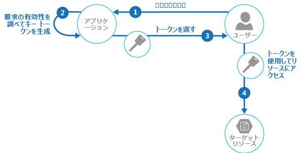

# <a name="valet-key-pattern"></a>バレット キー パターン

[!INCLUDE [header](../_includes/header.md)]

アプリケーションからのデータ転送をオフロードするため、クライアントに特定リソースへの限定的な直接アクセスを提供するトークンを使用します。 これは特に、クラウドでホストされるストレージ システムやキューを使用するアプリケーションで役に立ち、コストを最小限にしてスケーラビリティとパフォーマンスを最大化できます。

## <a name="context-and-problem"></a>コンテキストと問題

クライアント プログラムや Web ブラウザーは、多くの場合、アプリケーションのストレージとの間でファイルまたはデータ ストリームを読み書きする必要があります。 アプリケーションは通常、データをストレージからフェッチしてクライアントにストリーミングするか、クライアントからアップロードされたストリームを読み取ってそれをデータ ストアに格納することによって、データの移動を処理します。 ただし、このアプローチでは、計算、メモリ、帯域幅などの貴重なリソースが取られます。

データ ストアには、データのアップロードとダウンロードを直接処理する機能があり、このデータを移動するための処理を実行するようアプリケーションに要求しません。 しかし通常は、クライアントが、ストアのセキュリティ資格情報に対するアクセス権を持っているようにする必要があります。 これは、データ転送のコストと、アプリケーションをスケール アウトするための要件を最小限にして、パフォーマンスを最大化するうえで便利な方法となります。 ただしこれは、アプリケーションがデータのセキュリティを管理できなくなることを意味します。 クライアントがデータ ストアへの接続を備え、直接アクセスを行うようになると、アプリケーションがゲートキーパーとして機能することはできません。 アプリケーションはもはやプロセスを制御しておらず、データ ストアからの後続のアップロードやダウンロードを防げません。

これは、信頼されていないクライアントにサービスを提供する必要のある分散システムでは現実的なアプローチではありません。 それよりも、アプリケーションはきめ細かな方法でデータへのアクセスを安全に制御できる一方で、この接続を設定し、その後クライアントがデータ ストアと直接通信して必要な読み取りまたは書き込み操作を実行できるようにして、サーバーでの負荷を軽減できる必要があります。

## <a name="solution"></a>解決策

ストアがクライアントの認証と承認を管理できないデータ ストアへのアクセスを制御する問題を解決する必要があります。 一般的な 1 つの解決策は、データ ストアのパブリック接続へのアクセスを制限し、データ ストアが検証できるキーまたはトークンをクライアントに提供することです。

このキーまたはトークンは、通常、バレット キーと呼ばれます。 これにより、特定のリソースへの時間制限付きアクセスを提供し、ストレージやキューに対する読み取りと書き込み、Web ブラウザーでのアップロードとダウンロードなど、定義済みの操作のみを許可します。 アプリケーションはすばやく容易にバレット キーを作成してクライアント デバイスや Web ブラウザーに発行し、クライアントに必要な操作の実行を許可できます。アプリケーションがデータ転送を直接処理する必要はありません。 これによって、アプリケーションとサーバーに起因する、処理のオーバーヘッドと、パフォーマンスやスケーラビリティへの影響がなくなります。

図に示すように、クライアントは特定の期間のみ、アクセス許可に関して特定の制限があるデータ ストア内の特定のリソースに、このトークンを使用してアクセスします。 指定された期間の後にキーは無効になり、リソースへのアクセスは許可されなくなります。



データの範囲など、他の依存関係があるキーを構成することもできます。 たとえば、データ ストアの機能に応じて、キーでデータ ストア内のテーブル全体を指定することも、テーブル内の特定の行だけを指定することもできます。 クラウド ストレージ システム内では、キーによって、コンテナーを指定することも、コンテナー内の特定項目だけを指定することもできます。

キーは、アプリケーションによって無効にすることも可能です。 これは、クライアントがサーバーに、データ転送操作が完了したことを通知する場合に役立つアプローチです。 サーバーはその後、そのキーを無効にして、それ以上を停止できます。

このパターンを使用すると、ユーザーを作成して認証し、アクセス許可を与え、その後ユーザーを再度削除する必要がないため、リソースへのアクセスの管理を簡略化できます。 場所、アクセス許可、および有効期間の制限も容易になり、すべて実行時にキーを生成するだけです。 重要な要素は、受信者がリソースを意図した目的にのみ使用できるように、有効期間と、特にリソースの場所をできるだけ厳しく制限することです。

## <a name="issues-and-considerations"></a>問題と注意事項

このパターンの実装方法を決めるときには、以下の点に注意してください。

**有効状態とキーの期間を管理します**。 漏えいやセキュリティ侵害が発生した場合、キーによってターゲット項目のロックが効果的に解除され、有効期間中は悪用が可能になります。 キーは通常、発行された方法に応じて、取り消すことまたは無効することができます。 サーバー側のポリシーを変更するか、署名に使用されたサーバー キーを無効にすることが可能です。 承認されていない操作がデータ ストアに対して発生するリスクを最小限にするため、短い有効期間を指定してください。 ただし、有効期間が短すぎると、キーの有効期限が切れる前にクライアントが操作を完了できない可能性があります。 保護されたリソースに対して複数のアクセスが必要な場合は、有効期間が終わる前に、承認されたユーザーがキーを更新できるようにします。

**キーによって提供するアクセスのレベルを制御します**。 通常、キーでは、クライアントがデータ ストアにデータをアップロードできてはいけない場合、読み取り専用アクセスなど、操作を完了するために必要な操作のみを実行できるようにする必要があります。 ファイルのアップロードの場合、書き込み専用のアクセス許可を提供し、場所と有効期間を示すキーを指定するのが普通です。 キーが適用されるリソースまたは一連のリソースを正確に指定することが非常に重要です。

**ユーザーの動作を制御する方法を検討します**。 このパターンを実装することは、ユーザーにアクセスが付与されたリソースに対する制御の一部が失われることを意味します。 用いることができる制御のレベルは、サービスまたはターゲット データ ストアで使用できるポリシーとアクセス許可の機能によって制限されます。 たとえば、通常、ストレージに書き込まれるデータのサイズや、ファイルにアクセスするためにキーを使用できる回数を制限するキーを作成することはできません。 これにより、意図したクライアントによって使用された場合でもデータ転送のコストが予期せず大きくなる可能性があり、アップロードやダウンロードの繰り返しを引き起こすコードのエラーによって、これが発生する可能性があります。 ファイルをアップロードできる回数を制限するには、可能な場合には 1 つの操作が完了した時点でそれをアプリケーションに通知するようクライアントに強制します。 たとえば、一部のデータ ストアでは、操作を監視してユーザー動作を制御するためにアプリケーション コードで使用できるイベントが発生します。 ただし、1 つのテナントのすべてのユーザーが同じキーを使用するマルチテナント シナリオでは、個々のユーザーにクォータを適用するのは困難です。

**アップロードされたすべてのデータを検証し、必要に応じて不要部分を削除します**。 キーへのアクセスを取得した悪意のあるユーザーは、システムを侵害するように設計されたデータをアップロードする可能性があります。 一方、承認されたユーザーが、無効で、処理されるとエラーやシステム エラーになり得るデータをアップロードする可能性もあります。 これに対する保護のため、アップロードされたすべてのデータが検証され、使用前に悪意のある内容がないかチェックされるようにします。

**すべての操作を監査します**。 多くのキー ベースのメカニズムは、アップロードやダウンロードなどの操作とエラーを記録できます。 これらのログは通常、監査プロセスに組み込むことができ、ユーザーがファイル サイズやデータ量に基づいて課金される場合は課金にも使用できます。 このログを使用して、キー プロバイダーの問題や、保存されたアクセス ポリシーの偶発的削除によって発生する可能性がある認証エラーを検出します。

**キーを安全に配信します**。 ユーザーが Web ページでアクティブにする URL に埋め込むことも、ダウンロードが自動的に発生するようにサーバーのリダイレクト操作で使用することもできます。 常に HTTPS を使用して、セキュリティで保護されたチャネルでキーを配信します。

**転送中の機密データを保護します**。 アプリケーション経由の機密データの配信は、通常、SSL または TLS を使用して行われ、データ ストアに直接アクセスするクライアントにはこれを強制する必要があります。

このパターンの実装時に注意すべきその他の問題は次のとおりです。

- クライアントが、操作の完了をサーバーに通知しない、またはできない場合、唯一の制限はキーの有効期限であり、アプリケーションはアップロードやダウンロードの回数をカウントしたり、複数のアップロードやダウンロードを防止したりするなどの監査操作を実行できなくなります。

- 生成できるキーのポリシーの柔軟性が限られる可能性があります。 たとえば、一部のメカニズムでは、時間を指定した有効期間のみを使用できます。 他のメカニズムでは、十分な細分性の読み取り/書き込みアクセス許可を指定することができません。

- キーやトークンの有効期間の開始時刻を指定する場合は、クライアントの時計が少し同期していなくてもよいように、現在のサーバー時刻よりも少し前であるようにします。 指定しない場合の既定値は、通常、現在のサーバー時刻です。

- キーを含む URL はサーバーのログ ファイルに記録されます。 キーは通常、ログ ファイルが分析のために使用される前に有効期限が切れますが、ログ ファイルへのアクセスを確実に制限してください。 ログ データが監視システムに送信されたり別の場所に保存されたりする場合は、キーの漏えいを防ぐため、有効期間が切れる後までの待機時間を実装することを検討してください。

- クライアント コードが Web ブラウザーで実行される場合、Web ブラウザー内で実行されるコードを有効にしてページを提供するものとは異なるドメイン内のデータにアクセスするため、ブラウザーがクロス オリジン リソース共有 (CORS) サポートしている必要がある場合もあります。 古いブラウザーやデータ ストアには CORS をサポートしないものがあり、これらのブラウザーで実行するコードでは、バレット キーを使用して、クラウド ストレージ アカウントなど、別のドメイン内のデータへのアクセスを提供できる場合があります。

## <a name="when-to-use-this-pattern"></a>このパターンを使用する状況

このパターンは次の状況で役立ちます。

- リソースの読み込みを最小限にして、パフォーマンスとスケーラビリティを最大化する場合。 リソースをロックする必要がないバレット キーを使用すると、リモート サーバーの呼び出しが不要です。発行できるバレット キーの数に制限はありません。また、アプリケーションを介したデータ転送を実行することで生じる単一障害点が回避されます。 バレット キーの作成は、通常、キーを含む文字列を署名する単純な暗号操作です。

- 運用コストを最小限に抑える場合。 ストアとキューへの直接アクセスを有効にすることは、リソースとコストの面で効率的であり、ネットワーク ラウンド トリップの数が減少する結果になる可能性があります。また、必要な計算リソースの数を削減できる場合もあります。

- クライアントが定期的にデータのアップロードまたはダウンロードを行う場合。特に、大容量のボリュームがある場合や、各操作に大きなファイルが含まれる場合。

- ホスティングの制限またはコスト上の考慮事項のために、アプリケーションで使用できる計算リソースが限られている場合。 このシナリオでは、アプリケーションがデータ転送の処理から解放されるため、同時のデータ アップロードやダウンロードが多数ある場合はこのパターンがさらに役立ちます。

- データがリモート データ ストアまたは異なるデータ センターに格納される場合。 アプリケーションがゲートキーパーとして機能する必要がある場合、データ転送をデータ センター間やクライアントとアプリケーション間のパブリック ネットワークまたはプライベート ネットワークにわたって行い、その後アプリケーションとデータ ストアの間で行う追加の帯域幅のために料金が生じる可能性があります。

このパターンは、次の状況では有効でない場合があります。

- データが格納される前やクライアントに送信される前に、アプリケーションがデータに対していくつかのタスクを実行する必要がある場合。 たとえば、アプリケーションで検証を行う、アクセスの成功をログに記録する、データに対する変換を実行する必要がある場合。 ただし、一部のデータ ストアやクライアントは、圧縮や圧縮解除などの単純な変換をネゴシエートして実行できます (たとえば、Web ブラウザーは通常、GZip 形式を処理できます)。

- 既存のアプリケーションの設計により、パターンの組み込みが困難になっている場合。 このパターンを使用するには、通常、データを送受信する場合とは異なるアーキテクチャのアプローチが必要とされます。

- 監査証跡を管理したり、データ転送操作が実行される回数を制御したりする必要があり、これらの操作を管理するためにサーバーが使用できる通知を、使用中のバレット キー メカニズムがサポートしていない場合。

- 特にアップロード操作中に、データのサイズを制限することが必要な場合。 これに対しては、操作完了後にアプリケーションでデータのサイズをチェックするか、指定した期間の後またはスケジュールに従ってアップロードのサイズをチェックすることが唯一の解決策です。

## <a name="example"></a>例

Azure は、BLOB、テーブル、およびキュー内のデータへのきめ細かいアクセス制御と、Service Bus のキューおよびトピックのため、Azure Storage での Shared Access Signature をサポートしています。 Shared Access Signature トークンを構成し、特定のテーブル、テーブル内のキーの範囲、キュー、BLOB、または BLOB コンテナーに対する読み取り、書き込み、更新、削除などの特定のアクセス権を提供できます。 有効性は、指定した時間とするか、時間制限なしにすることが可能です。

Azure Shared Access Signature は、テーブルや BLOB などの特定のリソースに関連付けることができる、サーバーに保存されるアクセス ポリシーもサポートしています。 この機能は、アプリケーションで生成される Shared Access Signature トークンと比べて制御性と柔軟性が優れていて、可能な場合には常に使用する必要があります。 サーバーに保存されたポリシーで定義されている設定は変更可能で、新しいトークンを発行する必要なくトークンに反映されますが、トークン内に定義されている設定は、新しいトークンを発行せずに変更することができません。 このアプローチによって、有効期限が切れる前に有効な Shared Access Signature トークンを取り消すことも可能になっています。

> 詳細については、MSDN の「[Introducing Table SAS (Shared Access Signature), Queue SAS and update to Blob SAS (テーブル SAS (Shared Access Signature)、キュー SAS、および BLOB SAS の更新の概要)](https://blogs.msdn.microsoft.com/windowsazurestorage/2012/06/12/introducing-table-sas-shared-access-signature-queue-sas-and-update-to-blob-sas/)」と「[Shared Access Signature の使用](https://azure.microsoft.com/documentation/articles/storage-dotnet-shared-access-signature-part-1/)」をご覧ください。

次のコードは、5 分間有効な Shared Access Signature トークンを作成する方法を示しています。 `GetSharedAccessReferenceForUpload` メソッドは、ファイルを Azure Blob Storage にアップロードするために使用できる Shared Access Signature トークンを返します。

```csharp
public class ValuesController : ApiController
{
  private readonly CloudStorageAccount account;
  private readonly string blobContainer;
  ...
  /// <summary>
  /// Return a limited access key that allows the caller to upload a file
  /// to this specific destination for a defined period of time.
  /// </summary>
  private StorageEntitySas GetSharedAccessReferenceForUpload(string blobName)
  {
    var blobClient = this.account.CreateCloudBlobClient();
    var container = blobClient.GetContainerReference(this.blobContainer);

    var blob = container.GetBlockBlobReference(blobName);

    var policy = new SharedAccessBlobPolicy
    {
      Permissions = SharedAccessBlobPermissions.Write,

      // Specify a start time five minutes earlier to allow for client clock skew.
      SharedAccessStartTime = DateTime.UtcNow.AddMinutes(-5),

      // Specify a validity period of five minutes starting from now.
      SharedAccessExpiryTime = DateTime.UtcNow.AddMinutes(5)
    };

    // Create the signature.
    var sas = blob.GetSharedAccessSignature(policy);

    return new StorageEntitySas
    {
      BlobUri = blob.Uri,
      Credentials = sas,
      Name = blobName
    };
  }

  public struct StorageEntitySas
  {
    public string Credentials;
    public Uri BlobUri;
    public string Name;
  }
}
```

> 完全なサンプルは、[GitHub](https://github.com/mspnp/cloud-design-patterns/tree/master/valet-key) からダウンロードできる ValetKey ソリューションに収録されています。 このソリューションの ValetKey.Web プロジェクトには、上に示した `ValuesController` クラスを含む Web アプリケーションが含まれています。 この Web アプリケーションを使用して Shared Access Signature キーを取得し、ファイルを BLOB ストレージにアップロードするサンプル クライアント アプリケーションは、ValetKey.Client プロジェクトに収録されています。

## <a name="next-steps"></a>次のステップ

このパターンを実装する場合は、次のパターンとガイダンスも関連している可能性があります。
- このパターンを示すサンプルは [GitHub](https://github.com/mspnp/cloud-design-patterns/tree/master/valet-key) から入手できます。
- [ゲートキーパー パターン](gatekeeper.md)。 このパターンはバレット キー パターンと併用し、クライアントとアプリケーションまたはサービスの間でブローカーとして機能する専用のホスト インスタンスを使用してアプリケーションとサービスを保護できます。 ゲートキーパーは、要求を検証して不要部分を削除し、クライアントとアプリケーションの間で要求とデータを渡します。 セキュリティの追加の層を提供し、システムの攻撃対象領域を減らすことができます。
- [静的コンテンツ ホスティング パターン](static-content-hosting.md)。 高価なコンピューティング インスタンスの要件を低減するするため、これらのリソースをクライアントに直接提供できるクラウド ベースのストレージ サービスに静的リソースをデプロイする方法について説明します。 リソースを一般に公開する予定がない場合は、バレット キー パターンを使用してそれらを保護できます。
- [Introducing Table SAS (Shared Access Signature), Queue SAS and update to Blob SAS (テーブル SAS (Shared Access Signature)、キュー SAS、および BLOB SAS の更新の概要)](https://blogs.msdn.microsoft.com/windowsazurestorage/2012/06/12/introducing-table-sas-shared-access-signature-queue-sas-and-update-to-blob-sas/)
- [Shared Access Signatures の使用](https://azure.microsoft.com/documentation/articles/storage-dotnet-shared-access-signature-part-1/)
- [Service Bus による Shared Access Signature 認証](https://azure.microsoft.com/documentation/articles/service-bus-shared-access-signature-authentication/)
