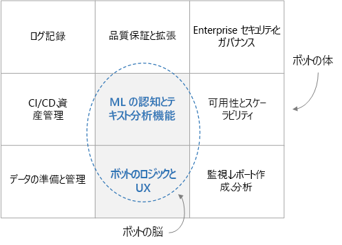

# エンタープライズ グレードの会話型ボット

この参照アーキテクチャでは、[Azure Bot Framework][bot-framework] を使用してエンタープライズ グレードの会話型ボット (チャットボット) を作成する方法について説明します。 ボットは 1 つずつ異なりますが、注意が必要な共通のパターンやワークフロー、テクノロジがいくつかあります。 特に、エンタープライズ ワークロードを処理するボットの場合、コア機能以外にもさまざまな設計上の考慮事項があります。 この記事では、最も重要な設計上の側面について説明するとともに、積極的に学習を行う、堅牢で安全なボットの作成に必要なツールも紹介します。

[![アーキテクチャの図][0]][0]

## アーキテクチャ

ここに示すアーキテクチャでは、次の Azure サービスを使用します。 使用する独自のボットでは、これらのサービスの一部のみが使用されることも、他のサービスが組み込まれることもあります。

### ボット ロジックとユーザー エクスペリエンス

- **[Bot Framework Service][bot-framework-service]** (BFS)。 このサービスは、ご使用のボットを Cortana、Facebook Messenger、Slack などの通信アプリに接続します。 ボットとユーザーの間の通信が円滑化されます。
- **[Azure App Service][app-service]**。 ボットのアプリケーション ロジックは、Azure App Service でホストされます。

### ボットの認識力とインテリジェンス

- **[Language Understanding][luis]** (LUIS)。 [Azure Cognitive Services][cognitive-services] の一部である LUIS によって、ユーザーの意図とエンティティが判別されることで、お客様のボットが自然言語を理解できるようになります。
- **[Azure Search][search]**。 Search は、すばやい検索が可能なドキュメント インデックスを提供するマネージド サービスです。
- **[QnA Maker][qna-maker]**。 QnA Maker は、データに基づく対話型の Q&A レイヤーを作成できるクラウドベースの API サービスです。 通常、FAQ などの半構造化コンテンツが読み込まれます。 これを使用して、自然言語の質問に回答するためのナレッジ ベースを作成します。
- **[Web アプリ][webapp]**。 既存のサービスによって提供されない AI ソリューションがお客様のボットに必要な場合は、独自のカスタム AI を実装し、これを Web アプリとしてホストすることができます。 これにより、ご使用のボットから呼び出される Web エンドポイントが提供されます。

### データの取り込み

ボットが使用する生データを取り込んで準備する必要があります。 このプロセスを調整するには、次のいずれかの方法を検討してください。

- **[Azure Data Factory][data-factory]**。 Data Factory は、データ移動とデータ変換を調整し、自動化します。
- **[Logic Apps][logic-apps]**。 Logic Apps は、アプリケーション、データ、およびサービスを統合するワークフローを構築するためのサーバーレス プラットフォームです。 Logic Apps では、Office 365 など、多くのアプリケーションにデータ コネクタを提供します。
- **[Azure Functions][functions]**。 Azure Functions を使用すると、[トリガー][functions-triggers]&mdash;によって (たとえば、ドキュメントが Blob Storage や Cosmos DB に追加されるたびに) 呼び出されるカスタム サーバーレス コードを記述できます。

### ログ記録と監視

- **[Application Insights][app-insights]**。 監視、診断、分析の目的でボットのアプリケーション メトリックをログに記録するには、Application Insights を使用します。
- **[Azure Blob Storage][blob]**。 Blob Storage は、テキスト データやバイナリ データなどの大量の非構造化データを格納するために最適化されています。
- **[Cosmos DB][cosmosdb]**。 Cosmos DB は、会話など、半構造化ログ データの格納に適しています。
- **[Power BI][power-bi]**。 お使いのボットの監視ダッシュボードを作成するには、Power BI を使用します。

### セキュリティとガバナンス

- **[Azure Active Directory][aad]** (Azure AD)。 ユーザーは、Azure AD などの ID プロバイダーを通じて認証されます。 Bot Service では、認証フローと OAuth トークンの管理を処理します。 「[Azure Bot Service を介してボットに認証を追加する][bot-authentication]」を参照してください。
- **[Azure Key Vault][key-vault]**。 Key Vault を使用して資格情報やその他のシークレットを格納します。

### 品質保証と拡張機能

- **[Azure DevOps][devops]**。 ソース管理、ビルド、テスト、デプロイ、プロジェクト追跡など、アプリ管理のための各種サービスを提供します。
- **[VS Code][vscode]**。アプリ開発用の軽量なコード エディター。 同様の機能を備えたその他の任意の IDE を使用することもできます。

## 設計上の考慮事項

大まかに言うと、会話ボットは、ボット機能 ("脳") と一連の周辺的要件 ("身体") に分けることができます。 脳には、ボット ロジックや ML 機能など、知識領域に対応したコンポーネントが含まれています。 その他のコンポーネントは知識領域に関係がなく、CI/CD、品質保証、セキュリティなどの非機能的要件に対処します。

このアーキテクチャの詳細に入る前に、設計の各サブコンポーネントを通過するデータ フローを見てみましょう。 データ フローには、ユーザーが開始するデータ フローと、システムによって開始されるデータ フローがあります。

### ユーザー メッセージ フロー

**[認証]**:  ユーザーは、まず、ボットとの通信チャネルによって提供される任意のメカニズムを使用して、自分自身を認証します。 Bot Framework では、Cortana、Microsoft Teams、Facebook Messenger、Kik、Slack など、多くの通信チャネルがサポートされています。 チャネルの一覧については、「[ボットをチャネルに接続する](/azure/bot-service/bot-service-manage-channels)」を参照してください。 Azure Bot Service を使用してボットを作成すると、[Web チャット][webchat] チャンネルが自動的に構成されます。 ユーザーはこのチャネルを使用することで、Web ページから直接ボットとやり取りすることができます。 また、[Direct Line](/azure/bot-service/bot-service-channel-connect-directline) チャネルを使用して、ボットをカスタム アプリに接続することもできます。 ユーザーの ID は、ロールベースのアクセス制御や、パーソナライズされたコンテンツを提供するために使用されます。

**ユーザー メッセージ**。 認証されると、ユーザーはボットにメッセージを送信します。 ボットはこのメッセージを読み取って、[LUIS](/azure/cognitive-services/luis/) などの自然言語理解サービスにルーティングします。 この段階で、**意図** (ユーザーがしたいこと) と**エンティティ** (ユーザーの関心の対象) が取得されます。 次にボットは、文書検索用の [Azure Search][search]、FAQ 用の [QnA Maker](https://www.qnamaker.ai/)、カスタム ナレッジ ベースなど、情報を提供するサービスに渡すクエリを作成します。 ボットは、これらの結果を使用して応答を作成します。 特定のクエリから最適な結果が得られるように、ボットはこれらのリモート サービスとのやり取りを複数回繰り返す場合があります。

**応答**。 この時点で、ボットは最適な応答を決定し、これをユーザーに送信します。 最も適合した回答の信頼度スコアが低い場合、応答は、あいまいさを排除するための質問になったり、ボットが的確に応答できないことの確認になったりする可能性があります。

**ログの記録**。 ユーザーの要求が受信されたり、応答が送信されたりしたとき、すべての会話アクションは、パフォーマンス メトリックや外部サービスの一般的なエラーと共に、ログ ストアに記録する必要があります。 これらのログは、後で問題を診断したり、システムを改善したりする際に役立ちます。

**フィードバック**。 また、ユーザー フィードバックや満足度のスコアを収集することもお勧めします。 ボットの最終応答のフォロー アップとして、応答に対する満足度を評価してもらうようボットからユーザーに依頼します。 フィードバックは、自然言語の理解に関するコールド スタートの問題を解決したり、応答の精度を継続的に改善したりするうえで役立ちます。

### システムのデータ フロー

**ETL**。 ボットは、バックエンドの ETL プロセスによって生データから抽出される情報と知識に依存しています。 このデータは、構造化データ (SQL データベース)、半構造化データ (CRM システム、FAQ)、または非構造化データ (Word 文書、PDF、Web ログ) である可能性があります。 ETL サブシステムにより、決まったスケジュールでデータが抽出されます。 コンテンツが変換およびエンリッチされ、Cosmos DB や Azure Blob Storage などの中間データ ストアに読み込まれます。

次に、中間ストア内のデータは、文書検索できるように Azure Search 内にインデックス化されたり、QnA Maker に読み込まれて質問と回答のペアが作成されたり、カスタム Web アプリに読み込まれて非構造化テキスト処理が行われたります。 また、このデータは、意図とエンティティを抽出できるように、LUIS モデルのトレーニングにも使用されます。

**品質保証**。 会話のログは、バグの診断や修正、ボットの使用状況に関する分析情報の提供、および全体的なパフォーマンスの追跡に使用されます。 フィードバック データは、AI モデルを再トレーニングしてボットのパフォーマンスを向上させる際に役立ちます。

## ボットの作成

コードの 1 行目を記述する前に、開発チームがボットに期待される動作を明確に理解できるように、機能仕様を書くことが重要です。 仕様には、さまざまな知識領域でのユーザー入力と予想されるボットの応答について、かなり包括的なリストを含める必要があります。 随時更新されるこのドキュメントは、ボットを開発およびテストするための非常に貴重なガイドとなります。

### データの取り込み

次に、ボットがユーザーとインテリジェントにやり取りできるようにするデータ ソースを特定します。 前述のように、これらのデータ ソースとしては、構造化データ セット、半構造化データ セット、または非構造化データ セットがあります。 開始するにあたり、Cosmos DB や Azure Storage などの中央のストアにデータを 1 回だけコピーすることをお勧めします。 進行に合わせて、自動化されたデータ インジェスト パイプラインを作成し、このデータを最新の状態に維持する必要があります。 自動化されたインジェスト パイプラインのオプションには、Data Factory、Functions、および Logic Apps があります。 データ ストアとスキーマによっては、これらのアプローチを組み合わせて使用する場合もあります。

始める時点では、Azure portal を使用して手動で Azure リソースを作成するのが合理的です。 これらのリソースのデプロイの自動化については、後でさらに検討を重ねる必要があります。

### ボットのコア ロジックとユーザー エクスペリエンス

仕様とデータが用意できたら、いよいよ実際にボットの作成を開始します。 ボットのコア ロジックに注目しましょう。 ルーティング ロジック、あいまいさ排除ロジック、ログ記録など、ユーザーとの会話を処理するコードがこれに当たります。 以下を含め、まず [Bot Framework][bot-framework] に慣れることから始めてください。

- 特に、[会話]、[ターン]、[アクティビティ]など、フレームワークで使用される基本的な概念と用語。
- ボットとチャネルの間のネットワークを処理する [Bot Connector サービス](/azure/bot-service/rest-api/bot-framework-rest-connector-quickstart)。
- メモリや、可能であればストア (Azure Blob Storage、Azure Cosmos DB など) で、会話[状態](/azure/bot-service/bot-builder-concept-state)を維持する方法。
- [ミドルウェア](/azure/bot-service/bot-builder-basics#middleware)。また、ミドルウェアを使用して、Cognitive Services などの外部サービスにボットをフックする方法。

豊かな[ユーザー エクスペリエンス](/azure/bot-service/bot-service-design-user-experience)を実現するオプションは多数あります。

- [カード](/azure/bot-service/bot-service-design-user-experience#cards)を使用して、ボタン、イメージ、カルーセル、およびメニューを含めることができます。
- ボットでは音声がサポートされます。
- ボットをアプリや Web サイトに埋め込むことで、ボットをホストするアプリの機能を使用することもできます。

最初に、[Azure Bot Service](/azure/bot-service/bot-service-quickstart) を使用してオンラインでボットを作成します。C# と Node.js から使用可能なテンプレートを選択します。 ボットが洗練されてくるにつれて、ボットをローカルで作成して、それを Web にデプロイする必要が生じます。 Visual Studio や Visual Studio Code などの IDE とプログラミング言語を選択します。 次の言語では SDK を利用できます。

- [C#](https://github.com/microsoft/botbuilder-dotnet)
- [JavaScript](https://github.com/microsoft/botbuilder-js)
- [Java](https://github.com/microsoft/botbuilder-java) (プレビュー)
- [Python](https://github.com/microsoft/botbuilder-python) (プレビュー)

出発点として、Azure Bot Service を使用して作成するボット向けのソース コードをダウンロードできます。 単純なエコー ボットから各種 AI サービスが統合された高度なボットまで、[サンプル コード](https://github.com/Microsoft/BotBuilder-Samples/blob/master/README.md)を検索することもできます。

### ボットをよりスマートにする

適切に定義されたコマンドの一覧を備えた単純なボットの場合、ルールベースのアプローチを使用して正規表現でユーザー入力を解析できる場合があります。 これには、確定的でわかりやすいという利点があります。 ただし、ボットがより自然言語に近いメッセージの意図とエンティティを理解する必要がある場合は、AI サービスを役立てることができます。

- LUIS は、特にユーザーの意図とエンティティを理解できるように設計されています。 関連性のある[ユーザー入力](/azure/cognitive-services/luis/luis-concept-utterance)と望ましい応答から成る適度な規模のコレクションを使用して LUIS をトレーニングすると、ユーザーの特定メッセージの意図とエンティティが返されます。

- Azure Search を LUIS と連携させることができます。 Search を使用して、すべての関連データに対して検索可能なインデックスを作成します。 ボットがこれらのインデックスにクエリを実行して、LUIS によって抽出されたエンティティを取得します。 Azure Search では、[シノニム][synonyms]もサポートされているため、正しい単語マッピングを捉えるための網を拡げることができます。

- QnA Maker は、特定の質問に対して回答を返すように設計されているもう 1 つのサービスです。 これは通常、FAQ などの半構造化データに対してトレーニングされます。

ボットは、その他の AI サービスを使用して、ユーザー エクスペリエンスをさらに強化することができます。 [事前構築済みの AI サービスから成る Cognitive Services スイート](https://azure.microsoft.com/en-us/services/cognitive-services/?v=18.44a) (LUIS や QnA Maker を含む) には、視覚、音声、言語、検索、および場所に対応したサービスが含まれています。 言語翻訳、スペル チェック、センチメント分析、OCR、位置把握、コンテンツ モデレーションなどの機能を簡単に追加することができます。 これらのサービスをミドルウェア モジュールとしてボットに設定することで、より自然かつインテリジェントにユーザーと対話できるようになります。

別のオプションとして、独自のカスタム AI サービスを統合することもできます。 この方法は複雑さが増しますが、機械学習アルゴリズム、トレーニング、およびモデルという点に関して完全な柔軟性が得られます。 たとえば、独自のトピック モデリングを実装し、[LDA][lda] などのアルゴリズムを使用して類似または関連する文書を検索できます。 Web サービスのエンドポイントとしてカスタム AI ソリューションを公開し、ボットのコア ロジックからエンドポイントを呼び出すことをお勧めします。 Web サービスは、App Service または VM のクラスターでホストすることができます。 [Azure Machine Learning][aml] には、モデルの[トレーニング](https://github.com/Azure/MachineLearningNotebooks/tree/master/how-to-use-azureml/training)と[デプロイ](https://github.com/Azure/MachineLearningNotebooks/tree/master/how-to-use-azureml/deployment)を支援する多くのサービスとライブラリが用意されています。

## 品質保証と拡張機能

**ログの記録**。 基になるパフォーマンス メトリックやすべてのエラーを含め、ユーザーとボットの会話が記録されます。 これらのログは、問題のデバッグ、ユーザー操作の理解、システムの改善を行う際に、非常に重要な役割を果たします。 ログの種類ごとに、適切なデータ ストアが異なる可能性があります。 たとえば、Web ログには Application Insights、会話には Cosmos DB、大きなペイロードには Azure Storage の使用を検討します。 「[ストレージに直接書き込む][transcript-storage]」を参照してください。

**フィードバック**。 ユーザーがボットとのやり取りにどの程度満足しているかを理解しておくことも重要です。 ユーザー フィードバックの記録がある場合は、このデータを使用して、特定のやり取りの改善や、AI モデルの再トレーニングに重点を置いてパフォーマンスを向上させることができます。 フィードバックを使用して、システム内のモデル (LUIS など) を再トレーニングできます。

**テスト**。 ボットのテストには、単体テスト、統合テスト、回帰テスト、および機能テストが含まれます。 テストを行う場合、Azure Search や QnA Maker などの外部サービスからの実際の HTTP 応答を記録することをお勧めします。これにより、単体テストの際に、外部サービスへのネットワーク呼び出しを実際に行うことなく応答を再生することができます。

これらの領域での開発を首尾よく開始するには、「[Botbuilder Utils for JavaScript (JavaScript 用 Botbuilder ユーティリティ)](https://github.com/Microsoft/botbuilder-utils-js)」を参照してください。 このリポジトリには、[Microsoft Bot Framework v4][bot-framework] でビルドされ、Node.js を実行するボット用のサンプル ユーティリティ コードが含まれています。 次のパッケージが含まれます。

- [HTTP テスト レコーダー](https://github.com/Microsoft/botbuilder-utils-js/tree/master/packages/botbuilder-http-test-recorder)。 外部サービスからの HTTP トラフィックを記録します。 LUIS、Azure Search、および QnA Maker のサポートが事前に組み込まれていますが、拡張機能を使用して任意のサービスをサポートすることもできます。

- [Cosmos DB Transcript Store](https://github.com/Microsoft/botbuilder-utils-js/tree/master/packages/botbuilder-transcript-cosmosdb)。 Cosmos DB でボット トランスクリプトを保管したり、クエリを実行したりする方法を示します。

- [Application Insights Transcript Store](https://github.com/Microsoft/botbuilder-utils-js/tree/master/packages/botbuilder-transcript-app-insights)。 Application Insights でボット トランスクリプトを保管したり、クエリを実行したりする方法を示します。

- [フィードバック コレクション ミドルウェア](https://github.com/Microsoft/botbuilder-utils-js/tree/master/packages/botbuilder-feedback)。 フィードバック要求メカニズムを構築するために使用できるサンプル ミドルウェアです。

> [!NOTE]
> これらのパッケージはユーティリティ サンプル コードとして提供されており、サポートや更新プログラムの保証は付属しません。

## 可用性に関する考慮事項

ボットに新しい機能やバグ修正をロールアウトする際は、ステージングや運用など、複数のデプロイ環境を使用することをお勧めします。 [Azure DevOps][devops] のデプロイ [スロット][slots]を使用すると、ダウンタイムなしでこれを実行できます。 最新のアップグレードを運用環境にスワップする前に、ステージング環境でテストできます。 負荷の処理に関しては、App Service は手動または自動でスケール アップしたりスケール アウトしたりできるように設計されています。 お使いのボットは Microsoft のグローバルなデータセンター インフラストラクチャでホストされるため、App Service の SLA によって高可用性が保証されます。

## セキュリティに関する考慮事項

他のアプリケーションと同様に、ボットは機密データを処理するように設計できます。 そのため、サインインしてボットを使用できるユーザーを制限できます。 また、ユーザーの ID やロールに基づいて、アクセスできるデータも制限できます。 ID とアクセス制御には Azure AD を使用し、キーとシークレットの管理には Key Vault を使用してください。

## 管理容易性に関する考慮事項

### 監視と報告

ボットが運用環境で稼働している場合は、ボットの稼働を維持する DevOps チームが必要になります。 システムを継続的に監視して、ボットが最高のパフォーマンスで動作していることを確認します。 Application Insights または Cosmos DB に送信されたログを使用して、Application Insights 自体、Power BI、またはカスタムの Web アプリ ダッシュボードで監視ダッシュボードを作成できます。 重大なエラーが発生したり、パフォーマンスが許容されるしきい値を下回ったりした場合は、DevOps チームにアラートを送信します。

### 自動化されたリソースのデプロイ

ボット自体は、ボットに最新データを提供したり、その適切な動作を確保する大規模なシステムの一部にすぎません。 これらの他の Azure リソース (&mdash;Data Factory などのデータ オーケストレーション サービス、Cosmos DB などのストレージ サービス、その他&mdash;) を、すべてデプロイする必要があります。 Azure Resource Manager では、Azure portal、PowerShell、Azure CLI を通じてアクセスできる、一貫性のある管理レイヤーを提供します。 速度と一貫性を実現するには、これらの方法のいずれかを使用してデプロイを自動化することをお勧めします。

### ボットの継続的なデプロイ

ボットのロジックは、IDE から直接デプロイすることも、Azure CLI などのコマンド ラインからデプロイすることもできます。 ただし、ボットが成熟してきた場合は、[継続的なデプロイの設定](/azure/bot-service/bot-service-build-continuous-deployment)に関する記事の説明に従い、Azure DevOps などの CI/CD ソリューションを活用して継続的なデプロイ プロセスを使用することをお勧めします。 これは、運用環境に近い環境でボットの新機能と修正プログラムをテストする際の煩雑さを軽減する優れた方法です。 また、複数のデプロイ環境 (通常は最低でもステージング環境と運用環境) を用意することをお勧めします。 Azure DevOps は、このアプローチをサポートしています。

<!-- links -->

[0]: ./_images/conversational-bot.png
[aad]: /azure/active-directory/
[アクティビティ]: /azure/bot-service/rest-api/bot-framework-rest-connector-activities
[aml]: /azure/machine-learning/service/
[app-insights]: /azure/azure-monitor/app/app-insights-overview
[app-service]: /azure/app-service/
[blob]: /azure/storage/blobs/storage-blobs-introduction
[bot-authentication]: /azure/bot-service/bot-builder-authentication
[bot-framework]: https://dev.botframework.com/
[bot-framework-service]: /azure/bot-service/bot-builder-basics
[cognitive-services]: /azure/cognitive-services/welcome
[会話]: /azure/bot-service/bot-service-design-conversation-flow
[cosmosdb]: /azure/cosmos-db/
[data-factory]: /azure/data-factory/
[data-factory-ref-arch]: ../data/enterprise-bi-adf.md
[devops]: https://azure.microsoft.com/solutions/devops/
[functions]: /azure/azure-functions/
[functions-triggers]: /azure/azure-functions/functions-triggers-bindings
[key-vault]: /azure/key-vault/
[lda]: https://wikipedia.org/wiki/Latent_Dirichlet_allocation/
[logic-apps]: /azure/logic-apps/logic-apps-overview
[luis]: /azure/cognitive-services/luis/
[power-bi]: /power-bi/
[qna-maker]: /azure/cognitive-services/QnAMaker/
[search]: /azure/search/
[slots]: /azure/app-service/deploy-staging-slots/
[synonyms]: /azure/search/search-synonyms
[transcript-storage]: /azure/bot-service/bot-builder-howto-v4-storage
[ターン]: /azure/bot-service/bot-builder-basics#defining-a-turn
[vscode]: https://azure.microsoft.com/products/visual-studio-code/
[webapp]: /azure/app-service/overview
[webchat]: /azure/bot-service/bot-service-channel-connect-webchat?view=azure-bot-service-4.0/
