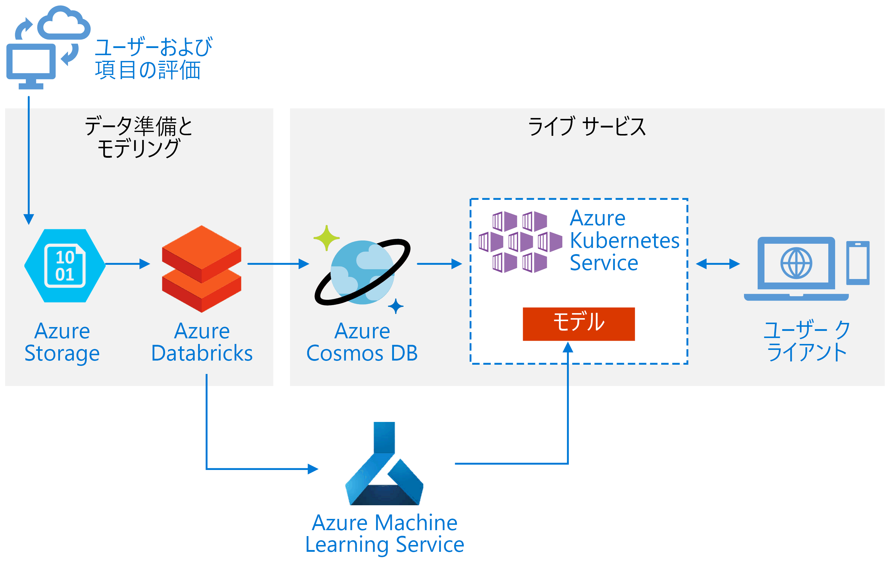
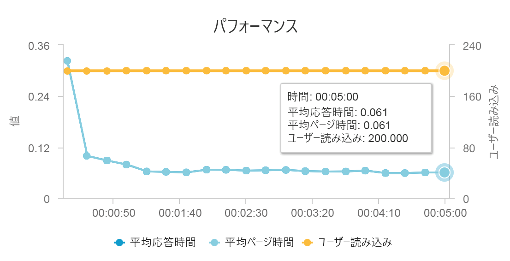
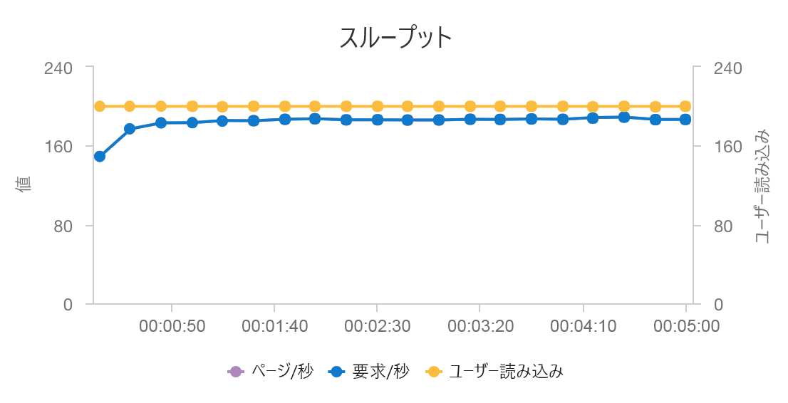

# <a name="build-a-real-time-recommendation-api-on-azure"></a><span data-ttu-id="17aca-103">Azure 上でリアルタイム レコメンデーション API を構築する</span><span class="sxs-lookup"><span data-stu-id="17aca-103">Build a real-time recommendation API on Azure</span></span>

<span data-ttu-id="17aca-104">この参照アーキテクチャは、Azure Databricks を使用してレコメンデーション モデルをトレーニングし、Azure Cosmos DB、Azure Machine Learning、および Azure Kubernetes Service (AKS) を使用して API としてデプロイする方法を示します。</span><span class="sxs-lookup"><span data-stu-id="17aca-104">This reference architecture shows how to train a recommendation model using Azure Databricks and deploy it as an API by using Azure Cosmos DB, Azure Machine Learning, and Azure Kubernetes Service (AKS).</span></span> <span data-ttu-id="17aca-105">このアーキテクチャは、製品、映画、およびニュースに関するレコメンデーションを含め、ほとんどのレコメンデーション エンジンのシナリオに一般化することができます。</span><span class="sxs-lookup"><span data-stu-id="17aca-105">This architecture can be generalized for most recommendation engine scenarios, including recommendations for products, movies, and news.</span></span>

<span data-ttu-id="17aca-106">このアーキテクチャの参照実装は、[GitHub](https://github.com/Microsoft/Recommenders/blob/master/notebooks/04_operationalize/als_movie_o16n.ipynb) で入手できます</span><span class="sxs-lookup"><span data-stu-id="17aca-106">A reference implementation for this architecture is available on [GitHub](https://github.com/Microsoft/Recommenders/blob/master/notebooks/04_operationalize/als_movie_o16n.ipynb).</span></span>



<span data-ttu-id="17aca-108">**シナリオ**:あるメディア組織は、ユーザーに映画またはビデオのレコメンデーションを提供したいと考えています。</span><span class="sxs-lookup"><span data-stu-id="17aca-108">**Scenario**: A media organization wants to provide movie or video recommendations to its users.</span></span> <span data-ttu-id="17aca-109">組織は、パーソナライズされたレコメンデーションを提供することで、クリックスルー率の向上、サイトのエンゲージメントの向上、ユーザー満足度の向上など、いくつかのビジネス目標を達成します。</span><span class="sxs-lookup"><span data-stu-id="17aca-109">By providing personalized recommendations, the organization meets several business goals, including increased click-through rates, increased engagement on site, and higher user satisfaction.</span></span>

<span data-ttu-id="17aca-110">この参照アーキテクチャは、特定のユーザーに上位 10 個の映画のレコメンデーションを提供できるリアルタイム レコメンダー サービス API をトレーニングおよびデプロイするためのものです。</span><span class="sxs-lookup"><span data-stu-id="17aca-110">This reference architecture is for training and deploying a real-time recommender service API that can provide the top 10 movie recommendations for a given user.</span></span>

<span data-ttu-id="17aca-111">このレコメンデーション モデルのデータ フローは次のとおりです。</span><span class="sxs-lookup"><span data-stu-id="17aca-111">The data flow for this recommendation model is as follows:</span></span>

1. <span data-ttu-id="17aca-112">ユーザーの動作を追跡します。</span><span class="sxs-lookup"><span data-stu-id="17aca-112">Track user behaviors.</span></span> <span data-ttu-id="17aca-113">たとえば、ユーザーが映画を評価したときや製品やニュースの記事をクリックしたときに、バックエンド サービスでログを記録することができます。</span><span class="sxs-lookup"><span data-stu-id="17aca-113">For example, a backend service might log when a user rates a movie or clicks a product or news article.</span></span>

2. <span data-ttu-id="17aca-114">このデータを、使用できる[データ ソース][data-source]から Azure Databricks に読み込みます。</span><span class="sxs-lookup"><span data-stu-id="17aca-114">Load the data into Azure Databricks from an available [data source][data-source].</span></span>

3. <span data-ttu-id="17aca-115">データを準備し、それをトレーニング セットとテスト セットに分割してモデルをトレーニングします</span><span class="sxs-lookup"><span data-stu-id="17aca-115">Prepare the data and split it into training and testing sets to train the model.</span></span> <span data-ttu-id="17aca-116">([このガイド][guide]では、データを分割するための選択肢が説明されています)。</span><span class="sxs-lookup"><span data-stu-id="17aca-116">([This guide][guide] describes options for splitting data.)</span></span>

4. <span data-ttu-id="17aca-117">データに合わせて [Spark の Collaborative Filtering][als] モデルを調整します。</span><span class="sxs-lookup"><span data-stu-id="17aca-117">Fit the [Spark Collaborative Filtering][als] model to the data.</span></span>

5. <span data-ttu-id="17aca-118">評価とランク付けのメトリックを使用してモデルの品質を評価します</span><span class="sxs-lookup"><span data-stu-id="17aca-118">Evaluate the quality of the model using rating and ranking metrics.</span></span> <span data-ttu-id="17aca-119">([このガイド][eval-guide]では、レコメンダーを評価できるメトリックについて詳しく説明されています)。</span><span class="sxs-lookup"><span data-stu-id="17aca-119">([This guide][eval-guide] provides details about the metrics you can evaluate your recommender on.)</span></span>

6. <span data-ttu-id="17aca-120">ユーザーごとに上位 10 個のレコメンデーションを事前に計算し、Azure Cosmos DB にキャッシュとして保存します。</span><span class="sxs-lookup"><span data-stu-id="17aca-120">Precompute the top 10 recommendations per user and store as a cache in Azure Cosmos DB.</span></span>

7. <span data-ttu-id="17aca-121">Azure Machine Learning API を使用して API サービスを AKS にデプロイし、API をコンテナー化してデプロイします。</span><span class="sxs-lookup"><span data-stu-id="17aca-121">Deploy an API service to AKS using the Azure Machine Learning APIs to containerize and deploy the API.</span></span>

8. <span data-ttu-id="17aca-122">バックエンド サービスによってユーザーから要求が取得されたら、AKS 内でホストされているレコメンデーション API を呼び出して上位 10 個のレコメンデーションを取得し、それらをユーザーに表示します。</span><span class="sxs-lookup"><span data-stu-id="17aca-122">When the backend service gets a request from a user, call the recommendations API hosted in AKS to get the top 10 recommendations and display them to the user.</span></span>

## <a name="architecture"></a><span data-ttu-id="17aca-123">アーキテクチャ</span><span class="sxs-lookup"><span data-stu-id="17aca-123">Architecture</span></span>

<span data-ttu-id="17aca-124">このアーキテクチャは、次のコンポーネントで構成されます。</span><span class="sxs-lookup"><span data-stu-id="17aca-124">This architecture consists of the following components:</span></span>

<span data-ttu-id="17aca-125">[Azure Databricks][databricks]。</span><span class="sxs-lookup"><span data-stu-id="17aca-125">[Azure Databricks][databricks].</span></span> <span data-ttu-id="17aca-126">Databricks は、入力データを準備し、Spark クラスター上でレコメンダー モデルをトレーニングするために使用される開発環境です。</span><span class="sxs-lookup"><span data-stu-id="17aca-126">Databricks is a development environment used to prepare input data and train the recommender model on a Spark cluster.</span></span> <span data-ttu-id="17aca-127">また、Azure Databricks には、データ処理タスクや機械学習タスクのためにノートブック上で実行して共同作業することができる対話型ワークスペースも用意されています。</span><span class="sxs-lookup"><span data-stu-id="17aca-127">Azure Databricks also provides an interactive workspace to run and collaborate on notebooks for any data processing or machine learning tasks.</span></span>

<span data-ttu-id="17aca-128">[Azure Kubernetes Service][aks] (AKS)。</span><span class="sxs-lookup"><span data-stu-id="17aca-128">[Azure Kubernetes Service][aks] (AKS).</span></span> <span data-ttu-id="17aca-129">AKS は、Kubernetes クラスターに機械学習モデル サービス API をデプロイして運用化するために使用されます。</span><span class="sxs-lookup"><span data-stu-id="17aca-129">AKS is used to deploy and operationalize a machine learning model service API on a Kubernetes cluster.</span></span> <span data-ttu-id="17aca-130">AKS はコンテナー化されたモデルをホストし、スループット要件、ID とアクセス管理、ログ記録と正常性の監視を満たすスケーラビリティを実現しています。</span><span class="sxs-lookup"><span data-stu-id="17aca-130">AKS hosts the containerized model, providing scalability that meets your throughput requirements, identity and access management, and logging and health monitoring.</span></span>

<span data-ttu-id="17aca-131">[Azure Cosmos DB][cosmosdb]。</span><span class="sxs-lookup"><span data-stu-id="17aca-131">[Azure Cosmos DB][cosmosdb].</span></span> <span data-ttu-id="17aca-132">Cosmos DB は、各ユーザーのおすすめ映画上位 10 個を保存するために使用されるグローバルに分散されたデータベース サービスです。</span><span class="sxs-lookup"><span data-stu-id="17aca-132">Cosmos DB is a globally distributed database service used to store the top 10 recommended movies for each user.</span></span> <span data-ttu-id="17aca-133">特定のユーザーの上位のおすすめ項目を読み取るためにかかる待機時間が短い (99 パーセンタイルで 10 ミリ秒) ので、Azure Cosmos DB はこのシナリオに適しています。</span><span class="sxs-lookup"><span data-stu-id="17aca-133">Azure Cosmos DB is well-suited for this scenario, because it provides low latency (10 ms at 99th percentile) to read the top recommended items for a given user.</span></span>

<span data-ttu-id="17aca-134">[Azure Machine Learning service][mls]。</span><span class="sxs-lookup"><span data-stu-id="17aca-134">[Azure Machine Learning Service][mls].</span></span> <span data-ttu-id="17aca-135">このサービスは、機械学習モデルを追跡および管理し、そのモデルをパッケージ化してスケーラブルな AKS 環境にデプロイするために使用されます。</span><span class="sxs-lookup"><span data-stu-id="17aca-135">This service is used to track and manage machine learning models, and then package and deploy these models to a scalable AKS environment.</span></span>

<span data-ttu-id="17aca-136">[Microsoft Recommenders][github]。</span><span class="sxs-lookup"><span data-stu-id="17aca-136">[Microsoft Recommenders][github].</span></span> <span data-ttu-id="17aca-137">このオープンソース リポジトリには、レコメンダー システムの構築、評価、および運用化を始める際に役立つユーティリティ コードとサンプルが含まれています。</span><span class="sxs-lookup"><span data-stu-id="17aca-137">This open-source repository contains utility code and samples to help users get started in building, evaluating, and operationalizing a recommender system.</span></span>

## <a name="performance-considerations"></a><span data-ttu-id="17aca-138">パフォーマンスに関する考慮事項</span><span class="sxs-lookup"><span data-stu-id="17aca-138">Performance considerations</span></span>

<span data-ttu-id="17aca-139">通常、レコメンデーションは、ユーザーがサイトに対して行う要求のクリティカル パスに含まれるため、パフォーマンスはリアルタイム レコメンデーションの主な考慮事項です。</span><span class="sxs-lookup"><span data-stu-id="17aca-139">Performance is a primary consideration for real-time recommendations, because recommendations usually fall in the critical path of the request a user makes on your site.</span></span>

<span data-ttu-id="17aca-140">AKS と Azure Cosmos DB の組み合わせることで、このアーキテクチャは、最小限のオーバーヘッドで中規模のワークロード向けにレコメンデーションを提供するために適した出発点となります。</span><span class="sxs-lookup"><span data-stu-id="17aca-140">The combination of AKS and Azure Cosmos DB enables this architecture to provide a good starting point to provide recommendations for a medium-sized workload with minimal overhead.</span></span> <span data-ttu-id="17aca-141">200 人の同時ユーザーによる負荷テストでは、このアーキテクチャは約 60 ミリ秒の中央値の待機時間でレコメンデーションを提供し、1 秒あたり 180 要求のスループットで実行されます。</span><span class="sxs-lookup"><span data-stu-id="17aca-141">Under a load test with 200 concurrent users, this architecture provides recommendations at a median latency of about 60 ms and performs at a throughput of 180 requests per second.</span></span> <span data-ttu-id="17aca-142">この負荷テストは、既定のデプロイ構成 (Azure Cosmos DB 用にプロビジョニングされた 12 vCPU、42 GB のメモリ、および 11,000 [要求ユニット (RU)/秒][ru]の 3x D3 v2 AKS クラスター) に対して実行されました。</span><span class="sxs-lookup"><span data-stu-id="17aca-142">The load test was run against the default deployment configuration (a 3x D3 v2 AKS cluster with 12 vCPUs, 42 GB of memory, and 11,000 [Request Units (RUs) per second][ru] provisioned for Azure Cosmos DB).</span></span>





<span data-ttu-id="17aca-145">Azure Cosmos DB は、ターンキーのグローバル配布と、アプリが持っているデータベース要件を満たす上での有用性により推奨されています。</span><span class="sxs-lookup"><span data-stu-id="17aca-145">Azure Cosmos DB is recommended for its turnkey global distribution and usefulness in meeting any database requirements your app has.</span></span> <span data-ttu-id="17aca-146">[待機時間がやや短い][latency]ため、参照の処理には Azure Cosmos DB ではなく [Azure Redis Cache][redis] を使用することを検討してください。</span><span class="sxs-lookup"><span data-stu-id="17aca-146">For slightly [faster latency][latency], consider using [Azure Redis Cache][redis] instead of Azure Cosmos DB to serve lookups.</span></span> <span data-ttu-id="17aca-147">Redis Cache で、バックエンド ストア内のデータへの依存度が高いシステムのパフォーマンスを向上することができます。</span><span class="sxs-lookup"><span data-stu-id="17aca-147">Redis Cache can improve performance of systems that rely highly on data in back-end stores.</span></span>

## <a name="scalability-considerations"></a><span data-ttu-id="17aca-148">スケーラビリティに関する考慮事項</span><span class="sxs-lookup"><span data-stu-id="17aca-148">Scalability considerations</span></span>

<span data-ttu-id="17aca-149">Spark を使用する予定がない場合、またはワークロードが小規模で分散が不要な場合は、Azure Databricks ではなく [Data Science Virtual Machine][dsvm] (DSVM) を使用することを検討してください。</span><span class="sxs-lookup"><span data-stu-id="17aca-149">If you don't plan to use Spark, or you have a smaller workload where you don't need distribution, consider using [Data Science Virtual Machine][dsvm] (DSVM) instead of Azure Databricks.</span></span> <span data-ttu-id="17aca-150">DSVM は、機械学習とデータ サイエンス向けのディープ ラーニング フレームワークとツールを備えた Azure 仮想マシンです。</span><span class="sxs-lookup"><span data-stu-id="17aca-150">DSVM is an Azure virtual machine with deep learning frameworks and tools for machine learning and data science.</span></span> <span data-ttu-id="17aca-151">Azure Databricks と同様に、DSVM で作成したモデルは、Azure Machine Learning を介して AKS 上のサービスとして運用化することができます。</span><span class="sxs-lookup"><span data-stu-id="17aca-151">As with Azure Databricks, any model you create in a DSVM can be operationalized as a service on AKS via Azure Machine Learning.</span></span>

<span data-ttu-id="17aca-152">トレーニング時は、より大きい固定サイズの Spark クラスターを Azure Databricks にプロビジョニングするか、[自動スケーリング][autoscaling]を構成します。</span><span class="sxs-lookup"><span data-stu-id="17aca-152">During training, provision a larger fixed-size Spark cluster in Azure Databricks or configure [autoscaling][autoscaling].</span></span> <span data-ttu-id="17aca-153">自動スケーリングが有効な場合、Databricks ではクラスターの負荷が監視され、必要に応じてスケールアップまたはスケールダウンされます。</span><span class="sxs-lookup"><span data-stu-id="17aca-153">When autoscaling is enabled, Databricks monitors the load on your cluster and scales up and downs when required.</span></span> <span data-ttu-id="17aca-154">大規模なデータ サイズで、データの準備またはモデリング タスクにかかる時間を短縮したい場合は、より大きなクラスターをプロビジョニングまたはスケールアウトします。</span><span class="sxs-lookup"><span data-stu-id="17aca-154">Provision or scale out a larger cluster if you have a large data size and you want to reduce the amount of time it takes for data preparation or modeling tasks.</span></span>

<span data-ttu-id="17aca-155">パフォーマンスとスループットの要件を満たすように AKS クラスターをスケールします。</span><span class="sxs-lookup"><span data-stu-id="17aca-155">Scale the AKS cluster to meet your performance and throughput requirements.</span></span> <span data-ttu-id="17aca-156">クラスターを十分に活用するために[ポッド][scale]の数をスケールアップし、サービスの要件を満たすようにクラスターの[ノード][nodes]をスケールすることに留意します。</span><span class="sxs-lookup"><span data-stu-id="17aca-156">Take care to scale up the number of [pods][scale] to fully utilize the cluster, and to scale the [nodes][nodes] of the cluster to meet the demand of your service.</span></span> <span data-ttu-id="17aca-157">レコメンデーション サービスのパフォーマンスとスループットの要件を満たすようにクラスターをスケールする方法の詳細については、「[Scaling Azure Container Service Clusters (Azure Container Service クラスターのスケール)][blog]」を参照してください。</span><span class="sxs-lookup"><span data-stu-id="17aca-157">For more information on how to scale your cluster to meet the performance and throughput requirements of your recommender service, see [Scaling Azure Container Service Clusters][blog].</span></span>

<span data-ttu-id="17aca-158">Azure Cosmos DB のパフォーマンスを管理するには、1 秒間に必要な読み取り数を見積もり、必要な[秒あたりの RU][ru] (スループット) の数をプロビジョニングします。</span><span class="sxs-lookup"><span data-stu-id="17aca-158">To manage Azure Cosmos DB performance, estimate the number of reads required per second, and provision the number of [RUs per second][ru] (throughput) needed.</span></span> <span data-ttu-id="17aca-159">[パーティション分割と水平スケーリング][partition-data]のベスト プラクティスを使用してください。</span><span class="sxs-lookup"><span data-stu-id="17aca-159">Use best practices for [partitioning and horizontal scaling][partition-data].</span></span>

## <a name="cost-considerations"></a><span data-ttu-id="17aca-160">コストに関する考慮事項</span><span class="sxs-lookup"><span data-stu-id="17aca-160">Cost considerations</span></span>

<span data-ttu-id="17aca-161">このシナリオにおけるコストの主な要因は次のとおりです。</span><span class="sxs-lookup"><span data-stu-id="17aca-161">The main drivers of cost in this scenario are:</span></span>

- <span data-ttu-id="17aca-162">トレーニングに必要な Azure Databricks クラスターのサイズ。</span><span class="sxs-lookup"><span data-stu-id="17aca-162">The Azure Databricks cluster size required for training.</span></span>
- <span data-ttu-id="17aca-163">パフォーマンス要件を満たすために必要な AKS クラスターのサイズ。</span><span class="sxs-lookup"><span data-stu-id="17aca-163">The AKS cluster size required to meet your performance requirements.</span></span>
- <span data-ttu-id="17aca-164">パフォーマンス要件を満たすためにプロビジョニングされる Azure Cosmos DB RU。</span><span class="sxs-lookup"><span data-stu-id="17aca-164">Azure Cosmos DB RUs provisioned to meet your performance requirements.</span></span>

<span data-ttu-id="17aca-165">頻度が低い場合は再トレーニングを少なくし、使用していない場合は Spark クラスターをオフにすることで、Azure Databricks のコストを管理します。</span><span class="sxs-lookup"><span data-stu-id="17aca-165">Manage the Azure Databricks costs by retraining less frequently and turning off the Spark cluster when not in use.</span></span> <span data-ttu-id="17aca-166">AKS と Azure Cosmos DB のコストはサイトに必要なスループットとパフォーマンスに左右され、サイトへのトラフィック量に応じてスケールアップまたはスケールダウンします。</span><span class="sxs-lookup"><span data-stu-id="17aca-166">The AKS and Azure Cosmos DB costs are tied to the throughput and performance required by your site and will scale up and down depending on the volume of traffic to your site.</span></span>

## <a name="deploy-the-solution"></a><span data-ttu-id="17aca-167">ソリューションのデプロイ方法</span><span class="sxs-lookup"><span data-stu-id="17aca-167">Deploy the solution</span></span>

<span data-ttu-id="17aca-168">このアーキテクチャをデプロイするには、まず Azure Databricks 環境を作成してデータを準備し、レコメンデーション モデルをトレーニングします。</span><span class="sxs-lookup"><span data-stu-id="17aca-168">To deploy this architecture, first create an Azure Databricks environment to prepare data and train a recommender model:</span></span>

1. <span data-ttu-id="17aca-169">[Azure Databricks ワークスペース][workspace]を作成します。</span><span class="sxs-lookup"><span data-stu-id="17aca-169">Create an [Azure Databricks workspace][workspace].</span></span>

2. <span data-ttu-id="17aca-170">Azure Databricks で新しいクラスターを作成します。</span><span class="sxs-lookup"><span data-stu-id="17aca-170">Create a new cluster in Azure Databricks.</span></span> <span data-ttu-id="17aca-171">次の構成が必要です。</span><span class="sxs-lookup"><span data-stu-id="17aca-171">The following configuration is required:</span></span>

    - <span data-ttu-id="17aca-172">クラスター モード:標準</span><span class="sxs-lookup"><span data-stu-id="17aca-172">Cluster mode: Standard</span></span>
    - <span data-ttu-id="17aca-173">Databricks Runtime のバージョン:4.1 (Apache Spark 2.3.0、Scala 2.11 など)</span><span class="sxs-lookup"><span data-stu-id="17aca-173">Databricks Runtime Version: 4.1 (includes Apache Spark 2.3.0, Scala 2.11)</span></span>
    - <span data-ttu-id="17aca-174">Python のバージョン:3</span><span class="sxs-lookup"><span data-stu-id="17aca-174">Python Version: 3</span></span>
    - <span data-ttu-id="17aca-175">ドライバーの種類:Standard\_DS3\_v2</span><span class="sxs-lookup"><span data-stu-id="17aca-175">Driver Type: Standard\_DS3\_v2</span></span>
    - <span data-ttu-id="17aca-176">worker の種類:Standard\_DS3\_v2 (必要に応じて最小および最大)</span><span class="sxs-lookup"><span data-stu-id="17aca-176">Worker Type: Standard\_DS3\_v2 (min and max as required)</span></span>
    - <span data-ttu-id="17aca-177">自動終了: (必要に応じて)</span><span class="sxs-lookup"><span data-stu-id="17aca-177">Auto Termination: (as required)</span></span>
    - <span data-ttu-id="17aca-178">Spark の構成: (必要に応じて)</span><span class="sxs-lookup"><span data-stu-id="17aca-178">Spark Config: (as required)</span></span>
    - <span data-ttu-id="17aca-179">環境変数: (必要に応じて)</span><span class="sxs-lookup"><span data-stu-id="17aca-179">Environment Variables: (as required)</span></span>

3. <span data-ttu-id="17aca-180">ローカル コンピューターに [Microsoft Recommenders][github] リポジトリを複製します。</span><span class="sxs-lookup"><span data-stu-id="17aca-180">Clone the [Microsoft Recommenders][github] repository on your local computer.</span></span>

4. <span data-ttu-id="17aca-181">Recommenders フォルダー内の内容を zip 形式で圧縮します。</span><span class="sxs-lookup"><span data-stu-id="17aca-181">Zip the content inside the Recommenders folder:</span></span>

    ```console
    cd Recommenders
    zip -r Recommenders.zip
    ```

5. <span data-ttu-id="17aca-182">Recommenders ライブラリを次のようにクラスターにアタッチします。</span><span class="sxs-lookup"><span data-stu-id="17aca-182">Attach the Recommenders library to your cluster as follows:</span></span>

    1. <span data-ttu-id="17aca-183">次のメニューで、ライブラリをインポートするオプション (["To import a library, such as a jar or egg, click here]\(jar や egg などのライブラリをインポートするにはここをクリックしてください\)) を使用し、**[click here]\(ここをクリック\)** を押します。</span><span class="sxs-lookup"><span data-stu-id="17aca-183">In the next menu, use the option to import a library ("To import a library, such as a jar or egg, click here") and press **click here**.</span></span>

    2. <span data-ttu-id="17aca-184">最初のドロップダウン メニューで、**[Upload Python egg or PyPI]\(Python egg または PyPI のアップロード\)** オプションを選択します。</span><span class="sxs-lookup"><span data-stu-id="17aca-184">At the first drop-down menu, select the **Upload Python egg or PyPI** option.</span></span>

    3. <span data-ttu-id="17aca-185">**[Drop library egg here to upload]\(ここにライブラリ egg をドロップしてアップロード\)** を選択し、先ほど作成した Recommenders.zip ファイルを選択します。</span><span class="sxs-lookup"><span data-stu-id="17aca-185">Select **Drop library egg here to upload** and select the Recommenders.zip file you just created.</span></span>

    4. <span data-ttu-id="17aca-186">**[Create library]\(ライブラリの作成\)** を選択して .zip ファイルをアップロードし、ワークスペースで使用できるようにします。</span><span class="sxs-lookup"><span data-stu-id="17aca-186">Select **Create library** to upload the .zip file and make it available in your workspace.</span></span>

    5. <span data-ttu-id="17aca-187">次のメニューで、ライブラリをクラスターにアタッチします。</span><span class="sxs-lookup"><span data-stu-id="17aca-187">In the next menu, attach the library to your cluster.</span></span>

6. <span data-ttu-id="17aca-188">ワークスペースに [ALS Movie Operationalization の例][als-example]をインポートします。</span><span class="sxs-lookup"><span data-stu-id="17aca-188">In your workspace, import the [ALS Movie Operationalization example][als-example].</span></span>

7. <span data-ttu-id="17aca-189">ALS Movie Operationalization ノートブックを実行して、特定のユーザーに上位 10 個のおすすめ映画を提供するレコメンデーション API を作成するために必要なリソースを作成します。</span><span class="sxs-lookup"><span data-stu-id="17aca-189">Run the ALS Movie Operationalization notebook to create the resources required to create a recommendation API that provides the top-10 movie recommendations for a given user.</span></span>

<!-- links -->
[aci]: /azure/container-instances/container-instances-overview
[aad]: /azure/active-directory-b2c/active-directory-b2c-overview
[aks]: /azure/aks/intro-kubernetes
[als]: https://spark.apache.org/docs/latest/ml-collaborative-filtering.html
[als-example]: https://github.com/Microsoft/Recommenders/blob/master/notebooks/04_operationalize/als_movie_o16n.ipynb
[autoscaling]: https://docs.azuredatabricks.net/user-guide/clusters/sizing.html
[autoscale]: https://docs.azuredatabricks.net/user-guide/clusters/sizing.html#autoscaling
[availability]: /azure/architecture/checklist/availability
[blob]: /azure/storage/blobs/storage-blobs-introduction
[blog]: https://blogs.technet.microsoft.com/machinelearning/2018/03/20/scaling-azure-container-service-cluster/
[clusters]: https://docs.azuredatabricks.net/user-guide/clusters/configure.html
[cosmosdb]: /azure/cosmos-db/introduction
[data-source]: https://docs.azuredatabricks.net/spark/latest/data-sources/index.html
[databricks]: /azure/azure-databricks/what-is-azure-databricks
[dsvm]: /azure/machine-learning/data-science-virtual-machine/overview
[dsvm-ubuntu]: /azure/machine-learning/data-science-virtual-machine/dsvm-ubuntu-intro
[eval-guide]: https://github.com/Microsoft/Recommenders/blob/master/notebooks/03_evaluate/evaluation.ipynb
[free]: https://azure.microsoft.com/free/?WT.mc_id=A261C142F
[github]: https://github.com/Microsoft/Recommenders
[guide]: https://github.com/Microsoft/Recommenders/blob/master/notebooks/01_prepare_data/data_split.ipynb
[latency]: https://github.com/jessebenson/azure-performance
[mls]: /azure/machine-learning/service/
[n-tier]: /azure/architecture/reference-architectures/n-tier/n-tier-cassandra
[ndcg]: https://en.wikipedia.org/wiki/Discounted_cumulative_gain
[nodes]: /azure/aks/scale-cluster
[notebook]: https://github.com/Microsoft/Recommenders/notebooks/00_quick_start/als_pyspark_movielens.ipynb
[partition-data]: /azure/cosmos-db/partition-data
[redis]: /azure/redis-cache/cache-overview
[regions]: https://azure.microsoft.com/en-us/global-infrastructure/services/?products=virtual-machines&regions=all
[resiliency]: /azure/architecture/resiliency/
[ru]: /azure/cosmos-db/request-units
[sec-docs]: /azure/security/
[setup]: https://github.com/Microsoft/Recommenders/blob/master/SETUP.md%60
[scale]: /azure/aks/tutorial-kubernetes-scale
[sla]: https://azure.microsoft.com/en-us/support/legal/sla/virtual-machines/v1_8/
[vm-size]: /azure/virtual-machines/virtual-machines-linux-change-vm-size
[workspace]: https://docs.azuredatabricks.net/getting-started/index.html
