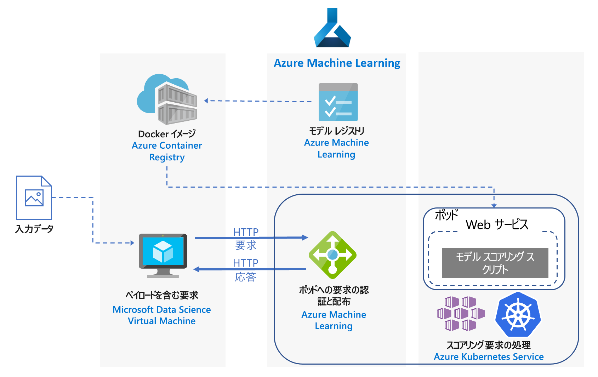
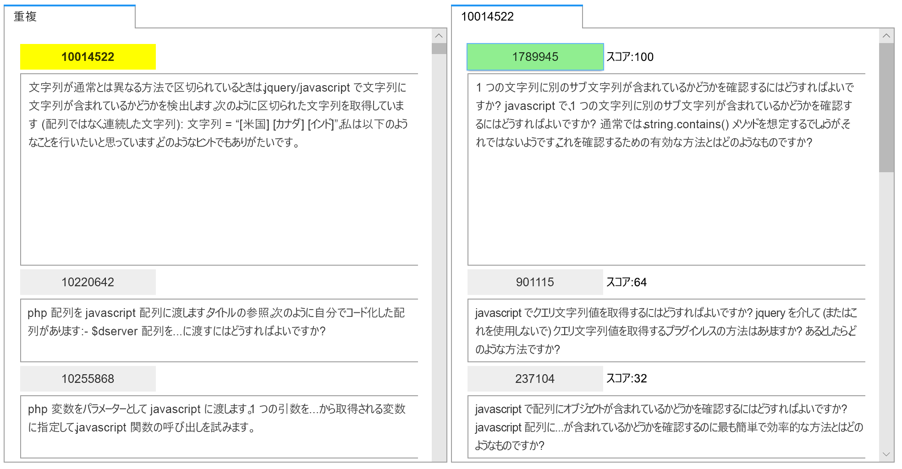
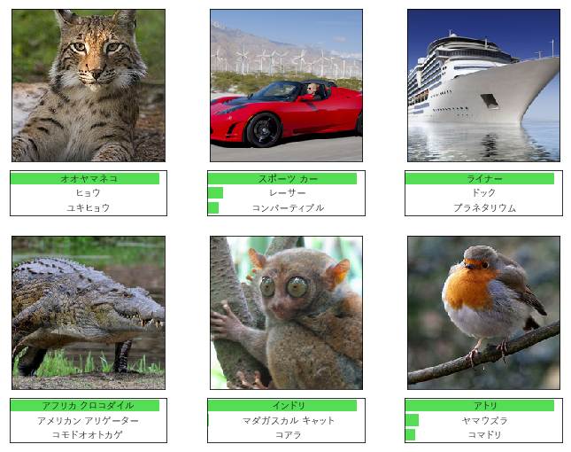

# Azure での Python scikit-learn モデルおよびディープ ラーニング モデルのリアルタイム スコアリングReal-time scoring of Python Scikit-Learn and deep learning models on Azure

この参照アーキテクチャでは、Python モデルを Web サービスとしてデプロイして、リアルタイムの予測を行う方法を示します。This reference architecture shows how to deploy Python models as web services to make real-time predictions. ここでは 2 つのシナリオについて説明します。1 つは通常の Python モデルのデプロイで、もう 1 つはディープ ラーニング モデルのデプロイという特定の要件です。Two scenarios are covered: deploying regular Python models, and the specific requirements of deploying deep learning models. ここで示すアーキテクチャは、両方のシナリオで使用されています。Both scenarios use the architecture shown.

このアーキテクチャの 2 つの参照実装は GitHub から入手でき、1 つは[通常の Python モデル][github-python]、もう 1 つ[はディープ ラーニング モデル][github-dl]を対象としています。Two reference implementations for this architecture are available on GitHub, one for [regular Python models][github-python] and one for [deep learning models][github-dl].

## シナリオScenarios

参照実装では、このアーキテクチャを使用して 2 つのシナリオを示します。The reference implementations demonstrate two scenarios using this architecture.

**シナリオ 1:FAQ 照合**。**Scenario 1: FAQ matching**. このシナリオは、よく寄せられる質問 (FAQ) 照合モデルを Web サービスとしてデプロイし、ユーザーの質問を予測する方法を示しています。This scenario shows how to deploy a frequently asked questions (FAQ) matching model as a web service to provide predictions for user questions. このシナリオでは、アーキテクチャ ダイアグラムの "Input Data" によって、ユーザーの質問を含むテキスト文字列が参照され、FAQ の一覧と照合されます。For this scenario, "Input Data" in the architecture diagram refers to text strings containing user questions to match with a list of FAQs. このシナリオは、Python 用の [scikit-learn][scikit] 機械学習ライブラリを対象にしていますが、Python モデルを使用してリアルタイムの予測を行う任意のシナリオ向けに汎用化できます。This scenario is designed for the [scikit-learn][scikit] machine learning library for Python, but can be generalized to any scenario that uses Python models to make real-time predictions.

このシナリオでは、JavaScript としてタグ付けされた元の質問、重複する質問、およびその回答を含む Stack Overflow 質問データのサブセットが使用されます。This scenario uses a subset of Stack Overflow question data that includes original questions tagged as JavaScript, their duplicate questions, and their answers. 元の質問それぞれについて、重複する質問と一致する可能性を予測するように scikit-learn パイプラインがトレーニングされます。It trains a scikit-learn pipeline to predict the match probability of a duplicate question with each of the original questions. これらの予測は、REST API エンドポイントを使用してリアルタイムで行われます。These predictions are made in real time using a REST API endpoint.

このアーキテクチャのアプリケーション フローは次のとおりです。The application flow for this architecture is as follows:

1. クライアントは、HTTP POST 要求を、エンコード済み質問データと一緒に送信します。The client sends an HTTP POST request with the encoded question data.

2. Flask アプリは、その要求から質問を抽出します。The Flask app extracts the question from the request.

3. 質問は scikit-learn パイプライン モデルに送信され、特徴付けとスコアリングが行われます。The question is sent to the scikit-learn pipeline model for featurization and scoring.

4. 一致する FAQ の質問とそのスコアは JSON オブジェクトにパイプされ、クライアントに返されます。The matching FAQ questions with their scores are piped into a JSON object and returned to the client.

結果を使用するサンプル アプリのスクリーンショットを次に示します。Here is a screenshot of the example app that consumes the results:

**シナリオ 2:画像の分類**。**Scenario 2: Image classification**. このシナリオは、畳み込みニューラル ネットワーク (CNN) モデルを Web サービスとしてデプロイし、画像に関する予測を提供する方法を示しています。This scenario shows how to deploy a Convolutional Neural Network (CNN) model as a web service to provide predictions on images. このシナリオでは、アーキテクチャ ダイアグラムの "Input Data" によって、画像ファイルが参照されます。For this scenario, "Input Data" in the architecture diagram refers to image files. 画像の分類やオブジェクト検出などのタスク向けのコンピューター ビジョンでは、CNN がきわめて効果的です。CNNs are very effective in computer vision for tasks such as image classification and object detection. このシナリオは、TensorFlow、Keras (TensorFlow バックエンドを含む)、および PyTorch フレームワークを対象にしています。This scenario is designed for the frameworks TensorFlow, Keras (with the TensorFlow back end), and PyTorch. ただし、ディープ ラーニング モデルを使用してリアルタイムの予測を行う任意のシナリオ向けに汎用化できます。However, it can be generalized to any scenario that uses deep learning models to make real-time predictions.

このシナリオでは、ImageNet-1K (1,000 クラス) データセットで事前にトレーニングされた ResNet-152 モデルを使用して、画像がどのカテゴリに属すかを予測します (以下の図参照)。This scenario uses a pre-trained ResNet-152 model trained on ImageNet-1K (1,000 classes) dataset to predict which category (see figure below) an image belongs to. これらの予測は、REST API エンドポイントを使用してリアルタイムで行われます。These predictions are made in real time using a REST API endpoint.

ディープ ラーニング モデルのアプリケーション フローは次のとおりです。The application flow for the deep learning model is as follows:

1. クライアントは、HTTP POST 要求を、エンコード済み画像データと一緒に送信します。The client sends an HTTP POST request with the encoded image data.

2. Flask アプリは、その要求から画像を抽出します。The Flask app extracts the image from the request.

3. 画像は前処理されてモデルに送信され、スコアリングが行われます。The image is preprocessed and sent to the model for scoring.

4. スコアリングの結果は JSON オブジェクトにパイプされ、クライアントに返されます。The scoring result is piped into a JSON object and returned to the client.

## アーキテクチャArchitecture

このアーキテクチャは、次のコンポーネントで構成されます。This architecture consists of the following components.

**[仮想マシン][vm]** (VM)。**[Virtual machine][vm]** (VM). VM は、HTTP 要求を送信できる &mdash;ローカルまたはクラウドの&mdash;デバイスの例として示されています。The VM is shown as an example of a device &mdash; local or in the cloud &mdash; that can send an HTTP request.

**[Azure Kubernetes Service][aks]** (AKS) は、アプリケーションを Kubernetes クラスターにデプロイするときに使用されます。**[Azure Kubernetes Service][aks]** (AKS) is used to deploy the application on a Kubernetes cluster. AKS により、Kubernetes のデプロイと操作が簡略化されます。AKS simplifies the deployment and operations of Kubernetes. クラスターを構成する場合、通常の Python モデルについては CPU のみの VM を使用し、ディープ ラーニング モデルについては GPU 対応 VM を使用します。The cluster can be configured using CPU-only VMs for regular Python models or GPU-enabled VMs for deep learning models.

**[ロード バランサー][lb]**。**[Load balancer][lb]**. サービスを外部に公開するときに、AKS によってプロビジョニングされたロード バランサーが使用されます。A load balancer, provisioned by AKS, is used to expose the service externally. ロード バランサーからのトラフィックは、バックエンド ポッドに送信されます。Traffic from the load balancer is directed to the back-end pods.

**[Docker Hub][docker]** は、Kubernetes クラスターにデプロイされている Docker イメージを格納するときに使用されます。**[Docker Hub][docker]** is used to store the Docker image that is deployed on Kubernetes cluster. Docker Hub は、使いやすく、Docker ユーザーに対する既定のイメージ リポジトリであるため、このアーキテクチャに選択されました。Docker Hub was chosen for this architecture because it's easy to use and is the default image repository for Docker users. [Azure Container Registry][acr] を、このアーキテクチャに使用することもできます。[Azure Container Registry][acr] can also be used for this architecture.

## パフォーマンスに関する考慮事項Performance considerations

リアルタイム スコアリング アーキテクチャでは、スループット パフォーマンスが主な考慮事項になります。For real-time scoring architectures, throughput performance becomes a dominant consideration. 通常の Python モデルの場合は、CPU で十分にワークロードを処理できると一般に考えられています。For regular Python models, it's generally accepted that CPUs are sufficient to handle the workload.

しかし、ディープ ラーニングのワークロードで速度がボトルネックになっているときは、一般的に CPU よりも GPU の方が優れた[パフォーマンス][gpus-vs-cpus]を発揮します。However for deep learning workloads, when speed is a bottleneck, GPUs generally provide better [performance][gpus-vs-cpus] compared to CPUs. CPU を使用して GPU に相当するパフォーマンスを実現するには、通常、多数の CPU を備えたクラスターが必要です。To match GPU performance using CPUs, a cluster with large number of CPUs is usually needed.

どちらのシナリオでもこのアーキテクチャには CPU を使用できますが、ディープ ラーニング モデルの場合、GPU が提供するスループット値は、同じコストの CPU クラスターに比べてかなり高くなります。You can use CPUs for this architecture in either scenario, but for deep learning models, GPUs provide significantly higher throughput values compared to a CPU cluster of similar cost. AKS では GPU の使用がサポートされています。これは、このアーキテクチャに AKS を使用するメリットの 1 つです。AKS supports the use of GPUs, which is one advantage of using AKS for this architecture. また、ディープ ラーニング デプロイで使用されるモデルには、通常、多数のパラメーターが含まれます。Also, deep learning deployments typically use models with a high number of parameters. GPU を使用することで、CPU のみのデプロイで問題になる、モデルと Web サービスの間のリソース競合を防ぐことができます。Using GPUs prevents contention for resources between the model and the web service, which is an issue in CPU-only deployments.

## スケーラビリティに関する考慮事項Scalability considerations

CPU のみの VM で AKS クラスターがプロビジョニングされている通常の Python モデルの場合、[ポッドの数をスケールアウト][manually-scale-pods]するときに注意が必要です。For regular Python models, where AKS cluster is provisioned with CPU-only VMs, take care when [scaling out the number of pods][manually-scale-pods]. 目標は、クラスターを完全に利用することです。The goal is to fully utilize the cluster. スケーリングは、CPU 要求と、ポッドに対して定義されている制限によって左右されます。Scaling depends on the CPU requests and limits defined for the pods. また、Kubernetes ではポッドの[自動スケーリング][autoscale-pods]もサポートされ、CPU 使用率などの選ばれたメトリックに応じて、デプロイのポッド数が調整されます。Kubernetes also supports [autoscaling][autoscale-pods] of the pods to adjust the number of pods in a deployment depending on CPU utilization or other select metrics. [クラスター オートスケーラー][autoscaler] (プレビュー) は、保留中のポッドに基づいてエージェント ノードをスケーリングできます。The [cluster autoscaler][autoscaler] (in preview) can scale agent nodes based on pending pods.

GPU 対応 VM を使用しているディープ ラーニング シナリオでは、ポッドのリソース制限は、1 つのポッドに 1 つの GPU を割り当てる、といったものです。For deep learning scenarios, using GPU-enabled VMs, resource limits on pods are such that one GPU is assigned to one pod. 使用する VM の種類に応じて[クラスターのノードをスケーリング][scale-cluster]して、サービスの需要に対応する必要があります。Depending on the type of VM used, you must [scale the nodes of the cluster][scale-cluster] to meet the demand for the service. これを簡単に行うには、Azure CLI と kubectl を使用します。You can do this easily using the Azure CLI and kubectl.

## 監視とログ記録に関する考慮事項Monitoring and logging considerations

### AKS の監視AKS monitoring

AKS のパフォーマンスを可視化するには、[コンテナーに対する Azure Monitor][monitor-containers] 機能を使用します。For visibility into AKS performance, use the [Azure Monitor for containers][monitor-containers] feature. この機能により、Kubernetes で使用可能なコントローラー、ノード、およびコンテナーから、メモリやプロセッサのメトリックが Metrics API 経由で収集されます。It collects memory and processor metrics from controllers, nodes, and containers that are available in Kubernetes through the Metrics API.

アプリケーションのデプロイ中、AKS クラスターを監視して、想定どおりに動作していること、すべてのノードが運用可能で、すべてのポッドが実行中であることを確認します。While deploying your application, monitor the AKS cluster to make sure it's working as expected, all the nodes are operational, and all pods are running. [kubectl][kubectl] コマンドライン ツールを使用してポッドの状態を取得できますが、Kubernetes にも、クラスターの状態の基本的な監視と管理のための Web ダッシュボードがあります。Although you can use the [kubectl][kubectl] command-line tool to retrieve pod status, Kubernetes also includes a web dashboard for basic monitoring of the cluster status and management.

クラスターとノードの全体的な状態を確認するには、Kubernetes ダッシュボードの **[ノード]** セクションに移動します。To see the overall state of the cluster and nodes, go to the **Nodes** section of the Kubernetes dashboard. ノードが非アクティブか失敗した場合は、そのページからエラー ログを表示できます。If a node is inactive or has failed, you can display the error logs from that page. 同様に、ポッドの数やデプロイの状態に関する情報を確認するには、**[ポッド]** セクションおよび **[デプロイ]** セクションに移動します。Similarly, go to the **Pods** and **Deployments** sections for information about the number of pods and status of your deployment.

### AKS のログAKS logs

AKS では、すべての stdout と stderr が、クラスター内のポッドのログに自動的に記録されます。AKS automatically logs all stdout/stderr to the logs of the pods in the cluster. kubectl を使用すると、これらのログのほか、ノード レベルのイベントおよびログも確認できます。Use kubectl to see these and also node-level events and logs. 詳細については、デプロイの手順を確認してください。For details, see the deployment steps.

[コンテナー用の Azure Monitor][monitor-containers] を使用して、コンテナー化されたバージョンの Linux 用 Log Analytics エージェントを介してメトリックとログを収集します。こうしたメトリックやログは、Log Analytics ワークスペースに保存されます。Use [Azure Monitor for containers][monitor-containers] to collect metrics and logs through a containerized version of the Log Analytics agent for Linux, which is stored in your Log Analytics workspace.

## セキュリティに関する考慮事項Security considerations

[Azure Security Center][security-center] を使用すると、Azure リソースのセキュリティの状態を一元的に表示して把握できます。Use [Azure Security Center][security-center] to get a central view of the security state of your Azure resources. Security Center は、潜在的なセキュリティ上の問題を監視し、デプロイのセキュリティの正常性を包括的に示します。ただし、AKS エージェント ノードは監視されません。Security Center monitors potential security issues and provides a comprehensive picture of the security health of your deployment, although it doesn't monitor AKS agent nodes. セキュリティ センターは、Azure サブスクリプションごとに構成されます。Security Center is configured per Azure subscription. [Azure サブスクリプションでの Security Center Standard の利用開始][get-started]に関するページの説明に従って、セキュリティ データの収集を有効にします。Enable security data collection as described in [Onboard your Azure subscription to Security Center Standard][get-started]. データ収集を有効にすると、セキュリティ センターは、そのサブスクリプションに作成されているすべての VM を自動的にスキャンします。When data collection is enabled, Security Center automatically scans any VMs created under that subscription.

**操作**。**Operations**. Azure Active Directory (Azure AD) 認証トークンを使用して AKS クラスターにサインインするには、[ユーザー認証][aad-auth]に Azure AD を使用するように AKS を構成します。To sign in to an AKS cluster using your Azure Active Directory (Azure AD) authentication token, configure AKS to use Azure AD for [user authentication][aad-auth]. また、クラスター管理者が、ユーザーの ID またはディレクトリ グループ メンバーシップに基づいて、Kubernetes のロールベースのアクセス制御 (RBAC) を構成することもできます。Cluster administrators can also configure Kubernetes role-based access control (RBAC) based on a user's identity or directory group membership.

[RBAC][rbac] を使用して、デプロイする Azure リソースへのアクセスを制御してください。Use [RBAC][rbac] to control access to the Azure resources that you deploy. RBAC を使用すると、DevOps チームのメンバーに承認の役割を割り当てることができます。RBAC lets you assign authorization roles to members of your DevOps team. ユーザーを複数の役割に割り当てることができ、よりきめ細かい[アクセス許可]のカスタム ロールを作成することができます。A user can be assigned to multiple roles, and you can create custom roles for even more fine-grained [permissions].

**HTTPS**。**HTTPS**. セキュリティのベスト プラクティスとして、アプリケーションでは HTTPS を強制して、HTTP 要求をリダイレクトします。As a security best practice, the application should enforce HTTPS and redirect HTTP requests. SSL を終了して HTTP 要求をリダイレクトするリバース プロキシをデプロイするには、[イングレス コントローラー][ingress-controller]を使用します。Use an [ingress controller][ingress-controller] to deploy a reverse proxy that terminates SSL and redirects HTTP requests. 詳細については、「[Azure Kubernetes Service (AKS) で HTTPS イングレス コントローラーを作成する][https-ingress]」を参照してください。For more information, see [Create an HTTPS ingress controller on Azure Kubernetes Service (AKS)][https-ingress].

**[認証]**: **Authentication**. このソリューションでは、エンドポイントへのアクセスは制限されません。This solution doesn't restrict access to the endpoints. エンタープライズ設定でアーキテクチャをデプロイするには、API キーによってエンドポイントをセキュリティで保護し、何らかの形式のユーザー認証をクライアント アプリケーションに追加します。To deploy the architecture in an enterprise setting, secure the endpoints through API keys and add some form of user authentication to the client application.

**コンテナー レジストリ**。**Container registry**. このソリューションでは、Docker イメージの格納にパブリック レジストリが使用されます。This solution uses a public registry to store the Docker image. アプリケーションが依存するコード、およびモデルは、このイメージ内に含まれています。The code that the application depends on, and the model, are contained within this image. エンタープライズ アプリケーションでは、悪意のあるコードが実行されるのを防ぎ、コンテナー内の情報が侵害されないようにするために、プライベート レジストリを使用する必要があります。Enterprise applications should use a private registry to help guard against running malicious code and to help keep the information inside the container from being compromised.

**DDoS 保護**。**DDoS protection**. [DDoS Protection Standard][ddos] を有効にすることを検討します。Consider enabling [DDoS Protection Standard][ddos]. Azure プラットフォームの一部として基本な DDoS 保護が有効になりますが、DDoS Protection Standard により、特に Azure 仮想ネットワークのリソース向けにチューニングされた軽減機能が提供されます。Although basic DDoS protection is enabled as part of the Azure platform, DDoS Protection Standard provides mitigation capabilities that are tuned specifically to Azure virtual network resources.

**ログの記録**。**Logging**. ログ データを格納する前にベスト プラクティスを使用します。たとえば、セキュリティ不正アクセスに使用できるユーザー パスワードなどの情報を除去します。Use best practices before storing log data, such as scrubbing user passwords and other information that could be used to commit security fraud.

## DeploymentDeployment

この参照アーキテクチャを展開するには、GitHub リポジトリで説明されている手順に従ってください。To deploy this reference architecture, follow the steps described in the GitHub repos:

- [通常の Python のモデル][github-python][Regular Python models][github-python]
- [ディープ ラーニング モデル][github-dl][Deep learning models][github-dl]

<!-- links -->

[aad-auth]: /azure/aks/aad-integration
[acr]: /azure/container-registry/
[something]: https://kubernetes.io/docs/reference/access-authn-authz/authentication/
[aks]: /azure/aks/intro-kubernetes
[autoscaler]: /azure/aks/autoscaler
[autoscale-pods]: /azure/aks/tutorial-kubernetes-scale#autoscale-pods
[azcopy]: /azure/storage/common/storage-use-azcopy-linux
[ddos]: /azure/virtual-network/ddos-protection-overview
[docker]: https://hub.docker.com/
[get-started]: /azure/security-center/security-center-get-started
[github-python]: https://github.com/Azure/MLAKSDeployment
[github-dl]: https://github.com/Microsoft/AKSDeploymentTutorial
[gpus-vs-cpus]: https://azure.microsoft.com/en-us/blog/gpus-vs-cpus-for-deployment-of-deep-learning-models/
[https-ingress]: /azure/aks/ingress-tls
[ingress-controller]: https://kubernetes.io/docs/concepts/services-networking/ingress/
[kubectl]: https://kubernetes.io/docs/tasks/tools/install-kubectl/
[lb]: /azure/load-balancer/load-balancer-overview
[manually-scale-pods]: /azure/aks/tutorial-kubernetes-scale#manually-scale-pods
[monitor-containers]: /azure/monitoring/monitoring-container-insights-overview
[アクセス許可]: /azure/aks/concepts-identity
[permissions]: /azure/aks/concepts-identity
[rbac]: /azure/active-directory/role-based-access-control-what-is
[scale-cluster]: /azure/aks/scale-cluster
[scikit]: https://pypi.org/project/scikit-learn/
[security-center]: /azure/security-center/security-center-intro
[vm]: /azure/virtual-machines/
