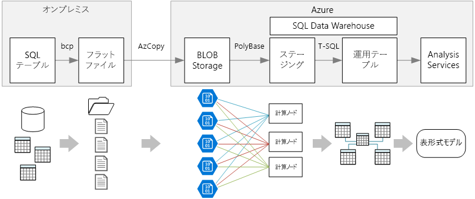

# SQL Data Warehouse を使用した Azure のエンタープライズ向け BI

この参照アーキテクチャでは、オンプレミスの SQL Server データベースから SQL Data Warehouse にデータを移動し、そのデータを分析用に変換する[抽出、読み込み、変換 (ELT)](../../data-guide/relational-data/etl.md#extract-load-and-transform-elt) パイプラインを実装します。

このアーキテクチャのリファレンス実装は、[GitHub][github-folder] で入手できます。

**シナリオ**:ある組織に、オンプレミスの SQL Server データベースに格納された大規模な OLTP データ セットがあります。 この組織では、SQL Data Warehouse を利用して Power BI を使った分析を行いたいと考えています。

この参照アーキテクチャは、1 回限りのジョブまたはオンデマンドのジョブ用に設計されています。 継続的に (毎時または毎日) データを移動する必要がある場合は、Azure Data Factory を使用して自動化されたワークフローを定義することをお勧めします。 Data Factory を使用する参照アーキテクチャについては、「[SQL Data Warehouse と Azure Data Factory を使用したエンタープライズ BI の自動化][adf-ra]」を参照してください。

## アーキテクチャ

アーキテクチャは、次のコンポーネントで構成されます。

### データ ソース

**SQL Server**。 ソース データは、オンプレミスの SQL Server データベースにあります。 オンプレミス環境をシミュレートするために、このアーキテクチャのデプロイ スクリプトでは、SQL Server がインストールされた Azure の VM がプロビジョニングされます。 [Wide World Importers OLTP サンプル データベース][wwi]は、ソース データベースとして使用されます。

### インジェストとデータ ストレージ

**Blob Storage**。 Blob Storage は、データを SQL Data Warehouse に読み込む前にコピーするためのステージング領域として使用されます。

**Azure SQL Data Warehouse**。 [SQL Data Warehouse](/azure/sql-data-warehouse/) は、大規模なデータの分析を目的として設計された分散システムです。 超並列処理 (MPP) がサポートされているので、ハイパフォーマンス分析の実行に適しています。

### 分析とレポート

**Azure Analysis Services**。 [Analysis Services](/azure/analysis-services/) は、データ モデリング機能を提供するフル マネージド サービスです。 Analysis Services を使用して、ユーザーがクエリを実行できるセマンティック モデルを作成します。 Analysis Services は、BI ダッシュボードのシナリオで特に役立ちます。 このアーキテクチャでは、セマンティック モデルを処理するために Analysis Services によってデータ ウェアハウスからデータが読み取られ、ダッシュボードのクエリが効率的に処理されます。 また、レプリカをスケールアウトしてクエリ処理を高速化することで、エラスティックなコンカレンシーもサポートします。

現在、Azure Analysis Services では表形式モデルをサポートしていますが、多次元モデルはサポートしていません。 表形式モデルではリレーショナル モデリング構造 (テーブル、列) を使用し、多次元モデルでは OLAP モデリング構造 (キューブ、ディメンション、メジャー) を使用します。 多次元モデルが必要な場合は、SQL Server Analysis Services (SSAS) を使用します。 詳細については、「[テーブル ソリューションと多次元ソリューションの比較](/sql/analysis-services/comparing-tabular-and-multidimensional-solutions-ssas)」をご覧ください。

**Power BI**。 Power BI は、データを分析してビジネスの分析情報を得る一連のビジネス分析ツールです。 このアーキテクチャでは、Analysis Services に格納されたセマンティック モデルに対してクエリが実行されます。

### Authentication

**Azure Active Directory (Azure AD)** では、Power BI から Analysis Services サーバーに接続するユーザーの認証が行われます。

## データ パイプライン

この参照アーキテクチャでは、[WorldWideImporters](/sql/sample/world-wide-importers/wide-world-importers-oltp-database) サンプル データベースをデータ ソースとして使用します。 データ パイプラインには次のステージがあります。

1. SQL Server からフラット ファイルにデータをエクスポートする (bcp ユーティリティ)。
2. フラット ファイルを Azure Blob Storage にコピーする (AzCopy)。
3. SSQL Data Warehouse にデータを読み込む (PolyBase)。
4. データをスター スキーマに変換する (T-SQL)。
5. Analysis Services にセマンティック モデルを読み込みます (SQL Server Data Tools)。

> [!NOTE]
> 手順 1 から 3 については、Redgate の Data Platform Studio を使用することを検討してください。 Data Platform Studio では、最も適切な互換性修正プログラムと最適化が適用されるため、SQL Data Warehouse をごく手軽に使い始めることができます。 詳細については、[Redgate Data Platform Studio を使用したデータの読み込み](/azure/sql-data-warehouse/sql-data-warehouse-load-with-redgate)に関する記事をご覧ください。
>

以下のセクションでは、これらのステージについて詳しく説明します。

### SQL Server からデータをエクスポートする

[bcp](/sql/tools/bcp-utility) (一括コピー プログラム) ユーティリティを使用すると、SQL テーブルからフラット テキスト ファイルを迅速に作成できます。 この手順では、エクスポートする列を選択しますが、データは変換しません。 データ変換は、SQL Data Warehouse で実行する必要があります。

**Recommendations (推奨事項)**

運用環境でのリソースの競合を最小限に抑えるために、可能であれば、データ抽出をピーク外の時間帯にスケジュールします。

データベース サーバーで bcp を実行しないようにしてください。 代わりに、別のコンピューターから実行します。 ファイルをローカル ドライブに書き込みます。 同時書き込みを処理できるだけの十分な I/O リソースがあることを確認してください。 最適なパフォーマンスを得るために、専用の高速ストレージ ドライブにファイルをエクスポートします。

エクスポートされたデータを Gzip 圧縮形式で保存することで、ネットワーク転送を高速化できます。 ただし、ウェアハウスへの圧縮ファイルの読み込みは圧縮されていないファイルの読み込みよりも時間がかかるため、高速ネットワーク転送と高速読み込みの間にはトレードオフがあります。 Gzip 圧縮を使用する場合は、単一の Gzip ファイルを作成しないでください。 代わりに、データを複数の圧縮ファイルに分割します。

### フラット ファイルを Blob Storage にコピーする

[AzCopy](/azure/storage/common/storage-use-azcopy) ユーティリティは、Azure Blob Storage への高パフォーマンスのデータ コピーを実行するように設計されています。

**Recommendations (推奨事項)**

ソース データの場所に近いリージョンにストレージ アカウントを作成します。 ストレージ アカウントと SQL Data Warehouse インスタンスを同じリージョンにデプロイします。

CPU と I/O の消費が運用ワークロードを妨げる可能性があるため、運用ワークロードを実行するマシンで AzCopy を実行しないでください。

まず、アップロードをテストして、アップロード速度を確認します。 AzCopy で /NC オプションを使用して、コンカレントなコピー操作数を指定できます。 既定値から始め、この設定を試してパフォーマンスを調整します。 低帯域幅の環境では、同時実行操作数が多すぎると、ネットワーク接続に過剰な負荷がかかり、操作を正常に完了できなくなる可能性があります。

AzCopy では、パブリック インターネット経由でデータをストレージに移動します。 速度が不十分な場合は、[ExpressRoute](/azure/expressroute/) 回線を設定することを検討してください。 ExpressRoute は、専用プライベート接続を通してデータを Azure にルーティングするサービスです。 ネットワーク接続が遅すぎる場合は、別の方法として、ディスク上のデータを Azure データセンターに物理的に送付します。 詳細については、「[Azure との間のデータ転送](/azure/architecture/data-guide/scenarios/data-transfer)」をご覧ください。

コピー操作中に、AzCopy によって一時ジャーナル ファイルが作成されます。これにより、(ネットワーク エラーなどが原因で) 操作が中断された場合に、AzCopy で操作を再開できます。 ジャーナル ファイルを格納できる十分なディスク領域があることを確認してください。 /Z オプションを使用して、ジャーナル ファイルの書き込み先を指定できます。

### SQL Data Warehouse にデータを読み込む

[PolyBase](/sql/relational-databases/polybase/polybase-guide) を使用して、Blob Storage からデータ ウェアハウスにファイルを読み込みます。 PolyBase は、SQL Data Warehouse の MPP (超並列処理) アーキテクチャを活用するように設計されているので、SQL Data Warehouse にデータを読み込む最も速い方法です。

データの読み込みは次の 2 段階のプロセスです。

1. データの一連の外部テーブルを作成します。 外部テーブルとは、ウェアハウスの外部に格納されたデータを参照するテーブル定義です。この場合は、Blob Storage 内のフラット ファイルです。 この手順では、データをウェアハウスに移動しません。
2. ステージング テーブルを作成し、データをステージング テーブルに読み込みます。 この手順でデータをウェアハウスにコピーします。

**Recommendations (推奨事項)**

大量のデータ (1 TB 超) があり、並列処理のメリットが得られる分析ワークロードを実行する場合に、SQL Data Warehouse を検討します。 SQL Data Warehouse は、OLTP ワークロードや小規模のデータ セット (250 GB 未満) には適していません。 250 GB 未満のデータ セットについては、Azure SQL Database または SQL Server を検討します。 詳細については、[データ ウェアハウス](../../data-guide/relational-data/data-warehousing.md)に関する記事をご覧ください。

インデックスのないヒープ テーブルとしてステージング テーブルを作成します。 運用テーブルを作成するクエリにより、フル テーブル スキャンが実行されることになるため、ステージング テーブルのインデックスを作成する理由はありません。

PolyBase では、ウェアハウスで並列処理を自動的に利用します。 DWU を増やすと、読み込みパフォーマンスがスケーリングされます。 最適なパフォーマンスを得るために、単一の読み込み操作を使用します。 入力データをチャンクに分割し、複数の同時読み込みを実行すると、パフォーマンス上のメリットは得られません。

PolyBase では Gzip 圧縮ファイルを読み取ることができます。 ただし、ファイルの圧縮解除はシングル スレッド操作であるため、リーダーは圧縮ファイルごとに 1 つしか使用されません。 そのため、単一の大きな圧縮ファイルの読み込みは避けてください。 代わりに、並列処理を活用するために、データを複数の圧縮ファイルに分割します。 

次の制限事項に注意してください。

- PolyBase でサポートされる最大列サイズは、`varchar(8000)`、`nvarchar(4000)`、または `varbinary(8000)` です。 これらの制限を超えるデータがある場合、1 つの方法として、エクスポート時にデータをチャンクに分割し、インポート後にチャンクを再構築します。

- PolyBase では、固定行ターミネータとして \n または改行を使用します。 ソース データに改行文字が出現すると、問題が発生する可能性があります。

- ソース データ スキーマに、SQL Data Warehouse でサポートされていないデータ型が含まれている場合があります。

これらの制限を回避するには、必要な変換を実行するストアド プロシージャを作成します。 bcp の実行時に、このストアド プロシージャを参照します。 また、[Redgate Data Platform Studio](/azure/sql-data-warehouse/sql-data-warehouse-load-with-redgate) を使用して、SQL Data Warehouse でサポートされていないデータ型を自動的に変換することもできます。

詳細については、次の記事を参照してください。

- [Azure SQL Data Warehouse へのデータ読み込みのベスト プラクティス](/azure/sql-data-warehouse/guidance-for-loading-data)
- [SQL Data Warehouse にスキーマを移行する](/azure/sql-data-warehouse/sql-data-warehouse-migrate-schema)
- [SQL Data Warehouse でのテーブルのデータ型の定義に関するガイダンス](/azure/sql-data-warehouse/sql-data-warehouse-tables-data-types)

### データの変換

データを変換し、運用テーブルに移動します。 この手順では、ディメンション テーブルとファクト テーブルで構成され、セマンティック モデリングに適したスター スキーマにデータが変換されます。

クラスター化列ストア インデックスを設定して運用テーブルを作成します。これにより、全体として最適なクエリ パフォーマンスが実現されます。 列ストア インデックスは、多数のレコードをスキャンするクエリに最適化されています。 列ストア インデックスは、シングルトンのルックアップ (つまり、単一行の検索) には適していません。 単一ルックアップを頻繁に実行する必要がある場合は、テーブルに非クラスター化インデックスを追加できます。 非クラスター化インデックスを使用すると、単一ルックアップの実行を大幅に高速化できます。 ただし、データ ウェアハウス シナリオでは、通常、単一ルックアップは OLTP ワークロードほど一般的ではありません。 詳細については、「[SQL Data Warehouse でのテーブルのインデックス作成](/azure/sql-data-warehouse/sql-data-warehouse-tables-index)」をご覧ください。

> [!NOTE]
> クラスター化列ストア テーブルでは、`varchar(max)`、`nvarchar(max)`、`varbinary(max)` の各データ型はサポートしていません。 その場合、ヒープ インデックスまたはクラスター化インデックスを検討してください。 それらの列を別のテーブルに配置できます。

サンプル データベースはそれほど大きくないので、パーティションなしでレプリケート テーブルが作成されました。 運用ワークロードでは、分散テーブルを使用すると、クエリ パフォーマンスが向上する可能性があります。 「[Azure SQL Data Warehouse での分散テーブルの設計に関するガイダンス](/azure/sql-data-warehouse/sql-data-warehouse-tables-distribute)」をご覧ください。 サンプル スクリプトでは、静的[リソース クラス](/azure/sql-data-warehouse/resource-classes-for-workload-management)を使用してクエリが実行されます。

### セマンティック モデルを読み込む

Azure Analysis Services で表形式モデルにデータを読み込みます。 この手順では、SQL Server Data Tools (SSDT) を使用してセマンティック データ モデルを作成します。 モデルは、Power BI Desktop ファイルからインポートして作成することもできます。 SQL Data Warehouse では外部キーをサポートしていないため、テーブル間の結合を可能にするために、セマンティック モデルにリレーションシップを追加する必要があります。

### Power BI を使用してデータを視覚化する

Power BI では、Azure Analysis Services に接続するための 2 つのオプションをサポートしています。

- インポート。 データは Power BI モデルにインポートされます。
- ライブ接続。 データは Analysis Services から直接取得されます。

Power BI モデルにデータをコピーする必要がないため、ライブ接続をお勧めします。 また、DirectQuery を使用すると、結果を最新のソース データと常に一致させることができます。 詳細については、「[Power BI を使用した接続](/azure/analysis-services/analysis-services-connect-pbi)」をご覧ください。

**Recommendations (推奨事項)**

BI ダッシュボードのクエリをデータ ウェアハウスに対して直接実行しないようにしてください。 BI ダッシュボードでは、応答時間が非常に短いことが求められます。ウェアハウスに対してクエリを直接実行すると、この要件を満たすことができない可能性があります。 また、ダッシュボードの更新は同時クエリの数にカウントされるので、パフォーマンスに影響を及ぼす可能性があります。

Azure Analysis Services は、BI ダッシュボードのクエリ要件に対応するように設計されているため、Power BI から Analysis Services に対するクエリを実行することをお勧めします。

## スケーラビリティに関する考慮事項

### SQL Data Warehouse

SQL Data Warehouse では、コンピューティング リソースをオンデマンドでスケールアウトできます。 クエリ エンジンは、コンピューティング ノードの数に基づいてクエリを並列処理に最適化し、必要に応じてノード間でデータを移動します。 詳細については、「[Azure SQL Data Warehouse でのコンピューティングの管理](/azure/sql-data-warehouse/sql-data-warehouse-manage-compute-overview)」をご覧ください。

### Analysis Services

Azure Analysis Services の Standard レベルでは、パーティション分割と DirectQuery をサポートしているため、運用ワークロードには Standard レベルをお勧めします。 レベル内では、インスタンスのサイズによってメモリと処理能力が決まります。 処理能力は、クエリ処理ユニット (QPU) で測定されます。 QPU 使用量を監視して適切なサイズを選択します。 詳細については、「[サーバー メトリックの監視](/azure/analysis-services/analysis-services-monitor)」をご覧ください。

高負荷時には、クエリのコンカレンシーによってクエリ パフォーマンスが低下する可能性があります。 より多くのクエリを同時に実行できるように、クエリを処理するレプリカのプールを作成して Analysis Services をスケールアウトできます。 データ モデルの処理は、常にプライマリ サーバーで行われます。 既定では、クエリもプライマリ サーバーで処理されます。 必要に応じて、クエリ プールですべてのクエリが処理されるように、処理を排他的に実行するプライマリ サーバーを指定することもできます。 高い処理要件がある場合は、クエリ プールから処理を切り離す必要があります。 クエリ負荷が高く、処理が比較的軽い場合は、プライマリ サーバーをクエリ プールに含めることができます。 詳細については、「[Azure Analysis Services のスケールアウト](/azure/analysis-services/analysis-services-scale-out)」をご覧ください。

不要な処理の量を減らすために、パーティションを使用して表形式モデルを論理部分に分割することを検討してください。 各パーティションは個別に処理できます。 詳細については、「[パーティション](/sql/analysis-services/tabular-models/partitions-ssas-tabular)」をご覧ください。

## セキュリティに関する考慮事項

### Analysis Services クライアントの IP ホワイトリスト登録

Analysis Services のファイアウォール機能を使用して、クライアントの IP アドレスをホワイトリストに登録することを検討します。 ファイアウォールを有効にすると、ファイアウォール規則で指定された接続以外のすべてのクライアント接続がブロックされます。 既定の規則では Power BI サービスがホワイトリストに登録されますが、必要に応じてこの規則を無効にすることができます。 詳細については、「[Hardening Azure Analysis Services with the new firewall capability (新しいファイアウォール機能による Azure Analysis Services の強化)](https://azure.microsoft.com/blog/hardening-azure-analysis-services-with-the-new-firewall-capability/)」をご覧ください。

### 承認

Azure Analysis Services では、Azure Active Directory (Azure AD) を使用して Analysis Services サーバーに接続するユーザーを認証します。 ロールを作成し、Azure AD ユーザーまたはグループをそれらのロールに割り当てることで、特定のユーザーが表示できるデータを制限できます。 各ロールでは次のことが可能です。 

- テーブルまたは個々の列を保護する。 
- フィルター式に基づいて個々の行を保護する。 

詳細については、「[データベース ロールとユーザーの管理](/azure/analysis-services/analysis-services-database-users)」をご覧ください。

## ソリューションのデプロイ方法

リファレンス実装をデプロイおよび実行するには、[GitHub readme][github-folder] の手順に従ってください。 以下がデプロイされます。

- オンプレミスのデータベース サーバーをシミュレートする Windows VM。 これには、SQL Server 2017 と関連ツール、および Power BI Desktop が含まれています。
- SQL Server データベースからエクスポートされたデータを保持する Blob Storage を提供する Azure ストレージ アカウント。
- Azure SQL Data Warehouse インスタンス。
- Azure Analysis Services インスタンス。

## 次の手順

- Azure Data Factory を使用して ELT パイプラインを自動化します。 「[SQL Data Warehouse と Azure Data Factory を使用したエンタープライズ BI の自動化][adf-ra]」を参照してください。

<!-- links -->

[adf-ra]: ./enterprise-bi-adf.md
[github-folder]: https://github.com/mspnp/reference-architectures/tree/master/data/enterprise_bi_sqldw
[wwi]: /sql/sample/world-wide-importers/wide-world-importers-oltp-database
