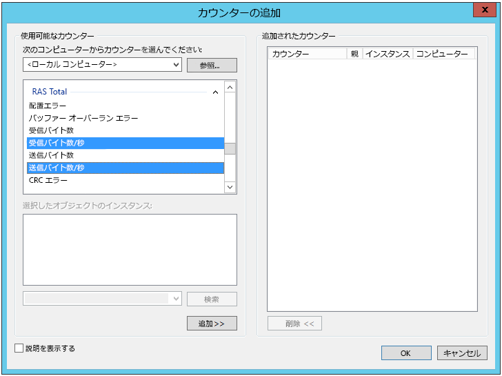
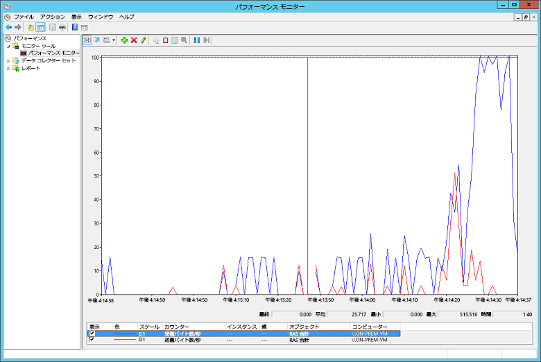

# <a name="troubleshoot-a-hybrid-vpn-connection"></a>ハイブリッド VPN 接続のトラブルシューティング

この記事では、オンプレミス ネットワークと Azure 間の VPN ゲートウェイ接続をトラブルシューティングする際のヒントをいくつか示します。 一般的な VPN 関連エラーのトラブルシューティングに関する全般的な情報については、「[Troubleshooting common VPN related errors (一般的な VPN 関連エラーのトラブルシューティング)][troubleshooting-vpn-errors]」を参照してください。

## <a name="verify-the-vpn-appliance-is-functioning-correctly"></a>VPN アプライアンスが正常に機能していることを確認する

次の推奨事項は、オンプレミス VPN アプライアンスが正しく機能しているかどうかを判断するうえで役立ちます。

**VPN アプライアンスによって生成されたログ ファイルで、エラーや障害がないかどうかを確認する。** これは、VPN アプライアンスが正しく機能しているかどうかを判断するうえで役立ちます。 この情報の場所は、アプライアンスによって異なります。 たとえば、Windows Server 2012 で RRAS を使用している場合は、次の PowerShell コマンドを使用して、RRAS サービスのエラー イベント情報を表示できます。

```PowerShell
Get-EventLog -LogName System -EntryType Error -Source RemoteAccess | Format-List -Property *
```

各エントリの *Message* プロパティにエラーの説明が示されます。 一般的な例を次に示します。

- おそらく、RRAS VPN のネットワーク インターフェイス構成内の Azure VPN ゲートウェイに対して指定された IP アドレスが正しくないため、接続できない。

  ```console
  EventID            : 20111
  MachineName        : on-prem-vm
  Data               : {41, 3, 0, 0}
  Index              : 14231
  Category           : (0)
  CategoryNumber     : 0
  EntryType          : Error
  Message            : RoutingDomainID- {00000000-0000-0000-0000-000000000000}: A demand dial connection to the remote
                          interface AzureGateway on port VPN2-4 was successfully initiated but failed to complete
                          successfully because of the  following error: The network connection between your computer and
                          the VPN server could not be established because the remote server is not responding. This could
                          be because one of the network devices (for example, firewalls, NAT, routers, and so on) between your computer
                          and the remote server is not configured to allow VPN connections. Please contact your
                          Administrator or your service provider to determine which device may be causing the problem.
  Source             : RemoteAccess
  ReplacementStrings : {{00000000-0000-0000-0000-000000000000}, AzureGateway, VPN2-4, The network connection between
                          your computer and the VPN server could not be established because the remote server is not
                          responding. This could be because one of the network devices (for example, firewalls, NAT, routers, and so on)
                          between your computer and the remote server is not configured to allow VPN connections. Please
                          contact your Administrator or your service provider to determine which device may be causing the
                          problem.}
  InstanceId         : 20111
  TimeGenerated      : 3/18/2016 1:26:02 PM
  TimeWritten        : 3/18/2016 1:26:02 PM
  UserName           :
  Site               :
  Container          :
  ```

- RRAS VPN ネットワーク インターフェイスの構成で、誤った共有キーが指定されている。

  ```console
  EventID            : 20111
  MachineName        : on-prem-vm
  Data               : {233, 53, 0, 0}
  Index              : 14245
  Category           : (0)
  CategoryNumber     : 0
  EntryType          : Error
  Message            : RoutingDomainID- {00000000-0000-0000-0000-000000000000}: A demand dial connection to the remote
                          interface AzureGateway on port VPN2-4 was successfully initiated but failed to complete
                          successfully because of the  following error: Internet key exchange (IKE) authentication credentials are unacceptable.

  Source             : RemoteAccess
  ReplacementStrings : {{00000000-0000-0000-0000-000000000000}, AzureGateway, VPN2-4, IKE authentication credentials are
                          unacceptable.
                          }
  InstanceId         : 20111
  TimeGenerated      : 3/18/2016 1:34:22 PM
  TimeWritten        : 3/18/2016 1:34:22 PM
  UserName           :
  Site               :
  Container          :
  ```

次の PowerShell コマンドを使用して、RRAS サービスを介した接続試行に関するイベント ログ情報を入手することもできます。

```powershell
Get-EventLog -LogName Application -Source RasClient | Format-List -Property *
```

接続で障害が発生した場合、このログには、次のようなエラーが含まれます。

```console
EventID            : 20227
MachineName        : on-prem-vm
Data               : {}
Index              : 4203
Category           : (0)
CategoryNumber     : 0
EntryType          : Error
Message            : CoId={B4000371-A67F-452F-AA4C-3125AA9CFC78}: The user SYSTEM dialed a connection named
                        AzureGateway that has failed. The error code returned on failure is 809.
Source             : RasClient
ReplacementStrings : {{B4000371-A67F-452F-AA4C-3125AA9CFC78}, SYSTEM, AzureGateway, 809}
InstanceId         : 20227
TimeGenerated      : 3/18/2016 1:29:21 PM
TimeWritten        : 3/18/2016 1:29:21 PM
UserName           :
Site               :
Container          :
```

## <a name="verify-connectivity"></a>接続を検証する

**VPN ゲートウェイを介した接続とルーティングを確認する。** VPN アプライアンスによって、Azure VPN Gateway を介したトラフィックが正しくルーティングされていない可能性があります。 [PsPing][psping] などのツールを使用して、VPN ゲートウェイを介した接続とルーティングを確認してください。 たとえば、オンプレミスのマシンから VNet にある Web サーバーへの接続をテストするには、次のコマンドを実行します (`<<web-server-address>>` を Web サーバーのアドレスで置き換えてください)。

```console
PsPing -t <<web-server-address>>:80
```

オンプレミスのマシンがトラフィックを Web サーバーにルーティングできる場合は、次のような出力が表示されます。

```console
D:\PSTools>psping -t 10.20.0.5:80

PsPing v2.01 - PsPing - ping, latency, bandwidth measurement utility
Copyright (C) 2012-2014 Mark Russinovich
Sysinternals - www.sysinternals.com

TCP connect to 10.20.0.5:80:
Infinite iterations (warmup 1) connecting test:
Connecting to 10.20.0.5:80 (warmup): 6.21ms
Connecting to 10.20.0.5:80: 3.79ms
Connecting to 10.20.0.5:80: 3.44ms
Connecting to 10.20.0.5:80: 4.81ms

    Sent = 3, Received = 3, Lost = 0 (0% loss),
    Minimum = 3.44ms, Maximum = 4.81ms, Average = 4.01ms
```

オンプレミスのマシンが指定した接続先と通信できない場合は、次のようなメッセージが表示されます。

```console
D:\PSTools>psping -t 10.20.1.6:80

PsPing v2.01 - PsPing - ping, latency, bandwidth measurement utility
Copyright (C) 2012-2014 Mark Russinovich
Sysinternals - www.sysinternals.com

TCP connect to 10.20.1.6:80:
Infinite iterations (warmup 1) connecting test:
Connecting to 10.20.1.6:80 (warmup): This operation returned because the timeout period expired.
Connecting to 10.20.1.6:80: This operation returned because the timeout period expired.
Connecting to 10.20.1.6:80: This operation returned because the timeout period expired.
Connecting to 10.20.1.6:80: This operation returned because the timeout period expired.
Connecting to 10.20.1.6:80:
    Sent = 3, Received = 0, Lost = 3 (100% loss),
    Minimum = 0.00ms, Maximum = 0.00ms, Average = 0.00ms
```

**オンプレミスのファイアウォールで VPN トラフィックの通過が許可されていること、また正しいポートが開いていることを確認する。**

**オンプレミスの VPN アプライアンスによって、Azure VPN ゲートウェイと互換性のある暗号化方式が使用されていることを確認する。** ポリシー ベースのルーティングでは、Azure VPN ゲートウェイは、AES256、AES128、および 3DES 暗号化アルゴリズムをサポートしています。 ルート ベースのゲートウェイは、AES256 および 3DES をサポートしています。 詳細については、「[サイト間 VPN Gateway 接続用の VPN デバイスと IPsec/IKE パラメーターについて][vpn-appliance]」を参照してください。

## <a name="check-for-problems-with-the-azure-vpn-gateway"></a>Azure VPN ゲートウェイの問題を確認する

次の推奨事項は、Azure VPN ゲートウェイに問題があるかどうかを判断するのに役立ちます。

**Azure VPN ゲートウェイの診断ログで潜在的な問題がないか調査する。** [ステップ バイ ステップのAzure Resource Manager VNET ゲートウェイの診断ログのキャプチャ][gateway-diagnostic-logs]に関するページを参照してください。

**Azure VPN ゲートウェイとオンプレミス VPN アプライアンスが同じ共有認証キーで構成されていることを確認する。** Azure VPN ゲートウェイによって保存されている共有キーを表示するには、次の Azure CLI コマンドを使用します。

```azurecli
azure network vpn-connection shared-key show <<resource-group>> <<vpn-connection-name>>
```

ご使用のオンプレミス VPN アプライアンスに適したコマンドを使用して、そのアプライアンス用に構成された共有キーを表示します。

Azure VPN ゲートウェイを保持している *GatewaySubnet* サブネットが NSG に関連付けられていないことを確認します。

サブネットを詳細を表示するには、次の Azure CLI コマンドを使用します。

```azurecli
azure network vnet subnet show -g <<resource-group>> -e <<vnet-name>> -n GatewaySubnet
```

*Network Security Group ID* という名前のデータ フィールドがないことを確認します。 次の例は、割り当られた NSG (*VPN-Gateway-Group*) を持つ *GatewaySubnet* のインスタンスの結果を示しています。 この場合、この NSG に対してルールが定義されていると、ゲートウェイは正しく動作できなくなる可能性があります。

```console
C:\>azure network vnet subnet show -g profx-prod-rg -e profx-vnet -n GatewaySubnet
    info:    Executing command network vnet subnet show
    + Looking up virtual network "profx-vnet"
    + Looking up the subnet "GatewaySubnet"
    data:    Id                              : /subscriptions/########-####-####-####-############/resourceGroups/profx-prod-rg/providers/Microsoft.Network/virtualNetworks/profx-vnet/subnets/GatewaySubnet
    data:    Name                            : GatewaySubnet
    data:    Provisioning state              : Succeeded
    data:    Address prefix                  : 10.20.3.0/27
    data:    Network Security Group id       : /subscriptions/########-####-####-####-############/resourceGroups/profx-prod-rg/providers/Microsoft.Network/networkSecurityGroups/VPN-Gateway-Group
    info:    network vnet subnet show command OK
```

**Azure VNet の仮想マシンが VNet 外からの受信トラフィックを許可するように構成されていることを確認する。** こうした仮想マシンを含むサブネットに関連付けられているすべての NSG ルールを確認します。 すべての NSG ルールを表示するには、次の Azure CLI コマンドを使用します。

```azurecli
azure network nsg show -g <<resource-group>> -n <<nsg-name>>
```

**Azure VPN ゲートウェイが接続されていることを確認する。** 次の Azure PowerShell コマンドを使用すると、Azure VPN 接続の現在の状態を確認できます。 `<<connection-name>>` パラメーターは、仮想ネットワーク ゲートウェイとローカル ゲートウェイをリンクする Azure VPN 接続の名前です。

```powershell
Get-AzureRmVirtualNetworkGatewayConnection -Name <<connection-name>> - ResourceGroupName <<resource-group>>
```

次のスニペットは、ゲートウェイが接続されている場合 (最初の例)、および切断されている場合 (2 番目の例) に生成される出力を示しています。

```powershell
PS C:\> Get-AzureRmVirtualNetworkGatewayConnection -Name profx-gateway-connection -ResourceGroupName profx-prod-rg

AuthorizationKey           :
VirtualNetworkGateway1     : Microsoft.Azure.Commands.Network.Models.PSVirtualNetworkGateway
VirtualNetworkGateway2     :
LocalNetworkGateway2       : Microsoft.Azure.Commands.Network.Models.PSLocalNetworkGateway
Peer                       :
ConnectionType             : IPsec
RoutingWeight              : 0
SharedKey                  : ####################################
ConnectionStatus           : Connected
EgressBytesTransferred     : 55254803
IngressBytesTransferred    : 32227221
ProvisioningState          : Succeeded
...
```

```powershell
PS C:\> Get-AzureRmVirtualNetworkGatewayConnection -Name profx-gateway-connection2 -ResourceGroupName profx-prod-rg

AuthorizationKey           :
VirtualNetworkGateway1     : Microsoft.Azure.Commands.Network.Models.PSVirtualNetworkGateway
VirtualNetworkGateway2     :
LocalNetworkGateway2       : Microsoft.Azure.Commands.Network.Models.PSLocalNetworkGateway
Peer                       :
ConnectionType             : IPsec
RoutingWeight              : 0
SharedKey                  : ####################################
ConnectionStatus           : NotConnected
EgressBytesTransferred     : 0
IngressBytesTransferred    : 0
ProvisioningState          : Succeeded
...
```

## <a name="miscellaneous-issues"></a>その他の問題

次の推奨事項は、ホスト VM 構成、ネットワーク帯域幅の使用率、またはアプリケーションのパフォーマンスに問題があるかどうかを判断するのに役立ちます。

**ファイアウォールの構成を検証します**。 サブネットの Azure VM で実行されているゲスト オペレーティング システムのファイアウォールが、オンプレミスの IP 範囲からの許可されたトラフィックを許可するように正しく構成されていることを確認する。

**トラフィックの量が、Azure VPN ゲートウェイで使用できる帯域幅の上限に近付いていないことを確認する。** これを確認する方法は、オンプレミスで実行されている VPN アプライアンスによって異なります。 たとえば、Windows Server 2012 で RRAS を使用している場合は、パフォーマンス モニターを使用して、VPN 接続経由で送受信されているデータ量を追跡できます。 *RAS Total* オブジェクトを使用して、*Bytes Received/Sec* と *Bytes Transmitted/Sec* のカウンターを選択します。



結果を、VPN ゲートウェイで使用できる帯域幅 (100 Mbps (Basic SKU の場合) から 1.25 Gbps (VpnGw3 SKU の場合)) と比較します。



**アプリケーションの負荷に対して適切な数およびサイズの VM がデプロイされていることを確認する。** Azure VNet の仮想マシンで、実行速度が遅くなっているものがあるかどうかを確認します。 ある場合は、それがオーバーロードになっている可能性があり、VM が少なすぎて負荷を処理できないか、ロード バランサーが正しく構成されていないことがあります。 これを確認するには、[診断情報を取得して、分析します][azure-vm-diagnostics]。 Azure Portal を使用して結果を調べることもできますが、パフォーマンス データについて詳細な情報を提供できるサード パーティ製ツールも多数あります。

**アプリケーションがクラウド リソースを効率的に使用していることを確認する。** 各 VM で実行されているアプリケーション コードをインストルメント化し、アプリケーションがリソースを最大限に利用しているかどうかを確認します。 [Application Insights][application-insights] などのツールを使用できます。

<!-- links -->

[application-insights]: /azure/application-insights/app-insights-overview-usage
[azure-vm-diagnostics]: https://azure.microsoft.com/blog/windows-azure-virtual-machine-monitoring-with-wad-extension/
[gateway-diagnostic-logs]: https://blogs.technet.microsoft.com/keithmayer/2016/10/12/step-by-step-capturing-azure-resource-manager-arm-vnet-gateway-diagnostic-logs/
[psping]: https://technet.microsoft.com/sysinternals/jj729731.aspx
[troubleshooting-vpn-errors]: https://blogs.technet.microsoft.com/rrasblog/2009/08/12/troubleshooting-common-vpn-related-errors/
[vpn-appliance]: /azure/vpn-gateway/vpn-gateway-about-vpn-devices
