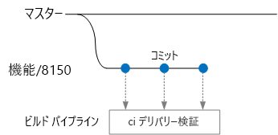
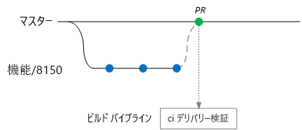
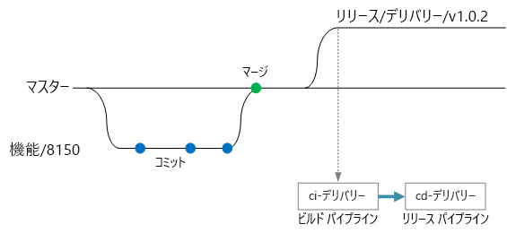

# <a name="microservices-architecture-on-azure-kubernetes-service-aks"></a>Azure Kubernetes Service (AKS) 上のマイクロサービス アーキテクチャ

この参照アーキテクチャは、Azure Kubernetes Service (AKS) にデプロイされたマイクロサービス アプリケーションを示します。 ここには、ほとんどのデプロイの出発点にすることができる基本的な AKS 構成が示されています。 より詳細なオプション (詳細なネットワーク オプションを含む) は、別の参照アーキテクチャで説明されます。

この記事では、Kubernetes の基本的な知識を前提にしています。 この記事は主に、AKS 上でマイクロサービス アーキテクチャを実行するためのインフラストラクチャと DevOps に関する考慮事項に重点を置いています。 ドメインベースの設計 (DDD) の観点からマイクロサービスを設計する方法に関するガイダンスについては、「[Azure でのマイクロサービスの設計、構築、および操作](/azure/architecture/microservices)」を参照してください。

> [!NOTE]
> 現在、この記事に付随するリファレンス実装 (RI) を作成しており、これを 2019 年の早い時期に発行する予定です。 この記事は、その RI の追加のベスト プラクティスが組み込まれるように更新されます。


## <a name="architecture"></a>アーキテクチャ

アーキテクチャは、次のコンポーネントで構成されます。

**Azure Kubernetes Service** (AKS)。 AKS は、マネージド Kubernetes クラスターをデプロイする Azure サービスです。 

**Kubernetes クラスター**。 AKS は Kubernetes クラスターをデプロイしたり、Kubernetes マスターを管理したりする役割を果たします。 ユーザーは、エージェント ノードを管理するだけです。

**Virtual network**。 既定では、AKS はエージェント ノードをデプロイするための仮想ネットワークを作成します。 より高度なシナリオでは、ユーザーが最初に仮想ネットワークを作成できます。それにより、サブネットの構成方法、オンプレミスの接続、IP アドレスの指定などを制御できます。 詳細については、[Azure Kubernetes Service (AKS) での高度なネットワークの構成](/azure/aks/configure-advanced-networking)に関するページを参照してください。

**イングレス**。 イングレスは、クラスター内のサービスに HTTP(S) ルートを公開します。 詳細については、後の「[API ゲートウェイ](#api-gateway)」のセクションを参照してください。

**外部データ ストア**。 マイクロサービスは通常ステートレスであり、Azure SQL Database や Cosmos DB などの外部データ ストアに状態を書き込みます。

**Azure Active Directory**。 AKS は、Azure ロード バランサーなどの他の Azure リソースを作成および管理するために Azure Active Directory (Azure AD) ID を使用します。 Azure AD はまた、クライアント アプリケーションでのユーザー認証にも推奨されます。

**Azure Container Registry**。 Container Registry は、クラスターにデプロイされたプライベート Docker イメージを格納するために使用します。 AKS は、その Azure AD ID を使用して Container Registry に対して認証できます。 AKS に Azure Container Registry は必要ないことに注意してください。 Docker Hub などの他のコンテナー レジストリを使用できます。

**Azure Pipelines**。 Pipelines は Azure DevOps Services の一部であり、自動化された構築、テスト、およびデプロイを実行します。 Jenkins などのサードパーティ CI/CD ソリューションも使用できます。 

**Helm**。 Helm は Kubernetes のパッケージ マネージャーであり、Kubernetes オブジェクトを発行、デプロイ、バージョン管理、および更新が可能な 1 つの単位にバンドルするための方法です。

**Azure Monitor**。 Azure Monitor は、メトリックやログ (ソリューションおよびアプリケーション テレメトリ内の Azure サービスのプラットフォーム メトリックを含む) を収集および格納します。 このデータは、アプリケーションを監視したり、アラートやダッシュボードを設定したり、障害の根本原因分析を実行したりするために使用します。 Azure Monitor は、コントローラー、ノード、およびコンテナーからのメトリックや、コンテナー ログおよびマスター ノード ログを収集するために AKS と統合します。

## <a name="design-considerations"></a>設計上の考慮事項

この参照アーキテクチャはマイクロサービス アーキテクチャに重点を置いていますが、推奨されるプラクティスの多くは AKS 上で実行される他のワークロードにも適用されます。

### <a name="microservices"></a>マイクロサービス

Kubernetes Service オブジェクトは、Kubernetes でマイクロサービスをモデル化するための自然な方法です。 マイクロサービスは、コードの疎結合で、かつ独立にデプロイ可能な単位です。 マイクロサービスは通常、適切に定義された API 経由で通信し、何らかの形式のサービス検出によって検出できます。 Kubernetes Service オブジェクトは、次の要件に一致する一連の機能を提供します。

- IP アドレス。 Service オブジェクトは、ポッドのグループ (ReplicaSet) に静的内部 IP アドレスを提供します。 ポッドが作成されたり移動されたりしても、常に、この内部 IP アドレスでサービスに到達できます。

- 負荷分散。 サービスの IP アドレスに送信されたトラフィックは、ポッドに対して負荷分散されます。 

- サービス検出。 サービスには、Kubernetes DNS サービスによって内部の DNS エントリが割り当てられます。 つまり、API ゲートウェイは、DNS 名を使用してバックエンド サービスを呼び出すことができます。 サービス間の通信にも同じメカニズムを使用できます。 DNS エントリは名前空間ごとに整理されるため、名前空間が境界付けられたコンテキストに対応している場合は、サービスの DNS 名がアプリケーション ドメインに自然にマッピングされます。

次の図は、サービスとポッドの関係の概念を示しています。 エンドポイントの IP アドレスおよびポートへの実際のマッピングは、Kubernetes のネットワーク プロキシである kube-proxy によって実行されます。


### <a name="api-gateway"></a>API ゲートウェイ

*API ゲートウェイ*は、外部クライアントとマイクロサービスの間に位置するゲートウェイです。 これは、要求をクライアントからマイクロサービスにルーティングするリバース プロキシとして機能します。 さらに、認証、SSL 終了、レート制限などのさまざまな横断的タスクを実行できます。 

ゲートウェイによって提供される機能は、次のようにグループ化できます。

- [ゲートウェイ ルーティング](../../patterns/gateway-routing.md): クライアント要求の適切なバックエンド サービスへのルーティング。 これはクライアントに単一のエンドポイントを提供し、サービスからクライアントを分離するのに役立ちます。

- [ゲートウェイ集約](../../patterns/gateway-aggregation.md): クライアントとバックエンドの間の頻繁な通信を削減するための、複数の要求の 1 つの要求への集約。

- [ゲートウェイ オフロード](../../patterns/gateway-offloading.md)。 ゲートウェイは、SSL 終了、認証、IP ホワイトリスト登録、クライアントのレート制限 (調整) など、バックエンド サービスから機能をオフロードできます。

API ゲートウェイは、一般的な[マイクロサービスの設計パターン](https://microservices.io/patterns/apigateway.html)です。 これらは、いくつかの異なるテクノロジを使用して実装できます。 おそらく、最も一般的な実装は、クラスター内に Nginx、HAProxy、Traefik などのエッジ ルーターまたはリバース プロキシをデプロイすることです。 

その他のオプションには、次のものが含まれます。

- どちらもクラスターの外部に存在するマネージド サービスである Azure Application Gateway または Azure API-Management、あるいはその両方。 Application Gateway イングレス コントローラーは現在、ベータ版です。

- Azure Functions プロキシ。 プロキシは要求や応答を変更したり、URL に基づいて要求をルーティングしたりできます。

Kubernetes **イングレス** リソースの種類は、プロキシ サーバーの構成設定を抽象化します。 これはイングレス コントローラーと組み合わせて機能し、これにより、イングレスの基礎となる実装が提供されます。 特に、Nginx、HAProxy、Traefik、および Application Gateway (プレビュー) 用のイングレス コントローラーが存在します。

イングレス コントローラーは、プロキシ サーバーの構成を処理します。 多くの場合は、エキスパートでなければ調整が難しい複雑な構成ファイルが必要になるため、イングレス コントローラーは優れた抽象化です。 さらに、イングレス コントローラーは Kubernetes API にアクセスできるため、ルーティングや負荷分散に関するインテリジェントな決定を行うことができます。 たとえば、Nginx イングレス コントローラーは kube-proxy ネットワーク プロキシをバイパスします。

これに対して、設定に対する完全な制御が必要な場合は、この抽象化をバイパスしてプロキシ サーバーを手動で構成することもできます。 

リバース プロキシ サーバーは潜在的なボトルネックまたは単一障害点であるため、高可用性のためには、常に少なくとも 2 つのレプリカをデプロイします。

### <a name="data-storage"></a>データ ストレージ

マイクロサービス アーキテクチャでは、サービスはデータ ストレージを共有すべきではありません。 各サービスは、サービス間の隠れた依存関係を回避するために、独自のプライベート データを個別の論理ストレージ内に所有する必要があります。 これは、サービスが基礎となる同じデータ スキーマを共有している場合に発生することのある、サービス間の意図しない結合を回避するためです。 サービスはまた、独自のデータ ストアを管理する場合、特定の要件に適したデータ ストアを使用することもできます。 詳細については、「[マイクロサービスの設計: データに関する考慮事項](/azure/architecture/microservices/data-considerations)」を参照してください。

データがノードに結合されるため、永続データをローカルのクラスター ストレージに格納することは避けてください。 代わりに、次のことを行います。 

- Azure SQL Database や Cosmos DB などの外部サービスを使用するか、*または*

- Azure ディスクまたは Azure Files を使用して永続ボリュームをマウントします。 複数のポッドで同じボリュームを共有する必要がある場合は、Azure Files を使用します。

### <a name="namespaces"></a>名前空間

クラスター内のサービスを整理するには、名前空間を使用します。 Kubernetes クラスター内のオブジェクトはすべて、名前空間に属します。 既定では、新しいオブジェクトを作成すると、そのオブジェクトは `default` 名前空間に移動します。 ただし、クラスター内のリソースを整理しやすくするために、わかりやすい名前空間を作成することをお勧めします。

まず、名前空間は名前付けの衝突を防止するのに役立ちます。 複数のチームが (数百ある可能性がある) マイクロサービスを同じクラスターにデプロイするとき、それらがすべて同じ名前空間に移動すると管理が困難になります。 さらに、名前空間では、次のことが可能になります。

- 名前空間に割り当てられたすべてのポッドが名前空間のリソースのクォータを超えることがないように、その名前空間にリソース制約を適用する。

- 名前空間レベルでポリシーを適用する (RBAC やセキュリティ ポリシーを含む)。

マイクロサービス アーキテクチャでは、マイクロサービスを境界付けられたコンテキストに整理し、境界付けられたコンテキストごとに名前空間を作成することを考慮してください。 たとえば、"受注処理" の境界付けられたコンテキストに関連したマイクロサービスはすべて、同じ名前空間に移動する可能性があります。 あるいは、開発チームごとに名前空間を作成します。

ユーティリティ サービスをその独自の個別の名前空間に配置します。 たとえば、クラスターの監視には Elasticsearch または Prometheus を、Helm には Tiller をデプロイできます。

## <a name="scalability-considerations"></a>スケーラビリティに関する考慮事項

Kubernetes は、次の 2 つのレベルでスケールアウトをサポートします。

- デプロイに割り当てられるポッドの数をスケール調整します。
- クラスターで使用できるコンピューティング リソースの合計を増やすために、クラスター内のノードをスケール調整します。

ポッドとノードは手動でスケールアウトできますが、高負荷のもとでサービスがリソース不足になる可能性を最小限に抑えるために、自動スケールを使用することをお勧めします。 自動スケール戦略では、ポッドとノードの両方を考慮に入れる必要があります。 ポッドだけをスケールアウトした場合、最終的にはノードのリソース制限に達します。 

### <a name="pod-autoscaling"></a>ポッドの自動スケール

ポッドの水平オートスケーラー (HPA) は、観察された CPU、メモリ、またはカスタム メトリックに基づいてポッドをスケール調整します。 ポッドの水平スケーリングを構成するには、ターゲットのメトリック (CPU の 70% など) とレプリカの最小および最大数を指定します。 サービスをロード テストして、これらの数値を導き出す必要があります。

自動スケールの副作用は、スケールアウトおよびスケールイン イベントが発生すると、ポッドがより頻繁に作成または削除される可能性があることです。 この影響を緩和するには、次のようにします。

- 準備プローブを使用して、新しいポッドがトラフィックを受け付ける準備ができたら Kubernetes に認識されるようにします。
- ポッド中断バジェットを使用して、サービスから一度に削除できるポッドの数を制限します。

### <a name="cluster-autoscaling"></a>クラスターの自動スケール

クラスター オートスケーラーは、ノードの数をスケール調整します。 リソース制約のためにポッドをスケジュールできない場合、クラスター オートスケーラーはさらに多くのノードをプロビジョニングします。  (注: AKS とクラスター オートスケーラーの間の統合は現在、プレビューの段階です。)

HPA が消費されている実際のリソースや実行中のポッドからのその他のメトリックを調べるのに対して、クラスター オートスケーラーは、まだスケジュールされていないポッドのためにノードをプロビジョニングします。 そのため、デプロイの Kubernetes ポッド仕様で指定されている要求されたリソースを調べます。 これらの値を微調整するには、ロード テストを使用します。

クラスターを作成した後に VM サイズを変更することはできないため、クラスターの作成時にエージェント ノードの適切な VM サイズを選択するには、何らかの初期の容量計画を実行する必要があります。 

## <a name="availability-considerations"></a>可用性に関する考慮事項

### <a name="health-probes"></a>正常性プローブ

Kubernetes では、ポッドが公開できる次の 2 種類の正常性プローブが定義されます。

- 準備プローブ: ポッドが要求を受け付ける準備ができたかどうかを Kubernetes に通知します。

- liveness probe: ポッドが削除され、新しいインスタンスが起動されるかどうかを Kubernetes に通知します。

プローブについて考慮する場合は、Kubernetes でのサービスのしくみを思い出すことが有効です。 サービスには、一連の (0 個以上の) ポッドに一致するラベル セレクターがあります。 Kubernetes は、そのセレクターに一致するポッドへのトラフィックを負荷分散します。 正常に起動され、正常な状態にあるポッドのみがトラフィックを受信します。 コンテナーがクラッシュした場合、Kubernetes はポッドを強制終了し、置き換えをスケジュールします。

ポッドが正常に起動されたにもかかわらず、そのポッドがトラフィックを受信する準備ができていない場合があります。 たとえば、コンテナーで実行されているアプリケーションがメモリにデータを読み込んだり、構成データを読み取ったりする初期化タスクが存在する可能性があります。 ポッドが正常であるが、トラフィックを受信する準備ができていないことを示すには、準備プローブを定義します。 

liveness probe は、ポッドが引き続き実行中だが、異常であるため、リサイクルする必要がある場合を処理します。 たとえば、コンテナーが HTTP 要求を処理しているが、何らかの理由でハングアップしたとします。 そのコンテナーはクラッシュしませんが、すべての要求の処理を停止しました。 HTTP liveness probe を定義した場合、このプローブは応答を停止し、ポッドを再起動するよう Kubernetes に通知します。

プローブを設計する場合の考慮事項のいくつかを次に示します。

- コードの起動時間が長い場合は、その起動が完了する前に liveness probe が障害を報告するおそれがあります。 これを防ぐには、プローブの起動を遅延させる initialDelaySeconds 設定を使用します。

- ポッドが再起動によって正常な状態に復元される可能性がない限り、liveness probe は役立ちません。 メモリ リークや予期しないデッドロックに対する緩和のために liveness probe を使用できますが、またすぐに障害が発生するポッドを再起動しても意味がありません。

- 依存サービスをチェックするために準備プローブが使用される場合があります。 たとえば、ポッドにデータベースへの依存関係がある場合は、liveness probe がデータベース接続をチェックすることがあります。 ただし、このアプローチにより、予期しない問題が発生する場合があります。 外部サービスが何らかの理由で一時的に使用できなくなることがあります。 それにより、サービス内のすべてのポッドで準備プローブが失敗し、それらがすべて負荷分散から削除されるため、連鎖的な障害の上流が生成されます。 より適切なアプローチとして、サービスが一時的な障害から正常に復旧できるように、サービス内に再試行処理を実装します。

### <a name="resource-constraints"></a>リソース制約

リソースの競合がサービスの可用性に影響を与える場合があります。 1 つのコンテナーがクラスター リソース (メモリと CPU) を占有できなくなるように、コンテナーのリソース制約を定義します。 スレッドやネットワーク接続などのコンテナー以外のリソースの場合は、[バルクヘッド パターン](/azure/architecture/patterns/bulkhead)を使用してリソースを分離することを考慮してください。

名前空間に許可されるリソースの合計を制限するには、リソースのクォータを使用します。 それにより、フロント エンドがバックエンド サービスをリソース不足にすることはなくなり、その逆も同様です。

## <a name="security-considerations"></a>セキュリティに関する考慮事項

### <a name="role-based-access-control-rbac"></a>ロールベースのアクセス制御 (RBAC)

Kubernetes と Azure のどちらにも、ロールベースのアクセス制御 (RBAC) のメカニズムがあります。

- Azure RBAC は、Azure でのリソースへのアクセス (新しい Azure リソースを作成する機能を含む) を制御します。 アクセス許可は、ユーザー、グループ、またはサービス プリンシパルに割り当てることができます。 (サービス プリンシパルは、アプリケーションによって使用されるセキュリティ ID です。)

- Kubernetes RBAC は、Kubernetes API へのアクセス許可を制御します。 たとえば、ポッドの作成やポッドの一覧表示は、RBAC によってユーザーに許可 (または拒否) できるアクションです。 ユーザーに Kubernetes アクセス許可を割り当てるには、*ロール*と*ロール バインディング*を作成します。

  - ロールは、名前空間内で適用される一連のアクセス許可です。 アクセス許可は、リソース (ポッドやデプロイなど) に対して動詞 (get、update、create、delete) として定義されます。

  - RoleBinding は、ロールにユーザーまたはグループを割り当てます。

  - また、ロールに似ているが、すべての名前空間にわたるクラスター全体に適用される ClusterRole オブジェクトも存在します。 ClusterRole にユーザーまたはグループを割り当てるには、ClusterRoleBinding を作成します。

AKS では、これらの 2 つの RBAC メカニズムが統合されます。 AKS クラスターを作成するとき、そのクラスターを、ユーザー認証に Azure AD を使用するように構成できます。 これを設定する方法の詳細については、「[Azure Active Directory と Azure Kubernetes Service を統合する](/azure/aks/aad-integration)」を参照してください。

これが構成された後、Kubernetes API に (たとえば、kubectl 経由で) アクセスしようとするユーザーは、自分の Azure AD 資格情報を使用してサインインする必要があります。

既定では、Azure AD ユーザーはクラスターにアクセスできません。 アクセス権を付与するには、クラスター管理者が、Azure AD ユーザーまたはグループを参照する RoleBindings を作成します。 ユーザーに特定の操作のアクセス許可がない場合、これは失敗します。

ユーザーに既定でアクセス権がない場合、そもそも、クラスター管理者はロール バインディングを作成するためのアクセス許可をどのように取得するのでしょうか。 AKS クラスターには、実際には、Kubernetes API サーバーを呼び出すための資格情報としてクラスター ユーザーとクラスター管理者の 2 種類があります。クラスター管理者の資格情報は、クラスターへのフル アクセスを付与します。 Azure CLI コマンド `az aks get-credentials --admin` はクラスター管理者の資格情報をダウンロードし、それを kubeconfig ファイルに保存します。 クラスター管理者は、この kubeconfig を使用してロールとロール バインディングを作成できます。

クラスター管理者の資格情報は非常に強力であるため、Azure RBAC を使用して、それへのアクセスを制限します。

- "Azure Kubernetes Service クラスター管理者ロール" には、クラスター管理者の資格情報をダウンロードするためのアクセス許可があります。 このロールにはクラスター管理者のみを割り当てる必要があります。

- "Azure Kubernetes Service クラスター ユーザー ロール" には、クラスター ユーザーの資格情報をダウンロードするためのアクセス許可があります。 このロールには管理者以外のユーザーを割り当てることができます。 このロールは、クラスター内の Kubernetes リソースに対する特定のどのアクセス許可も提供しません。ユーザーが API サーバーに接続できるようにするだけです。 

RBAC ポリシー (Kubernetes と Azure の両方) を定義する場合は、組織内のロールについて考慮してください。

- 誰が AKS クラスターを作成または削除したり、管理者の資格情報をダウンロードしたりできますか。
- 誰がクラスターを管理できますか。
- 誰が名前空間内のリソースを作成または更新できますか。

ClusterRoles と ClusterRoleBindings ではなく、Roles と RoleBindings を使用して、Kubernetes RBAC アクセス許可のスコープを名前空間ごとに設定することをお勧めします。

最後に、Azure リソース (ロード バランサー、ネットワーク、ストレージなど) を作成および管理するために AKS クラスターにはどのようなアクセス許可があるかという疑問があります。 Azure API で自身を認証するために、クラスターは Azure AD サービス プリンシパルを使用します。 クラスターを作成するときにサービス プリンシパルを指定しない場合は、サービス プリンシパルが自動的に作成されます。 ただし、最初にサービス プリンシパルを作成し、それに最小限の RBAC アクセス許可を割り当てることが良いセキュリティ対策です。 詳細については、[Azure Kubernetes Service でのサービス プリンシパル](/azure/aks/kubernetes-service-principal)に関するページを参照してください。

### <a name="secrets-management-and-application-credentials"></a>シークレットの管理とアプリケーションの資格情報

アプリケーションやサービスには、多くの場合、Azure Storage や SQL Database などの外部サービスに接続できるようにするための資格情報が必要です。 これらの資格情報を安全に保持し、漏洩させないことが課題になります。 

Azure リソースの場合は、マネージド ID を使用するオプションがあります。 マネージド ID の考え方は、アプリケーションまたはサービスが Azure AD に格納された ID を持ち、この ID を使用して Azure サービスに対して認証するというものです。 アプリケーションまたはサービスは、Azure AD で自身のために作成されたサービス プリンシパルを持ち、OAuth 2.0 トークンを使用して認証します。 実行中のプロセスが localhost アドレスを呼び出し、そのトークンを取得します。 そのため、どのパスワードまたは接続文字列も格納する必要がありません。 [aad-pod-identity](https://github.com/Azure/aad-pod-identity) プロジェクトを使用して、個々のポッドに ID を割り当てることによって、AKS でマネージド ID を使用できます。

現在、マネージド ID を使用した認証をすべての Azure サービスがサポートしているわけではありません。 その一覧については、[Azure AD 認証をサポートしている Azure サービス](/azure/active-directory/managed-identities-azure-resources/services-support-msi)に関するページを参照してください。

マネージド ID を使用した場合でも、マネージド ID をサポートしていない Azure サービス、サードパーティのサービス、API キーなどでは、何らかの資格情報やその他のアプリケーション シークレットの格納が必要になる可能性があります。 シークレットを安全に格納するためのオプションのいくつかを次に示します。

- Azure Key Vault。 AKS では、1 つ以上のシークレットを Key Vault からボリュームとしてマウントできます。 このボリュームは、Key Vault からシークレットを読み取ります。 ポッドはその後、これらのシークレットを通常のボリュームと同様に読み取ることができます。 詳細については、GitHub 上の [Kubernetes-KeyVault-FlexVolume](https://github.com/Azure/kubernetes-keyvault-flexvol) プロジェクトを参照してください。

    ポッドは、上で説明したポッド ID を使用して、または Azure AD サービス プリンシパルをクライアント シークレットと共に使用して自身を認証します。 その場合はクライアント シークレットが必要ないため、ポッド ID の使用が推奨されます。 

- HashiCorp Vault。 Kubernetes アプリケーションは、Azure AD マネージド ID を使用して HashiCorp Vault に対して認証できます。 [HashiCorp Vault と Azure Active Directory の統合](https://open.microsoft.com/2018/04/10/scaling-tips-hashicorp-vault-azure-active-directory/)に関するページを参照してください。 Vault 自体は Kubernetes にデプロイできますが、アプリケーション クラスターから個別の専用クラスターで実行することをお勧めします。 

- Kubernetes シークレット。 もう 1 つのオプションとして、単純に Kubernetes シークレットを使用します。 このオプションは構成するのが最も簡単ですが、課題もいくつかあります。 シークレットは、分散型キー値ストアである etcd に格納されます。 AKS は、[保存時の etcd を暗号化します](https://github.com/Azure/kubernetes-kms#azure-kubernetes-service-aks)。 暗号化キーは Microsoft が管理します。

HashiCorp Vault や Azure Key Vault などのシステムの使用には、次のようないくつかの利点があります。

- シークレットの集中制御。
- すべてのシークレットが保存時に暗号化されることの保証。
- キーの集中管理。
- シークレットのアクセス制御。
- 監査

### <a name="pod-and-container-security"></a>ポッドとコンテナーのセキュリティ

この一覧が網羅的でないことは確かですが、ポッドとコンテナーをセキュリティ保護するための推奨されるプラクティスのいくつかを次に示します。 

コンテナーを特権モードで実行しないでください。 特権モードは、ホスト上のすべてのデバイスにコンテナー アクセスを提供します。 特権モードでのコンテナーの実行を禁止するようにポッドのセキュリティ ポリシーを設定できます。 

可能な場合は、コンテナー内での root としてのプロセスの実行を回避してください。 コンテナーではセキュリティの観点からの完全な分離は提供されないため、コンテナー プロセスを非特権ユーザーとして実行する方が適切です。 

Azure Container Registry や Docker Trusted Registry などの、信頼できるプライベート レジストリにイメージを格納します。 Kubernetes のアドミッションの検証 webhook を使用して、ポッドが確実に、信頼できるレジストリからのみイメージをプルできるようにします。

Azure Marketplace から使用可能な Twistlock や Aqua などのスキャン ソリューションを使用して、既知の脆弱性がないかどうかイメージをスキャンします。

Azure Container Registry の機能である ACR タスクを使用して、イメージへのパッチ適用を自動化します。 コンテナー イメージは、レイヤーから構築されます。 基本レイヤーには、OS イメージとアプリケーション フレームワーク イメージ (ASP.NET Core や Node.js など) が含まれます。 基本イメージは通常、アプリケーション開発者から上流で作成され、他のプロジェクト保守管理者によって保守されます。 上流でこれらのイメージにパッチが適用されたら、既知のセキュリティの脆弱性が残らないように、独自のイメージを更新、テスト、および再デプロイすることが重要です。 ACR タスクは、このプロセスを自動化するのに役立ちます。

## <a name="deployment-cicd-considerations"></a>デプロイ (CI/CD) に関する考慮事項

マイクロサービス アーキテクチャのための堅牢な CI/CD プロセスの目標のいくつかを次に示します。

- 各チームは、他のチームに影響を与えたり妨害したりすることなく、独立に所有するサービスを構築およびデプロイできます。

- サービスの新しいバージョンは、運用環境にデプロイされる前に、検証のために開発/テスト/QA 環境にデプロイされます。 品質ゲートは、各段階で適用されます。

- サービスの新しいバージョンは、以前のバージョンと並行してデプロイできます。

- 十分なアクセス制御ポリシーが設定されています。

- 運用環境にデプロイされているコンテナー イメージを信頼できます。

### <a name="isolation-of-environments"></a>環境の分離

開発、スモーク テスト、統合テスト、ロード テスト、最後に運用のための環境を含め、サービスをデプロイするための複数の環境が存在します。 これらの環境には、あるレベルの分離が必要です。 Kubernetes では、物理的な分離と論理的な分離のどちらかを選択できます。 物理的な分離は、個別のクラスターにデプロイすることを示します。 論理的な分離では、先に説明したように、名前空間とポリシーを使用します。

開発/テスト環境のための個別のクラスターと共に、専用の運用クラスターを作成することをお勧めします。 開発/テスト クラスター内の環境を分離するには、論理的な分離を使用します。 開発/テスト クラスターにデプロイされたサービスには、ビジネス データを保持するデータ ストアへのアクセス権を与えるべきではありません。 

### <a name="helm"></a>Helm

Helm を使用してサービスの構築やデプロイを管理することを考慮してください。 CI/CD に役立つ Helm の機能には、次のものがあります。

- 特定のマイクロサービスのすべての Kubernetes オブジェクトを 1 つの Helm グラフに整理します。
- 一連の kubectl コマンドではなく、1 つの helm コマンドとしてグラフをデプロイします。
- 以前のバージョンにロールバックする機能と共にセマンティック バージョニングを使用して、更新プログラムやリビジョンを追跡します。
- 多数のファイルにわたる情報の複製 (ラベルやセレクターなど) を回避するためにテンプレートを使用します。
- グラフ間の依存関係を管理します。
- グラフを Helm リポジトリ (Azure Container Registry など) に発行し、それをビルド パイプラインと統合します。

Helm リポジトリとしての Container Registry の使用の詳細については、「[アプリケーションのグラフに Helm リポジトリとして Azure Container Registry を使用する](/azure/container-registry/container-registry-helm-repos)」を参照してください。

### <a name="cicd-workflow"></a>CI/CD ワークフロー

CI/CD ワークフローを作成する前に、コード ベースがどのように構造化され、管理されるかを理解しておく必要があります。

- チームは、別個のリポジトリで作業するのか、単一のリポジトリで作業するのか。
- 使用するブランチ戦略は何か。
- 運用環境にコードをプッシュできるのは誰か。 リリース マネージャー ロールは存在するのか。

単一リポジトリ アプローチのほうが支持されていますが、どちらにも長所と短所があります。

| &nbsp; | 単一のリポジトリ | 複数のリポジトリ |
|--------|----------|----------------|
| **長所** | コードの共有<br/>コードとツールの標準化が容易<br/>コードのリファクタリングが容易<br/>探しやすさ - コードの単一のビュー<br/> | 各チームの所有権が明確<br/>マージ競合の可能性が少ない<br/>マイクロサービスを強制的に分離するのに役立つ |
| **課題** | 共有コードの変更が複数のマイクロサービスに影響する可能性がある<br/>マージ競合の可能性が大きい<br/>大規模なコード ベースに合うようにツールを拡張する必要がある<br/>アクセス制御<br/>複雑なデプロイ プロセス | コードの共有が難しい<br/>コーディング規約の適用が難しい<br/>依存関係の管理<br/>コード ベースが拡散して探しにくい<br/>共有インフラストラクチャの欠如

このセクションでは、次の前提に基づく可能な CI/CD ワークフローを示します。

- コード リポジトリは単一リポジトリであり、フォルダーがマイクロサービス別に整理されています。
- チームのブランチ戦略は、[トランクベース開発](https://trunkbaseddevelopment.com/)に基づいています。
- チームは、[Azure Pipelines](/azure/devops/pipelines) を使用して CI/CD プロセスを実行します。
- チームは、Azure Container Registry の[名前空間](/azure/container-registry/container-registry-best-practices#repository-namespaces)を使用して、運用するために承認されたイメージとまだテスト中であるイメージを分離します。

この例では、開発者は Delivery Service と呼ばれるマイクロサービスを処理します  (この名前は、[こちら](../../microservices/index.md#the-drone-delivery-application)で説明されているリファレンス実装に由来します)。新機能の開発中に、開発者は、機能ブランチにコードをチェックインします。



このブランチにコミットをプッシュすると、マイクロサービス用の CI ビルドがトリガーされます。 慣例により、機能ブランチは `feature/*` と名付けられます。 [ビルド定義ファイル](/azure/devops/pipelines/yaml-schema)に、ブランチ名とソース パスでフィルター処理するトリガーが含まれます。 このアプローチを使用して、各チームは、専用のビルド パイプラインを持つことができます。

```yaml
trigger:
  batch: true
  branches:
    include:
    - master
    - feature/*

    exclude:
    - feature/experimental/*

  paths:
     include:
     - /src/shipping/delivery/
```

ワークフローのこの時点で、CI ビルドでは、いくつかの最小限のコードの検証が実行されます。

1. コードのビルド
1. 単体テストを実行する

ここでの考え方は、ビルド時間を短くして、開発者がすばやくフィードバックを取得できるようにすることです。 開発者は、機能をマスターにマージする準備ができたら、PR を開きます。 これにより、いくつかの追加のチェックを実行する別の CI ビルドがトリガーされます。

1. コードのビルド
1. 単体テストを実行する
1. ランタイム コンテナー イメージをビルドする
1. イメージの脆弱性スキャンを実行する



> [!NOTE]
> Azure Repos では、ブランチを保護するための[ポリシー](/azure/devops/repos/git/branch-policies)を定義できます。 たとえば、マスターにマージするには、CI ビルドの成功に加え、承認者のサインオフが必要であることをポリシーで要求できます。

ある時点で、チームは、この Delivery サービスの新しいバージョンをデプロイする準備が整います。 これを行うには、リリース マネージャーが `release/<microservice name>/<semver>` という名前付けパターンを使用して、マスターからブランチを作成します。 たとえば、「 `release/delivery/v1.0.2` 」のように入力します。
これにより、これまでのすべての手順に加え、以下を実行する完全な CI ビルドがトリガーされます。

1. Docker イメージを Azure Container Registry にプッシュします。 イメージには、ブランチ名から取得されたバージョン番号がタグ付けされます。
2. `helm package` を実行して、Helm チャートをパッケージ化します。
3. `az acr helm push` を実行することで、Helm パッケージを Container Registry にプッシュします。

このビルドが成功したと仮定すると、Azure Pipelines の[リリース パイプライン](/azure/devops/pipelines/release/what-is-release-management)を使用するデプロイ プロセスがトリガーされます。 このパイプラインでは、

1. `helm upgrade` を実行して、Helm チャートを QA 環境にデプロイします。
1. パッケージが運用環境に移動される前に、承認者がサインオフする。 「[Release deployment control using approvals (承認を使用したリリース デプロイ制御)](/azure/devops/pipelines/release/approvals/approvals)」をご覧ください。
1. Docker イメージを Azure Container Registry 内の運用名前空間用に再度タグ付けします。 たとえば、現在のタグが `myrepo.azurecr.io/delivery:v1.0.2` の場合、運用タグは `myrepo.azurecr.io/prod/delivery:v1.0.2` になります。
1. `helm upgrade` を実行して、Helm チャートを運用環境にデプロイします。



単一リポジトリであっても、チームが短時間でデプロイできるように、これらのタスクのスコープを個々のマイクロサービスに設定できることを覚えておくことが重要です。 このプロセスには、いくつか手動の手順があります。PR の承認、リリース ブランチの作成、および運用クラスターへのデプロイの承認です。 これらの手順は、ポリシーによって手動で行われます。組織が望むのであれば、完全に自動化することもできます。
