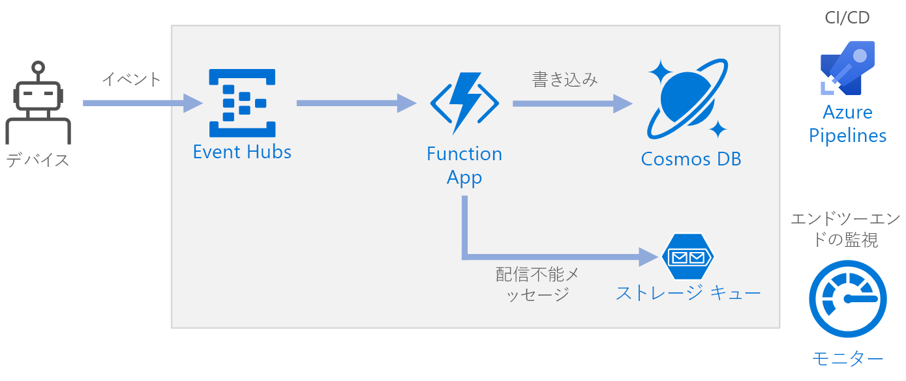

# <a name="serverless-event-processing-using-azure-functions"></a>Azure Functions を使用したサーバーレスなイベント処理

この参照アーキテクチャは、データ ストリームの取り込み、データ処理、およびバックエンド データベースへの結果の書き込みを行う[サーバーレス](https://azure.microsoft.com/solutions/serverless/)なイベント ドリブン アーキテクチャを示しています。 このアーキテクチャのリファレンス実装は、[GitHub][github] で入手できます。



## <a name="architecture"></a>アーキテクチャ

**Event Hubs** は、データ ストリームを取り込みます。 [Event Hubs][eh] は、高スループットのデータ ストリーミング シナリオ用に設計されています。

> [!NOTE]
> IoT シナリオの場合は、IoT Hub をお勧めします。 IoT Hub には、Azure Event Hubs API と互換性がある組み込みのエンドポイントが含まれているため、このアーキテクチャではどちらのサービスも使用できます。その際、バックエンド処理に大きな変更は必要ありません。 詳細については、「[IoT デバイスを Azure に接続する:IoT Hub と Event Hubs][iot]」を参照してください。

**Function App**。 [Azure Functions][functions] はサーバーレス コンピューティングの 1 つのオプションです。 ひとまとまりのコード ("関数") がトリガーによって呼び出されるイベント ドリブン モデルが使用されます。 このアーキテクチャでは、イベントが Event Hubs に到達したとき、そのイベントを処理し、結果をストレージに書き込む関数がトリガーされます。

Function App は、Event Hubs からの個々のレコードを処理するのに適しています。 ストリーム処理シナリオが複雑な場合は、Azure Databricks を使用した Apache Spark、または Azure Stream Analytics を検討してください。

**Cosmos DB**。 [Cosmos DB][cosmosdb] は、マルチモデル データベース サービスです。 このシナリオでは、Cosmos DB [SQL API][cosmosdb-sql] を使用して、イベント処理関数に JSON レコードが格納されます。

**Queue Storage**。 [Queue Storage][queue] は、配信不能メッセージに使用されます。 イベントの処理中にエラーが発生した場合、イベント データは後で処理できるように、関数によって配信不能キューに格納されます。 詳細については、「[回復性に関する考慮事項](#resiliency-considerations)」を参照してください。

**Azure Monitor**。 [Monitor][monitor] は、ソリューションにデプロイされた Azure サービスに関するパフォーマンス メトリックを収集します。 ダッシュボードでこれらを視覚化することで、ソリューションの正常性を把握できます。

**Azure Pipelines**。 [Pipelines][pipelines] は、アプリケーションをビルド、テスト、デプロイする継続的インテグレーション (CI) および継続的デリバリー (CD) サービスです。

## <a name="scalability-considerations"></a>スケーラビリティに関する考慮事項

### <a name="event-hubs"></a>Event Hubs

Event Hubs のスループット容量は、[スループット ユニット][eh-throughput]で測定されます。 [自動インフレ][eh-autoscale]を有効にすると、イベント ハブを自動スケーリングできます。自動インフレでは、トラフィックに基づいて、スループット ユニットが構成済みの最大値まで自動的にスケーリングされます。

関数アプリの [Event Hub トリガー][eh-trigger]は、イベント ハブ内のパーティション数に従ってスケーリングされます。 各パーティションには、関数インスタンスが 1 つずつ割り当てられます。 スループットを最大化するには、イベントは 1 つずつではなくバッチで受信します。

### <a name="cosmos-db"></a>Cosmos DB

Cosmos DB のスループット容量は、[要求ユニット][ru] (RU) で測定されます。 Cosmos DB コンテナーを 10,000 RU を超えてスケーリングするには、コンテナーの作成時に[パーティション キー][partition-key]を指定し、作成するすべてのドキュメントにパーティション キーを含める必要があります。

適切なパーティション キーの特徴をいくつか次に示します。

- キー値のスペースが大きい。
- キー値ごとに読み取り/書き込みが均等に分散され、ホット キーが発生しない。
- 任意の単一キー値の最大格納データが、物理パーティションの最大サイズ (10 GB) を超えない。
- ドキュメントのパーティション キーが変更されない。 既存のドキュメントでパーティション キーを更新することはできません。

この参照アーキテクチャのシナリオでは、関数に格納されるドキュメントは、データを送信するデバイスごとに 1 つだけです。 関数は、upsert 操作を使用して、最新のデバイスの状態でドキュメントを継続的に更新します。 このシナリオでは、書き込みがキーの間で均等に分散されるため、パーティション キーにはデバイス ID が適しています。また、キー値ごと 1 つのドキュメントが存在するため、各パーティションのサイズは厳密にバインドされています。 パーティション キーの詳細については、「[Azure Cosmos DB でのパーティション分割とスケーリング][cosmosdb-scale]」を参照してください。

## <a name="resiliency-considerations"></a>回復性に関する考慮事項

Functions と共に Event Hubs トリガーを使用する場合、お使いの処理ループ内で例外がキャッチされます。 ハンドルされない例外が発生すると、Functions ランタイムではメッセージの再試行は行われません。 処理できないメッセージは、配信不能キューに配置されます。 そのメッセージは、帯域外のプロセスを使用して調べられ、是正措置が決定されます。

次のコードは、どのようにインジェスト関数が例外をキャッチし、未処理のメッセージを配信不能キューに書き込むかを示しています。

```csharp
[FunctionName("RawTelemetryFunction")]
[StorageAccount("DeadLetterStorage")]
public static async Task RunAsync(
    [EventHubTrigger("%EventHubName%", Connection = "EventHubConnection", ConsumerGroup ="%EventHubConsumerGroup%")]EventData[] messages,
    [Queue("deadletterqueue")] IAsyncCollector<DeadLetterMessage> deadLetterMessages,
    ILogger logger)
{
    foreach (var message in messages)
    {
        DeviceState deviceState = null;

        try
        {
            deviceState = telemetryProcessor.Deserialize(message.Body.Array, logger);
        }
        catch (Exception ex)
        {
            logger.LogError(ex, "Error deserializing message", message.SystemProperties.PartitionKey, message.SystemProperties.SequenceNumber);
            await deadLetterMessages.AddAsync(new DeadLetterMessage { Issue = ex.Message, EventData = message });
        }

        try
        {
            await stateChangeProcessor.UpdateState(deviceState, logger);
        }
        catch (Exception ex)
        {
            logger.LogError(ex, "Error updating status document", deviceState);
            await deadLetterMessages.AddAsync(new DeadLetterMessage { Issue = ex.Message, EventData = message, DeviceState = deviceState });
        }
    }
}
```

関数が[キュー ストレージの出力バインド][queue-binding]を使用して、項目をキューに配置していることに注意してください。

また、上記のコードにより、例外が Application Insights にログ記録されます。 パーティション キーとシーケンス番号を使用すると、配信不能メッセージを、ログの例外に関連付けることができます。

配信不能キューのメッセージには、エラーのコンテキストを把握するのに十分な情報が記載されているはずです。 この例の `DeadLetterMessage` クラスには、例外メッセージ、元のイベント データ、および逆シリアル化されたイベント メッセージ (使用可能な場合) が含まれています。

```csharp
public class DeadLetterMessage
{
    public string Issue { get; set; }
    public EventData EventData { get; set; }
    public DeviceState DeviceState { get; set; }
}
```

[Azure Monitor][monitor] を使用して、イベント ハブを監視します。 入力があり、出力がない場合は、メッセージが処理されていないことを意味します。 その場合は、[Log Analytics][log-analytics] に移動し、例外またはその他のエラーを探します。

## <a name="disaster-recovery-considerations"></a>ディザスター リカバリーの考慮事項

ここに示したデプロイは単一の Azure リージョンに存在します。 ディザスター リカバリーでより回復性に優れたアプローチを実現するには、さまざまなサービスで地理的分散機能を利用します。

- **Event Hubs**。 プライマリ (アクティブ) 名前空間とセカンダリ (パッシブ) 名前空間の 2 つの Event Hubs 名前空間を作成します。 メッセージは、セカンダリ名前空間にフェールオーバーしない限り、アクティブな名前空間に自動的にルーティングされます。 詳細については、「[Azure Event Hubs geo ディザスター リカバリー][eh-dr]」を参照してください。

- **Function App**。 セカンダリ Event Hubs 名前空間からの読み取りを待っている 2 つ目の関数アプリをデプロイします。 この関数は、配信不能キュー用にセカンダリ ストレージ アカウントに書き込みます。

- **Cosmos DB**。 Cosmos DB では[複数のマスター リージョン][cosmosdb-geo]がサポートされています。これにより、Cosmos DB アカウントに追加した任意のリージョンに書き込むことができます。 マルチマスターを有効にしなくても、プライマリ書き込みリージョンにはフェールオーバーできます。 フェールオーバーは、Cosmos DB クライアント SDK と Azure Functions のバインディングによって自動的に処理されるため、アプリケーション構成設定を更新する必要はありません。

- **Azure Storage**。 配信不能キューに対して [RA-GRS][ra-grs] ストレージを使用します。 これにより、別のリージョンに読み取り専用レプリカが作成されます。 プライマリ リージョンが利用不可になると、現在キューにある項目を読み取ることができます。 さらに、セカンダリ リージョンに別のストレージ アカウントをプロビジョニングします。これには、フェールオーバー後に関数が書き込むことができます。

## <a name="deploy-the-solution"></a>ソリューションのデプロイ方法

この参照アーキテクチャをデプロイするには、[GitHub の Readme][readme] をご覧ください。

<!-- links -->

[cosmosdb]: /azure/cosmos-db/introduction
[cosmosdb-geo]: /azure/cosmos-db/distribute-data-globally
[cosmosdb-scale]: /azure/cosmos-db/partition-data
[cosmosdb-sql]: /azure/cosmos-db/sql-api-introduction
[eh]: /azure/event-hubs/
[eh-autoscale]: /azure/event-hubs/event-hubs-auto-inflate
[eh-dr]: /azure/event-hubs/event-hubs-geo-dr
[eh-throughput]: /azure/event-hubs/event-hubs-features#throughput-units
[eh-trigger]: /azure/azure-functions/functions-bindings-event-hubs
[functions]: /azure/azure-functions/functions-overview
[iot]: /azure/iot-hub/iot-hub-compare-event-hubs
[log-analytics]: /azure/log-analytics/log-analytics-queries
[monitor]: /azure/azure-monitor/overview
[partition-key]: /azure/cosmos-db/partition-data
[pipelines]: /azure/devops/pipelines/index
[queue]: /azure/storage/queues/storage-queues-introduction
[queue-binding]: /azure/azure-functions/functions-bindings-storage-queue#output
[ra-grs]: /azure/storage/common/storage-redundancy-grs
[ru]: /azure/cosmos-db/request-units

[github]: https://github.com/mspnp/serverless-reference-implementation
[readme]: https://github.com/mspnp/serverless-reference-implementation/blob/master/README.md
