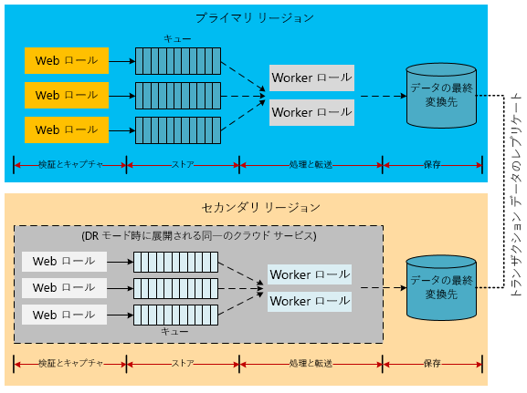
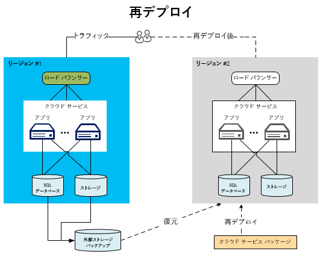

# Azure アプリケーションのディザスター リカバリー

ディザスター リカバリー (DR) は、アプリケーションの機能の致命的な損失からの復旧に重点を置きます。 たとえば、アプリケーションをホストしている Azure リージョンが使用できなくなった場合は、アプリケーションの実行またはデータへのアクセスを別のリージョンで行うための計画が必要です。 

ビジネスおよびテクノロジ関連の所有者は、障害発生時にどのくらいの機能が必要かを決定する必要があります。 この機能レベルには、完全に使用不可能、機能制限または処理の遅延により部分的に使用可能、完全に使用可能など、いくつかの形態があります。

回復性戦略および高可用性戦略は、一時的な障害状態を処理することを目的とします。  この計画の実行には、システムを継続的に機能させるユーザー、プロセス、およびサポート アプリケーションが必要です。 計画が完全かどうかを確認するために、計画には、障害のリハーサルおよびデータベースの復旧テストを含める必要があります。 

## Azure のディザスター リカバリー機能

可用性を考慮して、Azure にはディザスター リカバリーをサポートするために設計された[回復性技術ガイダンス](./index.md)が用意されています。 また、Azure の可用性機能とディザスター リカバリーには関連性があります。 たとえば、複数の障害ドメインを対象にロールを管理すると、アプリケーションの可用性が向上します。 そのような管理を行わないと、ハンドルされないハードウェア障害が "障害" シナリオになります。 可用性についてこれらの機能と戦略を活用することは、ご利用のアプリケーションの防災面において重要です。 ただし、この記事では、一般的な可用性の問題に留まらず、さらに重大な (かつまれな) 障害について考えます。

## 複数のデータセンター リージョン
Azure のデータセンターは、世界中のさまざまなリージョンにあります。 このインフラストラクチャにより、システムによって行われる Azure Storage のセカンダリ リージョンへの geo レプリケーションなど、複数のディザスター リカバリー シナリオがサポートされます。 また、世界中の複数の場所にクラウド サービスを簡単かつ安価にデプロイすることもできます。 複数のリージョンで独自にデータセンターを構築し維持する場合のコストおよび難しさと比べてみてください。 複数のリージョンにデータとサービスをデプロイすると、1 つのリージョンでの大規模な停止からアプリケーションを保護するのに役立ちます。 ディザスター リカバリー計画を策定するときには、ペアになっているリージョンの概念を理解することが重要です。 詳細については、「[ビジネス継続性とディザスター リカバリー (BCDR): Azure のペアになっているリージョン](/azure/best-practices-availability-paired-regions)」をご覧ください。

## Azure Site Recovery

[Azure Site Recovery](/azure/site-recovery/) により、リージョン間で Azure VM を簡単にレプリケートできます。 セカンダリ リージョンで追加リソースをプロビジョニングする必要はないため、管理オーバーヘッドは最小限で済みます。 レプリケーションを有効にすると、ソースの VM の設定に基づいて、ターゲット リージョンに必要なリソースが自動的に作成されます。 継続的なレプリケーションが自動的に行われ、1 回クリックするだけでアプリケーションのフェールオーバーを実行できます。 また、テスト フェールオーバーにより、ディザスター リカバリーのテストを、実稼働ワークロードや進行中のレプリケーションに影響を与えずに実行できます。 

## Azure の Traffic Manager
リージョンに固有の障害が発生した場合は、別のリージョンのサービスまたはデプロイにトラフィックをリダイレクトする必要があります。 これについては、Azure の Traffic Manager (プライマリ リージョンで障害が発生した場合にユーザー トラフィックを別のリージョンに自動的にフェールオーバーする) などのサービスを介して処理するのが最も効果的です。 効果的な DR 戦略を設計する場合には、Traffic Manager の基本を理解することが重要です。

Traffic Manager では、ドメイン ネーム システム (DNS) を使用して、トラフィック ルーティング方法とエンドポイントの正常性に基づいて最適なエンドポイントにクライアント要求を送信します。 次の図で、ユーザーは、実際のサイト URL (`http://app1URL.cloudapp.net` と `http://app2URL.cloudapp.net`) を抽象化した Traffic Manager URL (`http://myATMURL.trafficmanager.net`) に接続しています。 ユーザー要求は、構成した [Traffic Manager のルーティング方法](/azure/traffic-manager/traffic-manager-routing-methods)に基づいて、適切な基になる URL にルーティングされます。 この記事では、フェールオーバー オプションのみを考慮します。

Traffic Manager を構成する場合は、新しい Traffic Manager の DNS プレフィックスを指定します。ユーザーはこれを使用して所定のサービスにアクセスします。 これにより、Traffic Manager はリージョン レベルより 1 レベル上で負荷分散を抽象化します。 Traffic Manager の DNS は、管理するすべてのデプロイの CNAME レコードに対応します。

Traffic Manager 内では、障害発生時にユーザーがルーティングされるデプロイの優先度リストを指定します。 Traffic Manager はデプロイのエンドポイントを監視します。 プライマリ デプロイが利用不可になった場合、Traffic Manager は優先度リストに登録されている次のデプロイにユーザーをルーティングします。

フェールオーバー先は Traffic Manager が決定しますが、ユーザーはフェールオーバー モードではないときにフェールオーバー ドメインを休止状態にするかアクティブにするかを決定できます (これは Traffic Manager には関係ありません)。 プライマリ サイトが現在、ユーザーにサービスを提供しているかどうかに関係なく、Traffic Manager はプライマリ サイトでの障害を検出し、フェールオーバー サイトへのロールオーバーを実行します。

Azure Traffic Manager の機能の詳細については、次を参照してください。

* [Traffic Manager の概要](/azure/traffic-manager/traffic-manager-overview/)
* [Traffic Manager のルーティング方法](/azure/traffic-manager/traffic-manager-routing-methods)
* [フェールオーバーのルーティング方法の構成](/azure/traffic-manager/traffic-manager-configure-failover-routing-method/)

## Azure の障害シナリオ
以下のセクションでは、障害シナリオのさまざまな種類について説明します。 リージョン全体にわたるサービスの中断が、アプリケーション全体の障害の唯一の原因ではありません。 不適切な設計および管理エラーも停止の原因になる可能性があります。 復旧計画の設計フェーズとテスト フェーズの両方で、障害が発生する可能性のある原因を検討することが重要です。 適切な計画を作成するには、Azure の機能を利用したうえで、アプリケーション固有の戦略に合わせて補強します。 どのような対応を選択するかは、アプリケーションの重要性、目標復旧時点 (RPO)、目標復旧時間 (RTO) によって決まります。

### アプリケーションの障害
Azure Traffic Manager は、ホスト仮想マシンの基になるハードウェアまたはオペレーティング システム ソフトウェアに起因する障害を自動的に処理します。 Azure は新しいロール インスタンスを作成し、使用可能なプールに追加します。 複数のロール インスタンスが既に実行されている場合、Azure は、障害が発生したノードを交換している間、実行している他のロール インスタンスに処理を移動します。

ハードウェアまたはオペレーティング システムに基になる障害がなくても、重大なアプリケーション エラーが発生する場合があります。 不適切なロジックやデータ整合性の問題が原因の致命的な例外により、アプリケーションで障害が発生する可能性があります。 十分なテレメトリをアプリケーション コードに組み込み、監視システムが障害状態を検出して、アプリケーション管理者に通知できるようにする必要があります。 ディザスター リカバリー プロセスに関して豊富な知識を持つ管理者は、重大なエラーの解決中に、フェールオーバー プロセスを呼び出すか、可用性の停止を受け入れるかを決定することができます。

### データの破損
Azure は自動的に、Azure SQL Database と Azure Storage のデータを、同じリージョン内の異なる障害ドメインに 3 回冗長的に格納します。 geo レプリケーションを使用している場合は、さらに 3 回、異なるリージョンに格納します。 ただし、ユーザーまたはアプリケーションがプライマリ コピーでデータを破損した場合は、たちまち他のコピーにレプリケートされます。 残念ながら、結果として破損したデータのコピーが複数作成されます。

データが破損する可能性を管理するには、2 つのオプションがあります。 第 1 の方法は、カスタム バックアップの管理です。 ビジネス要件やガバナンス規定に応じて、Azure またはオンプレミスにバックアップを格納できます。 第 2 の方法は、SQL Database を復旧するためのポイントインタイム リストア オプションの使用です。 詳細については、後述する[ディザスター リカバリーのためのデータ戦略](#data-strategies-for-disaster-recovery)に関するセクションをご覧ください。

### ネットワークの停止
Azure ネットワークの一部にアクセスできないと、アプリケーションまたはデータを利用できなくなる可能性があります。 ネットワークの問題のために利用できないロール インスタンスがある場合、Azure はアプリケーションの残りの使用可能なインスタンスを利用します。 Azure ネットワークの停止のためにアプリケーションがデータにアクセスできない場合でも、キャッシュされているデータを使用すれば、アプリケーションの機能を制限した状態でローカルに実行できる可能性があります。 アプリケーションの機能を制限して実行するには、ディザスター リカバリー戦略を設計する必要があります。 ただし、アプリケーションによっては現実的ではないことがあります。

もう 1 つのオプションは、接続が回復するまで別の場所にデータを格納することです。 機能の制限を使用できない場合に残されているオプションは、アプリケーションのダウンタイムまたは代替リージョンへのフェールオーバーです。 機能を制限して実行するアプリケーションの設計は、技術的な決定であると同時にビジネス上の決定でもあります。 この詳細については、「[アプリケーションの機能制限](#reduced-application-functionality)」を参照してください。

### 依存サービスの障害
Azure では、定期的にダウンタイムが発生する可能性のある多くのサービスが提供されています。 たとえば、[Azure Redis Cache](https://azure.microsoft.com/services/cache/) は、アプリケーションにキャッシュ機能を提供するマルチテナント サービスです。 依存サービスが利用できない場合にアプリケーションがどのようになるかを考慮することが重要です。 多くの点で、このシナリオはネットワーク停止シナリオに似ています。 ただし、各サービスを個別に考慮することで、計画全体が向上する可能性があります。

Azure Redis Cache は、クラウド サービスのデプロイ内からアプリケーションにキャッシュを提供し、ディザスター リカバリーのメリットがあります。 何よりもまず、サービスはデプロイにローカルなロールで実行しています。 そのため、クラウド サービスの全体的な管理プロセスの一部として、キャッシュの状態を監視および管理できるようになります。 この種のキャッシュでは、キャッシュされたデータの高可用性などの新しい機能も利用できます。この機能では、重複したコピーを他のノードで維持することにより、単一のノードで障害が発生した場合に、キャッシュされたデータを保護します。

高可用性を使用すると、書き込み操作でセカンダリ コピーを更新することも必要であるため、スループットが低下し、待機時間が長くなることに注意してください。 キャッシュされたデータを格納するために必要なメモリ量は事実上 2 倍になるので、容量計画の策定時には、このことを考慮する必要があります。  この例では、各依存サービスが、全体的な可用性と致命的な障害に対する抵抗力を高める可能性があることを示します。

各依存サービスについて、サービス中断の影響を理解する必要があります。 キャッシュの例では、キャッシュが復元されるまで、データベースのデータに直接アクセスできる場合があります。 その場合は、アプリケーション データへのフル アクセスを提供する間、パフォーマンスが低下することになります。

### リージョン全体にわたるサービスの停止
これまでの障害は主として、同じ Azure リージョン内で管理できる障害でした。 ただし、リージョン全体のサービスが中断する可能性に対しても準備する必要があります。 リージョン全体のサービス中断が発生した場合、データのローカルな冗長コピーは使用できません。 geo レプリケーションを有効にしてある場合は、BLOB とテーブルのコピーがさらに 3 つ、別のリージョン内に存在します。 Microsoft によってリージョンの喪失が宣言された場合、Azure は geo レプリケートされたリージョンにすべての DNS エントリを再マッピングします。

> [!NOTE]
> ユーザーはこのプロセスを制御できないこと、およびリージョン全体のサービス中断の場合にのみ行われることに注意してください。 RPO や RTO を向上させるには、[Azure Site Recovery](/azure/site-recovery/) を使うことを検討してください。 Site Recovery を使うことにより、アプリケーションでは、許容できる障害と、レプリケートされた VM にフェールオーバーするタイミングを決定できます。

### Azure 全体にわたるサービスの中断
障害計画では、可能性のある障害の全範囲を考慮する必要があります。 最も重大なサービス中断の 1 つは、すべての Azure リージョンに同時に関係するものです。 他のサービス中断と同様に、そのような場合は一時的なダウンタイムのリスクを受け入れる決断もあり得ます。 複数のリージョンにまたがる広範囲のサービス中断が発生する可能性は、依存サービスや単一のリージョンが関係する部分的なサービス中断よりはるかに低いものです。

ただし、一部のミッション クリティカルなアプリケーションには複数リージョンのサービス中断に対応するバックアップ計画が必要であると判断できます。 このような計画には、[代替クラウド](#alternative-cloud)または、[オンプレミスとクラウドのハイブリッド ソリューション](#hybrid-on-premises-and-cloud-solution)のサービスへのフェールオーバーが含まれます。

### アプリケーションの機能制限
適切に設計されたアプリケーションは通常、疎結合された情報交換パターンの実装を介して相互に通信するサービスを使用します。 DR に適したアプリケーションには、サービス レベルでの役割の分離が必要です。 これにより、依存サービスの中断によってアプリケーション全体がダウンするのを防ぐことができます。 たとえば、会社 Y の Web コマース アプリケーションについて考えます。たとえば次のようなモジュールがアプリケーションを構成します。

* **製品カタログ** : ユーザーが製品を参照できるようにします。
* **ショッピング カート** : ユーザーはショッピング カートの製品を追加/削除できます。
* **注文状態** : ユーザーの注文の出荷状態を示します。
* **注文送信** : 支払いを含む注文を送信して、ショッピング セッションを終了します。
* **注文処理** : 注文のデータ整合性を確認し、在庫チェックを実行します。

このアプリケーションにおけるサービスの依存関係が利用不可になった場合、依存関係が回復するまで、サービスはどのように機能するのでしょうか?  適切に設計されたシステムでは、設計時および実行時の両方で役割の分離によって分離境界が実装されます。 すべての障害は、回復可能または回復不可能として分類できます。 回復不可能なエラーはサービスをダウンさせますが、回復可能なエラーは代替手段によって軽減できます。 自動的なエラー処理と代替アクションによって対処される一部の問題は、ユーザーに対して透過的です。 さらに重大なサービスの中断中は、アプリケーションが完全に利用できなくなることがあります。 3 番目のオプションは、機能を制限してユーザー要求の処理を続行するというものです。

たとえば、注文をホストするためのデータベースで障害が発生した場合、注文処理サービスは販売トランザクションを処理できなくなります。 アーキテクチャによっては、アプリケーションの注文送信と注文処理サービスの続行が困難または不可能になることがあります。 このようなシナリオに対応するようにアプリケーションが設計されていない場合、アプリケーション全体がオフラインになる可能性があります。 ただし、製品のデータが別の場所に格納されている場合は、製品カタログ モジュールを使用して製品を表示できます。 ただし、注文や在庫照会などのアプリケーションの他の部分は利用できません。

適用するアプリケーションの機能制限の内容については、ビジネス面と技術面の両方を考慮して決定します。 アプリケーションが一時的な問題をユーザーに通知する方法も決定する必要があります。 上記の例では、製品を表示し、ショッピング カートに製品を追加することができます。 ただし、ユーザーが購入しようとすると、アプリケーションはユーザーに注文機能が一時的に利用不可であることを通知します。 顧客にとって最善ではありませんが、アプリケーション全体のサービス中断は避けられます。

## 障害復旧のためのデータ戦略
適切なデータ処理は、ディザスター リカバリー計画における難しい課題です。 通常、回復プロセス中はデータの復元に最も時間がかかります。 機能を制限するうえでのさまざまな選択は、障害からのデータ復旧および障害後の整合性に対する困難な課題になります。

考慮事項の 1 つは、アプリケーションのデータのコピーの復元または保持の必要性です。 このデータは、セカンダリ サイトでの参照とトランザクションの目的に使用されます。 オンプレミスのデプロイでは、複数リージョンのディザスター リカバリー戦略を実装するためにコストと時間のかかる計画プロセスが必要です。 さいわい、Azure を含むほとんどのクラウド プロバイダーでは、複数のリージョンにアプリケーションを簡単にデプロイできます。 これらのリージョンは、複数リージョンのサービス中断が非常にまれになるように地理的に分散されています。 異なるリージョン間でデータを処理するための戦略は、ディザスター リカバリー計画を成功に導く要素の 1 つです。

以下のセクションでは、データのバックアップ、参照データ、およびトランザクション データに関連するディザスター リカバリー テクニックについて説明します。

### バックアップと復元
アプリケーション データの定期的なバックアップにより、一部のディザスター リカバリー シナリオに対応できます。 ストレージ リソースが異なると、必要な手法も異なります。

#### SQL Database
Basic、Standard、および Premium の SQL Database 階層の場合、データベースの復旧にポイントインタイム リストアを利用できます。 詳細については、「[概要: SQL Database を使用したクラウド ビジネス継続性とデータベース ディザスター リカバリー](/azure/sql-database/sql-database-business-continuity/)」を参照してください。 もう 1 つのオプションは、SQL Database にアクティブ geo レプリケーションを使うことです。 この機能は、データベースの変更を、同じ Azure リージョンまたは別の Azure リージョンのセカンダリ データベースに、自動的にレプリケートします。 これは、この記事で説明されている、より手動的なデータ同期技法の一部に対する代替手段になる可能性があります。 詳細については、「 [概要: Azure SQL Database のアクティブ geo レプリケーション](/azure/sql-database/sql-database-geo-replication-overview/)」を参照してください。

もっと手動的なバックアップおよび復元の方法を使用することもできます。 DATABASE COPY コマンドを使用して、トランザクションの一貫性を保つ、データベースのバックアップ コピーを作成できます。 Azure SQL Database のインポート/エクスポート サービスを使用することもできます。このサービスでは、Azure Blob Storage に格納されている BACPAC ファイル (ご利用のデータベース スキーマおよび関連するデータを含む圧縮されたファイル) へのデータベースのエクスポートをサポートします。

Azure Storage に組み込まれている冗長性により、バックアップ ファイルの 2 個のレプリカが同じリージョンに作成されます。 ただし、バックアップ プロセスを実行する頻度により、障害シナリオで失われる可能性があるデータ量を表す RPO が決まります。 たとえば、毎正時にバックアップを実行していて、正時の 2 分前に障害が発生したとしましょう。 最後のバックアップが実行されてからの 58 分間に記録されたデータは失われます。 また、リージョン全体のサービス中断を防ぐには、BACPAC ファイルを代替リージョンにコピーする必要があります。 その場合、代替リージョンのバックアップを復元することができます。 詳細については、「[概要: SQL Database を使用したクラウド ビジネス継続性とデータベース ディザスター リカバリー](/azure/sql-database/sql-database-business-continuity/)」をご覧ください。

#### Azure Storage (Azure Storage)
Azure Storage の場合、カスタム バックアップ プロセスを開発したり、多くのサード パーティ製バックアップ ツールのいずれかを使用したりすることができます。 ストレージ リソース間に相互参照があるほとんどのアプリケーション設計では、複雑さが増すことに注意してください。 たとえば、Azure Storage の BLOB にリンクしている列を含む SQL データベースがあるものとします。 バックアップが同時に実行されない場合、データベースには、障害発生前にバックアップされなかった BLOB へのポインターが含まれる可能性があります。 アプリケーションまたはディザスター リカバリー計画では、復旧後のこのような不整合を処理するプロセスを実装する必要があります。

#### 他のデータ プラットフォーム
Elasticsearch や MongoDB など、サービスとしてのインフラストラクチャ (IaaS) でホストされる他のプラットフォームでバックアップと復元の統合プロセスを作成する場合は、独自の機能および考慮事項が存在します。 これらのデータ プラットフォームに対して、一般的には、ネイティブの、または利用可能な統合ベースのレプリケーションまたはスナップショット機能を使用することをお勧めします。 それらの機能が存在しないか、または適切でない場合は、Azure Backup サービスまたはマネージ/アンマネージ ディスク スナップショットを使用して、アプリケーション データの特定時点のコピーを作成することを検討してください。 すべてのケースにおいて、一貫性のあるバックアップを実現する方法を決定することが重要です。特に、そのことは、アプリケーション データが複数のファイル システムにまたがる場合や、ボリューム マネージャーやソフトウェア ベースの RAID を使用して 1 つのファイル システムに複数のドライブを結合する場合に重要です。

### 障害復旧のための参照データ パターン
参照データはアプリケーションの機能をサポートする読み取り専用のデータです。 通常、頻繁に変更されることはありません。 バックアップと復元はリージョン全体にわたるサービス中断を処理する 1 つの方法ですが、RTO は比較的長くなります。 セカンダリ リージョンにアプリケーションをデプロイする場合、参照データの RTO を改善する方法がいくつかあります。

参照データは頻繁に変化しないので、参照データの永続的なコピーをセカンダリ リージョンに保持することで、RTO を改善できます。 これにより、障害発生時にバックアップを復元するために必要な時間がなくなります。 複数リージョンのディザスター リカバリーの要件を満たすには、アプリケーションと参照データを一緒に複数のリージョンにデプロイする必要があります。 「 [高可用性の参照データ パターン](high-availability-azure-applications.md#reference-data-pattern-for-high-availability)」で説明されているように、ロール自体、外部ストレージ、または両方の組み合わせに、参照データをデプロイできます。

コンピューティング ノード内の参照データ デプロイ モデルは、ディザスター リカバリーの要件を暗黙的に満たします。 SQL Database への参照データのデプロイでは、各リージョンに参照データのコピーをデプロイする必要があります。 Azure Storage にも同じ方法が当てはまります。 Azure Storage に格納されている参照データのコピーを、プライマリ リージョンとセカンダリ リージョンにデプロイする必要があります。

参照データを含むすべてのデータに対して、アプリケーション固有のバックアップ ルーチンを独自に実装する必要があります。 リージョン間で geo レプリケートされたコピーは、リージョン全体のサービス中断においてのみ使用されます。 長時間のダウンタイムを回避するには、アプリケーションのデータのミッション クリティカルな部分をセカンダリ リージョンにデプロイします。 このトポロジの例については、 [アクティブ/パッシブ モデル](#active-passive)に関するセクションを参照してください。

### 障害復旧のためのトランザクション データ パターン
完全に機能する障害モード戦略の実装では、セカンダリ リージョンにトランザクション データを非同期にレプリケートする必要があります。 レプリケーションを実行できる実際の時間枠により、アプリケーションの RPO 特性が決まります。 それでも、レプリケーションの時間枠の間にプライマリ リージョンから失われたデータを回復する可能性があります。 また、後でセカンダリ リージョンとマージできる場合があります。

次のアーキテクチャの例では、フェールオーバー シナリオでのトランザクション データのさまざまな処理方法についてのアイデアを示します。 すべての例を網羅しているわけではないことに注意してください。 たとえば、キューなどの中間ストレージの場所は、Azure SQL Database に置き換えられます。 キュー自体には、Azure Storage キューまたは Azure Service Bus キューを使用できます (「[Azure キューと Service Bus キューの比較](/azure/service-bus-messaging/service-bus-azure-and-service-bus-queues-compared-contrasted/)」をご覧ください)。 サーバー ストレージ先も変更できます (SQL Database の代わりに Azure テーブルなど)。 さらに、さまざまな手順の途中に worker ロールが挿入される場合があります。 目的とするのは、これらのアーキテクチャを正確に模倣することではなく、トランザクション データおよび関連モジュールの復旧でさまざまな代替方法を検討することです。

#### 障害復旧の準備でのトランザクション データのレプリケーション
Azure Storage キューを使用してトランザクション データを保持するアプリケーションを検討してください。 これにより、worker ロールは別のアーキテクチャでサーバー データベースへのトランザクション データを処理できます。 フロントエンド ロールでデータのクエリをすぐに実行する必要がある場合は、トランザクションで何らかの一時的キャッシュを使用する必要があります。 データ損失の許容レベルに応じて、キュー、データベース、またはすべてのストレージ リソースをレプリケートできます。 データベース レプリケーションのみでも、プライマリ リージョンがダウンした場合、プライマリ リージョンが復旧した後でキューのデータを回復できます。

次の図では、リージョン間でサーバー データベースが同期されるアーキテクチャを示します。

このアーキテクチャを実装するときの最大の課題は、リージョン間のレプリケーション戦略です。 [Azure SQL データ同期](/azure/sql-database/sql-database-get-started-sql-data-sync/)サービスを使用して、この種のレプリケーションを実行できます。 このドキュメントの作成時点では、このサービスはまだプレビュー段階であり、運用環境には推奨されません。 詳細については、「[概要: SQL Database を使用したクラウド ビジネス継続性とデータベース ディザスター リカバリー](/azure/sql-database/sql-database-business-continuity/)」を参照してください。 運用アプリケーションの場合は、サードパーティ製のソリューションを利用するか、独自のレプリケーション ロジックのコードを作成する必要があります。 アーキテクチャによっては、レプリケーションが双方向になる可能性があり、複雑さが増します。

可能性のある実装の 1 つは、前の例で中間キューを使用するものです。 最終的なストレージ先へのデータを処理する worker ロールは、プライマリ リージョンとセカンダリ リージョンの両方で変更を行うことができます。 これらは簡単なタスクではなく、レプリケーション コードの詳細なガイダンスはこの記事の範囲を超えています。 セカンダリ リージョンにデータをレプリケートするためのアプローチには、十分な時間をかけて十分なテストを実施してください。 さらに、可能性のあるデータの不整合や重複トランザクションがフェールオーバーおよび回復のプロセスで正しく処理されることを確認するために、追加の作業とテストを実行することもできます。

> [!NOTE]
> このドキュメントの大部分では、サービスとしてのプラットフォーム (PaaS) について説明します。 ただし、ハイブリッド アプリケーションのための追加のレプリケーション オプションおよび可用性オプションでは、Azure Virtual Machines を使用します。 これらのハイブリッド アプリケーションは、サービスとしてのインフラストラクチャ (IaaS) を使用して、Azure の仮想マシンで SQL Server をホストします。 これにより、AlwaysOn 可用性グループやログ配布などの SQL Server の従来の可用性アプローチを使用できます。 AlwaysOn などの一部のテクニックは、オンプレミスの SQL Server インスタンスと Azure Virtual Machines の間でのみ機能します。 詳細については、「[Azure 仮想マシンにおける SQL Server の高可用性とディザスター リカバリー](/azure/virtual-machines/windows/sql/virtual-machines-windows-sql-high-availability-dr/)」を参照してください。
> 
> 

#### トランザクション キャプチャに対するアプリケーション機能の制限
機能を制限して動作する第 2 のアーキテクチャを検討してください。 セカンダリ リージョンのアプリケーションは、レポート、ビジネス インテリジェンス (BI)、キューのドレインなどのすべての機能を無効にします。 ビジネス要件によって定義されている、最も重要な種類のトランザクション ワークフローのみを受け付けます。 システムはトランザクションをキャプチャし、キューに書き込みます。 システムは、サービス中断の初期段階でデータの処理を遅延できます。 プライマリ リージョンのシステムが予想される時間枠内に再アクティブ化した場合、プライマリ リージョンの worker ロールはキューをドレインできます。 このプロセスにより、データベースをマージする必要がなくなります。 プライマリ リージョンのサービス中断が許容時間枠を超えた場合、アプリケーションはキューの処理を開始できます。

このシナリオでは、セカンダリ リージョンのデータベースには、プライマリが再アクティブ化したらマージする必要がある増分トランザクション データが含まれます。 次の図では、プライマリ リージョンが復元されるまで一時的にトランザクション データを格納するためのこの方法を示します。

回復力のある Azure アプリケーションのデータ管理手法の詳細については、「 [Failsafe: Guidance for Resilient Cloud Architectures (フェールセーフ: 回復力のあるクラウド アーキテクチャに関するガイダンス)](https://channel9.msdn.com/Series/FailSafe)」を参照してください。

## 障害復旧のデプロイ トポロジ
リージョン全体のサービス中断に対処するにはミッション クリティカルなアプリケーションを準備する必要があります。 複数リージョン デプロイ戦略を運用計画に組み込みます。

複数リージョン デプロイには、障害発生後にセカンダリ リージョンにアプリケーションと参照データを発行する IT プロセスが含まれる場合があります。 すばやいフェールオーバーを必要とするアプリケーションの場合、デプロイ プロセスにアクティブ/パッシブ セットアップまたはアクティブ/アクティブ セットアップを含めることができます。 この種のデプロイには、代替リージョンで実行しているアプリケーションの既存のインスタンスがあります。 Azure Traffic Manager などのルーティング サービスは、DNS レベルで負荷分散サービスを提供します。 サービスの中断を検出し、必要に応じてユーザーを異なるリージョンにルーティングできます。

Azure のディザスター リカバリーを成功させるためには、そのような復旧を最初からソリューションに組み込みます。 クラウドには、従来のホスティング プロバイダーでは使用できない、障害から復旧するための追加オプションがあります。 具体的には、異なるリージョンにリソースを動的かつ迅速に割り当てることができます。そのため、障害の発生前には、未使用のリソースに対するコストは発生しません。

以下のセクションでは、障害復旧のためのさまざまなデプロイ トポロジについて説明します。 通常、可用性の向上には、コストや複雑さの増加というトレードオフがあります。

### 単一リージョンのデプロイ
単一リージョンのデプロイは、実際にはディザスター リカバリー トポロジではありませんが、他のアーキテクチャと比較するために示してあります。 単一リージョンのデプロイは Azure のアプリケーションでは一般的です。ただし、このデプロイはディザスター リカバリー トポロジの要件を満たしていません。

次の図は、単一の Azure リージョンで実行するアプリケーションを示しています。 Azure Traffic Manager と、障害ドメインおよびアップグレード ドメインの使用により、リージョン内のアプリケーションの可用性が向上します。

このシナリオでは、データベースは単一障害点となります。 Azure は異なる障害ドメインのデータを内部レプリカにレプリケートしますが、このレプリケーションは同じリージョン内でのみ実行されます。 アプリケーションは壊滅的な障害に対処することはできません。 リージョンが利用不可になると、障害ドメインも利用できなくなります。これには、すべてのサービス インスタンスやストレージ リソースが含まれます。

最も重要性の低いアプリケーションを除き、複数のリージョンにアプリケーションをデプロイする計画を検討する必要があります。 また、使用するデプロイ トポロジを検討するときは、RTO とコストの制約も考慮する必要があります。

それでは、異なるリージョン間のフェールオーバーをサポートする具体的なアプローチを見ていきましょう。 以下の例では、2 つのリージョンを使用してプロセスを説明します。

### Azure Site Recovery を使ってフェールオーバーする

Azure Site Recovery を使う Azure VM のレプリケーションを有効にすると、セカンダリ リージョンにいくつかのリソースが作成されます。

- リソース グループ。
- 仮想ネットワーク (VNet)。
- ストレージ アカウント。 
- フェールオーバー後に VM を保持するための可用性セット。

プライマリ リージョンの VM ディスクへのデータ書き込みは、セカンダリ リージョンのストレージ アカウントに継続的に転送されます。 復旧ポイントが数分ごとにターゲット ストレージ アカウントに生成されます。 フェールオーバーを開始すると、復旧された VM が、ターゲットのリソース グループ、VNet、可用性セットに作成されます。 フェールオーバーの間に、使用可能な任意の復旧ポイントを選ぶことができます。

### セカンダリ Azure リージョンへの再デプロイ
セカンダリ リージョンへの再デプロイ アプローチの場合、プライマリ リージョンでのみアプリケーションとデータベースが実行されます。 セカンダリ リージョンは、自動フェールオーバー用に設定されていません。 したがって、障害が発生したときは、ユーザーが新しいリージョンでサービスのすべての部分を起動する必要があります。 これには、Azure へのクラウド サービスのアップロード、クラウド サービスのデプロイ、データの復元、およびトラフィックを再ルーティングするための DNS の変更が含まれます。

これは最もコストのかからない複数リージョン オプションですが、RTO 特性は最も劣ります。 このモデルでは、サービス パッケージとデータベース バックアップは、オンプレミスに、またはセカンダリ リージョンの Azure Blob Storage インスタンスに格納されます。 ただし、操作を再開する前に、新しいサービスをデプロイし、データを復元する必要があります。 バックアップ ストレージからのデータ転送を完全に自動化した場合でも、新しいデータベース環境のプロビジョニングには多くの時間を要します。 復元プロセスで最も負荷の大きな部分は、バックアップ ディスク ストレージからセカンダリ リージョンの空のデータベースへのデータの移動です。 ただし、データがレプリケートされていないので、新しいデータベースを動作状態にするには、これを行う必要があります。

最善のアプローチは、セカンダリ リージョンの Blob Storage にサービス パッケージを格納しておくことです。 これにより、Azure にパッケージをアップロードする必要がなくなります。オンプレミスの開発用コンピューターからデプロイする場合は、これが行われます。 PowerShell スクリプトを使用することで、Blob Storage から新しいクラウド サービスにサービス パッケージをすばやくデプロイできます。

このオプションは、高い RTO を許容できる重要ではないアプリケーションの場合にのみ実用的です。 たとえば、数時間停止していてもかまわないが、24 時間以内には利用可能になる必要のあるようなアプリケーションには適しています。

### アクティブ/パッシブ
アクティブ/パッシブ トポロジは多くの企業で好まれる選択です。 このトポロジでは、再デプロイ アプローチより比較的少ないコスト増加で、RTO が向上します。 このシナリオにも、プライマリとセカンダリの Azure リージョンがあります。 すべてのトラフィックは、プライマリ リージョンのアクティブなデプロイに送られます。 データベースは両方のリージョンで動作しているため、セカンダリ リージョンはディザスター リカバリーの準備ができています。 さらに、両方のリージョンの間には同期メカニズムがあります。 このスタンバイ アプローチには、データベースのみのアプローチと、セカンダリ リージョンへの完全なデプロイの、2 つのバリエーションがあります。

#### データベースのみ
アクティブ/パッシブ トポロジの第 1 のバリエーションでは、プライマリ リージョンのみにクラウド サービス アプリケーションがデプロイされます。 ただし、再デプロイのアプローチとは異なり、データベースの内容は両方のリージョン間で同期されています  (詳細については、「[障害復旧のためのトランザクション データ パターン](#transactional-data-pattern-for-disaster-recovery)」をご覧ください)。障害が発生したときにアクティブ化する必要のあるものが少なくなります。 セカンダリ リージョンでアプリケーションを起動し、接続文字列を新しいデータベースに変更して、トラフィックを再ルーティングするように DNS エントリを変更します。

再デプロイ アプローチと同様に、デプロイの時間を短縮するには、セカンダリ リージョンの Azure Blob Storage にサービス パッケージを格納しておく必要があります。 ただし、データベースは準備が整っていて、実行されているので、データベースの復元操作に必要なオーバーヘッドの多くは発生しません。 これにより多くの時間が節約されるため、手頃なコストの DR パターンとなっています (最も頻繁に使用されています)。

#### 完全なレプリカ
アクティブ/パッシブ トポロジの第 2 のバリエーションでは、プライマリ リージョンとセカンダリ リージョンの両方に完全なデプロイがあります。 このデプロイには、クラウド サービスと同期化されたデータベースが含まれます。 ただし、プライマリ リージョンのみが、ユーザーからのネットワーク要求をアクティブに処理しています。 セカンダリ リージョンは、プライマリ リージョンでサービスの中断が発生した場合にのみアクティブになります。 その場合、新しいネットワーク要求はすべて、セカンダリ リージョンにルーティングされます。 Azure Traffic Manager は、このフェールオーバーを自動的に管理できます。

サービスが既にデプロイされているため、フェールオーバーはデータベースのみのバリエーションより高速に行われます。 このトポロジの RTO は非常に低くなります。 セカンダリ フェールオーバー リージョンは、プライマリ リージョンで障害が発生した直後に動作可能な状態になる必要があります。

このトポロジは、応答時間が速いだけでなく、バックアップ サービスを事前に割り当てておいてデプロイするため、障害発生時に新しいインスタンスを割り当てる領域が不足する可能性を回避することができます。 セカンダリ Azure リージョンが容量に近づいている場合、これは重要なことです。 サービス レベル アグリーメント (SLA) では、任意のリージョンに 1 つまたは複数の新しいクラウド サービスをすぐにデプロイできることを保証していません。

このモデルの応答時間を最短にするには、プライマリ リージョンとセカンダリ リージョンを似たスケール (ロール インスタンスの数) にする必要があります。 以上のような利点はありますが、使用していないコンピューティング インスタンスの料金を払う必要があり、コスト的に最も妥当な選択肢とは限りません。 このため、セカンダリ リージョンではややスケール ダウンしたバージョンのクラウド サービスを使用するのが一般的です。 その場合、必要に応じて迅速にセカンダリ デプロイをフェールオーバーおよびスケールアウトできます。 プライマリ リージョンにアクセスできなくなったら、負荷に応じて追加のインスタンスがアクティブ化されるよう、フェールオーバー プロセスを自動化する必要があります。 これには、 [仮想マシン スケール セット](/azure/virtual-machine-scale-sets/virtual-machine-scale-sets-overview/)のような自動スケール メカニズムの使用が含まれる場合があります。

次の図に示すモデルでは、プライマリ リージョンとセカンダリ リージョンに、アクティブ/パッシブ トポロジで完全にデプロイされたクラウド サービスが含まれます。

### アクティブ/アクティブ
アクティブ/アクティブ トポロジでは、両方のリージョンにクラウド サービスとデータベースが完全にデプロイされます。 アクティブ/パッシブ モデルとは異なりは、両方のリージョンがユーザー トラフィックを受け取ります。 このオプションでは、最も短い復旧時間を実現できます。 サービスは既に、各リージョンでの負荷の一部を処理できるスケールが設定されています。 DNS は既にセカンダリ リージョンを使用できる状態になっています。 ユーザーを適切なリージョンにルーティングする方法の決定については複雑さが増します。 ラウンドロビン スケジューリングを使用できる場合があります。 さらに可能性が高いのは、特定のユーザーが、データのプライマリ コピーが存在する特定のリージョンを使用する方法です。

フェールオーバーの場合は、プライマリ リージョンへの DNS を無効にするだけで、 すべてのトラフィックがセカンダリ リージョンにルーティングされます。

このモデルにもいくつかのバリエーションがあります。 たとえば、次の図に示すプライマリ リージョンは、データベースのマスター コピーを所有しています。 両方のリージョンのクラウド サービスが、そのプライマリ データベースに書き込みます。 セカンダリ デプロイは、プライマリ データベースまたはレプリケートされたデータベースから読み取ることができます。 この例のレプリケーションは 1 方向となります。

前の図のアクティブ/アクティブ アーキテクチャには欠点があります。 第 1 のリージョンにマスター コピーがあるため、第 2 のリージョンは第 1 のリージョンのデータベースにアクセスする必要があります。 リージョン外からデータにアクセスすると、パフォーマンスが大幅に低下します。 クロスリージョンのデータベース呼び出しでは、呼び出しのパフォーマンスが向上するように、何らかのバッチ処理方式を検討する必要があります。 詳細については、「 [バッチ処理を使用して SQL Database アプリケーションのパフォーマンスを強化する方法](/azure/sql-database/sql-database-use-batching-to-improve-performance/)」を参照してください。

代わりのアーキテクチャとしては、各リージョンが専用のデータベースに直接アクセスする方法があります。 このモデルでは、各リージョンのデータベースを同期するため、何らかの種類の双方向レプリケーションが必要です。

前述のトポロジでは、RTO を短縮すると、一般的にコストと複雑さが増します。 アクティブ/アクティブ トポロジは、このコスト パターンから逸脱します。 アクティブ/アクティブ トポロジでは、プライマリ リージョンのインスタンス数がアクティブ/パッシブ トポロジほど多くなくて済む場合があります。 アクティブ/パッシブ アーキテクチャのプライマリ リージョンに 10 個のインスタンスがある場合、アクティブ/アクティブ アーキテクチャの各リージョンでは 5 個しか必要ないかもしれません。 このモデルでは、両方のリージョンが負荷を共有します。 パッシブ リージョンでフェールオーバーを待機する 10 個のインスタンスを使用してウォーム スタンバイを維持する場合、アクティブ/パッシブ トポロジよりコストが節約されることがあります。

プライマリ リージョンを復元するまで、セカンダリ リージョンで新しいユーザーが急激に増加する可能性があることに注意してください。 プライマリ リージョンでサービスが中断したときに各サーバーに 10,000 人のユーザーがいた場合、セカンダリ リージョンは突然 20,000 人のユーザーを処理しなければならなくなります。 セカンダリ リージョンの監視ルールは、セカンダリ リージョンでのインスタンスの倍増を検出する必要があります。 これに関する詳細については、「 [障害の検出](#failure-detection)」を参照してください。

## オンプレミスとクラウドのハイブリッド ソリューション
ディザスター リカバリーのもう 1 つの戦略は、オンプレミスとクラウドで実行するハイブリッド アプリケーションを設計することです。 アプリケーションによっては、プライマリ リージョンがどちらの場所にあってもかまいません。 前のアーキテクチャで、プライマリ リージョンまたはセカンダリ リージョンがオンプレミスにある場合を考えてみてください。

このようなハイブリッド アーキテクチャには、いくつかの課題があります。 まず、この記事のほとんどでは、PaaS アーキテクチャ パターンについて説明しています。 Azure の一般的な PaaS アプリケーションは、ロール、クラウド サービス、Traffic Manager などの Azure 固有の構造に依存します。 この種の PaaS アプリケーション用のオンプレミス ソリューションを作成する場合は、大幅に異なるアーキテクチャが必要です。 これは、管理やコストの点で実現できない場合があります。

一方、ディザスター リカバリー用のハイブリッド ソリューションでは、クラウドに移行された従来のアーキテクチャ (IaaS ベースのアーキテクチャなど) に対する課題はほとんどありません。 IaaS アプリケーションは、オンプレミスに同等の機能を直接持つことができるクラウド内の仮想マシンを使用します。 仮想ネットワークの使用により、クラウドのマシンをオンプレミスのネットワーク リソースと接続することもできます。 これにより、PaaS のみのアプリケーションでは実現できない複数の可能性が生まれます。 たとえば、SQL Server は、AlwaysOn 可用性グループやデータベース ミラーリングなどのディザスター リカバリー ソリューションを利用できます。 詳細については、「[Azure 仮想マシンにおける SQL Server の高可用性とディザスター リカバリー](/azure/virtual-machines/windows/sql/virtual-machines-windows-sql-high-availability-dr/)」を参照してください。

また、IaaS ソリューションは、フェールオーバー オプションとして Azure を使用する簡単なパスをオンプレミスのアプリケーションに提供します。 既存のオンプレミス リージョンに完全に機能するアプリケーションがあるかもしれません。 しかし、フェールオーバーのために地理的に別のリージョンを維持するためのリソースがなかったらどうでしょう。 仮想マシンと仮想ネットワークを使用して、Azure でアプリケーションを実行できます。 その場合は、クラウドにデータを同期するプロセスを定義します。 Azure のデプロイはフェールオーバーに使用するセカンダリ リージョンになります。 プライマリ リージョンはオンプレミスのアプリケーションのままです。 IaaS のアーキテクチャと機能の詳細については、 [Virtual Machines のドキュメント](https://azure.microsoft.com/documentation/services/virtual-machines/)を参照してください。

## 代替クラウド
Microsoft Azure の広範な機能でも、組織によって求められる内部的なコンプライアンス規則またはポリシーを満たしていない場合があります。 十分に準備し、障害時のバックアップ システムを実装するように設計しても、クラウド サービス プロバイダーのグローバル サービスに中断があった場合は不十分です。

可用性の要件と、可用性を高めることによるコストと複雑さの上昇を比較する必要があります。 リスク分析を実行し、ソリューションの RTO と RPO を定義します。 アプリケーションがダウンタイムを許容できない場合は、追加のクラウド ソリューションの使用を検討してみてください。 インターネット全体がダウンしない限り、Azure がグローバルにアクセスできなくなっても、別のクラウド ソリューションはまだ使用できる可能性があります。

ハイブリッド シナリオと同様に、前のディザスター リカバリー アーキテクチャのフェールオーバー デプロイは、別のクラウド ソリューションにも存在できます。 代替クラウドの DR サイトは、(あったとしても) 非常に小さいダウンタイムを許す RTO のソリューションに対してのみ使用する必要があります。 Azure の外部の DR サイトを使用するソリューションでは、構成、開発、デプロイ、保守の作業が増えることに注意してください。 クロスクラウド アーキテクチャに実証済みのプラクティスを実装することもさらに困難になります。 クラウド プラットフォームの上位レベルの概念は似ていますが、API とアーキテクチャは異なります。

DR 戦略が複数のクラウド プラットフォームに依存している場合は、ソリューションの設計に抽象化レイヤーを含めることが大事です。 これにより、障害に備えて、異なるクラウド プラットフォーム用に同じアプリケーションの 2 つの異なるバージョンを開発して管理する必要はなくなります。 ハイブリッド シナリオと同様に、これらのケースでは、Azure Virtual Machines か Azure コンテナー サービスを使用する方が、クラウド固有の PaaS 設計を使用するより簡単な場合があります。

## Automation
ここで説明したパターンの一部では、オフライン デプロイの迅速なアクティブ化と、システムの特定の部分の復元が必要になります。 Automation スクリプトを使用すると、必要に応じてリソースをアクティブ化し、ソリューションをすばやくデプロイできます。 以下に示す DR 関連の自動化の例では、[Azure PowerShell](https://msdn.microsoft.com/library/azure/jj156055.aspx) を使用していますが、[Azure CLI](https://docs.microsoft.com/cli/azure/get-started-with-azure-cli) または [Service Management REST API](https://msdn.microsoft.com/library/azure/ee460799.aspx) を使用する方法もお勧めします。

自動化スクリプトでは、Azure によって透過的に処理されない DR の側面を管理します。 これにより、一貫性のある反復可能な結果がもたらされ、人為的なミスを最小限に抑えることができます。 事前定義された DR スクリプトを使用すると、障害発生時にシステムとその構成要素を再構築するのに要する時間も短縮されます。 ダウンして 1 分ごとにお金が失われているのにサイトの復元方法を手動で見つけるようなことはしたくありません。

開始から終了までスクリプトを繰り返しテストします。 基本的な機能を確認した後は、[障害のシミュレーション](#disaster-simulation)でそれらを必ずテストします。 これにより、スクリプトやプロセスの不備が検出されます。

Automation に関するベスト プラクティスとしては、Azure 障害復旧のための PowerShell スクリプトまたはコマンド ライン インターフェイス (CLI) スクリプトのリポジトリを作成します。 すばやくアクセスできるように明確にマークして分類します。 スクリプトのリポジトリとバージョンを管理するプライマリ ユーザーを指定します。 パラメーターの説明とスクリプトの使用例をドキュメントにします。 また、このドキュメントと Azure のデプロイの同期を保ちます。 これが、リポジトリのすべての部分を担当するプライマリ ユーザーを配置する目的です。

## 障害の検出
可用性と障害復旧に関する問題を正しく処理するには、障害を検出して診断できる必要があります。 システムまたはそのコンポーネントが突然利用不可になったタイミングを迅速に認識するために、サーバーとデプロイの詳細な監視を実行します。 クラウド サービスとその依存関係の全体的な正常性を評価する監視ツールで、この作業の一部を実行できます。 適切な Microsoft のツールの 1 つは [System Center 2016](https://www.microsoft.com/cloud-platform/system-center) です。 サード パーティ製ツールも監視機能を提供できます。 ほとんどの監視ソリューションは、主要なパフォーマンス カウンターとサービスの可用性を追跡します。

これらのツールは不可欠ですが、クラウド サービスでの障害検出およびレポートについて計画を立てることも必要です。 また、Azure 診断の適切な使用を計画する必要があります。 カスタム パフォーマンス カウンターまたはイベント ログ エントリも、全体的な戦略に組み込むことができます。 これらは障害の間により多くのデータを提供し、問題をすばやく診断して完全な機能を復元するのに役立ちます。 また、監視ツールがアプリケーションの正常性の判断に使用できる追加メトリックも提供します。 詳細については、「 [Azure Cloud Services での Azure 診断の有効化](/azure/cloud-services/cloud-services-dotnet-diagnostics/)」を参照してください。 総合的な "正常性モデル" を計画する方法の詳細については、「 [Failsafe: Guidance for Resilient Cloud Architectures (フェールセーフ: 回復力のあるクラウド アーキテクチャに関するガイダンス)](https://channel9.msdn.com/Series/FailSafe)」を参照してください。

## 障害のシミュレーション
シミュレーション テストでは、作業現場で小規模な現実的状況を作成し、チーム メンバーがどのように反応するかを観察します。 また、シミュレーションでは、復旧計画で示されているソリューションの有効性もわかります。 作成されたシナリオが実際のビジネスを中断することなく、それでいて実際の状況に近いものになるように、シミュレーションを実行します。

手動で可用性の問題をシミュレートできるように、アプリケーションに一種の "スイッチボード" を組み込むことを検討します。 たとえば、ソフト スイッチを使用し、誤動作を発生させることにより、注文モジュールのデータベース アクセス例外をトリガーします。 ネットワーク インターフェイス レベルで他のモジュールに対しても同様の簡単な方法を実施できます。

シミュレーションでは、不適切に処理されたすべての問題が明確に示されます。 シミュレートされるシナリオは、完全に制御できる必要があります。 つまり、復旧計画が失敗したと思われる場合でも、重大な損害を発生させずに状況を正常な状態に戻せる必要があります。 また、シミュレーション訓練を実施するタイミングと方法を、上級管理者に通知することが重要です。 この計画では、シミュレーション中に影響を受ける時刻またはリソースを具体的に示す必要があります。 また、ディザスター リカバリーをテストするときの成功の尺度も定義します。

Azure Site Recovery を使っている場合、Azure へのテスト フェールオーバーを実行して、データの損失またはダウンタイムを発生させることなく、レプリケーション戦略の検証またはディザスター リカバリーの訓練を行うことができます。 テスト フェールオーバーは、実行中の VM レプリケーションや運用環境に影響を与えません。

他にもいくつかの手法で、ディザスター リカバリー計画をテストできます。 ただし、そのほとんどは、これらの基本的な手法を単に変形させたものです。 このテストの目的は、復旧計画の実現可能性を評価することにあります。 ディザスター リカバリー テストでは、細部に注目して、基本的な復旧計画に不足している部分を発見します。

## サービス固有のガイダンス

次のトピックでは、ディザスター リカバリーに特化した Azure サービスについて説明します。

| サービス | トピック |
|---------|-------|
| Azure Database for MySQL | [Azure Database for MySQL でのビジネス継続性の概要](/azure/mysql/concepts-business-continuity) |
| Azure Database for PostgreSQL | [Azure Database for PostgreSQL でのビジネス継続性の概要](/azure/postgresql/concepts-business-continuity)
| Cloud Services | [Azure Cloud Services に影響を与える Azure サービスの中断が発生した場合の対処方法](/azure/cloud-services/cloud-services-disaster-recovery-guidance) |
| Cosmos DB | [Azure Cosmos DB でのビジネス継続性のためのリージョン内自動フェールオーバー](/azure/cosmos-db/regional-failover)
| Key Vault | [Azure Key Vault の可用性と冗長性](/azure/key-vault/key-vault-disaster-recovery-guidance) |
|ストレージ | [Azure Storage の停止が発生した場合の対処方法](/azure/storage/storage-disaster-recovery-guidance) |
| SQL Database | [Azure SQL Database を復元する、またはセカンダリにフェールオーバーする](/azure/sql-database/sql-database-disaster-recovery) |
| 仮想マシン | [Azure サービスの中断が Azure 仮想マシンに影響を与える場合の対処方法](/azure/virtual-machines/virtual-machines-disaster-recovery-guidance) |
| 仮想ネットワーク | [Virtual Network – ビジネス継続性](/azure/virtual-network/virtual-network-disaster-recovery-guidance) |

