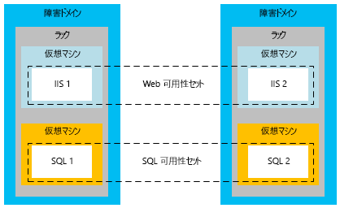
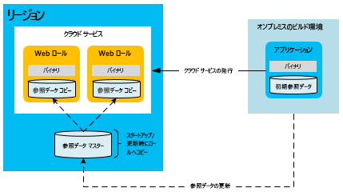

[!INCLUDE [header](../_includes/header.md)]

# Microsoft Azure 上に構築されたアプリケーションの高可用性
高可用性アプリケーションは、依存型のサービスとハードウェアの可用性の変動、負荷、一時的な障害を緩和します。 アプリケーションは、ビジネス要件またはアプリケーションのサービス レベル アグリーメント (SLA) に定義されている許容レベルで実行を続けます。

## Azure の高可用性機能
Azure には、可用性の高いアプリケーションをサポートするさまざまなプラットフォーム機能が組み込まれています。 このセクションでは、それらの主要機能の一部について説明します。

### ファブリック コントローラー
Azure ファブリック コントローラーは、Azure コンピューティング インスタンスをプロビジョニングし、その状態を監視します。 このファブリック コントローラーは、ホスト コンピューター インスタンスとゲスト コンピューター インスタンスのハードウェアとソフトウェアの状態を監視します。 エラーが検出された場合、VM インスタンスを自動的に再配置し、SLA を維持します。 障害ドメインとアップグレード ドメインのコンセプトがコンピューティング SLA をさらにサポートします。

複数のクラウド サービスのロール インスタンスがデプロイされている場合、Azure はこれらのインスタンスを異なる障害ドメインにデプロイします。 障害ドメインの境界は、基本的に、同じリージョンの異なるハードウェア ラックになります。 障害ドメインは、ローカライズされたハードウェアがアプリケーションのサービスを遮断する可能性を減らします。 worker または Web ロールの障害ドメインの数は管理できません。 ファブリック コントローラーは、Azure でホストされるアプリケーションから分離している専用リソースを使用します。 Azure システムの中核としてサービスを提供するため、100% のアップタイムが必要です。 障害ドメイン全体でロール インスタンスを監視し、管理します。

次の図は、異なる障害ドメインにまたがってファブリック コントローラーによりデプロイされ、管理される Azure 共有リソースを示したものです。

障害ドメインは障害を軽減するための物理的な分離ですが、アップグレード ドメインは、サービスのインスタンスを特定の時刻にアップグレードするかを決定する、インスタンス分離の論理ユニットです。 既定では、ホストされるサービスのデプロイの場合、5 つのアップグレード ドメインが定義されます。 ただし、サービス定義ファイルでその値を変更できます。 たとえば、Web ロールの 8 つのインスタンスがある場合は、3 つのアップグレード ドメインに 2 つのインスタンス、1 つのアップグレード ドメインに 2 つのインスタンスがあります。 Azure は、アップグレード ドメインの数に基づいて更新順序を定義します。 詳しくは、「[クラウド サービスの更新方法](/azure/cloud-services/cloud-services-update-azure-service/)」をご覧ください。

### その他のサービスの機能
プラットフォーム機能でコンピューティング リソースの高可用性をサポートするだけでなく、Azure は高可用性機能を他のサービスに組み込みます。 たとえば、Azure Storage は、すべてのデータの少なくとも 3 つのレプリカを Azure ストレージ アカウントに維持します。 また、geo レプリケーションでデータのコピーをセカンダリ リージョンに格納することもできます。 Azure Content Delivery Network は世界中の BLOB をキャッシュし、冗長性、拡張性、待ち時間の短縮を実現します。 Azure SQL Database はまた、複数のレプリカを維持します。

Azure プラットフォームの可用性機能について詳しくは、「[Resiliency technical guidance](index.md)」(回復性技術ガイダンス) をご覧ください。 「[Best practices for designing large-scale services on Windows Azure](https://azure.microsoft.com/blog/best-practices-for-designing-large-scale-services-on-windows-azure/)」(Microsoft Azure で大規模なサービスを設計するためのベスト プラクティス) もご覧ください。

Azure には高可用性をサポートする複数の機能が用意されていますが、その制約を理解することが重要です。

* コンピューティングに関しては、あなたのロールが利用できて実行されていることを Azure は保証しますが、あなたのアプリケーションが実行されているのか、過負荷になっているのかは検出できません。
* Azure SQL Database の場合、データはリージョン内で同期複製されます。 アクティブ geo レプリケーションを選択できます。アクティブ geo レプリケーションでは、同じリージョン (または異なるリージョン) にデータベース コピーを 4 つまで保持できます。 これらのデータベース レプリカはポイントインタイム バックアップではありませんが、SQL Database はポイントインタイム バックアップ機能を提供します。 詳しくは、「[データベースの自動バックアップを使用した Azure SQL Database の復旧](/azure/sql-database/sql-database-recovery-using-backups#point-in-time-restore)」の「ポイントインタイム リストア」をご覧ください。
* Azure Storage の場合、テーブル データと BLOB データは既定で代替リージョンにレプリケートされます。 ただし、代替サイトへのフェールオーバーを Microsoft が選択するまで、レプリカにアクセスできません。 リージョン フェールオーバーは、リージョン全体のサービス中断が長引いた場合にのみ発生します。geo フェールオーバーの時間には SLA はありません。 データの破損はすぐにレプリカに広まることにもご留意ください。 これらの理由から、プラットフォームの可用性機能をアプリケーション固有の可用性機能 (BLOB データのポイントインタイム バックアップを作成する BLOB スナップショット機能など) で補完する必要があります。

### Azure Virtual Machines の可用性セット
このドキュメントでは、サービスとしてのプラットフォーム (PaaS) モデルを使用する、クラウド サービスについて重点的に説明します。 サービスとしてのインフラストラクチャ (IaaS) モデルを使用する、Azure Virtual Machines 固有の可用性機能もあります。 Virtual Machines を使用して高可用性を実現するには、障害ドメインおよびアップグレード ドメインと同様の機能を提供する可用性セットを使用する必要があります。 可用性セット内では、ローカライズされたハードウェアの障害や保守管理行動に起因してグループ内の全コンピューターが停止する事態が回避されるように、Azure は仮想マシンを配置します。 Virtual Machines の可用性に関する Azure SLA を達成するためには、可用性セットが必要です。

次の図は、Web 仮想マシンと SQL Server 仮想マシンの 2 つの可用性セットを示しています。

> [!NOTE]
> 上の図では、SQL Server が仮想マシンにインストールされ、実行されています。 これは、管理サービスとしてデータベースを提供する、Azure SQL Database とは異なります。
> 
> 

## 高可用性のアプリケーション戦略
高可用性のアプリケーション戦略の大半は、アプリケーション コンポーネント間の冗長性または強固な依存性の解除に関するものです。 アプリケーションを設計するとき、Azure またはサードパーティ サービスの散発的ダウンタイム時の耐障害性を組み込む必要があります。 次のセクションでは、クラウド サービスの可用性を上げるアプリケーション パターンを紹介します。

### 非同期の通信と永続的なキュー
Azure アプリケーションの可用性を高めるために、疎結合のサービス間に非同期の通信を取り入れることを検討してください。 このパターンでは、ストレージ キューと Azure Service Bus キューのいずれかにメッセージが書き込まれ、後で処理されます。 キューにメッセージが書き込まれると、直後に送信者にコントロールが返されます。 アプリケーションの別のサービス (通常、worker ロールとして実行されます) がメッセージを処理します。 処理サービスが停止した場合、そのサービスが元の状態に戻るまで、メッセージはキューに累積されます。 フロントエンドの送信者とメッセージの処理者の間に直接的な依存関係はありません。 これにより、分散アプリケーションのボトルネックを引き起こす可能性のある同期サービス呼び出しが排除されます。

このパターンのバリエーションとしては、故障したデータベースの呼び出しに関する情報を Azure Storage (BLOB、テーブル、キュー) または Service Bus のキューに格納する方法があります。 たとえば、あるアプリケーション内で別のサービス (Azure SQL Database など) を同期的に呼び出す行為は繰り返し失敗します。 場合によっては、その要求をシリアル化し、永続的なストレージに保存できます。 後に、サービスまたはデータベースがオンラインに戻ったときに、アプリケーションはストレージから要求を再送信できます。 このモデルの違いは、仲介となる場所が、アプリケーション ワークフローの通常の部分としてではなく、フェールオーバー時にのみ使用されるということです。

いずれのシナリオでも、非同期通信と中間ストレージの利用により、バックエンド サービスが停止しても、アプリケーション全体が停止する事態が回避されます。 キューは論理的な仲介者として機能します。 キュー サービス間の選択について詳しくは、「[Azure キューと Service Bus キューの比較&mdash;](/azure/service-bus-messaging/service-bus-azure-and-service-bus-queues-compared-contrasted/)」をご覧ください。

### 障害検出と再試行ロジック
高可用性アプリケーションの設計で重要なことは、コード内で再試行ロジックを使用し、一時的に使用不可になっているサービスをグレースフルに (劣化を最小限に抑えるように) 処理することです。 Azure Storage と Azure Service Bus の最新バージョンの SDK は再試行をネイティブにサポートします。 アプリケーションのカスタムの再試行ロジックの提供について詳しくは、「[Retry pattern](../patterns/retry.md)」(再試行パターン) をご覧ください。

### 高可用性の参照データ パターン
参照データは、アプリケーションの読み取り専用データです。 このデータはビジネス コンテキストを与えます。そのビジネス コンテキストの中で、アプリケーションは業務の際にトランザクション データを生成します。 トランザクション データの整合性は、トランザクションの完了時の参照データのスナップショットに依存します。

アプリケーションの適切な操作には参照データが必要です。 さまざまなアプリケーションが参照データを作成し、維持します。通常、マスター データ管理 (MDM) システムがこの機能を実行します。 そのようなシステムは、参照データのライフサイクルを担当します。 参照データには、たとえば、製品カタログ、社員マスター、部品マスター、設備マスターがあります。 参照データは組織の外部から発生することもあります。郵便番号や税率などです。 参照データの可用性を高めるための戦略は、一般的に、トランザクション データの場合よりも簡単です。 参照データには、ほとんど変化しないという利点があります。

アプリケーションと共に参照データをデプロイすることで、Azure Web ロールと worker ロールは実行時に自立的に参照データを利用できます。 この手法は、ローカル ストレージが十分に大きく、このようなデプロイが可能な場合に理想的です。 Azure コンピューティングのスケール ユニットの自立性には、ローカルにデプロイされている組み込み SQL データベース、NoSQL データベース、または XML ファイルが役立ちます。 ただし、再デプロイしなくても各ロールのデータを更新するメカニズムを用意する必要があります。 具体的には、参照データが更新されたら、それをクラウド ストレージ エンドポイント (Azure BLOB ストレージや SQL Database など) に送信します。 ロールの起動時にコンピューティング ノードにデータ更新をダウンロードするコードを各ロールに追加します。 あるいは、ロール インスタンスへの強制ダウンロードを管理者に許可するコードを追加します。

ストレージが停止したときに可用性を上げるために、一連の参照データをロールに追加する必要もあります。 更新のストレージ リソースが利用できるようになるまで、一連の基本参照データでロールを起動できます。

このパターンでは、大量の参照データをデプロイまたはダウンロードする場合に、新しいデプロイまたはロール インスタンスの起動に時間がかかることがあります。 時間が増えたとしても、外部のストレージ サービスに頼ることなく、各ロールで参照データをすぐに利用できるという自立性が与えられるなら許容範囲内となることもあります。

### 高可用性のトランザクション データ パターン
トランザクション データは、ビジネス コンテキストにおいてアプリケーションによって生成されるデータです。 トランザクション データは、アプリケーションに実装する一連のビジネス プロセスとそのようなプロセスをサポートする参照データを組み合わせたものです。 トランザクション データには、たとえば、注文、事前出荷明細、請求書、顧客関係管理 (CRM) 案件などがあります。 トランザクション データは記録を保存する外部システムに送信され、さらに処理されます。

参照データはそのデータを担当するシステム内で変動する場合があります。 そのような理由から、外部依存性を最小限に抑え、その意味論的な一貫性を維持するために、参照データの特定の時点のコンテキストをトランザクション データで保存する必要があります。 たとえば、注文の完了から数か月後に製品をカタログから削除するとします。 トランザクションを使用してできるだけ多くの参照データ コンテキストを格納することをお勧めします。 この手法では、トランザクションの記録後に参照データが変更された場合でも、トランザクションに関連付けられている意味が失われません。

前述のように、疎結合と非同期通信を使用するアーキテクチャは高いレベルの可用性を提供します。 それはトランザクション データにも当てはまります。ただし、実装は一層複雑になります。 トランザクションの従来の概念は、通常、トランザクションを請け合うデータベースに依存します。 中間層を導入するとき、アプリケーション コードでさまざまな層のデータを正しく処理し、十分な一貫性と耐久性を維持する必要があります。

次のシーケンスは、トランザクション データの記録とその処理を分離するワークフローを表しています。

1. Web コンピューティング ノード: 参照データを提示します。
2. 外部ストレージ: 中間トランザクション データを保存します。
3. Web コンピューティング ノード: エンド ユーザー トランザクションを完了します。
4. Web コンピューティング ノード: 完了したトランザクション データを参照データ コンテキストと共に、応答が予測可能である仮の永続的なストレージに送信します。
5. Web コンピューティング ノード: トランザクションの完了をエンド ユーザーに知らせます。
6. バックグラウンド コンピューティング ノード: トランザクション データを抽出し、必要に応じてさらに処理し、現在のシステムの最終保存場所に送信します。

次の図は、Azure でホストされるクラウド サービスでこの設計を実装した 1 つの例です。

上の図の破線矢印は非同期処理を示しています。 フロントエンドの web ロールはこの非同期処理を認識しません。 結果的に、現在のシステムを参照し、最終的な目的地にトランザクションを保存します。 この非同期モデルにより導入される待ち時間に起因し、トランザクション データにすぐに照会することはできません。 そのため、単位ごとのトランザクション データをキャッシュまたはユーザー セッションに保存し、目下の UI ニーズを満たす必要があります。

web ロールはインフラストラクチャの残りの部分から自立します。 その可用性は Web ロールと Azure キューの組み合わせであり、インフラストラクチャ全体ではありません。 高い可用性に加え、この手法では、バックエンド ストレージに関係なく、Web ロールを水平方向に拡張できます。 この高可用性モデルは運用の経済性に影響を与える場合があります。 Azure キューや worker ロールなど、その他のコンポーネントは毎月の利用コストに影響を与える場合があります。

前の図はトランザクション データにこの疎結合手法を実装する一例に過ぎません。 他にもさまざまな方法で実装できます。 次は代替手法の一覧です。

* worker ロールは、Web ロールとストレージ キューの間に置かれることがあります。
* Service Bus キューを Azure Storage キューの代わりに使用できます。
* 最終的な宛先は Azure Storage か別のデータベース プロバイダーになります。
* Azure キャッシュを Web 層で利用し、トランザクションの直後にキャッシュ要件を与えることができます。

### 拡張性パターン
クラウド サービスの拡張性が可用性に直接影響を与えることにご留意ください。 負荷の増加が原因でサービスが応答を停止した場合、ユーザーはアプリケーションが停止したことを認識します。 アプリケーションに予想される負荷と将来の予想値に基づき、拡張性の実証済みのプラクティスを実行します。 規模が最大になると、さまざまな事項を考慮する必要があります。1 つまたは複数のストレージ アカウント、複数のデータベースによる共有、キャッシュ方針などです。 これらのパターンについて詳しくは、「[Best practices for designing large-scale services on Microsoft Azure](https://azure.microsoft.com/blog/best-practices-for-designing-large-scale-services-on-windows-azure/)」(Microsoft Azure で大規模なサービスを設計するためのベスト プラクティス) をご覧ください。

## 次の手順
このシリーズのドキュメントの内容には、Microsoft Azure 上に構築されたアプリケーションのディザスター リカバリーと高可用性が含まれます。 このシリーズの次の記事は、「[Disaster recovery for applications built on Microsoft Azure](disaster-recovery-azure-applications.md)」(Microsoft Azure 上で構築されたアプリケーションのディザスター リカバリー)です。

